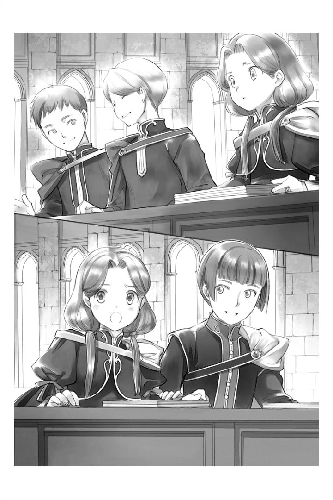

==================================
로데리히 시점 - 귀족원의 어느 하루
==================================

“그럼, 모두. 다녀오세요.”

언제나 로제마인님은 강의에 향하는 사람들에게 말을 걸어 배웅해준다. 현관에서 나가는 상급생에게 나와 필린느가 함께 있는 것을 발견하더니, 친밀한 미소를 지었다.

“필린느와 로데리히는 지리 수업을 듣는 날이군요. 선생님들 말씀을 잘 듣고 와주세요.”

나와 필린느는 지리와 역사에 간신히 합격할 수 있던 것은, 선생님들에게 합격으로 해주시길 바란다고 애원한 결과다. 그렇기 때문에, 1학년은 우리 둘만이 지리와 역사 강의를 들으러 간다.

필기 강의는 최초 시험을 받고 나서와 비교하면, 인원이 절반 정도로 줄었다. 지령의 영주후보생이나 상급귀족이 점차 합격해가고 있기 때문이다. 하급귀족과 중급귀족이 절반정도로 이루어져 강당은 어쩐지 엉성한 인상을 풍기게 되었다.

강당에 들어간 나는 ‘어라...?’ 하고 눈을 껌벅였다. 오늘은 왜인지 앞자리에 학생이 모여있어서 그런지, 사람이 잔뜩 있는 것처럼 보였다.

설마 과목을 헷갈렸나...?

순간 불안해진 나는 옆에서, 필린느도 불안한 듯이 ‘무슨 일이 있었을까요?’ 라며 주변을 돌아본다. 그 중얼대는 말이 들렸는지, 옆을 걷던 물색의 망토의 여학생이 다리를 멈추고 돌아보았다.

“영주후보생과 상급귀족의 대부분이 합격해서 나갔기 때문에, 자리가 정리된 거겠죠. 저는 언니로부터 곧 이렇게 바뀔거라는 것을 들었답니다.”

다른 영지의 사람들이 어리둥절해 하지 않은 것은, 상급생으로부터 이야기를 들었기 때문이겠지. 에렌페스트는 학년마다, 코스마다 나뉘어져 공부하고 있다. 그래서 1학년 전원이 한번에 합격했고, 도중에 이런식의 변화가 있다는 것을 상급생이 일부러 이야기 하지 않았던 것이 틀림없다.

“알려주셔서 감사합니다. 조금 당황하고 있었어요......”

감사의 말을 전하고, 나와 필린느는 자신의 자리를 찾기 시작했다. 의자에는 영지의 번호가 있는 것이다.

“13번은 여기군.”

한 줄에 가운데에 12와 14번 사이에서, 13이라는 번호가 붙은 자리가 두 개 준비되어 있었다. 지금까지 영지채로 열이 정해졌기 때문에 에렌페스트 8명 분의 자리에 둘이서 딱하니 앉아 있었지만, 빈자리가 없도록 모여져있다.

“우우, 옆에 타령의 분이 오신다니 긴장되네요.”

필린느는 자신의 짐을 가슴 앞에 안은 채로 불안한 듯한 작은 목소리로 그렇게 말했다. 나는 12번 옆의 자리에 짐을 두고 머리를 움츠렸다.

“같은 영토의 상급생과 비교할정도는 아니지.”

나는 2년전의 사냥 대회에서 아버님의 지시대로 빌프리트님과 놀던 결과, 빌프리트님을 죄를 짓게해버렸다. 그 이후, 나나 함께 놀던 아이들은 ‘구 베로니카파가 차기 아우브로서 이을 예정인 빌프리트님을 계략에 빠뜨렸다.’ 며 영주 일족 파벌 뿐만이 아닌, 같은 파벌에서도 소외받아 차가운 눈빛으로 받고 있다.

한번에 필기를 합격한다고 말한 로제마인님의 엄격한 과제에는 공포로 떨었지만, 같이 싸운 1학년과는 연대감이 생겨, 나를 소외하는 일 없이 대해준다. 거기에, 타령의 학생은 내가 영지에서 어떤 취급을 받는지는 모른다. 그래서 강의 중은 기숙사에 있는 것보다 훨씬 마음이 놓인다.

“저기...... 로데리히님은 마치 로제마인님과 행동을 같이 하는 측근처럼 도서관에 매일 방문하시고 계시지요...? 만약의 이야기지만, 작년의 아이 방처럼 기숙사가 불편하신건가요? 저, 로제마인님께 살짝 상담드려 볼까요?”

14번 쪽의 자리에 앉으며 필린느가 작은 목소리로 살짝 말해왔다. 수긍한다면 구 베로니카파에게 어떤 정보가 들어갈지 모르고, 부정한다면 지금의 상황은 변하지 않는다. 어느 쪽도 대답할 수 있을 리가 없다. 나는 조금 생각하고서 ‘아니, 필요없어.’ 라고 고개를 저었다.

“나는 가능하면 떨어진 위치에 있는 열람석을 쓰기 때문에, 도서관에 못 가게 하지 않는다면, 그것만으로 괜찮아. 나는 지금 로제마인님을 위해 이야기를 쓰고 있으니까......”

그것만으로 필린느는 상황을 짐작한 모양이다. ‘분명 로제마인님은 기뻐해주실 겁니다.’ 라며 중얼거렸다. 우울해 보이는 옆얼굴이 떳떳하지 못하게 보이는 것은, 분명 어린이 방에서 똑같이 이야기를 모으거나 적거나 했는데도, 필린느만이 측근으로 뽑혔기 때문이겠지.

“......하나 질문이 있습니다만, 로제마인님이 봉납식 때문에 귀환하시면 로데리히님은 어떻게 하실건가요.”

심장을 쥔듯한 공포가 등으로 전해졌다. 로제마인님과 같이 도서관에 가면 누구에게도 위협받지 않고 안심하고 갈 수 있다. 그래서, 생각지도 않았다. 봉납식으로 로제마인님이 귀환하고 나서의 일은.

“글세? 어떻게 할까?”

“실은, 저도 지금 찾고 있어요. 로제마인님의 옆에 있는 한은 안전하겠지만, 시샘이나 비꼼을 가장 많이 받고 있는 입장이니까요.”

그 말에 가슴이 뜨끔했다. 나도 ‘하급 귀족 주제에’ 라고 생각한 적이 있다. 입에는 담지 않아도, 필린느는 그것을 느끼고 있었겠지. 사람의 악의는 화가 날 정도로 잘 전해진다. 그래도 로제마인님의 측근이 된 필린느에 대한 시샘은 여전하다.

“걱정하지 않아도 나와 달리 필린느는 하르트무트님들이 지켜주겠지.”

말에 쓸데없는 가시가 박혀있는 것에 스스로 깨닫고서, 나는 입술을 닫았다. 그러자, 필린느의 옆자리에 손이 뻗쳤다. 짙은 자색의 망토가 흔들린다.

“실례합니다. 베르슈만의 안제름입니다. 잘 부탁드립니다.”

“에렌페스트의 필린느입니다. 잘부탁드립니다.”

인사를 하고 필린느의 옆자리에 앉은 것은, 14위의 베르슈만의 남학생이었다. 내가 실기 강의에서도 본적이 있는 얼굴이니 중급귀족이겠지. 하급귀족인 필린느를 트집잡지 않도록 나도 말을 걸었다.

“에렌페스트의 로데리히입니다. 잘 부탁드립니다.” 안제름의 옆에, 바로 옆자리의 학생도 이쪽이 신경쓰였는지, 깜박깜박 시선을 향해온다. 안제름이 가볍게 찌르는 것을 보면, 무언가 질문이 있는 것인가, 정보를 얻어오라고 한 것은 누구 쪽일까.

순위가 위인 영지에 대해서는 결코 실례가 되지 않도록, 라고 상급생으로부터 입이 닳도록 들었다. 익숙해진 상급생이라면 몰라도, 사교도 시작하지 않은 1학년에게는 긴장되는 상황이다.

나도 이런 상황에는 실패해도 쉽게 잘라버릴 수 있도록 앞으로 떠밀려지는 위치이기 때문에, 어쩐지 안제름에게 동정심이 들어 대화가 통하도록 말을 꺼냈다.

“안제름님과는 실기를 함께해서, 그다지 초면이라는 느낌이 들지 않네요.”

재촉당한 안제름과 어떤 대응을 하면 좋을까 허둥대던 필린느가 같이 안심한 듯이 표정이 풀렸다.

“그랬죠. 저기, 하나 질문이 있습니다만, 괜찮을까요? 모두가 첫 시험에 필기를 끝낸 에렌페스트의 1학년은 보통 강의 시간에 무엇을 하고 있나요?”

“무엇을...?”

질문의 의도를 알 수 없어 필린느와 얼굴을 마주보자, 안제름은 급히 덧붙였다.

“타령은 아직 강의가 끝나지 않아서, 교류를 가지는 것도 어렵죠? 게다가 1학년이라 조합이나 훈련 같은 것도 할 수 없구요. 에렌페스트의 1학년이 자유시간을 어떻게 보내고 있는지, 예상할 수 없어 신경쓰여서요. 자유 시간이 늘어나면 즐거운가요?”

그렇게 말하자, 확실히 기숙사 안에서 할 수 있는 것은 적어 보인다. 그러나, 여기서 어떻게 대답해야 좋을까. 성적 향상 위원회의 자세한 활동에 관해서는, 타령에 알리지 않도록 들었다.

“......기숙사에서 하고 있는 것은 공부일까요? 저희들은 강의가 없어도 로제마인님이 내주시는 과제를 해내고 있습니다. 사교를 하려고해도 타령은 강의 중이라, 상당한 이유가 없는 한에는 기숙사에서 대기하라고 하셨으니까요.”

필린느가 내 쪽을 살피며 대답했다. 그 정도면 틀림없겠지. 나도 끄덕였다.

“에렌페스트에는 1학년의 영주후보생이 두 명이나 있는데, 상급생의 측근은 아직 강의를 마치지 못했습니다. 그래서, 저희들은 영주후보생의 측근 외에는 강의 시간에 기숙사로부터 나가지 않도록 되어있습니다.”

지금은 로제마인님이 도서관에 매일 왕래하고 있어, 나도 도서관에 가고 있지만, 빌프리트님의 측근은 아직 강의가 끝나지않아 자유로이 기숙사로부터 나갈 수 없기 때문에 거짓말은 아니다. 내년을 대비해 평소에는 기숙사의 다목적홀에서 2학년의 참고서를 읽어가며 새로운 참고서제작을 하고 있었지만, 그건 비밀로 하는 것으로 되어있다.

“아하, 그것은... 뭐랄까, 첫날에 합격하고도 그다지 즐거워보이지 않군요.”

“실은, 베르슈만에서는 에렌페스트에 지지 않도록 전원 성적을 올리라고 하셨습니다. 에렌페스트의 1학년이 어떻게 지내고 있는지 알면 조금은 할 마음이 생길거라고 생각했지만, 저희들에게는 그다지 이득이 없어 보이네요.”

“영주후보생의 명령은 모두를 휘말리게하니, 아랫사람은 큰일이네요.”

1학년 전원이 한번에 합격을 명령받았을 때에는 심장이 바싹 오그라들었지만, 로제마인님은 그만큼의 자료나 공부방법을 준비해주셨다. 영주일족의 전속악사로부터 페슈필의 훈련을 볼 수 있는 것만으로도 얼마나 자신의 양식이 되었는지 생각해보면, 전혀 그들에게 동의할 수 없다.

“로제마인님은......”

베르슈만의 1학년이 제각기 말하는 것을 보면서, 필린느가 조금 발끈한 얼굴이 되었다. 주인을 욕보이는 말을 용서할 수 없는 것은 알지만, 상대는 중급귀족이다. 하급귀족의 필린느는 쓸데없는 말은 하지 않는 편이 좋다. 나는 필린느의 팔을 가볍게 치면서 제지했다.

“아랫사람은 물론 큰일이지만, 공부라고 해도 문장이 붙은 과제이기 때문에 이득이 없는 것은 아닙니다. 그렇지, 필린느?”

“네? 네. 그렇습니다. 성의 도서실에 없는 책을 사본하면 로제마인님이 사주십니다. 타령 쪽에서도 에렌페스트의 문장이 붙은 과제에 흥미가 있는 분은 말씀해주십시오.”

귀족원에서의 문장이 붙은 과제라는 것은 학생이 돈을 벌기 위해 하는 개인적인 과제를 말한다. 과제를 줄 때, 차질 없이 지불 받을 수 있도록 과제를 개인이름과 문장이 있는 발주서로 받기 때문에 그렇게 불리고 있다. 지불이 없으면 영지대항전에서 아우브에게 호소할 수 있게 된다.

지금, 강당에 남아 있는 학생은, 영주후보생이나 상급귀족과는 달리 공부를 위해 돈을 그다지 쓸수 없는 귀족이 많다. 문장이 붙은 과제에는 민감한 사람들이다. 특히 1학년은 조합도 할 수 없어 회복약을 만들어 기사견습들에게 팔 수 도 없고, 위험하므로 채집으로 소재를 문관견습들에게 팔 수 도 없다. 쓰는 것만으로도 돈을 벌 수 있는 일은 정말 고마운 일이다.

“...몇 분은 강의를 끝내고 자유시간을 얻으면, 이야기를 들려주세요.”

베르슈만의 학생들이 문장이 붙은 과제에 흥미를 가지게 된 참에 지리 강의가 시작되었다.

지리와 역사의 강의는 로제마인님이 준비해주신 시험용 문제집이나 참고서를 보며 선생님의 말씀을 들으니, 무척 알기 쉬웠다. 스스로 강의 내용을 정리하는 것보다 깔끔하게 정리되어 있어 중요한 곳은 한눈에 알 수 있게 되어있다.

로제마인님이 만든 것 중 가장 비싸게 팔릴 것은 참고서라고 생각되는군......

로제마인님의 문장은 내게 본보기가 된다. 첫 해의 어린이 방에서는 필사적으로 이야기하면서 트럼프를 빌렸다. 둘째해의 어린이 방에서는 내가 이야기한 이야기가 쓰여있는 책을 빌려, 전부 목패로 베꼈다. 도저히 살 수 있을 정도의 책이 아니었기 때문에 필사적으로 옮기고, 전부 암기해두었다.

그럼에도 구어체와 문어체의 차이를 내가 이해할 수 있었던 것은 최근에 와서다. 자신이 이야기를 쓰려고 하면서, 로제마인님의 문장처럼 읽기 쉽게 되어있지 않은 것을 알게되었다. 고쳐가려고 생각하고 있지만, 자신에게는 어디가 어떻게 다른지, 어떻게 고치면 좋을지, 잘 모르겠다.

이런 때에 로제마인님과 같은 파벌이었다면, 질문하러 갈 수 있었겠지만...

질문한다면 로제마인님은 기꺼이 대답해주실 거라고 예상할 수 있지만 주위의 측근들이나 빌프리트님은 내가 접근하면 몹시 매서운 눈초리가 된다. 도저히 가까이갈 수 없다.

4의 종에 필기가 끝나고, 점심식사를 위해 기숙사로 돌아갔다. 오후부터는 마력을 다루는 실기다. 중급귀족은 6위까지와 7위 이하의 영지로 두 교실에 나뉘어져있다. 대영지는 사람이 많기 때문에, 이런식으로 나누게 되지만, 그 덕에 상위영지의 중급귀족과 강의에서 연결고리를 만드는 것은 어렵다.

“오늘이야말로 마석에서 마력을 잘 뽑아내도록 하겠어요.”

“마력을 마석에 방출하는 쪽은 어떻게든 되겠지만, 아직 한번 주입한 마석에서 마력을 다시 뽑아내는 것은 어렵군.”

카틴카님이 그렇게 말하자, 엘리어스님이 동의하며 끄덕였다. 둘은 에렌페스트에서 중립 입장을 취하고 있는 파벌의 중급귀족이다. 이전은 베로니카님에 충실히 따르는 것처럼 보였지만, 로제마인님의 세례식 후 라이제강계의 귀족과 사이가 좋아져, 로제마인님이 긴 잠에 빠지자, 조금 라이제강과 거리를 두었다. 부친이 파벌의 상층부의 비위를 맞추기 위해 위험한 다리를 건너는 것과 같은 짓을 하면서 말려든 내가 보기엔, 중립인 중급귀족으로서는 완벽한 행동거지를 보이고 있다고 말할 수 있다.

둘이 오늘의 목표를 이야기하면서 걷는 곳으로부터 두 걸음 정도 뒤에서 걸으며, ‘오늘이야 말로 마력을 넣을 수 있게 되고 싶어.’ 라며 자신의 목표를 정했다. 나는 어느 쪽이냐고하면, 하급귀족에 가까운 중급귀족이다. 둘에 비하면, 마력량이 적어 마석에 마력을 넣는 것만으로도 고생하고 있다.

선생님이 가져오는 마석은 품질이 낮고, 영주후보생이나 상급귀족도 사용하고 있는 교재를 재이용하기 때문에 마력을 빼냈다고해도 희미하게 잔재가 남아있다. 그 미량의 마력을 완전히 자신의 마력으로 바꾸지 않으면 안되지만, 상대는 영주후보나 상급귀족의 마력이다. 나의 마력으로 굴복시키는 것은 매우 어렵다.

자신의 의사로 마력을 움직이는 것조차도 힘들 정도니까......

귀족이 태어날 때쯤 받는 마술 도구는, 멋대로 여분의 마력을 빨아들인다. 그래서 자신이 마력을 움직일 필요가 없다. 마력이 옮겨가는 감각이나 마술 도구를 향해 흘러가는 감각은 알고 있기에, 같은 방법으로 스스로 옮기지 않으면 안 된다는 것은 알고 있다. 그러나, 가능할지 아닐지는 다른 문제이다. 영주후보생이나 상급귀족의 교실에서는 모두가 한번에 할 수 있었다고 들었지만, 전혀 그런 간단한 일이라고 생각지 않는다.

“으으으으윽......”

오늘도 나는 작은 마석을 쥐고 마력을 넣어간다. 이래뵈도 슈타프를 얻고나서 조금은 마력을 쉽게 흘릴 수 있게 되었지만, 능숙히 마석으로 들어가지는 않는다.

“우왓!?”

펑! 하고 튕기는 듯한 감각이 들면서, 쥔 주먹 안의 자신의 마력이 흩어졌다. 실패한 탓에, 털썩하는 피로감에 휩싸여간다.

“어쩌면, 그 마석은 이전에 굉장히 마력이 강한 학생이 사용한 것일지도 모릅니다. 힐쉬르 선생님에게 부탁해서 마석을 교환해보시는게 어떤가요?”

“교환입니까...?”

엘리어스님의 목소리를 듣고 나는 투명한 마석으로 시선을 떨어뜨렸다.

“제 느낌이지만, 마석에 따라 마력을 넣는 난이도가 다르더라구요.”

지금까지 같은 실기를 세 번했었지만, 나는 한번도 성공한 적이없어 마력을 넣는 난이도를 알 수 없었다. 마석의 문제가 아닌, 자신의 기술이 문제라는 기분이 들었다. 그래도, 모처럼 받은 조언이다. 쓸데없이 뿌리치지 않고, 나는 힐쉬르 선생님쪽으로 향했다.

“힐쉬르 선생님, 마석을 교환해도 되겠습니까?”

“......사실 이 정도 크기의 마석이라면, 누구라도 마력을 넣을 수 있어야 합니다만, 지금은 시험이 아닌 연습이니 상관없습니다. 드디어 마력 주입 난이도의 차이를 실감했나보군요?”

힐쉬르 선생님은 마석이 들은 상자를 내 앞에 내밀었다. 나는 조언을 들은 것 뿐으로, 실감한 것은 아니다. 조금 꺼름칙한 기분이 되었지만, 마석에 차이가 있다는 것은 틀림 없는 모양이다.

그래도..., 어떤 마석이 넣기 쉬울지는 봐도 알 수가 없구나.

이거나 저거나 같은 투명한 마석이다. 힐쉬르 선생님에게 감사를 말하며 적당한 마석으로 교환하고서 나는 자리로 돌아갔다.

“으으으으윽......응?”

아까의 마석보다 상당히 마력을 넣기 쉬웠다. 서서히지만, 확실하게 마석에 들어가는 것을 알 수 있었다. 이 마석에도 저항이 느껴지지만, 아까와 같은 튕기는 듯이 강하지는 않았다. 나는 단단히 쥐고서, 다시 마력을 주입해갔다. 필사적으로 마력을 넣어가자, 주먹 사이에서 작은 빛이 흘러나왔다.

“어머, 로데리히님. 성공한 것이 아닌가요?”

카틴카님의 목소리를 듣고, 나는 믿을수 없는 기분으로 주뼛주뼛 손가락을 폈다. 투명했던 마석이 자신의 마력인 황색에 가까운 오렌지색이 되어있었다.

“성공이다...... 아, 아니, 그, 카틴카님이나 엘리어스님과 달리, 안에 작은 쓰레기같은 다른 사람의 마력의 잔재가 있어 완전히 성공이라고는 말할 수 없지만......”

“확실히 더 연습은 필요하겠지만, 성공은 성공이네요.”

“네. 다음은 마력을 뽑는 연습이네요, 로데리히님.”

엘리어스님은 칭찬해주었고, 카틴카님은 다음 과제를 일러주었다. 강의 시간만이지만, 이렇게 평범한 대화를 할 수 있는 시간이 있는 것을 나는 몹시 감사히 생각하고 있다. 파벌이 다르면, 본래에는 이런 식으로 대화하는 것조차 할 수 없다.

성적향상 위원회를 만들어주신 로제마인님에게 감사를......

억지로 흡수해내는 듯한 형태였지만, 마력의 방출은 감각으로 알았다. 하지만 마석으로부터 마력을 빼내어 자신에게 되돌리는 것은 전혀 경험이 없다. 어떻게하면 좋을지 모르는채, 마석을 손바닥에 옮기고 머리를 갸웃하고 있는 사이에 강의 종료 종이 울렸다. 빼낼 수 없었던 마력은, 선생님이 빼낸다는 모양이다. 나는 마석을 상자에 돌려놓고 교실을 나왔다.

저녁식사가 끝나자, 순서대로 목욕탕을 사용하게 된다. 같은 방의 사람들 사이에서는 내가 가장 낮기 때문에 마지막으로 정해져있다. 목욕하러가기 전까지 가져온 목패를 읽을까, 아니면 이야기를 적을까. 그런 것을 생각하면서 식당을 나서자 필린느가 불러세웠다.

“로데리히님, 저 내일 역사 수업에는 빠지게 되었습니다. 아무래도 다른 분들과 조정할 수 없었습니다.”

필린느에 의하면, 로제마인님의 도서관에 동행할 수 있도록 측근들은 강의의 조정도 하고 있는 모양이었다. 지리와 역사의 필기를 한번에 받아낸 필린느는 가끔 강의를 빠지게 되어있다. 필린느는 미안한 듯한 얼굴을 하고 있는데도, 나의 눈에는 어쩐지 로제마인님과 동행하는 것을 뽐내는 듯이 보여 조금 화가나 버린다.

“측근인 시종 쪽이 중요한데다가, 일단 필린느는 합격했으니까...”

필린느의 모습을 지켜보듯이 하르트무트님과 코르넬리우스님이 이쪽을 지긋이 보고 있다. 하급귀족 주제에 측근 동료로부터 소중히 여겨지는 필린느가 정말 부러우면서, 짜증이 난다. 자신과의 차이를 눈앞에서 보일 때마다 분해서 참을 수 없는 기분이된다.

로제마인님과 나의 파벌이 같았다면 이런 기분이 되는 일은 없었을지도 몰라......

필린느가 나쁜짓을 한 것이 아님에도, 짜증이 나는 자신에게도 화가 난다. 이런 지저분한 기분은 부풀어 오를 뿐, 전혀 해소 될 낌새가 없다. 필린느에게 질투하면서도, 동시에 질투와 시기로 물들어 시커메진 마음을 조금이라도 바꿀 수 있으면 좋을텐데, 라고 바라는 것이었다. 스스로도 영문을 몰랐다.

목욕탕에서 더러움과 함께 흘러보낼 수 있으면 좋겠다......

욕조에 몸을 담그자 따뜻한 물이 조금 어두운 기분을 풀어주었다. 그리고 머리를 감겨주는 시종인 카시미르의 손가락의 움직임에 짜증이 조금씩 풀려간다.

“...카시미르는 파벌이 다른 사람이 신용 받는 방법을 혹시 알고 있어?”

어머니쪽의 친척인 카시미르는, 아버님의 행동거지에 생각하는 바가 있는지, 내게 친절하다. 전에 도망칠 장소를 찾는다면, 도서관에 가는 것은 어떠냐며 제안해주었던 카시미르에게 넌지시 물었다.

“파벌이 다른 사람을 신용하는 수단, 말씀이십니까?”

카시미르는 무척 곤란한 듯이 나를 쳐다보았다. 돌연히 그런 것을 질문해도 곤란하겠지. 나는 서둘러 자신의 질문을 번복했다. 시종을 쓸데없이 곤란하게 하려던 것은 아니다.

“없으면 괜찮아. 그런게 있다면 누구든지 쓰고 있었을 테니......까.”

그렇다, 내가 로제마인님에게 신용을 받을 방법이 있을 리가 없다. 스스로 내놓은 대답에 얻어 맞은 듯한 기분이 되었지만, 카시미르가 주저하면서 입을 열었다.

“완전히 없지는......”

“있는건가!?”

“거품이 흐르니 움직이지 말아주십시오.”

무심코 튀어오른 나는, 다시 한번 몸을 기댔다. 카시미르가 후우하고 한숨을 내쉬더니 물을 흘려 내 머리를 헹궈간다.

“의심이 많은 베로니카님에게 신용받기 위해, 귀족들이 사용하던 수단이 있는 모양입니다. 유감이지만, 저도 자세히는 알지 못합니다만......”

물어도 자세히는 말하지 않는걸로 보아 카시미르는 대답을 주저하는 것 같았다.

“무슨 방법이 있다는 것을 안 것만으로도 기분이 가벼워졌어. 고마워, 카시미르.”

“고마워하실 정도는 아닙니다. 로데리히님의 귀족원이 조금이라도 평안하기를......”

무슨 정보가 손에 들어온것도 아니다. 그래도, 나는 내 신상을 걱정해주는 카시미르의 말에 몹시 구원받은 듯한 기분이 되었다.

언젠가 나도 로제마인님의 신용을 얻게 될 수 있을까......

1학년을 마치고 에렌페스트에 돌아가면, 베로니카님의 신용을 받기 위해 귀족들이 무엇을 했는지 알아보자. 나는 마음 속 예정표에 크게 적어 넣었다.

