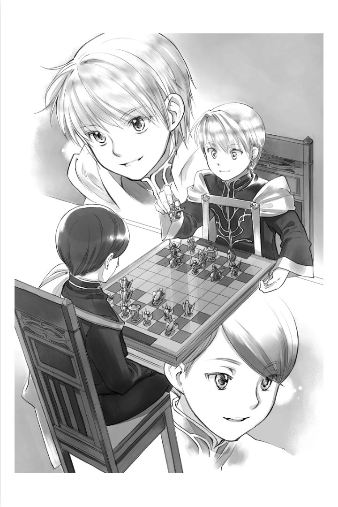

===========================
빌프리트 시점 - 남자의 사교
===========================

앞을 다투듯 초청받고 있던 여성들의 다과회에 여러 차례 참석하다 보니 사교주간이 시작되었다. 드레반헬의 오르트빈님으로부터 게뷔넨의 초대를 받고, 나는 날아오를 듯이 기뻤다. 염원하던 남자의 사교다. 나는 오르트빈님의 초대장을 몇 번이나 다시 읽고, 곧바로 출석의 답장을 하도록 이시도르에게 명령했다.

......이 날을 위해 게뷔넨의 연습을 해 온 것이다!

게뷔넨은 남자 사교에서 흔히 사용되는 반상의 유희다. 마력으로 판 위의 말을 조종하여 상대의 보물을 빼앗으면 승리가 된다. 판 위의 디터 같은 유희라고 할 수 있다. 귀족원 사교에서 망신을 당하지 않기 위해 나는 측근들을 상대로 연습해 왔다. 페슈필 이나 봉납춤 연습보다 훨씬 즐거운 일이다. 트럼프나 카루타에서는 졌지만, 게뷔넨에서는 로제마인에게도 지지 않을 거라고 생각한다.

"이그나츠, 지금부터 대전하지 않겠나?"

"......저는 상관없습니다만......"

이그나츠는 흘끗 오즈발트의 모습을 엿본다. 게뷔넨은 한판 승부를 가리는 데에 시간이 걸리므로 예정이 많은 날에는 할 수 없다. 그만큼 눈에 파묻혀 밖에 나갈 수 없는 겨울에는 자주 치러진다. 귀족원 남자의 사교에서 게뷔넨이 자주 열리는 것도 눈이 쌓여 있어 밖에서 할 수 있는 일이 적기 때문일 것이다.

"오즈발트, 드레반헬과의 승부에서 꼴사나운 승부를 할 수는 없다. 훈련이 필요하다."

첫 남자 사교에서 실패는 할 수 없다고 내가 호소하자 오즈발트는 잠시 생각한 뒤 "한 판뿐입니다" 라며 허락을 내주었다.

"이그나츠, 말을 가지고 와라. 알렉시스는 오즈발트와 함께 판의 준비다."

게뷔넨을 할 때는 기본적으로 자신의 말을 가지고 와 사용하게 되어 있다. 기사의 모습을 본뜬 말 중에는 예술적인 가치가 높은 것도 많아, 다른 사람의 말을 보는 것도 즐거움의 하나다.

......측근들의 말은 익숙하지만, 다른 영지의 영주후보생의 말을 보는 것은 즐거움이지.

이그나츠가 말을 가지러 가는 동안, 견습 호위기사 알렉시스와 수석 시종 오즈발트가 게뷔넨 판을 준비한다. 제법 큰 직사각형으로 마석을 많이 사용한 사치스러운 물건이다. 게뷔넨은 마력으로 말을 움직이는 유희이기 때문에, 판도 말도 마석으로 되어 있다.

"오래 기다리셨습니다. 그럼 말의 교환을 하죠."

이그나츠가 자기 방에서 가져온 상자를 열어 나를 향해 내밀었다. 나도 오즈발트가 들고 온 상자를 열어 이그나츠에게 건네준다. 이렇게 해서 서로의 말에 지난번 사용했을 때의 마력이 말에 남아있지 않은지 확인하는 것이다.

"음, 문제 없군."

"빌프리트님의 말, 이건 조금 남아 있지 않습니까? 다른 영지와 승부할 때는 조심하는 게 좋습니다."

"......거의 없다고 생각한다만......조심하지"

지적된 말에 빈 마석을 눌러 완전히 마력을 뺀 다음 이그나츠가 다시 한 번 확인하도록 한다. 모든 말에 마력이 없음을 확인하고 말을 돌려주면, 판의 앞으로 향한다.

"오늘은 마력 하나면 되겠지요?"

이그나츠의 말에 고개를 끄덕이고는 판의 짧은 변에 붙어 있는 뚜껑을 열었다. 거기에는 다섯 개의 마석이 늘어서 있다. 나는 그 중 하나에 접촉하고 마력으로 채웠다. 이 마석의 수로 난이도 조절이 가능한 것이다. 마력이 많이 채울수록 승부에서 쓸 수 있는 말이 많아지기도 하고 공격 수단이 다양해지기도 한다. 그렇기 때문에 여기서도 확실히 하나의 마석에만 마력을 채웠는지 아닌지 서로 확인해야 한다. 이 후로 승부가 날 때까지 뚜껑을 열면 반칙패가 된다.

"말은 열 개다", 나는 내 상자에서 말을 열 개 꺼내면서 이그나츠에게 말한다. 보물 말을 가장 먼저 꺼냈다. 이것을 서로 빼앗는 승부이기 때문에 난이도를 높여 말 수를 늘려 승부할 때에도 보물 말만은 사용하는 것이 확정되어 있다.

......다음은 어떻게 할까?

마석 한 개 분량의 승부에서 사용할 수 있는 말은 활과 검과 창이다. 보물을 제외한 9개분을 골라야 한다. 모두 활로 만들거나 칼로 만들 수도 있지만 공격 범위가 다르기 때문에 대개는 여러 종류의 말을 사용하게 된다.

마석을 늘려 난이도를 높이면 승부에 사용할 수 있는 총 마력량이 증가한다. 그리고 각 말의 공격력, 방어력, 속도의 비율을 스스로 할당하거나 덫을 놓는 문관들의 말이나 회복약을 운반하는 보급 역의 말을 늘리거나 할 수 있게 되기 때문에 승부가 더욱 복잡해지는 것이다.

......나는 아직 말을 늘린 적은 없지만 아버지와 숙부님의 승부에서는 말을 늘리면 늘릴수록 숙부님의 승률이 오르는 것 같다.

결국 나는 활과 검과 창 말을 세 개씩 골라 자기 진영에 배치했다. 자기 진영에 배치하면 말에 마력을 흘려간다. 말에 마력으로 가득 차면 빛나기 때문에, 그 사이에 선공과 후공을 결정한다.

나는 상자에 남아 있는 말에서 문관과 보급의 말을 꺼내, 좌우의 손에 하나씩 쥐고 이그나츠 앞에 내밀었다.

"어느 쪽이냐?"

"왼쪽으로 하겠습니다."

나는 왼손을 펼쳤다. 거기에는 문관의 말이 있다. 이그나츠가 선공이다.
모든 말이 빛나면 승부가 시작된다. 이그나츠가 손가락을 흔들었다.

"그럼, 가겠습니다."

오르트빈님의 초청을 받은 사교의 날까지 나는 측근들을 상대로 매일 게뷔넨의 연습을 했다. 이그나츠에게는 이길 수 있지만 알렉시스는 좀처럼 이길 수 없는 것이 조금 분한 것이다.

"이시도르, 잊은 물건은 없나? 오즈발트, 이제 출발해도 되겠나?"

"3의 종이 울릴 때까지 기다려 주십시오. 다과회실까지는 그리 멀지 않으니까요."

안절부절못하며 3의 종이 울리는 것을 기다려, 나는 측근들과 함께 기숙사를 나와 드레반헬의 다과회실로 향했다. 첫 남자 사교다. 긴장하면서 나는 3이라는 숫자가 붙은 문 앞에 선다.

"기다리고 있었습니다, 빌프리트님."

다과실에 들어가자 오르트빈님이 마중 나온다. 게뷔넨 판이 두 개가 준비되어 있었다. 둘러보면 린덴타르의 청록색 망토를 입은 영주후보생 다비드님과 가우스뷔텔의 갈색 망토를 입은 콘라딘님이 먼저 도착해 있다. 이것으로 1학년 남자 영주후보생은 모두 모인 셈이다.

"상급생은 없군요"

"아아, 상급생은 아직 강의가 끝나지 않았잖아요. 강의 수가 전혀 다르니까요. 상급생이 참여하게 되는 건 후반입니다. 그때까지 우리 1 학년은 사교 분위기에 다소 익숙해져야겠다는 생각에 오늘 모임을 개최했습니다."

오르트빈님의 말에「과연」이라고 나는 수긍한다. 영주후보생이 많은 드레반헬과 달리, 나는 상급생이 어느 정도 강의를 하는지도 모른다. 여기서 영주후보생에 대한 정보를 모으는 게 좋을 것 같다.

"3학년이 되면 사냥도 할 수 있겠지요? 저는 그쪽도 기대하고 있습니다." 

다비드님이 그렇게 말하며 웃었다. 1학년생은 강의에서 기수를 만들 수 있게 되고, 슈타프를 얻은 지 얼마 되지 않았다. 2학년생은 마석으로 갑옷을 만들거나 슈타프로 무기를 만드는 실기가 있다. 그러한 강의들이 끝난 3학년부터의 남성 영주후보생은 호위기사를 이끌고 사냥에 참가할 수 있는 것 같다. 다비드님도 제법 자세히 아는 것 같다. 나는 모두의 설명을 흠흠 하고 고개를 끄덕이며 듣는다.

"2학년을 마치면 영지에서 기사단과 함께 사냥 연습을 하게 됩니다. 이복 형들이 참가하고 있는 것을 보고, 저도 빨리 참가하고 싶다고 생각하고 있습니다."

콘라딘님처럼 형이 있는 영주 후보생의 이야기를 듣는 것은 매우 참고가 된다. 나의 남자들 간의 사교에 관한 정보원은 기본적으로 아버님이다. 정변을 경계로 여러 가지 변하고 있을지도 모른다고 주의도 받고 있고, 최근의 정보가 적다. 측근들에게도 듣지만, 영주후보생 정보는 측근들에게도 모으기 힘든 것 같아, 스스로 모을 수밖에 없는 것이다.

......친족이라면 숙부님도 있지만, 나와 숙부님은 그런 이야기를 하는 사이가 아니니까. 나에게 있어 숙부님은 얼굴을 마주칠 때마다 과제를 산더미처럼 쌓아가는 존재이다. 정확하게는 과제가 있을 때밖에 불리지 않는다. 로제마인이 일어난 뒤로는 그 쪽 교육에만 매달려있기 때문에 조금 도움이 되고 있다.

차를 마시며 정보교환을 한 뒤에는 게뷔넨을 하게 됐다. 나와 오르트빈님이, 다비드님과 콘라딘님이 대전하기로 결정되었다.
각각의 말을 확인하는 것에서부터 시작하는 것이지만, 오르트빈님의 말은 보물 말이 엷은 갈색이고, 그 외의 말은 적자색으로 통일돼 있다.

"오르트빈님의 머리와 눈 색깔이군요"

"아버님께서 주문하여 주신 것입니다만, 그 색깔로 맞추느라 고생하셨다고 합니다. 빌프리트님의 말은......"

"눈동자 색깔이 아니라 탄생 계절의 귀색입니다."

"과연. 이건 조형이 아름답군요."

그런 대화를 하면서 하나하나 말을 확인해 나간다. 오늘은 나도 완벽하게 마력을 빼내어두었기 때문에 아무 문제없이 확인은 끝났다.

"오늘은 처음이니까 마석 한 개 분의 승부로 하지요"

"다음 번에는 늘리는 건가요?

내가 묻자 오르트빈님은 마력을 담으며 고개를 수긍했다.

"상급생의 초대를 받을 즈음까지 마석 두 개 분까지는 연습을 해두는 게 좋다고 생각합니다. 가끔 있는 겁니다. 마석을 늘린 적이 없느냐고 도발해 오는 상급생이......"

마력압축에 익숙하지 않은 저학년 동안은 마석 한 개 분의 승부가 가능하면 된다고 아버님이 말씀했지만, 마석을 늘려서 연습할 필요가 있는 것 같다. 오늘 알게 돼서 다행이다. 기숙사로 돌아가면 당분간은 게뷔넨 연습을 열심히 하지 않으면 사교 후반에 고생할지도 모르겠다.

그런 생각을 하며 말을 놓고 있는데, 먼저 배치를 마친 오르트빈님이 문관과 보급의 말을 잡고 좌우 손에 하나씩 쥐고 내 앞으로 내밀었다.

"빌프리트님은 어느 것으로 하시겠습니까?"

"오른쪽으로 부탁합니다."

오르트빈님이 오른손을 열자, 거기에는 보급의 말이 있었다. 나는 후공이고 오르트빈님이 선공이다.

"제가 선공이군요."

말을 상자에 되돌리자 오르트빈은 내가 배치한 말을 보면서 팔짱을 끼고 생각하기 시작했다. 자, 어떻게 공격해 올까. 나도 오르트빈님의 말을 보면서 생각한다. 말이 모두 빛나는 것과 동시에, 오르트빈님이 손가락을 흔들며 말을 움직였다. 검의 말이나 창의 말이 사뿐히 움직이며 한 칸 위로 이동한다. 다음은 내 차례다.

처음에는 그다지 큰 움직임이 없다. 나는 몇 개의 움직임을 생각하면서 말을 움직여 간다.

"빌프리트님은 기본에 입각한 움직임을 하시는군요"

"아직 응용해서 움직일 정도의 실력은 아니라고 아버님께 듣고 있습니다. 우선은 기본에 익숙해지지 않으면 안 된다고 합니다. 공격에 집중하느라 방어가 소홀하게 된다고 야단맞았습니다."

처음으로 공격력, 방어력, 속도를 스스로 할당하는 연습을 할 때 공격력에 너무 배정해 방어력을 경시했기 때문에, 아버지의 활의 말에 멀리서 맥없이 당한 것이다. 어떻게든 아버지의 말을 줄여 보려고 방향을 잡자 어느새 보물이 두들겨 맞고 있었다.

......아버지는 묘한 작전을 짜는데, 나에게는 아직 이르다고 말하는 것이다.

"그러고 보니 저희 누님이 에렌페스트의 머리장식 등에 흥미를 가지고 계십니다.."

오르트빈님이 가볍게 왼손을 움직여 자신의 말을 움직이며 그렇게 말했다. 나는 힐끗 그의 얼굴을 본 뒤 바로 판에 시선을 돌려 다음 수를 생각하며 "......아돌피네님께서 관심을 갖고 계시다니 기쁘기 그지없습니다" 라고 대답한다.

......오르트빈님은 남자들끼리의 사교에서 머리장식 이야기를 해서 어떻게 할 셈인 거지? 아돌피네님 것을 골라달라고 말할 셈인가?

여성뿐인 다과회에서 요구 받은 여러 가지들을 떠올리며 나는 게뷔넨의 말을 노려본다. 솔직히 말하면, 나는 장식품 고르는 것은 잘 하지 못한다. 어렸을 때는 할머님이 여러 가지 말씀하셔서 알고 있다. 여성이 질문할 때는 이미 마음이 정해져 있고 동의해 주었으면 하는 것뿐이다. 여자가 마음먹은 것 이외의 것을 고르거나 칭찬했을 때는 대개 실망하게 된다.

......오르트빈님, 안 된다. 서두르면 안 된다. 여성에게 골라주는 것은 어려운 것이다. 일단 쓸데없는 말은 하지 말고, 오르트빈님이 제안해 오거나 명령해 왔을 때만 응하기로 하고 나는 게뷔넨에게 집중하기로 했다.

"......빌프리트님은 뭔가 피곤하신가요?"

잠시 동안의 침묵 뒤에, 오르트빈님이 내 상태를 살피듯 물었다. 피곤하냐고 묻는다. 의미를 모르겠다. 말없이 생각에 잠긴 것이 좋지 않았던 것일까.

"아니요. 게뷔넨에 집중하고 있습니다만, 특별히 피곤하지는 않습니다. 뭔가?"

"모처럼의 기회에 에렌페스트의 유행을 선전하는 모습을 보이시지 않기 때문에 이상하게 생각했을 뿐입니다"

......그런가. 이곳은 유행을 선전하는 자리였던가. 하지만, 에렌페스트의 유행은 남성보다 여성에게 환영받는 것이 많다. 여기서 어떻게 선전하면 좋을 것인가. 나는 스스로 린샴을 쓰는 일도 없고, 머리장식의 좋고 나쁨을 말할 수도 없다. 그러한 일은 로제마인에게 맡겨 두고 싶다고 생각한다.

"......아아, 그것은 로제마인이 귀환해 부재중이기 때문에, 여자만의 다과회에 제가 남자 혼자라는 상태로 몇 번이나 초대받아, 같은 이야기를 하고 있는 탓이겠지요. 빨리 귀족원으로 돌아왔으면 합니다."

"아아, 여자들의 다과회에 남자 혼자 참석하는 것은 피곤하지요. 저는 누님과 그 친구들의 다과회에 함께 참여하는 일이 있습니다만, 매우 피곤합니다."

나와 같은 생각을 일상적으로 하고 있는 것 같은 오르트빈님의 말투가 뭐랄까 지긋지긋한 것이 되었다. 나는 아직 로제마인의 사교에 함께한 적은 없지만, 에그란티느님이나 한넬로레님의 다과회에 끌려간 자신을 상상하고 녹초가 되었다.

"저도 할머님들의 다과회에 조금은 익숙해졌다고 생각했는데, 남자들의 사교와는 화제나 분위기가 전혀 다르니까요...... 남자들의 사교에서는 머리 장식 화제가 나오지 않아 마음이 편합니다."

자신이 하지도 않는 머리장식에 대해 질문을 받아도 곤란하다는 의미를 불평하자, 재미있다는 듯 오르트빈님이 웃었다. 그 웃음에는 동정이 다분히 담겨있다.

"저도 누님으로부터 장식품을 골라달라고 들을 때가 있습니다. 장래에 결혼 상대에게 마석 목걸이를 주거나 의상 준비하기 위한 천을 준비할 때 필요하지요 라고 듣습니다만, 어느 것도 그다지 바뀐 게 없는 것 같다고 생각합니다."

......알 수 있다!

"선택해 달라는 후보의 차이가 너무 미세해서, 어떤 것이든 좋다는 생각이 듭니다. 여성은 어디를 보고 결정하는 걸까요?"

아주 약간의 색상 차이로 의상에 맞지 않는 것 같다는 말을 들어도, 잘 모르겠다. 맞지 않는 것 같으면 처음부터 후보에 넣지 않으면 되는 것 아닌가. 그렇게 생각해도 쓸데없는 말을 하면, 할머님의 경우는 지긋지긋할 정도로 이야기가 길어졌던 것이다. 그런 나의 경험담을 말하자 오르트빈은 잘 안다고 말할 듯이 크게 고개를 끄덕였다.

......동료다!

"그대와는 아주 친해질 수 있을 것 같다. 빌프리트라고 불러도 될까?"
오르트빈님이 피식 웃으며 게뷔넨 말을 움직인다. 마침 나도 같은 생각을 하고 있던 참이다.

"네, 황송합니다. 저도 오르트빈이라고 불러도 될까요?"

"아, 상관없다. 편하게 말해라"

상위 영지가 상대이므로 일단 여쭈어 보았지만, 바로 수긍해준다.

......오르트빈, 인가.

귀족원에서 처음으로 친구라고 부를 수 있는 사람이 생긴 것이, 나는 매우 기뻤다.

"역시 남자는 남자의 사교를 해야 하는군."

게뷔넨에서는 졌지만 새로운 친구를 생기고 오르트빈에게 게뷔넨으로 이기겠다는 목표를 얻은 것으로 내 기분은 상쾌해졌다. 앞으로는 남자들끼리의 사교 예정을 가급적 잡아서, 여성의 다과회 횟수를 줄이려고 한다. 내년에는 샤를로테도 있다. 여동생 둘에게 휘둘려 다과회에 끌려나가면 매우 곤란한 일이 되겠지. 지금부터 조금씩 여성의 다과회로부터 물러나고, 내년에는 의연한 태도로 거절하는 것이다.

......음. 완벽한 계획이다.

나의 계획이 완벽했던 것은 아주 잠깐이었다. 본격적인 사교 시즌에 들어가고 잠깐 지나자, 다른 영지나 자신의 영지의 귀족들로부터 「남자의 사교에만 나가지 말고, 영주후보생으로서 다른 영지의 영주후보생을 초청하는 다과회를 개최해 주었으면 한다」라고 하는 요망이 여기저기서 전해져 왔다. 한번 개최하면 한동안 다과회가 계속되겠지. 나 혼자서는 도저히 처리할 수 없다.

게다가 「로제마인의 귀환은 언제까지인가?」라는 질문이 왕족이나 상위 영지로부터 차례차례 밀려드는 지경이 되었다.

"아버님, 가능한 한 빨리 로제마인을 귀족원으로 돌려보내 주십시오!"

"유감스럽지만 영지 대항전 직전까지 갈 수 없다고 페르디난드가 말했다. 이 이상 문제를 일으키면 너도 곤란하겠지?"

처음엔 그 대답에 고개를 끄덕였다. 확실히 여기서 로제마인이 문제를 일으켜서는 곤란하다. 아버님이나 숙부님이 영지 대항전 직전까지 돌려보내지 않는 쪽이 좋다고 생각한다면, 틀림없이 그 쪽이 문제는 적을 것이다. 하지만, 남자의 사교에 아나스타지우스 왕자가 나타나 게뷔넨의 승부 중에 계속 로제마인의 귀환에 대한 질문을 받게 되자, 나는 곧바로 의견을 바꾸었다. 왕족에게 추궁당하는 것보다 로제마인의 문제 행동을 보고서에 쓰는 게 훨씬 낫다.

"아버님, 로제마인이 없는 것으로 문제가 일어나고 있습니다. 적어도 언제 돌아오는지 정확한 날짜만이라도 가르쳐주십시오!"

있어도 없어도 곤란한 존재, 로제마인. 내 여동생이 귀족원으로 돌아오는 건 이제 곧 이다.
