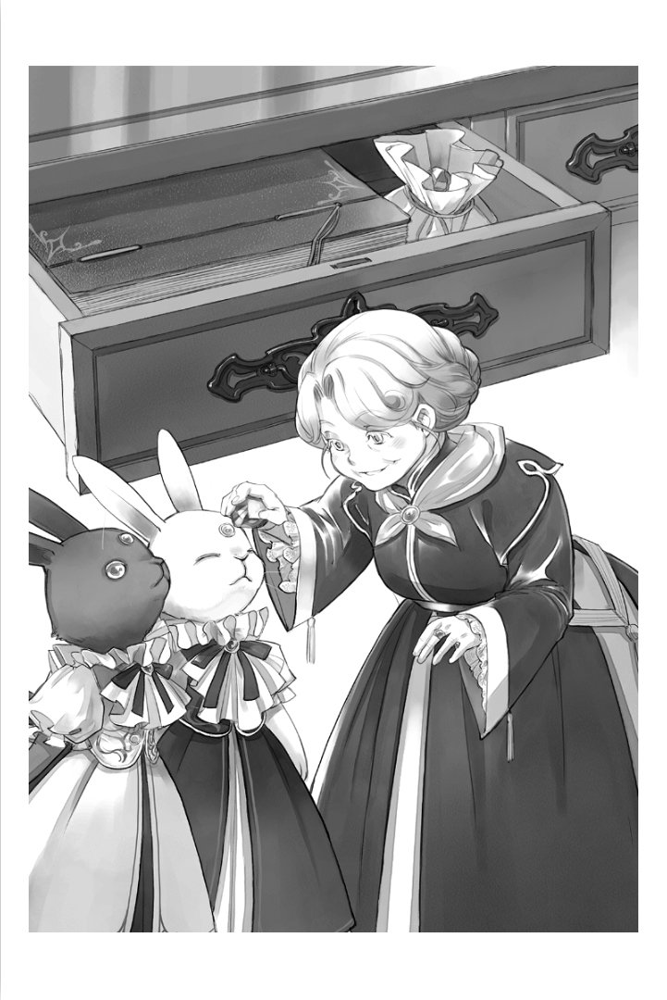

=====================================
솔랑쥬 시점 - 폐가식 서고와 낡은 일지
=====================================

졸업식이 끝나고 며칠이 지났습니다. 학생들이 각자의 영지에 귀환함으로서 귀족원 전체가 한산한 상태가 되어 도서관을 방문하는 자도 거의 없어졌습니다. 하지만 일이 없어진 것은 아닙니다. 아침 식사를 끝나자 저는 슈바르츠와 바이스를 데리고 집무실에 들어가 수많은 마술구를 움직여 나갑니다. 살랑살랑 움직이는 슈바르츠와 바이스의 귀를 보고 있는 것만으로 표정이 부드러워져 가는 것을 스스로도 알았습니다.

"로제마인님 덕분에 정말 올해의 귀족원은 즐거웠네요."

도서관을 사랑하는 에렌페스트의 영주후보생이 출입한 것으로 저의 귀족원 생활은 크게 바뀌었습니다. 쭉 움직임을 멈추고 있었던 슈바르츠와 바이스가 다시 움직이게 되고, 집무실에서 다과회가 열리고…….

"메스티오노라에게 바치는 곡을 가장 먼저 들을 수도 있었는 걸요."

왕족에게 직접 도서관의 실정을 호소해도 상급 사서를 늘릴 수는 없었습니다. 그것은 유감이지만 제가 직접 부탁할 수 있었던 것만으로도 큰 변화입니다.

"솔랑쥬, 어떤 일?"

"어제의 계속?"

로제마인 님께서 마력을 잔뜩 품은 마석을 준비해주셨기에 저는 둘과 다음 겨울까지 함께 있을 수 있습니다. 슈바르츠와 바이스에게 웃으며 끄덕이면서 저는 열람실로 이어지는 문을 열었습니다.

열람실의 책장에는 책이 빼곡히 나열되어 있습니다. 예년이라면 반납되지 않은 자료의 많음에 한숨을 내쉬며 아는 범위에서 각각의 사감에게 고충을 설명해 사감을 통해 반납받고 있었습니다. 텅빈 책장을 바라보면서 고독하게 작업했던 작년과는 매우 다릅니다.

……책장에 많은 자료가 돌아온 것은 페르디난드 님의 덕분이네요.

슈바르츠와 바이스가 다시 가동하고, 주인으로서 로제마인님께서 자료를 반납하지 않은 자의 이름을 일람표로 만들어주시고, 페르디난드 님께서 독촉의 올도난츠를 보내주셨습니다. 그 덕분에 일시적으로 도서관이 혼란 상태가 될 정도의 많은 학생이 책을 안고 도서관에 달려왔습니다.

하지만 로제마인 님께서 기꺼이 도움을 자처해 주시자마자 학생들은 단번에 조용해 진 것입니다. 책의 연체나 무단 반출을 하고 있었던 학생들은 이 이상 아우브에게 혼나는 일을 할 수는 없었을 테죠. 각 영지의 아우브와 이야기하는 일도 있는 영주후보생이라는 입장은 매우 강한 것입니다.

저는 지금 슈바르츠와 바이스와 함께 책이 책장의 바른 위치에 돌아와 있는지 어떤지, 부족한 책이 없는지 정성스럽게 확인하고 있습니다. 작년까지와 비교하면 서적 정보를 가지고 있는 둘이 있기에 몇십 배나 빨리 확인이 끝납니다.

"1층, 끝."

"솔랑쥬, 다음은 2층?"

"2층의 정리는 가을에 하는 거에요."

학생들이 사라지면 선생님들께서는 자신의 연구에 몰두할 수 있게 됩니다. 마침 지금쯤의 시간부터 2층의 자료를 필요로 하는 선생님의 출입이 늘어나는 겁니다. 그렇기에 2층의 자료는 귀족원이 시작되기 전, 가을에 정리하게 되어 있습니다.

"둘은 열람석의 청소를 부탁드립니다. 그게 끝나면 폐가식 서고의 확인을 하도록 할까요. ……몇 년 만이려나요?"

지금까지는 손을 댈 수 없었던 곳에도 손을 댈 수 있는 것은 기쁜 일입니다. 제가 집무실에 열쇠를 가지러 갔을 때 끼익하는 소리를 내고 열람실의 문이 열렸습니다.

"솔랑쥬, 찾아주었으면 하는 자료가 있습니다만."

"어머, 프라우렘 선생님이 아니십니까. 평안하신지요. 이런 시간에 오시다니 드문 일이군요. 어떤 자료를 찾으시는가요?"

프라우렘은 문관 코스의 교사로 정보의 수집과 분류 등을 가르치고 있습니다. 도서관과 친화성은 높다고 말할 수 있을 테죠. 하지만 지금까지 그녀에게서 자료 찾기를 부탁받은 적은 없습니다.

"폐가식 서고에 안내해 주시지요. 제 전임자인 클레멘스의 강의 내용에 관하여 자세히 알고 싶습니다."

"어머 전에는 필요 없다고 말씀하시지 않으셨던가요?"

선생님이 바뀌면 강의 내용이 확 바뀌는 일도 드물지 않습니다. 강의 내용이 변경될 때에는 반드시 이전 자료를 폐가식 서고에 정리하고, 이어질 때에는 열람실에 자료를 남깁니다. 프라우렘이 취임한 때에 어떻게 할지 여쭈었을 때에는 새로운 내용을 가르칠테니 클레멘스의 자료를 정리하도록 들었을 터입니다.

"저도 귀족원에서의 강의에 익숙해지기 시작했으니까요. 클레멘스가 작성한 예전 자료 중에 좋은 부분이 있으면 자신의 강의에 포함시켜 나가고 싶다고 생각한 겁니다."

"그건 무척이나 멋진 생각이군요. 자령에 돌아가면 책을 손에 넣는데 고생하는 자도 많고, 성인이 되면 매일 일에 쫒겨 새로운 것을 공부하기 어려워지는 걸요.

"네. 모처럼의 강의인걸요. 학생들은 첫날의 시험에서 모든 것을 끝내는 것이 아니라, 가능한 만큼 많은 지식을 얻었으면 한다고 생각합니다."

프라우렘은 빽하는 높은 목소리로 열을 담아 그렇게 말했습니다. 귀족원에 있는 동안에 가능한 만큼 많은 지식을 얻었으면 한다는 생각에는 저도 가슴 깊이 찬성합니다. 정변 전에는 강의에서 배웠던 내용은 연장자에게 있어 "알고 있어 당연한 것" 이 됩니다. 그렇기에 정면의 숙청의 전후로 젊은이와의 사이에 전제 지식의 차가 생겨 일을 하는 중에 지장이 생기는 경우도 있다고 들었습니다.

"프라우렘 선생님의 열심인 자세에는 감탄해 버립니다. 하지만 그 자료가 보관되어 있는 제3 폐가식 서고는 기본적으로 사서밖에 들어갈 수 없게 되어 있습니다. 죄송합니다만 이쪽의 열람실에서 기다려 주시지요. 곧바로 자료를 가져오겠습니다. 슈바르츠, 바이스. 제3 폐가식 서고에 가도록 하죠."

저는 프라우렘을 남기고 열람실을 한번 나왔습니다. 그리고 집무실의 반대편을 향하여 복도를 걷기 시작했습니다.

귀족원의 도서관에는 폐가식 서고가 크게 나눠 세 곳 있습니다.

제1 폐가식 서고는 도서관이 아니라 중앙동에 있어서 영주후보생 코스의 선생님이 왕족에게서 맡겨진 열쇠를 지닌 서고입니다. 강의에 사용하는 재료나 자료가 수록되어 있습니다. 영주후보생 이외의 눈에는 닿지 못하게 하는 편이 좋은 마술구 등도 있는 듯해서 중급 귀족인 저는 들어간 적이 없습니다. 단지 열쇠를 관리하고 있을 뿐입니다.

제2 폐가식 서고는 도서관의 1층 열람실에 문이 있습니다. 오래된 자료가 놓여져 있는 장소로 최근 이용한 것은 에렌페스트의 학생입니다. 영지대항전의 오래된 자료를 원한다는 요망에 응해 이 서고에서 자료를 꺼냈습니다. 이쪽은 사서가 동행하면 학생도 들어갈 수 있습니다. 이 서고의 안에는 상급 사서가 아니면 들어갈 수 없는 서고도 있어, 과거에는 왕족도 이용했던 기록이 있습니다.

……그리고 제3 폐가식 서고는…….

홀에 튀어 나온 벽에 슈첼리아가 새겨져 있는 것을 바라보며 저는 슈첼리아의 방패의 중앙의 마석 부분을 열었습니다. 그러면 열쇠 구멍이 나옵니다. 그곳에 열쇠를 꼽아 천천히 돌리면 문이 출현해 출입할 수 있게 됩니다.

하지만 들어간 장소에 있는 것은 단지 새하얄 뿐인 공간입니다. 실은 전이진이 존재합니다만 그것을 움직일 수 있는 것은 슈바르츠와 바이스 뿐인 겁니다. 작년까지는 이곳의 자료를 요구받았을 때 "슈바르츠와 바이스를 움직이도록 왕족에게 교섭해 주셨으면 합니다." 라고 말했었습니다. 하지만 왕족으로부터 분노를 살 가능성이 있기에 누구도 교섭해주지 않았습니다.

"솔랑쥬. 기도해."

"지혜의 여신 메스티오노라이시여, 유르겐슈미트에 있는 모든 지식을 바라는 나의 주인이시여, 저는 지식을 바치는 자이자 지식의 파수꾼. 슈첼리아가 지키는 지식에 닿는 허가를."

제가 사서가 되었을 때 받은 팔찌가 빛났습니다. 동시에 슈바르츠와 바이스의 이마의 마석이 빛을 내며 제 머리보다 높은 위치에 마법진이 떠올랐습니다.

"……여기에 들어가는 것은 몇 년만이려나요?"

제3 폐가식 서고는 정치적인 죄인으로서 처형당한 자들이 남긴 연구 성과나 자료가 수록된 서고로 시간이 흘러 당시의 자료가 필요해질 때까지 단지 보존해 둘 뿐인 장소입니다. 매우 오래되고 진귀한 자료가 많이 수록되어 있습니다만, 밖에 내놔도 권력에 의하여 빼앗기거나 소실된다거나 하지 않는 세상이 되었다고 사서가 판단할 수 있을 때까지 꺼낼 수 없게 되어 있습니다.

"슈바르츠, 바이스. 클레멘스의 자료를 찾아 주세요. 학생들이 만든 강의 참고서면 충분합니다. 본인의 자료는 아직 꺼낼 수 없으니까."

슈바르츠와 바이스가 참고서를 찾고 있는 동안 저는 이 서고에 있는 보존의 마술 도구가 작동하고 있는지 확인합니다.

……열람실에 있는 보존의 마술 도구는 마력을 절약하려 정지되어도 여기는…….

제 머릿속에 전임 상급 사서들의 비통한 목소리가 되살아납니다.

"부탁한다 솔랑쥬. 여기에 지식의 파수꾼은 그대밖에 남지 않는다!"

"어디까지 처형당할지 모른다. 클라센부르크 출신인 그대가 해를 입을 일은 없겠지. 가능한 만큼 많은 자료와 지식의 보존을……."

"큰 죄도 없이 처형당하는 자들이 남긴 흔적과 그들의 지식을 미래로 이어주었으면 한다."

그것은 정변에서 제 5왕자가 승리하고 왕으로서 즉위한 후의 일입니다. 제 4왕자의 편을 들었던 최대 세력인 베르케슈토크는 결과에 납득하지 못했었던 듯해서 왕의 목숨을 노리려 했다고 합니다. 그것은 지금의 왕으로는 대단한 처벌은 할 수 없을 것이라고 우습게 본 행동이었습니다. 제 5왕자가 죽으면 흰 탑에 수감되어 있는 제 4왕자 이외에 왕좌에 오를 수 있는 직계 왕족이 없게 됩니다. 그것이 목적이었던 것이겠죠.

하지만 그것은 제 3왕자가 승리한 직후에 암살당한 때와 같은 상황으로 클라센부르크를 격노하게 만들었습니다. 제 5왕자의 편을 들었던 영지도 차후를 위해서도 무른 대응을 해서는 안 된다고 가차가 없어진 겁니다. 수감되어 있었을 뿐인 제 4왕자는 처형이 결정되고, 유르겐슈미트를 혼란에 빠트린 것은 베르케슈토크를 시작으로 하는 패자조 영지라고, 엄격한 숙청이 승자조 영지에 의해 계획되었습니다.

왕이 "지나친 것이 아닌가" 라고 몇 번이나 목소리를 냈다고 합니다만 "노려지는 것은 당신의 목숨입니다." 라고 주위는 들어주지 않았습니다. 하지만 왕도 막 태어난 공주님의 목숨을 방패로 왕좌를 제 4왕자에게 양보하도록 협박해오는 자들이 나온 것으로 생각을 바꾸었다고 합니다.

일반적이라면 연좌로 처형을 받는다고 해도 벌금형 따위로 끝났을 자들에게도 처형이 적용되게 되었습니다. 그 때는 무서운 시기였습니다. 살벌한 여론이 상식처럼 이야기되어, "평온하게" "지나친 것은" 이라고 말한 자들은 베르케슈토크와의 관련을 의심받는 듯한 분위기였던 겁니다.

베르케슈토크의 상층부는 물론 제 4왕자에게 가담한 영지의 영주 부부나 차기 영주들이 차례대로 처형되어 갔습니다. 그리고 그것은 취직이나 결혼에 의하여 타령의 귀족이 된 베르케슈토크 출신자들에게도 밀어닥쳤습니다. 정변에서 베르케슈토크에게 편의를 봐주거나 정보를 흘리거나 했던 것이 죄라고 생각되게 되었습니다. 귀족원의 상급 사서들의 처형 이유는 베르케슈토크의 자들에게 중요한 정보가 실린 자료를 빌려준 것이라고 합니다.

……왕궁 도서관에 있는 건축에 관련된 오래된 자료를 빌려준 것은 귀족원 도서관의 사서가 아니었을지도 모르는데…….

처형이 결정되었을 때 사서들은 일절 저항하지 않았었습니다. 단지 방의 정리등을 하기 위해, 업무 인계를 위한 며칠간의 유예를 바란다고 희망했을 뿐입니다.

"태어난 장소가 나빴을 뿐으로, 그들의 연구 성과가 지워지는 일은 피하지 않으면 안 된다. 가능한 만큼 많은 자료를 제 3 폐가식 서고에……."

그들은 눈물을 흘리지도 않고 담담히 처형이 결정된 선생님의 연구 성과나 베르케슈토크에 관련된 자료를 제 3 폐가식 서고에 넣어가며, 슈바르츠와 바이스를 저에게 남기기 위하여 있는 대로 회복약을 마시면서 목숨을 다할 듯한 한계까지 마력을 넣고 있었습니다.

"우리들은 지식의 파수꾼. 유르겐슈미트에서 태어난 지식을 메스티오노라에게 봉납하는 자. 뒤는 부탁한다고, 솔랑쥬."

생각하면서 걸어 나아가니 낡은 일지가 나열되어 있는 곳이 눈에 끌렸습니다. 처형당한 사서들에 의하여 쓰여졌기에 만일을 위해 수납된 낡은 일지입니다. 그리움이 떠올라 저는 문득 한 권을 손에 들었습니다.

"솔랑쥬. 그것도?"

"프라우렘에게 빌려줘?"

"아니요. 이것은 제가 읽을 것입니다. 사서의 일지니까……"

저는 과거의 일지를 안은 채 제3 폐가식 서고를 나왔습니다. 열쇠를 잠그고 열람실에 들어가지 않고 곧바로 집무실로 가서 열쇠를 정리하고 낡은 일지를 집무 책상에 놓았습니다. 그리운 시간이 돌아온 듯한 기분에 조금 쓴웃음이 올라옵니다.

"솔랑쥬. 열람실 간다."

"책, 빌려준다."

슈바르츠와 바이스에게 재촉당해 저는 열람실에 들어가서는 제3 폐가식 서고에서 가져온 참고서를 프라우렘에게 건넸습니다. "꽤나 적군요." 라고 프라우렘은 불만인 듯이 입꼬리를 낮추며 참고서를 휘리릭 넘겨 나갑니다.

"이런! 이것은 학생이 쓴 강의의 참고서가 아닙니까. 솔랑쥬, 저는 클레멘스가 남긴 자료를 읽고 싶다고 생각하는 겁니다."

"유감이지만 그 이상은 꺼낼 수 없습니다. 그는 정치적인 죄로 처형된 자이니까요……."

"아, 자료가 남아 있지 않은 것이군요. 그렇다면 어쩔 수 없습니다. 이쪽을 빌리겠습니다."

프라우렘이 참고서를 슈바르츠에게 건네고 대출 수속을 하고 있는 것을 보면서 저는 지긋이 가슴을 쓸어내렸습니다.

슈바르츠와 바이스에게 "열람석의 청소가 끝나면 오늘의 일은 끝입니다." 라고 알리고 저는 집무실에 돌아갑니다. 집무 책상에 앉아서 조금 떨리는 손가락으로 낡은 일지의 표지를 넘겼습니다. 본 적 있는 글자가 나열되어 있습니다. 그것을 시선으로 따라 나아가는 것만으로도 그리운 기억이 차례대로 떠올랐습니다.

"자, 빨리 준비를 하지 않으면 왕족이 오신다고."

"공주님, 문 연다."

"영주 회의가 끝나면 돌아간다. 앞으로 조금이다."

"공주님 일 끝."

예전에는 영주 회의가 끝나면 귀족원의 도서관을 폐쇄하고 왕궁 도서관으로 모두 이동했습니다. 지금은 귀족원이 폐쇄되어 있는 동안에 하지 않으면 안 되는 일이 너무 많아서 저는 왕궁 도서관에 갈 시간도 없습니다. 편지로 주고 받습니다만, 왕궁 도서관도 인원이 부족하다고 듣고 있습니다. 수년에 한 번 밖에 만날 수 없는 저쪽의 사서들은 건강하려나요.

두서없는 것을 생각하면서 일지를 넘기고 있었습니다만, 갑자기 기술이 끊겨져 있었습니다. 마지막 페이지는 그들이 처형장으로 이동하기 전날입니다. 정말로 마지막의 마지막까지 담담히 업무 내용이 쓰여져 있었습니다. 이것을 읽은 것만으로는 그들이 처형당했다고는 생각하지 못 할테죠.

"솔랑쥬. 그대는 살아서 여기를 지켜주게. 지금까지보다도 훨씬 혹독한 일이 되겠지."

"새로운 사서가 오면 환영해주게."

"아, 그렇지. 우리들은 지식의 파수꾼. 출신지에 의미는 없다. 중요한 것은 인류의 영지에 경의를 표할 수 있을지 어떨지, 그것 뿐이다."

저는 그들에게서 도서관이나 슈바르츠와 바이스를 맡겨졌습니다만, 혼자서는 도저히 끝까지 지켜낼 수 없었습니다. 슈바르츠와 바이스는 마력이 다해 움직이게 않게 되고, 도서관에서 가동하고 있는 마술 도구도 줄이지 않으면 안 되게 되고, 반출된 자료를 되찾는 것도 어려워진 겁니다.

……하지만, 지금은…….

다시 슈바르츠와 바이스와 함께 일할 수 있게 되었습니다. 로제마인 님께서 메스티오노라께 기도한 축복의 빛으로 움직이기 시작한 것입니다. 그 빛과 슈바르츠와 바이스가 움직이기 시작한 광경을 보면 그들은 얼마나 감동했을까요.

"저기, 여러분. 저는 건강해요. ……아직 살아 있습니다만, 여러분을 대신하는 사서는 아직 오지 않았습니다."

낡은 일지에 불러도 물론 대답은 없습니다.

"솔랑쥬, 끝났다."

"오늘은 끝."

슈바르츠와 바이스가 열람석의 청소를 끝내고 집무실에 돌아왔습니다. 저는 일지를 닫고 두사람을 마중합니다. 슈바르츠와 바이스가 낡은 일지를 보고 고개를 갸웃거렸습니다.

"공주님, 읽어?"

"공주님, 써?"

두 사람에게 있어 일지는 사서가 쓰는 것이기에 주인인 로제마인 님에게 쓰게 하기 위해서 건넨다고 판단한 듯합니다. 저는 큭큭 웃으면서 고개를 가로저었습니다.

"읽어주셨으면 한다고 생각했을 뿐이에요. 내년 도서관의 다과회가 열리면 빌려드리는 것은 어떠려나요? 사서가 되고 싶다고 말씀하신 로제마인 님이라면 그들의 일상을 즐겁게 읽어주실 것이라고 생각하지만……."

조금이라도 상관없이 기뻐해주는 자와 그들의 추억을 공유하고 싶다. 그런 기분이 끓어오르기 시작한 저의 혼잣말에 슈바르츠와 바이스가 뛰어 오릅니다.

"공주님 책 좋아해."

"공주님 기뻐."

둘의 찬성을 얻었기에 일지를 빌려드리기로 결정했습니다. 열쇠가 걸린 서랍에 일지를 넣고 대신 로제마인님의 마력이 남긴 마석을 꺼냅니다.

"슈바르츠, 바이스. 마력 공급을 하도록 하죠."

……이 평온한 일상이 가능한 만큼 오래 계속 되도록.

