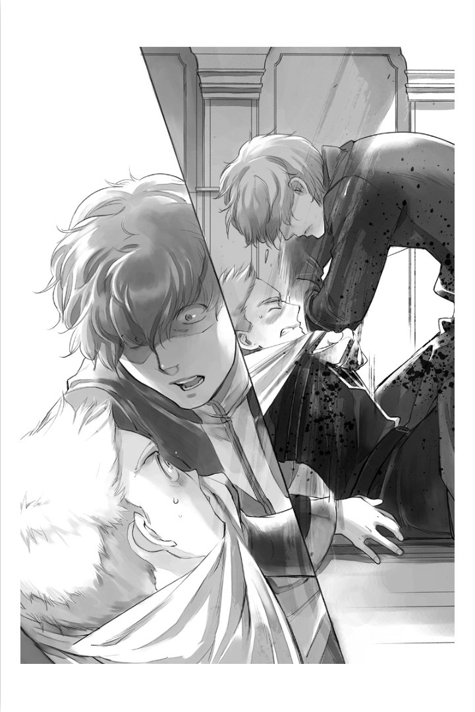

====================================
트라우고트 시점 - 예상이상의 심한 벌
====================================

“유스톡스, 트라우고트를 부탁합니다.”

어머님이 숙부에게 나를 부탁하고 있지만, 꼴사납고 창피해 서둘러 귀족원에서 출발하고 싶었다. 나는 일족회의를 끝내고 귀족원에 돌아가는 것에 마음속 깊이 안도했다. 영주 일족의 측근을 사임한 것이 귀족 사이에서 문제가 된다고는 해도, 계속되는 설교에 진절머리가 났다.

...할아버님은 유일한 손녀라고는 해도 너무 로제마인님만 편드는 건 아닌가?

부계쪽 조부인 보니파티우스님이, 직접 손자들 중 유일한 손녀인 로제마인님을 아끼고 있는 것은 유명하다. 그러나 지나치게 아껴서 눈이 흐려진거라고 생각한다.

“네녀석이 로제마인을 경솔하게 취급하다니! 신분차도 이해하지 못한다니 멍청한 것에도 정도가 있다!”

그런 소리를 듣고도, 로제마인님이 영주일족 중에서도 가장 핏줄이 열등하다는 것은 부동의 사실이다. 타령의 영주일족의 피를 잇는 빌프리트님이나 샤를로테님과 비교할 것도 없다. 솔직히 말해, 일부의 상급귀족과 비교해도 열등하다.

나는 할아버님의 손자라는 점에서는 로제마인님과 동렬이고, 모계의 핏줄을 보면, 로제마인님이 라이제강이고, 나는 영주일족의 방계다. 내 쪽이 우월한 핏줄을 타고 났다. 다소 얕보일 수 있지만 어쩔 수 없다고 생각한다.

할아버님은 그럼에도 불구하고, 내가 마력압축의 방법이 알고 싶다는 이유로 로제마인님의 측근을 선택한 것에 격노하고, 디터 중에 로제마인님의 지시에 반항적인 언동을 보였다는 것에 분개해 안게리카와의 혼약은 취소하라고 큰소리쳤다.

...그 정도로 화낼 일인가?

모계의 조모인 리카르다는 ‘어떤 이유로도 측근이 되어도, 제대로 섬기면 문제는 없다.’ 고 말해왔다. 그렇다면, 마력압축이 이유여도 문제없다. 나는 마력압축만 아니었다면, 빌프리트님의 호위기사가 되었겠지. 눈덩이에 조금 맞은정도로 쓰러지는 주인의 호위 따위의 귀찮은 일은, 솔직히 말하면 하고싶지 않았다. 거기에, 여성인 영주후보생의 사교는 다과회가 대부분이다. 거기에 멀뚱히 서있는 것이 호위의 일이라니, 너무 시시하다. 그것보다 동성의 영주후보생의 호위기사가 되어, 함께 사냥에 나서거나, 게뷔넨의 상대를 하라는 쪽이 훨씬 즐거울거라 생각한다.

...나는 마력 압축 방법을 알기 위해, 최악의 주인을 참고 섬겨왔다고.

확실히 디터에서 선두에서 돌격하고 말대꾸를 했을때에는, 주인을 상대로 참지 못하고 다소 반항적인 태도를 취했을지도 모른다. 그러나, 눈덩이에 쓰러지는 듯한 아이가 디터의 무엇을 안다는 건지. 디터를 하고 있는데 공격에 나서는 걸 금지당해, 불쾌하기 그지없었던건 내쪽이었다.

거기에 안게리카와의 혼약은 애제자를 자신의 일족과 맺어주고 싶다는 생각한 할아버님이 꺼낸 것이다. 내가 바란 것도 아니다. 기사로서의 강함은 있지만, 성적이 나쁘고 사교도 하지않는 중급귀족인 안게리카가 내 아내로 어울린다고 생각해본 적도 없다. 졸업 직전인 안게리카와 그 친족은 곤란할지도 모르지만, 혼약을 취소 당한들 나는 아무렇지도 않다.

영주 일족인 할아버님이 성을 내셔서 부모님도 나를 책망하고 있지만, 내 자신은 현 상황에 만족하고 있다. 이제 나는 자유다. 하르트무트가 쓸데없는 것을 말할 때에는 섬뜩했지만, 자비가 깊다고 할지 안이한 주인에게 도움 받았다. 계속 알고 싶다고 생각한 마력 압축 방법을 배우게 되었고, 해임이 아닌 사임이 되었다. 미친 듯이 격노한 할머님을 멈춰주었고, 귀족으로서의 상처도 얕다.

...시끄러운 할머님이나 부모님이 뭐라 말해도, 나는 이미 그만두었다. 측근이 아니다.

신체 강화 보조 마술구를 달지 않으면 움직일 수도 없는 정도로 약해져있고, 외견이 너무 어려 타령의 귀족들로부터도 비웃음을 사고 있는 아이를 주인이라고 부를 일도 없다. 문관에게 책을 가질러 가지고 오라고 하면 끝날 이야기임에도, 측근의 사정도, 영주후보생에게 매일 인사해야하는 솔랑쥬 선생의 사정도 전혀 생각하지 않은 채 숨을 헐떡이며 도서관에 매일 왕래하는 민폐 폭군에게 맞춰줄 수는 없다.

이렇게 일족 회의가 열리고 질책까지 받고 있으니 나도 ‘실패했다’ 고는 생각하고 있지만, 그건 로제마인님을 섬기는 것 자체가 실패한 것이지, 사임하는 것이 아니다.

나는 자유다......

아니, 아직 완전한 자유는 아니다. 귀족원의 후반에는 숙부인 유스톡스가 나의 시종으로서 붙게 된 것이었다. 친족의 감시역으로 보낸거겠지.

“아무리 일족의 명령이어도 이런 무능한 놈의 시종은 싫다구요, 저는.”

무능하다 무능하다라는 소리를 자꾸 듣게되어 화가 났다. 숙부님은 자신의 취미에 지나치게 몰두해 주인을 제대로 섬길수 없어서 게오르기네님의 측근후보에서 떨어져, 선대 아우브의 명령으로 베로니카님에게 홀대를 받고 있던 페르디난드님에게 붙었다고 들은적이 있다.

그런데 할머님이 ‘제가 트라우고트의 시종이 되어 근성을 뜯어 고치겠어요.’ 라고 벼르고 있을 정도였기 때문에, 다소 무능하더라도 시종이 숙부님이어서 살았다고 생각한다. 페르디난드님에 해임되지 않은 것이다. 시종으로서 어느 정도는 해낼 수 있겠지.

자신의 생각에 납득하고 있자, 칼스테드님이 한 장의 서류를 내밀고, 숙부님이 전해주었다.

“페르디난드님으로부터 마침 딱 좋게 유스톡스를 빌려준다, 는 승낙서를 받았다.”

“...마침 딱 좋게?”

숙부님이 승낙서를 보며, 흠흠하고 끄덕였다. 직후, ‘알겠습니다. 가겠습니다.’ 라고 전언을 철회했다. 아무래도 숙부님은 주인의 명령에 순종적인 모양이다. 그렇다면, 내 시종이 되는 것도 별 문제는 없겠지. 나한테도 마침 딱 좋다.

“어머님은 아버님께 계셔주세요. 또 조금 편찮으시죠?”

“자네가 문제를 일으켜서 잖습니까, 트라우고트. 자신의 입장을 귀족원에서 잘 알아두고 오세요. 알겠습니까?”

어머님의 눈총을 받으며 나는 숙부님과 함께 전이대에 올라섰다. 귀족원에 돌아가면 내 마음대로 할 수 있다.

지금의 나는 진심으로 그렇게 생각하고 있었다.

“그럼, 나는 다목적홀로 갈테니까.”

“무슨 말을 하는거냐, 너는? 빨리 오기나해라.”

귀족원에 돌아왔는데, 평소처럼 방이 준비될때까지 다목적홀에서 기다리려고 했더니, 숙부님에게 목덜미를 붙잡혀 방에 끌려들어왔다. 혹시 설교인가 싶어 자세를 잡았더니, 숙부님은 “빨리 정리해라.” 라며 방에 옮겨둔 나무상자 더미를 가리켰다.

“하? 내가 짐 정리를 하는건가? 시종인 당신의 일이 아닌가?”

“빨리 정리하지 않으면 옷을 갈아입혀줄 수 도 없고, 내 일도 할 수 없다. 빨리 하도록.”

의미를 알 수 없다. 숙부님의 일은 짐정리가 아닌가.

“유스톡스, 당신......”

“숙부님이라고 불러라, 내가 너의 시종으로서 여기에 온 것은, 주종계약의 결과가 아니다. 어디까지나 일족회의에서 정해지고, 나의 주인이 허가를 내렸기 때문이다. 너는 내 주인이 아니다. 그걸 잊지 말도록.”

“무, 무무무.....”

확실히 주종계약은 하지 않았지만, 시종으로서 귀족원에 동행하는 것으로 숙부님의 주인은 내가 될터였다. 의미를 알 수 없다.

“나는 주인이신 페르디난드님으로부터 귀족원에서 정보수집과 기숙사내의 파악, 문관의 육성 등을 부탁받았다. 너의 시종 업무는 어떻게 되든 상관없는 일이니, 비어있는 쉬는시간에 하게 된다. 바쁘니까 내 방해는 하지마라.”

숙부님은 그렇게 말하고, 나의 짐이 아닌 자신의 짐을 풀기 시작했다.

“하!? 이 귀족원에서는 주인인 나에게......”

“나의 주인은 언제 어디서든 페르디난드님이다. 너는 일족으로부터 내려진 벌을 받고 있는 중인 것을 잊고 있는거냐? 꽤나 축복받은 머리를 갖고 있구나. ...아무리 무능하다해도 이 정도는 이해해라. 귀찮군.”

숙부님은 기어코 내 짐은 정리하지 않은 채, 그 후에는 나의 책상에 앉아 서류를 계속해 읽어나가는 것이었다. 적어도, 끝났다면 이쪽을 도와주는 일 정도는 해도 괜찮겠지.

“숙부님, 짐 정리가 끝났으면 제......”

“그 정도의 정리도 아직 못한건가? 적어도 내가 기숙사를 한 바퀴 도는 동안에는 어떻게든 해두도록.”

마음 깊숙이 바보처럼 여기는 듯한 눈으로 나를 보며 말하고는, 서류를 들고 방을 나가버렸다. 나는 숙부님이 진심으로 짐풀기를 도와줄 생각이 없다는 것을 깨달았다. 겨우 한 명만 데려올 수 있는 시종으로 숙부님을 붙여준 탓에, 보통의 귀족다운 생활도 할 수 없게 되었다.

이것이 일족으로부터의 벌인가......

나는 분해서 입술을 깨물며 짐을 정리하고 있자, 숙부님이 돌아왔다. ‘아직도 끝나지 않은건가?’ 라고 방을 둘러보고서, 내 책상에 앉아 무언가 쓰기 시작했다. 그 모습은 마치 문관이다.

...뭘 하고 있는지는 모르겠지만, 변변찮은 일이겠지.

잘 생각해보니, 나는 숙부님에 대해서 그다지 모른다. 어머님이나 할머님이 잘도 ‘유스톡스는 정말 쓸모없는 정보를 좋아한다니까......’ 라고 질린듯한 얼굴로 말한 기억은 있지만, 직접 얼굴을 마주본 적도 많지 않다.

“응? 올도난츠?”

방에 하얀 새가 들어오는 것을 보고, 나는 멈추기 위해 듯 팔을 내밀었다. 하지만, 올도난츠는 나를 지나치더니 숙부님의 앞에 내려섰다.

“코르넬리우스입니다. 귀족원에 돌아왔습니다. 이제 곧 로제마인님이 도착합니다.”

세 번 말하자, 올도난츠는 황색의 마색으로 돌아갔다. 숙부님은 ‘알겠습니다. 인사하러 가겠습니다.’ 라고 답장을 보내고, 펜을 들었다.

“로제마인님에게 인사를 드려야 하는데, 너는 아직 짐정리를 하고 있는건가? 아무리 그래도 이건 너무 느리군. 정말로 누님의 아들인가...? 아아, 아버지가 그 모양이니 어쩔 수 없나.”

“숙부님, 지금 뭐라고...”

“빨리 정리하라고 했다.”

숙부님은 그렇게 말하며 남은 짐을 정리하기 시작했다. 순식간에 정리해가는 모습을 보고, 도와줄거면 빨리 도와주지라고 생각했다. 시종으로서의 교육을 받지 않은 기사견습인 나에게, 숙부님은 많은 것을 요구한거다.

“가자, 트라우고트.”

“...어디로 가는겁니까?”

“너는 정말로 다른 사람의 말을 듣지 않는구나. 로제마인님이 귀족원에 돌아오셨으니 인사하러 간다고 하지 않았나.”

바보를 보는듯한 눈으로 쳐다보자 나는 발끈했다.

“내 시종이 무슨 인사를 하는건가?”

“나는 페르디난드님으로부터 부탁받은 일이 있다. 거기다, 너는 로제마인님에게 사죄하지 않으면 안된다. 설마 그정도로 일족회의에서 질책받고서도, 자신이 무슨 짓을 저지른건가 모른다고 하지는 않겠지?”

그정도로 큰 일을 저질렀다고는 생각하지 않는다만......

나는 그렇게 생각했지만, 쓸데없는 말로 숙부님으로부터 보고가 들어가, 귀족원이 끝나고 나서도 다시 일족회의가 열리는 것도 귀찮다. 로제마인님에게 겉으로라도 사죄하고 오는 것이 무난하겠지.

“격조하셨습니까, 로제마인 공주님.”

내가 무언가 말하기도 전에 숙부님이 말을 걸었다. 내가 소개하는것보다 먼저 시종이 인사를 하다니 로제마인님이 놀라겠지. 그렇게 생각했지만, 로제마인님은 웃는 얼굴로 숙부님을 받아들였다.

“플랑탱 상회로부터 유스톡스에게 많은 신세를 졌다고 들었습니다. 2년동안 고생하셨다면서요. 큰 도움이 되었습니다. 앞으로도 잘 부탁드릴께요.”

숙부님에게 신세를 졌다고...?

좀처럼 얼굴을 보지 않아, 무엇을 하고 있는지 잘 알수 없었던 숙부님과 로제마인님의 사이에 연결이 있었다는 게 놀라웠다. 그러고보니, 페르디난드님은 로제마인님의 후견인이다. 그러나, 후견인의 측근과 그렇게까지 친밀할거라고는 생각하지 못했다.

지금까지 숙부님은 무슨일을 해온건가...? 할머님이나 어머님으로부터도 들은 푸념에서 무능하다고 판단하고 있었지만, 실은 아닐지도?

“으극!”

생각에 빠져있자 옆구리에 격통을 느꼈다. 숙부님이 팔꿈치로 갑작스레 찌른것이었다는 것을 알기까지 몇초가 걸렸다. ‘갑자기 무슨 짓이야!?’ 라고 말하고 싶었지만, 너무 아파서 말이 나오지 않는다. 비명이 새어나가지 않도록 참는 것이 고작이었다.

“트라우고트, 너는 공주님께 말씀드릴게 있었지. 무얼 멍청히 있는거냐?”

위압적으로 낮은 목소리와 차가운 시선에 꿀꺽하고 숨을 삼켰다. 엄청난 분노를 느껴, 거스르는 것 조차 할 수 없었다. 나는 입술을 깨물며 옆구리를 감싸며 로제마인님의 앞에 무릎을 꿇었다.

“...제 얕은 생각으로, 로제마인님에게 큰 실례를 끼쳤습니다. 정말 송구합니다. 깊이 사죄드립니다.”

이걸로 괜찮겠지...?

그렇게 생각하자 숙부님은 더욱 차가운 눈이 되었다. 나의 사죄를 받지 않고서 로제마인님에게 말하면서, 그 이후로는 나를 완전히 무시하고 문관 교육에 관한 이야기를 하면서 다목적홀로 들어간다. 나의 존재는 완전히 덤이다.

다목적홀에 들어가자, 로제마인님을 맞이하던 사람들이 가까이 왔다. 나는 더는 로제마인님의 측근은 아니기 때문에 거리를 벌리려고 했더니, 아까 팔꿈치를 맞은 옆구리를 숙부님이 다시 강하게 때렸다.

“그흑......”

“어딜 갈 생각이냐? 공주님과의 이야기가 끝날때까지 너는 나한테서 떨어지지마라. 너는 적당히 자신의 입장을 분별하도록.”

주변에는 들리지 않을 정도의 목소리로 말하는 도중에 로제마인님이 말을 걸었다. 내가 아닌 숙부님에게.

“의지할만한 사감이 없습니다. 지금은 트라우고트의 시종이 아닌, 페르디난드님의 문관으로서 조언을 받아도 될까요?”

페르디난드님의 문관으로서? 시종이 아니라?

의미를 이해할수 없는 나와 달리, 로제마인님과 숙부님의 사이에는 당연한 인식인 것 같았다. 숙부님은 주위의 학생들로부터 현상황을 묻고, 차례차례로 적확한 지시를 내려간다. 내가 생각했던 무능과는 큰 차이가 있는 모습에 눈을 크게 떴다.

숙부님의 평가를 수정한 다음날, 내게 시종을 교대한다고 알렸다.

“오늘, 나는 왕족의 다과회에 동행하는 것으로 되어있다. 그 사이는 어머님이 너의 시종으로서 와주시는 모양이다. 나는 지금부터 준비를 갖출테니, 너는 다목적홀에 가고 싶다면 가도 상관없다.

“그렇습니까......”

결정 사항으로서 전달하는 것 뿐이므로 내가 무엇을 말해도 의미가 없겠지. 나는 가볍게 끄덕였다. 자신의 일을 우선하는 숙부님보다는 다소 설교를 쏟아내도 할머님쪽이 시종으로서 일해주실 것이 틀림없다. 조금이지만 안도의 숨을 내쉬었다.

나는 먼저 다목적 홀에 나갔다. 영지대항전에 대해 의논하고 있었기 때문이었다. 영지대항전에 의논은 빌프리트님의 측근을 중심으로하여 말하고 있지만, 디터에 관해서는 코르넬리우스와 레오노레의 발언권이 크다.

로제마인님의 귀환 중에 일어난 보물찾기 디터의 재전을 완패했기 때문에 첫 싸움에서 활약했던 로제마인님의 지시와 호위기사들을 다시 보았기 때문이었다. 레오노레가 모인 전원에게 자료나 마물의 공격방법을 토대로 작전이 재검토되어, 연대의 중요성이 몇 번이고 강조되었다. ‘연대를 흩트리지 마라.’ 라고 디터 중에 몇 번이고 들은 나는, 상당히 주눅이 들었다. ‘속도를 겨루는 디터에서 중요한 것은, 연대보다도 공격력이 아닌가.’ 라고 발언해도 ‘아직도 연대의 중요성을 모르는건가.’ 라며 입을 막았다. 이정도로 자신의 발언이 무시된 것은 처음이다.

“어라...? 누구시죠?”

갑자기 본적없는 여성이 다목적홀에 들어오셨다. 어머님보다 풍채는 좋지만, 어머님과 닮았다. 그것이 누구인지, 나에게는 한눈에 알 수 있었다. 숙부님이다.

무얼하는건가..., 숙부님은!?

왕자의 다도회에 갈 준비를 한다고 말했지만, 그것이 설마 이런 여장이었다고 누가 생각할까. 나는 숙부님을 멈출 수 있는 할머님에게 시선을 돌렸다. 굉장히 싫은 듯한 표정을 짓고 있지만, 멈출 기색은 보이지 않는다.

...설마 할머님은 알고 계셨던건가!?

배신당한 기분으로 입을 뻐끔거리고 있자, 숙부님은 로제마인님의 앞에 나서 무릎꿇었다. 로제마인님은 놀란 표정을 짓고있었다.

...부탁드립니다, 로제마인님. ‘지금 당장 갈아입고 와.’ 라고 호되게 꾸짖어주십시오!

나의 필사적인 바람은 덧엎이도, 로제마인님은 ‘목소리도 바꿀 수 있는건가요?’ 라고 머리를 갸웃거렸다. 놀라는 곳이 다르다.

...괜찮은겁니까!? 당신께서 데리고 걸어야 하는데요!?

도대체 저정도로 순순히 받아들일 수 있는지 알 수 없지만, 로제마인님은 그렇게 받아들이고 있고, 하르트무트는 ‘내게도 필요한 기술인가.’ 라며 생각에 잠겼다.

...저런게 문관에게 필요한 기술일 리가 없잖아!

어머님의 이름을 사칭하는 숙부님에 항의하여도 흘려버리자, 기숙사의 학생들이 불쌍한 사람을 보는 눈으로 보았다. 이것이 일족으로부터의 벌이라면, 너무나도 가혹하지 않은가.

“할머님, 이것이 일족으로부터의 벌인겁니까?”

로제마인님과 숙부님들이 외출하는 것을 배웅한 후, 나는 방으로 돌아와 할머님에게 캐물었다.

“예, 이 상황을 달게 받는 것이 당신의 벌입니다. ...사실은 당신을 신전에 넣으려는 안도 있었지만, 공주님이 반대하셨습니다. 그리고 페르디난드 도련님으로부터 유스톡스를 귀족원에 넣기 위해 협력하길 바란다고 이번 건을 상담 받았습니다.”

측근을 사임한 것이, 귀족으로서의 생활을 앗아갈 정도로의 죄라는 소리에, 나는 꿀꺽하고 숨을 삼켰다. 그 정도라고는 생각하지 않았다.

“저도 저 상태의 유스톡스를 공주님에게 붙이는 건 전혀 바라던 바가 아닙니다. 그러나, 질베스타님이나 페르디난드 도련님의 요망과, 로제마인 공주님이 받아들인다면 어쩔 수 없습니다. 이 상황을 견디는 것이, 저에게 주어진 벌이겠죠.”

“할머님의 벌...?”

“당신을 공주님의 측근으로 추천한 것은 저니까요.”

할머님이 어깨를 떨구고 머리를 좌우로 흔들었다. 나는 할머님과 이야기를 나눴을 때가 생각났다. 그것은 아직 로제마인님이 유레베에 잠겨 자고 있을 때, 빌프리트님으로부터 호위기사의 타진이 왔을 때의 일이다.

“트라우고트, 당신은 빌프리트님의 호위기사가 되는 것이 아닌, 로제마인 공주님이 눈을 뜨기를 기다리는 겁니까?”

“네, 할머님. 저는 마력압축의 방법을 알고 싶다고 생각하고 있습니다. 그러므로, 로제마인님이 눈을 떴을 때에 저를 호위기사에 추천해주신다면 좋겠습니다.”

빌프리트님의 호위기사에는 알려줄 수 없는 것이다. 어쩔 수 없다. 나는 로제마인님의 호위기사를 바라고 있다. 코르넬리우스나 안게리카가 놀라운 속도로 마력을 압축하여 늘려가고 있다. 비슷할 정도로 강했던 나를 떼놓고 가는 것은 참기 힘든 굴욕이었다.

“앞으로 1년 넘게 잠들어 있을 공주님을 기다리는 측근 후보는 많지 않습니다. 트라우고트, 당신은 마력압축 방법이 목적이라 해도, 공주님을 성심성의껏 섬길 수 있는거죠? 그럴 수 있다면, 제가 추천하지요.”

할머님에게 몇 번 주의받고, 나는 ‘네’ 라고 대답하며, 마음속으로 ‘마력 압축 방법을 알 때까지는 성심성의껏 섬기겠습니다.’ 라고 덧붙였다. 할머님은 그때그때에 따라, 차례차례 주인을 바꾸고 있는 영주일족의 시종이다. 나도 똑같이 목적을 달성하면 주인을 바꾸면 될 뿐인 이야기다, 라고 생각했다......

...할머님은 차례로 주인을 바꾸고 있지 않은가. 나의 사임이 도대체 이토록 책망받아야 하는거지? 그렇게 생각했지만, 초췌해진 할머님께 따질 수는 없어, 나는 입을 다물었다.

“서둘러 보고서를 작성하지 않으면...... 트라우고트, 방에 돌아갑니다.”

로제마인님과 동행했던 숙부님은 기숙사에 돌아오자마자, 나에게 방에 돌아가자고 말했다. 아직 영지대항전의 이야기를 하고 있었지만, 반론할 여지도 없다. 다른 모두도 ‘빨리 가는게 좋지 않나요?’ 라고 방에 돌아가도록 재촉했다.

사교나 영지대항전을 수행하면서 산더미같은 과제를 재빨리 적절하게 정리해가는 숙부님은, 거의 이틀만에 학생들의 지지를 받고 있다. 학생인 내가 기숙사에서는 이제와서는 완전히 숙부의 덤 취급이다. ‘이것이 벌인건가.’ 라고 자신을 타이르며, 나는 방에 돌아갔다.

“무슨일입니까, 숙부님?”

머리에 붙인 장식을 떼고 있는 숙부님에게 마지못해 말을 걸자, 숙부님은 이쪽을 볼생각도 안한채 ‘시간이 없으니 벗는 것을 도와주세요.’ 라고 교태를 부리며 말했다.

“도와드릴테니, 그 모습은 더 이상 봐주세요. 그리고, 여자 목소리도......”

“나의 일에 참견하지마라. 왕족이나 클라센부르크와 공주님이 어떤 회담을 가지는지 알기 위해 필요한 것이었으니 분장한 것일 뿐이지만, 수확이 많았다. 페르디난드님도 기뻐하시겠지.”

...여장을 권장하는 페르디난드님은 머리가 이상한 것이 아닐까?

이런 측근을 해임하지 않고 있는 것이다. 보통이 아니다. 숙부님은 머리장식이 남아있는지 묻더니, 나는 어머님과 닮은 갈색의 머리를 보며 확인했다.

“그건 그렇고, 여성 시종의 의복을 용케 손에 넣으셨네요.”

“어머님이나 누님의 의복을 보며 따라 만들었지만, 시종의 의복이 아니다. 넌 눈도 나쁘구나.”

나에게는 잘 알 수 없었지만, 세세한 부분이 다른 모양이었다. 멀리서 보고 닮아 보이면 그만이다. 그것보다 더 신경 쓰이는 것을 시원스레 말한것이 아닌가.

“만들었다니, 설마 직접...?”

“당연하다. 입혀줄 사람이 없는 변장용 의복인데 다른 사람의 손이 필요한 옷이면 곤란하지 않은가.”

...아니. 그런건 어찌되어도 좋다. 숙부님이 바느질을 하는 것에 놀란 것이다!

여장에 얼마나 열의를 가지고 있는건가. 생각한 것만으로 머리가 아프다. 부스럭거리며 가발을 든 숙부님이, 다음으로 머리 뒤편의 끈을 풀었다. 앞쪽의 버튼을 숨기기 위한 비녀가 드러났다.

“형태는 비슷하게 만들어져 있지만, 혼자서 입을 수 있게 해두었고, 이런저런 도구가 숨겨져있다. 자... 봐라.”

“스커트를 말지 말아주세요! 보고 싶지 않앗!”

이쪽 저쪽에서 끈을 풀거나 나무 상자에 정리하고 있는 사이에, 자신이 기사견습이라는 의식이 산산조각나는 듯한 기분이 되었다.

그러나, 의외로, 숙부님의 여장은 기숙사에서는 일반적으로 받아들여졌다. 혹시 나와는 관계가 없는 것과 눈을 피하는 편이 좋을지도 모른다. 동시에 숙부님의 나에 대한 취급이 너무하다는 것이 기숙사 내에 퍼져, 나는 주변에서 동정의 시선을 받게 되었다. 생활을 정돈 해주는 시종이 자신에 사정에 따라 돌아다니고, 제멋대로 하는 것이다. 어떤 의미로, 하급귀족보다도 취급이 나쁘다.

그러나, 조금 냉정히 숙부님의 옆에서 기숙사 내를 돌아보면, 로제마인님의 측근이 중심이 되어 기숙사 내가 굴러가고 있는 것을 눈치챘다. 앞으로 주류는 빌프리트님이 아닌, 로제마인님이 되는 것은 아닐까.

...나는 저 안에 있었건만...

스스로 주류를 떠난 것을 후회한 나는, 이런 생활을 마무리 지을 명안을 생각해냈다. 로제마인님의 호위기사를 사임하고나서, 이런 벌을 받고 있는 것이다. 숙부님을 떼어놓고 싶다면, 로제마인님의 호위기사로 돌아가면 된다. 그러면 할아버님을 시작으로 일족의 노여움도 풀리고, 심한 벌도 끝나겠지.

나는 방에 돌아가서, ‘로제마인님에게 성심성의 사죄하고 호위기사로 돌아갑니다.’ 라고 숙부님에게 말했다. 몇 번인가 눈을 깜빡이고서 숙부님은 코웃음을 쳤다.

“공주님으로부터 완전히 버려졌으면서 무슨 바보같은 소리를...... 멍청한 것에도 정도가 있다.”

“앗!? 그치만...”

...로제마인님은 자비가 깊고 안이하다. 눈물이라도 보여 반성한 모습을 보이면 허락해주겠지.

입밖으로 꺼내지는 않았지만, 숙부님에게는 나의 생각이 전해진 모양이다. 그 순간, 나의 명치에 격통이 울리고, 몇 초간 숨이 멎었다. 컥컥하고 숨을 내뱉자 던져져 버리고, 그 상태로 덮쳐진채로 목을 졸렸다.

“윽...... 끅......”

기사도 아닌 숙부님에게 완전히 제압당해 맞서지도 못하는 사실에, 기사견습으로서의 자존심이 와르르 무너졌다.

“너는 로제마인 공주님에게서 완전히 버려졌다. 자신의 주위에서 어슬렁거리게 하고 싶지도 않고, 너를 위해 시간을 쓰고싶지도 않아 벌로서 신전에 들이는 것을 생각조차 하지말아달라고 어머님에게 말한 모양이더군. 너는 공주님에게 있어 신전의 고아보다도 무가치하다.”

...그런 어처구니 없는...

신전에 들이는 것을 반대했다고 할머님께서 말씀하셨을 때에는 ‘로제마인님은 역시 안이해’ 라고 생각했지만, 그것은 착각이었다는 건가. 아니, 그럴리 없다.

완전히 의식이 떨어지기 전에 목을 조르고 있던 손을 살짝 풀어줘, 숨을 쉴수 있도록 되었지만, 아직 손은 놓지 않았다. 나의 생살여탈권을 쥔 채, 숙부님은 질린 듯한 얼굴로 나를 내려보고 있다.

“너는 일족회의에서 그렇게 질책당했는데도, 아직 아무것도 이해하지 못하고 있구나? 사임했다고 해도, 해임에 가까운 것임은 귀족원에 있는 모두가 알고 있다. 어머님이나 칼스테드님으로부터 보고가 있었는데, 당연히 영주부부에게도 전달되었겠지.”

“그게 어떻단 말인가? 나는 아무도 섬기지 않고 기사단장이 된 할아버님처럼 될거다. 로제마인님은 나의 바램을 이해해주셨다.”

나의 주장에 숙부님은 잠시 정색하고 나를 내려본 후, 냉소를 띠었다.

“아무도 섬기지 않고 기사단장이 될 수 있는 것은, 영주일족뿐이다. 상급귀족인 너는 될 수 없지. 분수도 모르는 것도 정도가 있다.”

“그럴 리가...... 로제마인님은......”

“너가 기사단장이 될 수 있다고 정말로 공주님이 말씀하셨나? 너의 바램을 이해했다고 수긍한 것이 아니라?”

순식간에 핏기가 가신다. 숙부님이 말한대로다. 로제마인님이 말씀하신 것은 ‘주장한 바를 이해했다.’ 였다. 잘 생각해보면 ‘기사단장은 무리가 아닌가’ 라고 말씀하셨던 것 같은 기분이 들었다. 그 정도로 강하지 않다는 소리인 줄로만 알고 있었지만, 신분의 문제 였던 것인가.

“너가 기사단장이 되는 길은, 너 자신이 부쉈다. 너는 하얀 탑에 들어간 빌프리트님과 똑같다. 무지의 죄를 저지른 것을 자각해라. 영주의 방계임을 뽐낼뿐인 부친에게 큰 영향을 받고 있는 모양이지만, 주위 사람에게 있어서 너 따위는 그저 상급귀족일 뿐이다. 일족의 수치를 드러낼수 없기 때문에, 너가 타령에 나가는 것은 허락받지 못하겠지, 너의 장래는 에렌페스트의 일개 기사일뿐이다.”

숙부님의 말이 나의 장래를 좁히고, 검게 칠해 나갔다. 나는 나의 장래를 지키고자 필사적으로 저항했다. 주인이 없으면 기사단장이 될 수 없다면, 다시 누군가를 섬기면 된다. 할머님은 그때마다 차례차례 주인을 바꿨으니까.

“그럴리 없다. 숙부님은 틀렸어. 나에게도 아직 기사단장이 될 길은 있을터다. 할머님처럼 주인을 바꾸면......”

“까불지마라.”

그 순간, 숙부님의 눈이 번쩍 빛나더니, 목을 조르던 숙부님의 손에 힘이 들어갔다. 진심으로 살의를 느끼고 숨을 멈췄다.

“어머님은 에렌페스트에 충성을 다하는 영주일족의 방계다. 주인을 자신의 의지로 정하지 못한채, 항상 아우브 에렌페스트의 명령으로 움직이고, 측근이 붙기 힘든 영주일족을 모신다. 그 삶의 방식을 모독하는 것은 용서하지 않는다.”

...그런 사정은 몰랐다. 아니, 들은 적은 있지만, 무슨 의미인가 이해하지 못하고 있었다.

말하고 싶어도 목소리가 나오지 않는다. 숨을 쉴수 없다. 눈물이 흐르고, 머리가 하얗게 될 것 같았지만, 숙부님의 손은 멈추지 않았다.

“너무나 멍청해서 반성이 보이지 않으면, 다음은 확실히 보내버린다.”

휙하고 손을 놓은 것과 동시에 나의 의식은 꺼졌다.

