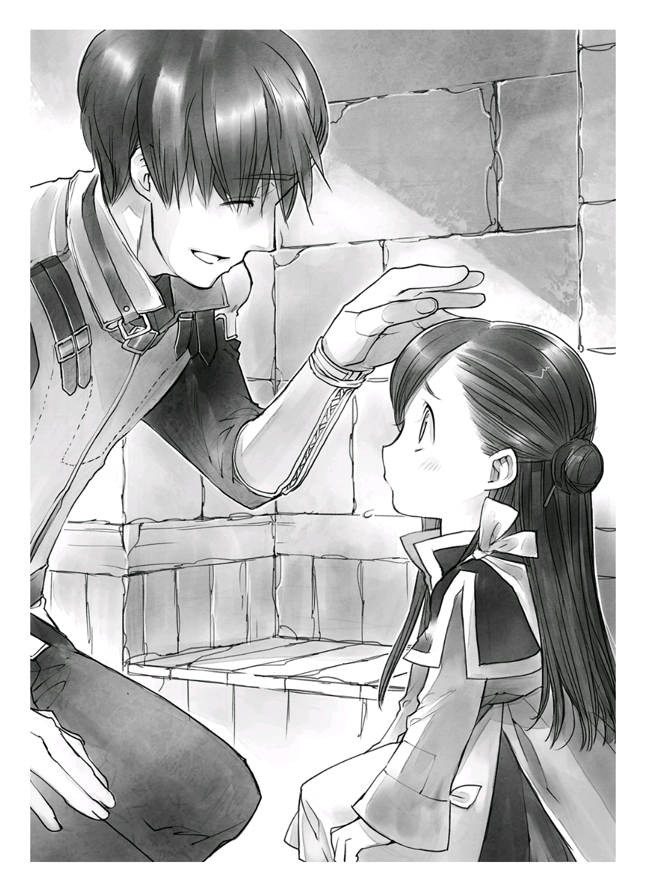

종이, 입수가 불가능하다
=======================

랄프의 등에 업혀 다리를 흔들거리는 사이 외벽 문이 보이기 시작했다.

외벽은 마을을 지키기 위한 벽으로 가까이서 보면 꽤 높았다. 일본 건물로 치면 2, 3층 정도쯤 되는 높이에 두께가 상당했다. 동서남북 사면에 문이 설치되어 있고, 마을에 들어오는 사람을 조사하는 병사들이 그곳을 지켰다.

눈앞의 문은 남문으로 주변에 병사가 여럿 보였다. 그 중에 아빠가 있겠지. 나는 그중에 누가 아빠인지 분간이 가지 않았지만, 투리는 금방 찾아낸 모양이었다. 보따리를 안고 크게 손을 흔들면서 뛰어갔다.

"아빠! 잊고 간 물건 가져왔어. 이거 필요하지?"

투리가 방긋 웃으며 놀란 눈으로 깜빡이는 아빠에게 들고 있던 보따리를 건넸다.

착해도 아주 착한 딸이야, 투리. 

만약 나라면 '아빠가 잊어버리고 가면 엄마가 기분이 팍 나빠지니까 내 쪽이 곤란해진다고. 아침 분위기 잊었어?' 하고 본심이 튀어 나왔을 것 같은데.

"아아, 고맙구나. 응? 마인은 집에 두고 온 거니!?"

"아니, 같이 왔어. 봐봐, 랄프가 마인을 업고 왔어."

바로 알아보지 못한 게 멋쩍었는지 아빠의 동공이 살짝 흔들렸다. 그리고 랄프의 머리에 손을 올렸다.

"고생시켜서 미안하구나, 랄프."

"어차피 숲에 가는 길이었는데요. 뭐."

아빠가 랄프의 머리를 마구 휘젓자 랄프가 당황한 얼굴을 하며 등에서 나를 내렸다. 그리고 페이와 루츠가 지고 있던 자기 짐을 들었다.

"고마워, 랄프, 루츠도 페이도 고마워."

나와 투리는 숲에 가기 위해 문을 나서는 아이들을 배웅하고 대기실에 들어갔다.

외벽 두께는 그 속에 열 평 남짓한 방이 들어갈 만큼 두꺼웠고 그 안에 그다지 넓지 않은 대기실과 숙직실도 갖추고 있었다. 대기실은 간소한 테이블과 의자 몇 개, 선반 하나가 전부인 간소한 방이었다. 내가 꼭 외국에 관광 온 사람처럼 두리번거리는 동안 아빠의 동료로 보이는 사람이 물을 가지고 왔다.

"잊은 물건을 여기까지 가지고 와 주다니, 참 착한 딸들이네요" 

집에서 문까지 걸어오기까지 투리의 걸음걸이로 이십 분은 족히 걸렸기에 나는 목이 말라 있었다. 물을 가져와 준 동료의 마음 씀씀이가 고마웠다. 나무 컵에 든 물을 단숨에 벌컥벌컥 들이켜고 푸하하고 숨을 크게 내쉬었다.

"하아. 맛있어. 죽다 살았네."

"마인은 거의 업혀 왔으면서."

투리가 입술을 쭉 내밀며 하는 말에 모두가 일제히 웃음을 터트렸다. 뾰로통한 얼굴을 했지만 이미 랄프에게 업힌 모습을 보였기 때문에 반론의 여지가 없었다.

내가 모두에게 웃음을 사면서 두 컵째 물을 마시고 있을 때 한 병사가 방에 들어왔다. 그리고 선반에서 도구 상자로 보이는 목재 상자를 꺼내 들고는 바로 방을 나갔다. 왠지 우왕좌왕하는 모습에 나는 무심코 주변을 돌아보았다.

"아빠, 무슨 일 터진 거 아니야?"

"요주의 인물이 온 거겠지. 그렇게 걱정하지 않아도 돼."

아빠는 가볍게 손을 흔들며 신경 쓰지 말라고 했지만 어수선한 분위기를 보니 조금 걱정됐다. 정말 괜찮은 걸까?

그도 그럴 것이 여기가 문이고 문지기가 우왕좌왕하고 있다고! 골칫거리가 일어난 것 같지 않아?

그런 나와는 반대로 투리는 전혀 위기감 따위 느끼지 않는 편안한 표정으로 고개를 갸웃거렸다.

"요주의 인물이라니 어떤 사람이야? 나도 본 적 있는 사람이야?" 

투리는 항상 지나가는 문에서 문지기를 당황하게 하는 인물이 곧바로 떠오르지 않는 모양이었다. 투리의 질문에 아빠는 삐죽삐죽 자란 턱수염을 손바닥으로 쓸며 말을 찾았다.

"음. 가만있자. 어디서 나쁜 짓을 일삼을 것 같은 얼굴이라든지 아니면 영주님께 미리 알리는 편이 좋은 귀족들 정도일까?"

"흠……"

인상만으로 사람을 판단하는구나. 하지만 이곳 환경처럼 정보 전달이 발달하지 않은 곳에서 악당처럼 생긴 사람을 붙잡아다 조사하는 건 어쩔 수 없는 것일지도 몰랐다.

"다른 방에 대기시켰다가 마을에 들여도 될지 말지를 위에서 판단한단다."

아아, 그래서 대기실이 몇 군데나 있었구나. 이제 이해가 가네. 분명 귀족용과 악당 얼굴을 한 사람용 대기실은 방 크기부터 가구까지 완전 다르겠지.

그런 걸 생각하고 있는 사이 병사가 목재 상자와 대나무 통처럼 생긴 둥근 물건을 들고 다시 방에 돌아왔다. 그 병사는 짙은 갈색 머리에 갈색 눈동자로 굉장히 눈을 편안하게 하는 차분한 색채를 가진 젊은 병사였다. 그의 표정에서는 긴급 상황으로 보이는 긴장감 따위는 전혀 보이지 않았다. 아빠가 한 말처럼 별것 아니었나 보다.

그리고 손에 든 짐을 왼손으로 들고 아빠 앞에 서서 오른쪽 주먹으로 왼쪽 가슴을 두 번 두드렸다. 아빠도 일어나 자세를 고쳐 그와 같은 동작으로 답했다. 이곳에서 경례를 표하는 동작인 듯하다.

"오토, 보고 부탁하네."

집에서는 볼 수 없는 위엄 넘치는 아빠의 표정에 나는 "오오!" 하고 작은 소리로 감탄했다. 항상 흐리멍덩한 모습밖에 못 본 나로서는 그런 아빠의 모습이 굉장히 신선했다. 위풍당당한 얼굴이 꽤 멋있었다.

"로빈발트 백작께서 개문을 원하십니다."

"계인 [#1]_ 은?"

"확인 완료했습니다."

"좋아. 통과시켜."

.. [#1] 인장이나 문양을 찍은 뒤 둘로 나누어 가진 이후, 양쪽을 서로 맞춰 문서나 신원의 진위를 확인하는날인 방식

오토는 다시 경례를 한 후, 내 정면에 놓인 의자에 앉았다. 식탁 위에 목재 상자를 올리고 다른 한 손에 든 물건을 펼쳤다. 매끈한 종이에 비해 조금 두께가 있고 특유의 냄새를 희미하게 풍기는 그 물건에 내 시선이 박혔다.

양피지……!?

정말 양피지인지는 모르겠지만, 동물 가죽 재질로 만든 종이었다. 읽을 수는 없지만 이 세계의 글자가 적혀 있었다. 오토는 도구상자 안에서 잉크 병과 갈대 펜처럼 식물로 만든 펜을 꺼내 눈을 휘둥그레 뜨고 응시하는 내 앞에서 양피지에 무언가를 적기 시작했다.

우오오오오옷! 글자다! 글자를 쓸 줄 아는 사람이 여기에 있어! 이 세계에서 처음 만난 문명인이야! 제발 내게 이 세계 글자를 가르쳐줘!

내가 오토의 손끝을 뚫어질 듯 보고 있자 아빠가 "왜 그래?" 라며 내 머리에 손을 툭 올리며 물었다. 나는 아빠를 올려다보며 양피지로 보이는 물건을 손가락으로 가리켰다. 나중을 위해 지금 이름을 확인해 두지 않을 수 없었다.

"아빠, 아빠. 이거 뭐야?"

"아아, 양피지라고, 염소와 양가죽으로 만든 종이야."

"이 검은 건?"

"잉크와 펜이지."

예상대로다. 드디어 종이와 잉크를 발견했다. 이걸로 책을 만들 수 있어. 나는 덩실덩실 춤추고 싶은 기쁨을 자제하며 가슴 앞에 양손을 살포시 모으고 아빠를 올려다보았다.

"아빠, 이거 나 줘~"

"안돼. 애들 장난감이 아니야."

딸내미가 이렇게 귀여운 얼굴로 조르는데 그걸 단칼에 거절하다니. 물론 거절당했다고 해서 간단하게 포기할 생각은 전혀 없다. 우라노 때부터 한번 물면 죽어도 떨어지지 않는다는 말을 들어 왔던 나의 책에 대한 집착을 얕보면 곤란하지.

"이런 거 쓰고 싶어. 갖고 싶다고. 제발."

"안 돼, 안 돼! 거기다 마인은 글자도 모르잖아."

아빠 말대로 글자를 모르면 종이도 잉크도 필요 없다. 그러므로 아빠의 말은 나에게 가장 큰 기회이기도 했다.

"그럼, 나한테 글 가르쳐 줘. 글을 알게 되면 이거, 나 줘야 해?" 

젊은 말단 병사가 글자를 쓸 수 있을 정도니까 상사인 아빠도 당연히 쓸 수 있겠지.

설마 종이 한 장 없는 집에 글을 아는 사람이 있을 거라곤 생각도 못 했는데, 이는 실로 기쁜 오산이 아닐 수 없었다.

야망에 한발 다가간 기분으로 만면에 웃음을 띠는 내 옆에서 "푸핫!" 하고 누군가가 웃음을 터트렸다. 어디서 나는 소린가 해서 시선을 돌려 보니 양피지와 잉크를 둘러싼 부녀간의 대화를 듣고 있던 오토가 참을 수 없다는 듯이 웃고 있었다.

"하하하, 가르쳐 달라니… 큭큭, 반장님 분명 글 쓰는 거 서툴지 않으셨어요?"

그 순간 야망에 금이 가는 소리가 들렸다. 나는 찬물을 왕창 뒤집어쓴 것처럼 웃고 있던 얼굴이 얼어 버린 것을 느꼈다.

"뭐? 아빠, 글 못 써?"

"읽고 쓰기는 조금 가능해. 서류 작업도 해야 하니까 글을 읽을 필요는 있지만, 일 외에는 전혀 쓸모도 없어. 다른 곳에서 온 사람들 이름을 적는 정도다."

"흠…………."

나는 발끈한 얼굴로 변명하는 아빠를 차가운 눈으로 쳐다봤다. 다시 말해서 아빠의 국어 수준은 일본으로 치면 히라가나 표를 보고 반 친구들 이름을 적을 수 있는 정도가 아닐까? 젊어 보이는 오토가 '서툴다' 고 할 정도면 친구들 이름도 가끔 틀리는 초등학교 1학년 수준일 거다. 분명히.

"이 녀석, 아빠를 그런 눈으로 쳐다보면 안 되지!"

내 안의 아빠에 대한 주가를 급상승시켰다가 급락시킨 원흉인 오토가 노심초사하는 표정으로 나를 꾸짖었다. 그리고 아빠를 옹호하듯 병사의 직업에 관해 설명해 주었다.

"병사란 직업은 마을의 치안 유지가 주된 일이지만, 마을 귀족들이 관련된 큰 사건이 일어났을 때 조서 작성은 기사 계급이 해결하고, 작은 사건도 말로 보고를 끝내거든. 이름을 쓸 수 있을 정도면 충분해"

오토의 옹호에 다시 기운이 났는지 아빠도 다시 자신감이 생긴 듯 했다. 나의 차가운 눈초리에 꽤 상처를 받았던 모양이다.

"농민이라면 글을 읽을 수 있는 건 촌장 정도니까 이 정도면 아빠는 충분히 대단한 거야."

"그럼 대단하신 아버지. 이거, 갖고 싶어. 나 줘~"

그렇게 대단한 아빠라면 귀여운 딸에게 종이 백 장 정도는 시원하게 선물해 줄 수 있잖아? 지긋이 아빠의 눈을 바라보면서 조르자 아빠는 질린다는 표정을 하며 한 발 뒷걸음질쳤다.

"하. 한 장에 한 달치 급료가 날아가는 걸 어떻게 사 주냐?"

뭐라고요!? 한 달치 급료!? 자, 잠깐만, 양피지가 그렇게 비싸단 말이야!? 그럼 어린애가 아니라도 아무한테나 쉽게 줄 수 있는 게 아니잖아.

집에 종이가 없는 이유도, 마을에 서점이 보이지 않는 이유도 전부 평민이 살 수 있는 가격이 아니라서였다. 가족이 겨우 입에 풀칠할 급료밖에 못 받는 형편에 책을 만들 종이가 갖고 싶다고 떼를 써도 허사다. 절대 사 줄 수 있을 리가 없다.

오토가 풀이 죽어 푹 떨군 내 머리를 달래듯이 가볍게 다독였다.

"원래 평민이 드나드는 상점엔 팔지 않아. 종이는 귀족이나 귀족과 연결이 필요한 대상인이나 관리들이 쓰는 거지, 어린애가 쓸 물건이 아니거든. 글공부를 하고 싶은 거면 석판을 쓰는 건 어때? 내가 옛날에 쓰던 석판 줄까?"

"정말이에요!? 신난다!"

나는 즉각 대답하고 석판을 받기로 오토와 약속했다. 기왕이면 글공부도 하고 싶으니까 오토를 교사로 지명해 버리자.

"고마워요, 오토 씨. 제발 제게 글을 가르쳐 주세요. 부탁이에요."

활짝 웃으며 조르니 아빠가 나와 오토를 비참한 듯한 얼굴로 번갈아 바라봤지만, 못 본 척했다.

사실 글 연습을 하게 된 것도 석판을 받게 된 것도 나를 들뜨게 했지만, 내가 원하는 건 책이고 필요한 건 종이었다. 석판으로는 글자를 보존할 수 없다. 석판이란 건 쓰고 지우는 칠판 같은 것이라서 글자를 외우기 위한 연습용으로는 괜찮지만, 책이 될 수는 없다.

그건 그렇고 평민은 종이도 못 산다니. 오산도 정도가 있지. 종이 도 없는데 어떻게 책을 만들어야 할까?

종이가 손에 들어오지 않는다면 답은 단 하나. 내가 만들면 되잖아.

으으, 책을 손에 넣기까지의 여정이 멀고도 험하구나!
