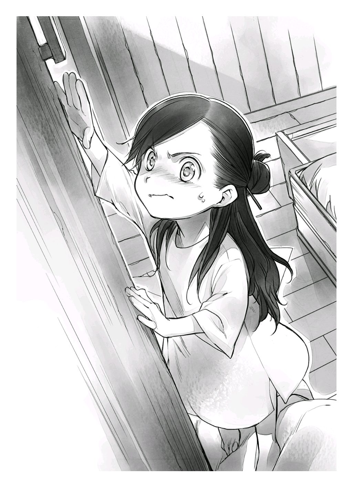

집 안 탐색
==========

내가 마인이 된 지 어느덧 사흘이 지났다. 이 사흘간은 나에게 고통의 나날이었다. 눈물 없이는 들을 수 없는 치열한 전투가 있었다.

우선 집 안에서 책을 찾으려고 엄마 눈을 피해 몰래 침대에서 내려갔다. 하지만 혼쭐난 후 다시 강제로 침대에 끌려왔다. 몇 번인가 도전했지만, 결과는 참패였다. 화장실에 가는 것 외에 침대에서 내려오기만 하면 다시 침대에 눕혀지기를 반복했다. 결국, 책을 찾지못한 채 내 도전은 끝이 났다.

그리고 유일하게 이동이 허락된 화장실도 격한 전쟁터였다.

이곳 화장실은 침실에 둔 요강을 썼다. 게다가 이전까지 마인은 혼자서 볼일을 볼 수 없었던 모양인지 반드시 가족 중 한 사람이 지켜보는 가운데 일을 치러야 했다. 내가 아무리 "혼자 쌀 수 있으니까 제발 보지 마!" 라며 울어도 소용없었다. 도리어 "그러다 오줌지리면 어쩔 건데!?" 라고 꾸지람을 들었다.

다른 사람 앞에서 오줌을 지리는 것보다야 낫겠다는 생각에 속으로 눈물을 흘리며 요강에다 볼일을 보면 투리가 "우와, 마인. 이제 잘 싸네? 금방 혼자서도 쌀 수 있겠는걸?" 이라고 칭찬했다. 여동생의 성장을 진심으로 기뻐하는 건 알겠지만, 덕분에 인간으로서 중요한 나의 자존심과 존엄과 체면은 너덜너덜해졌다.

더 믿기 어려운 건 가족들도 침실 요강에 볼일을 보는데, 오물이 다 차면 그냥 창밖으로 부어 버린다는 거였다. 그때 난 내 눈을 의심했다.

옷을 갈아입는 것도 치열했다. 낯선 아빠가 나를 발가벗겨 옷을 갈아입히는 게 창피해 혼자 하겠다며 울고불고 난리 쳤지만, 버릇없는 어린애 취급만 당했다. 정말 해도 해도 너무하네.

사실 우라노 때 아빠를 일찍 여읜 탓에 나는 아빠라는 존재와 어떻게 지내야 할지 전혀 감이 없었다. 기억 속 마인이 아무리 좋아하던 아빠라도 나에게는 근육이 울뚝불뚝한 불량스런 아빠로밖에 보이지 않았다. 그런 직업병사인 아빠의 강력한 팔심에 비하면 비실비실한 어린애 반항 따위 한 줌 거리였다. 당해낼 재간이 없었다. 가족 전원에게 연달아 사흘간 패배를 맛본 결과, 나는 소녀가 가지는 예민함과 부끄러움을 버렸다. 나는 그저 어린 여자아이이고 가족의 시종를 피할 수 없다는 걸 몸소 깨달았다. 그렇게 생각하지 않으면 살 수가 없다고요!

모든 걸 내려놓기 전까지는 더는 이런 생활 못 해먹겠다고 생각했지만, 어쩔 수 없었다. 지금 상황에 나 같은 어린 환자가 느닷없이 집을 나간다 해서 원하는 생활을 누릴 수 있을 리 만무했다. 제대로 된 화장실과 목욕탕을 찾겠다고 가출한들 기껏해야 창문에서 떨어지는 오물을 뒤집어쓰고 비명 지르며 뛰어다니다 결국은 길가에 쓰러져 죽겠지.

언뜻 보기에 완벽한 나의 패배인 것 같지만, 사실 꼭 그렇지만은 않았다. 나에게도 작은 승리는 있었다.

일단 몸이 간지러워 견딜 수 없었던 나는 투리에게 부탁해서 매일 따뜻하게 적신 천으로 몸을 닦기로 했다. 어차피 옷을 갈아입을 때 홀딱 벗겨지는 몸이다. 한발 앞서 몸을 닦게 하는 것에 그 어떤 저항이 있으랴.

투리는 매일같이 이상한 눈으로 나를 쳐다봤지만, 난 상쾌해졌다. 첫날은 대야에 받아놓은 물이 뿌옇게 탁해질 정도로 더러웠지만, 최근에는 그 정도가 덜했다. 하지만 머리가 아직 가렵다. 없는건 알지만, 샴푸가 쓰고 싶다.

그리고 나는 또 한 가지를 손에 거머쥐었다.

바로 머리를 묶어 올릴 수 있는 비녀다. 부스스하게 흘러내리는 머리를 고정할 비녀를 갖고 싶다고 하자 투리가 나무를 깎아서 만들어 줬다.

사실 내 눈에 투리의 인형 다리가 비녀를 만들기에 가장 적당해 보였다. 부러뜨려도 되느냐고 물었을 때 투리가 반 울상을 지었는데 그땐 정말 미안했다. 사실 아빠가 나무를 깎고 엄마가 옷을 만들어 주었다는 투리의 소중한 인형은 얼핏 제웅을 닮았지만, 자세히 보지 않으면 그 형태를 알기 어려웠다.

완성된 비녀로 머리를 한데 모아 올리려고 하니 투리가 "어른만 머리를 올릴 수 있어." 라고 지적하길래 할 수 없이 반올림 머리로 만족해야 했다. 문화 차이가 커서 익숙해지기까지 시간이 걸릴 것 같다.

부끄러운 생활에도 슬슬 체념했으니 이제 빨리 몸을 회복시켜 생활 환경을 바로잡는 일만 남았다. 그러기 위해선 책이 필요했다. 나의 생활 환경을 잡기 위한 첫걸음이 바로 책이기 때문이다. 책만 있으면 언제까지고 침대 위에서 뒹굴며 지낼 수 있고, 여러 불쾌한 상황도 견딜 수 있을 것 같았다. 아니, 견뎌낼 거다.

그런 이유로 나는 오늘이야말로 집 안을 탐색하기로 마음먹었다. 너무 오랫동안 책을 읽지 않은 탓에 "책! 책 내놔, 우캬!" 라며 짖거나 으르렁거리거나 울부짖거나 하는 이상한 금단 증세가 나타날 지경이었다.

"마인, 자?"

투리가 문을 열고 얼굴을 빼꼼 내밀었다. 내가 얌전히 자는 모습을 보고 만족했는지 고개를 끄덕였다. 요 사흘 동안 눈만 뜨면 책을 찾겠다고 침대를 벗어나 집안을 서성거리다 쓰러지길 반복하니 엄마는 물론, 간호를 맡은 투리까지 철저하게 나를 단속했다.

투리는 정오가 되면 일을 나가는 엄마의 신신당부로 나를 침대에서 단 한 발자국도 못 나가게 필사적으로 막았다. 아무리 도망치려 해도 몸집이 작은 나는 투리를 이길 수가 없었다.

"언젠가 꼭 '**하극상**' 하고 말 거야."

"마인, 뭐라고?"

"응? 빨리 키가 컸음 좋겠다고."

에둘러 말한 내 말에 감춰진 참뜻을 알 리 없는 투리는 곤란한 듯 웃어 보였다.

"마인이 건강해지면 분명 더 클 거야. 네가 계속 아파서 밥을 제대로 못 먹으니까 다섯 살인데 세 살로 보이는 거야."

"투리는 커?"

"나는 여섯 살인데 일곱이나 여덟 살로 보인다고 하니까 큰 편아닐까?"

한 살 터울인데 왜 이렇게 체격 차이가 나는 거지? 하극상하기는 조금 힘들지도 모르겠다. 그래도 절대 포기하지 않겠어. 식사도 위생 환경도 신경 써서 꼭 건강해질 테다.

"엄마는 일 나가셨으니까 설거지하고 올게. 절대로 침대에서 나오면 안 돼. 안 자면 병도 안 낫고 병이 낫지 않으면 키도 안 크니까."

나는 침대를 탈출한 전과가 있었기에 어젯밤부터 투리의 경계심을 풀기 위해 얌전하고 착한 아이인 양 연기를 하며 투리가 밖으로 나갈 때를 조용히 기다리고 있었다.

"그럼, 다녀올게. 얌전히 기다리고 있어."

"네~에."

내가 고분고분 대답하자 투리는 침실 문을 닫았다. 후후훗………. 자, 빨리 나가라.

나는 투리가 그릇이 든 바구니를 안고 밖으로 나가기를 조용히 기다렸다. 어디서 설거지를 하고 오는지 모르겠지만, 항상 삼십 분정도 나갔다 들어오는 걸 보면 집집마다 수도가 설치되어 있지 않은 모양이다. 아마 밖 어딘가에 공용 우물이 있겠지.

찰카닥, 하고 열쇠를 잠그는 소리가 나더니 계단을 내려가는 투리의 발소리가 점차 멀어졌다.

좋아, 찾아 볼까?

여섯 살짜리 언니가 있으니까 집 안 구석구석 찾아 보면 분명 어딘가에 그림책 열 권 정도는 있겠지. 없을 리가 없어. 만약 있다 해도 아직 이 나라 글을 모르니 못 읽겠지만, 그림으로 상상하며 글자를 추측하는 정도는 가능하지 않을까?

나는 투리의 발소리가 완전히 들리지 않자 침대 바닥으로 슬그머니 발을 내디뎠다. 모래와 흙이 밟히는 감촉에 얼굴을 살짝 찡그렸다. 가족들이 신발을 신은 채로 다니는 더러운 바닥 위를 맨발로 걸으려니 끔찍했지만, 내가 집안에서 활개치지 못하게 투리가 사보(옛 유럽인들이 신었던 나막신) 처럼 생긴 나무 신발을 빼앗아 간 이상 어쩔 수 없었다.

발이 더러워지는 것보다 우선 책을 찾아야 해.

아직 열이 많은 나를 가둔 침실 침대 옆에 바구니가 놓여 있었다. 그 안에는 나무나 짚으로 만든 장난감이 들어가 있지만, 책은 없었다.

"이 안에 있었으면 이야기가 빨랐을 텐데・・・・・・."

한 발씩 움직일 때마다 발바닥에 밟히는 작은 모래에서 사박사박 소리가 났다. 여기는 집 안에서도 신발을 신고 생활을 하니까 불평해도 소용없겠지만, 그래도 나는 "제발 누가 빗자루와 걸레 좀 가져와 줘~" 라고 소리를 지를 수밖에 없었다.

물론 집 안에 아무도 없으니 답변도 돌아오지 않을뿐더러 빗자루와 걸레가 뿅 하고 나타날 리도 없다.

"이런, 이거 처음부터 난관인데?"

집안 탐색 첫 관문은 침실 문을 여는 것이었다. 온 힘을 다해 발끝을 치켜세워 팔을 뻗으면 손잡이까지 겨우 닿긴 했지만, 손잡이를 잡고 돌리는 건 생각보다 어려웠다.

발판으로 쓸만한 게 없을까 방 안을 둘러보다가 옷이 든 나무상자를 발견했다.

"크으윽...."

우라노 몸이었다면 나무상자쯤 간단하게 움직였을 텐데, 지금 이 작은 손으로 밀어 보고 당겨 봐도 꼼짝도 안 했다. 체격이 작으니까 장난감 상자를 뒤집어서 올라가는 방법은 어떨까 생각했지만, 체중에 따라 상자가 부서질 가능성도 있었다.

"빨리 커야 할 텐데, 이 몸으론 할 수 없는 일이 너무 많아." 침실 안을 둘러보며 스스로 움직일 수 있는 물건이 없을지 이리저리 궁리한 후, 엄마와 아빠가 덮고 자는 이불을 돌돌 말아 발판대신으로 써 보았다. 내가 덮는 이불을 더러운 바닥 위에 올리는 건 죽어도 싫지만, 이런 생활환경에 익숙한 부모님이라면 아무 문제 없겠지. 분명, 그럴 거야.

아빠, 엄마. 미안…….

책을 손에 넣기 위해서라면 꾸지람 정도는 참아야지.

"영차."

둥글게 만 이불을 밟고 올라가 쭉 뻗은 팔에 모든 체중을 실어 겨우겨우 손잡이를 잡고 돌렸다. 그러자 찰칵 하는 소리와 함께 문이 열렸다. 안쪽으로

"우앗!?"

모든 체중이 쏠려 있던 탓에 내 쪽으로 열린 문에 세게 머리를 부딪칠 뻔하자 황급히 손을 뗐지만 때는 이미 늦었다. 그대로 뒤로 넘어가 둥글게 만 이불에서 데굴데굴 굴러떨어져 쿵 하는 화려한 소리를 내며 바닥에 머리를 부딪쳐 버렸다.

"아야야......"

부딪친 머리를 문지르며 몸을 일으켜 세웠다. 일단 문은 아주 살짝 열려 있다. 아픔 따위야 명예로운 부상이라 생각하자.

나는 힘차게 일어나 문틈 사이로 손을 집어넣어 힘껏 문을 열어젖혔다. 엄마 아빠의 이불이 바닥 위에 슬라이딩하듯 끌렸다. 덕분에 바닥 한쪽이 깨끗해진 것 같지만, 못 본 걸로 해야겠다. 이렇게까지 이불을 더럽힐 생각은 없었는데.

정말 죄송합니다……….

"앗, 부엌이다."

침실을 나오니 부엌이 나왔다. 주방이라 부를 만큼 세련되지 않았고 기구도 제대로 갖추어지지 않아서, 그냥 간단히 조리하는 공간 정도로 보였다.

부엌 중앙에는 그리 크지 않은 식탁과 삼발이 의자 두 개가 놓여있었다. 그리고 의자용으로 쓰는 듯한 나무상자 하나, 오른쪽에는 식기장으로 보이는 손잡이 달린 나무 찬장이 있었다.

침실과 가까운 벽면에는 가마가 있었고, 금속제 냄비, 국자, 프라이팬 같은 조리도구가 벽에 걸려 있고, 벽과 벽을 연결한 끈에 걸레처럼 보이는 지저분한 천이 걸려 있었다. 저걸로 닦았다간 더 더러워질 것 같다.

"으아, 내 몸이 허약한 이유가 여기에 있었네."

가마 반대편 벽 모퉁이에는 커다란 물 항아리와 물을 흘려보낼 수 있는 개수대가 있었다. 예상대로 수도 시설은 갖추어져 있지 않은 모양이다. 그리고 그 옆에 놓인 커다란 상자에 감자나 양파처럼 생긴 재료가 수북이 쌓여 있었다. 본 적 없는 색깔과 형태의 재료라 설령 모양이 감자처럼 생겼다 해도 실제로는 감자가 아닐지도 모른다.

"어? 이건………… 아보카도처럼 생겼는데? 기름을 뽑아낼 수 있을까?"

나는 재료들 속에서 한 채소에 주목했다. 이 재료에서 기름을 뽑아낼 수 있다면 간지러운 머리 문제를 해결할 수 있을지도 모른다. 우라노 시절 엄마는 문화센터 강좌부터 TV 방송에 나오는 절약방법, 잡지 특집에 실린 자연파 생활 등 유별난 것에 잇따라 푹 빠져서 따라하는 버릇이 있었는데, 나는 그때마다 엄마의 장단을 맞춰 줘야 했다. 엄마는 우라노가 머릿속에 책밖에 없으니 다른 것에 흥미를 느끼게 하기 위해서라고 핑계를 댔지만, 나는 알고 있었다. 사실은 엄마 자신이 좋아해서 하는 일이란 걸. 그땐 정말 곤란했었는데 덕분에 샴푸를 만들 수 있을 것 같다.

엄마, 고마워. 나, 여기서 살아갈 수 있을 것 같아.

뜻하지 않은 전리품 발견에 들뜬 기분으로 방을 둘러보았다. 침실 외에 문이 두 개 더 있었다.

"우후훗~, 어느 문이 정답일까?"

이 부엌은 아무리 봐도 책장이 있을 만한 분위기가 아니었다. 나는 부엌에서 다른 방으로 이어진 문이 반쯤 열린 것을 발견하고 힘껏 열어 보았다.

"으~음, 창고인가? 여긴 꽝이네."

그곳은 용도를 알 수 없는 잡동사니들이 너저분하게 쌓여 있는 방이었다. 일단 선반이 있었지만, 어수선한 분위기가 책장이 있을만한 방이 아닌 것 같았다.

나는 그 방을 포기하고 다른 문을 열어 보기로 했다. 찰칵 소리에 문이 잠겨 있다는 걸 알았다. 손잡이를 여러 번 돌려 봤지만, 전혀 열릴 기색이 없었다.

"어라? 혹시 투리가 나간 문이 이거야? 어? 전부 꽝이라구?"

이 문이 정말 밖으로 나가는 문이라면 이 집은 욕실도, 화장실도, 수도도, 책장도, 아무것도 없는 집이란 말인데. 어딜 봐도 이 이상 다른 방은 없었다.

잠깐만요, 하느님. 혹시 저한테 원한 같은 거 있으세요? 나는 분명 우라노 때 '다시 태어나도 책을 읽고 싶다' 라고 빌었다. 일본인으로 살았던 기억과 감각, 상식을 그대로 가지고 환생한 곳이 다름 아닌 욕실도 화장실도 수도도 없는 집이라니 전혀 예상도 하지 않았다. 책이 있는 환경에서 태어나는 게 당연하다고 믿고 있었기 때문에.

"혹시, 책이 비싼가?"

내가 아는 역사에서도 책은 인쇄기가 대량으로 생산되기 전까지는 상당히 비싼 물건이었다. 상류 계급이 아니면 책을 읽을 기회가 거의 없었던 셈이다. 우라노 때처럼 구청에서 출산 기념 선물로 그림책을 주던 환경과는 영원히 안녕인가?

"으으, 할 수 없지. 책이 없다면 일단 글자부터 찾아보자."

책이 없다고 글자 공부를 할 방법이 아예 없는 건 아니다. 광고지, 신문지, 통신문, 설명서, 달력 등, 글자가 쓰인 곳은 어디든지 있을 테니까. 적어도 일본에서는.

"없어. 전혀 없어! 하나도 없어!"

부엌 찬장이나 창고 선반을 차례로 뒤지며 돌아다녔지만, 이 집안에는 책은 물론, 글자가 적힌 물건이 단 하나도 보이지 않았다. 글자뿐 아니라, 종이조차 없었다. 

"이게 대체 무슨 상황이지?"

갑자기 머리에 열이 올랐는지 머리가 지끈거렸다. 심장이 두근두근 요동쳤고, 귀 안에선 고막이 비명을 질렀다. 팽팽하게 당겨졌던 실이 끊어지듯 나는 그 자리에 털썩 주저앉았다.

눈 안쪽이 뜨거웠다.

책에 짓눌려 죽은 건 어쩔 수 없었다고 치자. 책에 파묻혀 죽고싶다는 소원이 약간 어긋났을 뿐이다. 그리고 다시 태어나길 원한 것도 나였다.

그런데 여긴 책도, 글자도, 종이도 없는데? 나, 정말 여기서 살아야 하는 거야? 대체 뭐 하고 살아야 해?

눈물이 똑 떨어졌다.

책이 존재하지 않는 세계 따위 내 머릿속엔 털끝만큼도 없었다.

이곳에서 마인으로서 살아야 할 의미를 찾지 못해 내 마음은 텅 비어 버린 것 같았다.

눈물이 멈추지 않았다.

"마인! 왜 안 자고 있어? 신발도 없이 침대에서 내려오면 안 돼!"

투리가 어느새 집으로 돌아와 부엌 바닥에 주저앉은 나를 발견하고 파란 눈을 치켜세우며 소리 질렀다.

"투리, '**책**' 이 없어."

"왜 그래? 어디 아파?"

"투리, 나, '**책**' 갖고 싶어. '**책**' 읽고 싶다고. '**책**' 을 읽고 싶어서 죽
을 것 같은데, '**책**' 이 없어."

투리는 뚝뚝 눈물 흘리며 망연자실한 나를 걱정하며 달래 주었다. 하지만 책이 없는 현실에 어떠한 의문도 품지 않는 투리에게 지금 내 심정을 아무리 호소해 봤자 그녀가 알아 주지 않겠지.

도대체, 누구한테 말해야 이해해 줄까? 어디로 가야 책이 있는거지? 누가 제발 가르쳐 줘.
