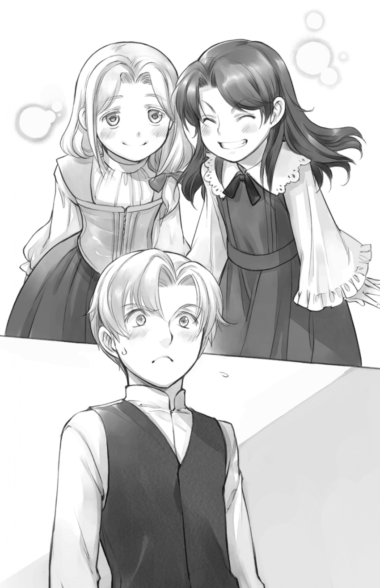

벤노 - 폭주 아가씨의 공통점
===========================

|br| |br|

마인과 루츠의 임시등록과 머리장식 상담을 마치고 우리는 상업길드에서 나왔다. 예상보다 빨리 끝난 것은 마인이 머리장식을 가지고 있었기 때문이다. 나는 길드장의 분해보이는 얼굴을 떠올리며 흡족해했다. 이렇게 좋은 기분으로 길드장과의 면담을 끝낸 것은 처음일지도 모른다. 나는 마인을 안고 걷기 시작했다.

"서둘러 상점으로 돌아가자. 루츠 따라오고 있나?"

마인을 안고 있으면 뒤가 잘 안보인다. 루츠에게 묻자 조금 빠른 걸음의 나막신 소리와 함께 활기찬 목소리가 되돌아왔다.

"이정도 속도라면 괜찮아!"

안긴 마인은 '나도 스스로 걸을 수 있는데' 라고 입술을 삐죽내밀며 불평하지만 이 녀석을 걷게 해서는 안된다. 초조할 정도로 걸음이 느리다. 게다가 갑자기 쓰려져 의식을 잃을 수도 있다. 눈앞에서 마인이 쓰러진 것을 본 마르크에게는 '마인의 건강해 보이는 외견에 속아서는 안됩니다. 나르는 편이 안전합니다.' 라고 주의를 받았다.

나막신 소리로 루츠가 주위에 있는 것을 확인하며 걷는데, 안긴 마인이 막 완성된 길드카드를 보며 중얼거렸다.

"벤노 씨, 접수인이 이상한 눈으로 봤는데 부모가 권유하는 곳 이외의 견습이 되는 것이 그렇게 드문건가요?"

"그건 드물지. 연줄이나 이웃도 아니고 사람 됨됨이도 모르는 녀석같은건 아무리 견습이 되고 싶다고 해도 보통은 상점이나 공방에서 받아주지 않잖아?"

부모나 친척의 소개도 없이 세례식 직후의 견습을 맡는 것은 상당한 이익이 있을 것이라 내다보거나 자신이 손해를 보더라도 전혀 신경쓰지 않는 호인 정도다.

문득 내 뇌리에 이제는 죽고 없는 소꿉친구인 리제가 '나는 반드시 상인 견습이 될거야!' 라고 외치는 소리가 되살아났다.

'그러고보니 그 녀석도 폭주 아가씨였지.''

한번 생각하니 차례차례 리제와의 추억이 떠오른다. 머리속에서 적갈색 머리카락이 살짝 흔들리며 지기 싫어하는 성격을 한눈에 알 수 있는 푸른 눈이 나를 보고 있다.

나에게는 밀다라는 여동생이 있다. 길드장의 아들과의 결혼에서 도망치기 위해 이 거리를 떠나 결혼한 여동생이다. 밀다와 리제는 한 계절 차이만 나는 동갑으로 사이가 좋았다. 리제는 나보다 딱 2살 어리다. 리제의 집은 천을 다루는 상가로 길베르타 상회와 인연이 깊다. 아버지끼리도 딸끼리도 사이가 좋았던 바람에 나이가 비슷한 나와 밀다와 리제 3명은 자주 묶여서 취급되었다.

시장에 가서 상품과 가격을 공부할 때도, 거래가 있는 공방을 견학할 때도 마르크를 따라 셋이 함께 가곤 했다. 나이가 제일 많았던 나는 보기 좋게 둘을 돌보는 일을 떠맡는 경우도 많았다.

|br| ◆ |br|

그것은 내가 막 9살이 되었을 때, 리제가 세례식을 마치고 밀다와 같은 공방에서 재봉사 견습 일을 시작한 지 얼마 되지 않았을 때이다.

"오빠, 오빠. 좀 상담할 게 있어. 괜찮아?"

공방에서의 견습일을 마치고 돌아온 밀다가 주위를 두리번거리다가 나를 몰래 불렀다. 나와 비슷한 색의 머리카락을 왼쪽 어깨에 느슨하게 모아두고 있는 것이 특징이다. 머리카락도 눈도 색채가 비슷한 탓인지 한눈에 남매인 것을 알아보겠다는 말을 자주 듣는다.

"뭔데?"

나는 너무나도 미심쩍어서 나쁜 예감을 느껴 눈썹을 찡그렸다.

"여기서는 말할 수 없어. 빨리."

"어른이 듣지 않았으면 하는 상담같은건 완전히 성가신 일 아니야?"

"성가신 일이 되기 전에 멈추고 싶으니까 상담을 하려고 한거야."

손짓 하는 대로 여동생 방에 가니 거기엔 푸른 눈을 빛내고 있는 리제의 모습이 있었다. 나쁜 예감이 자꾸 가속되어 갔다. 밀다 자신이 성가신 일을 일으키는 경우는 좀처럼 없지만, 리제의 변덕에 휘말리는 경우는 자주 있는 것이다. 이번에도 리제가 뭔가 하려는 것이 분명하다.

"리제에게 말야, 우리 후계자에 대해 얘기했어. 그랬더니 폭주할 것 같아서……. 오빠는 어떻게 하면 좋을거라 생각해?"

'전혀 의미를 모르겠다.'

나는 벅벅 머리를 긁은 뒤 한숨을 내쉬고는 밀다의 어깨를 가볍게 두드렸다.

"처음부터 침착하게 말해. 리제 저 말괄량이가 제 갈 길만 가는건 전부터 그랬어. 나는 너에게 책임이 있다고는 생각하지 않으니까."

"잠깐, 벤노! 그게 무슨 의미야!?"

눈을 부릅 뜬 리제가 물어뜯었지만, 지금은 밀다에게 이야기를 듣고싶다.

"상담받고 싶으면 넌 가만히 있어. 이야기가 복잡해지니까."

나의 말에 컹컹 짖는 강아지 같은 리제가 입을 다물었다. 상당한 용건인 걸까. 불만 가득한 얼굴로 나를 노려보며, 그래도 조용히 있는 리제를 보고 밀다가 입을 열었다.

"……그게, 리제가 상인 견습이 되고 싶어 했던 것은 알고 있지?"

"뭐 그렇지."

얼마 전 있었던 리제의 세례식에서 하얀 나들이옷을 입은 리제는 "재봉사 견습보다는 상인 견습이 좋았을텐데" 라며 혼자 불만가득한 얼굴로 투덜거렸다.

리제에게는 나이 차이가 나는 오빠가 있어서 그가 상점를 이을 것이 분명하다. 그래서 리제가 아무리 희망을 호소해도 그녀의 아버지는 리제를 재봉사 견습으로 삼았다. 여성에게 요구되는 것은 상점과 상점를 연결하는 결혼이며 결혼 상대를 찾을 때에 바느질을 잘하는 미인이 환영받기 때문이다. 친한 밀다가 있으면 우리 재봉 공방에 넣어도 나름대로 일을 할 것이고, 일이 시작되면 포기할 거라고 아버지는 생각하셨다고 한다. 상인의 딸은 그런 것이고 밀다도 마찬가지라는 말을 들은 리제는 어쩔 수 없이 재봉사 견습으로 공방에 가기 시작했다.

"오늘 말야, 나도 오빠때문에 재봉사 견습이 된거지? 라고 리제가 물어봐서 나도 모르게 아니라고 말해 버렸어."

길베르타 상회는 여계 상점이다. 옷을 만드는 여자가 점주가 되고 그 남편과 형제가 영업면을 지탱한다. 옷을 만든다면 남자도 점주가 될 수 없는 것은 아니지만, 귀족 여성 고객의 치수를 재는 등에는 남자는 들어갈 수 없다. 고객과 직접 관계를 맺는 여자가 점주가 되는 것이 좋은 경우가 많다.

그래서 현재 길베르타 상회의 후계자는 내가 아니라 밀다다. 밀다는 어머니의 공방에서 재봉사 견습으로 일하면서 그 외의 날에는 상점에서 상인 공부를 하고 있다. 만약 다른 여동생이 태어나고 그 아이가 바느질을 잘하면 후계자가 될지도 모르지만, 바느질을 하지 않는 내가 점주가 될 일은 없는 것이다

"여자라도 점주가 될 수 있는 길베르타 상회라면 나라도 들어갈 수 있지?"

"하아!?"

"그러니까 말야, 나도 길베르타 상회에 들어가서 상인 견습이 되려고 생각해!"

훗훗훗…… 거리는 리제는 의욕 가득한 미소를 띄우고 있지만, 거기에 말려드는 것은 나와 밀다다. 나쁜 예감은 전혀 틀리지 않았다. 머리가 아프다.

"너 이미 다루아 견습으로서 계약했잖아? 거긴 어떡할려고? 갑자기 계약을 파기하는 녀석을 상인으로서 신용할 수 있어?"

"그러니까, 파기하기 않고 상인 견습이 될 수 있는 방법을 찾는 거잖아. 벤노는 의외로 이해가 느리네."

"이녀석!"

내가 화내는 것을 전혀 신경쓰지 않으며 리제는 팔짱을 끼고 자신의 의견을 주장했다

"내가 아빠를 설득하려면 받아들여줄 곳이 필요하잖아? 그러면 여자가 점주가 되는 데다가 아빠끼리 사이 좋은 길베르타 상회라면 승률이 높아. 내가 직접 부탁하기도 쉽고 아저씨도 협력해 줄지도 모르잖아. 게다가 지금 계약하고 있는 공방의 벨프는 아주머니인걸. 그쪽도 교섭이 쉬울거라 생각하지 않아?"

세례식 직후라고는 생각되지 않는 머리회전과 말솜씨에 나는 내심 혀를 내두르고 있었다. 자신이 원하는 것을 이루기 위해 어쩌면 좋을지 필사적으로 생각하고 있음을 잘 알 수 있다. 나 자신은 상인 견습이 되기 위해 특별히 노력하지 않았기 때문에 나보다 연하인 리제의 노력을 보면서 약간 꺼림칙한 기분이 들었다.

"리제의 기분은 이해하지만 이미 견습처가 정해져서 일을 시작했지. 지금부터 직장을 바꾸긴 어려울거라 생각해."

"괜찮아. 나 10살때까지는 재봉사와 상인을 겸임할거야. 길베르타 상회에서 일한다면 옷에 대해 알아두는 것이 좋은데다 밀다도 하고 있는 일인걸."

세례식때부터 10살때까지의 기간동안 견습은 격일로 일을 한다. 이는 견습이 일에 익숙해지기 위한 동시에 어른들이 교육에 지나치게 시간을 쏟지 않게 하기 위함이기도 하다. 리제는 격일로 다른 일을 함으로써 재봉사와 상인을 양립하겠다고 선언했다.

나는 밀다와 시선을 주고 받는다. 리제를 만류하는 것은 힘들 것 같다.

"겸임은 내가 후계자니까 하는 거야. 평범한 견습이 될 리제가 할 일이 아니야."

"뭐 어때. 같이 하자."

"함께하고 싶은 마음은 나도 있지만, 우리가 겸임하고 있는 내용은 후계자용 교육이라 리제랑 함께 할 수는 없어."

후계자인 밀다는 격일로 재봉사일을 하며 상인 교육을 받고 있다. 교육은 접객과 경영에 관한 것이 주내용이다. 길베르타 상회의 고객에는 귀족도 있기 때문에 귀족과 접촉하는 데에 필요한 인사나 말투, 행동거지를 성년이 될 때까지 익혀야 한다.

"우리라는건 벤노도 하는 거야?"

"오빠는 점주의 보좌를 해야 하니까."

밀다의 보좌를 하기 위해서, 그리고 밀다의 남편이나 아이가 길베르타 상회의 방식을 배우는 데에 내가 교육계가 될 거라고 정해져 있다. 그 때문에 나는 다른 견습들과 실제로 상점에 가서 일하는 날과 밀다와 함게 교육받는 날이 교대로 있다.

"그렇게 밀다와 함께 교육받는데 벤노는 점주가 되고 싶다는 생각해 본적 없어?"

리제의 이상하다는 듯한 얼굴에 나는 살짝 혀를 찼다.

"남자는 귀족 여성 고객의 치수 재는 것도 스스로 할 수 없어서 옷을 만들 수 없거든."

과연, 이라고 납득한 듯 고개를 끄덕이는 리제에게 밀다가 파닥파닥 손을 흔들었다.

"단순한 명분일 뿐이야. 오빠는 의외로 손재주가 없는걸. 상품이나 유행을 보는 안목과 지식은 있지만 손이 따라가지 못해서……."

"밀다, 쓸데없는 소리 하지 마!"

내가 무심코 말을 막자 리제가 멍한 얼굴로 나를 봤다.

"왠지 벤노는 뭐든 잘 할 수 있을 것 같았는데 손재주가 없구나. 흐응, 처음 알았어."

후웅 거리며 리제의 얼굴이 점점 우쭐해져갔다.

'그래서 리제에게는 알리고 싶지 않았던 것이다.'

"괜찮아. 나는 경영이나 접객 쪽이 흥미있고 즐거우니까."

거창하게 들릴지 모르겠지만 이것은 진심이다. 나는 귀족 여성을 위해 옷을 만드는 것보다 접객을 하며 어울리는 것을 권하거나, 손님이 손에 넣고 싶을 것 같은 상품을 찾거나, 수지보고와 눈싸움해가며 흑자를 늘리는 방법을 생각하는 것이 재밌다.

"아, 그건 나도야! 재봉사일보다 상점이나 손님에 관련된 일이 좋아!"

리제는 그러면서 상인일이 얼마나 즐거운지 재잘거리기 시작했다. 다른 사람과 이야기하는 것이 즐겁고, 자신이 권하는 것을 기뻐하는 얼굴을 보면 자신까지 기뻐져 성취감을 느끼는 것 같다.

'그렇다면, 재봉사로는 성취감을 얻을 수 없겠지.'

재봉사는 공방에서 지시받은 대로 바느질하는 것이 일이다. 어머니나 장래의 밀다처럼 고객에게 주문을 받거나 완성된 의상을 주러 가는 입장의 재봉사가 아니면 고객의 반응을 볼 수 있는 경우는 거의 없다. 게다가 리제에게 요구되는 것은 결혼 상대를 찾기 쉽게 하기 위한 바느질 솜씨다. 귀족들과 접하기 위한 솜씨가 아니다.

"나는 반드시 상인 견습이 될거야! 아빠 따윈 끽소리도 못하게 해줄테니까! 그러니까 벤노. 아저씨랑 만나게 부탁해줬으면 하는데."

"내가 왜? 밀다에게 부탁하면 되잖아"

리제의 희망과 마음은 잘 알겠다. 하지만 내가 아버지와 리제의 연결고리를 만드는 의미를 모르겠다. 후계자인 밀다에게 얘기를 하면 좋을거라 생각한다.

"어? 밀다보다 말솜씨가 좋으니 의지가 되잖아. 난 아저씨와 얘기를 하려면 벤노의 협력이 꼭 필요하다고 생각했는데 말야."

아무런 의문도 느끼지 않은 당연하다는 듯한 얼굴을 하며 리제가 말했다. 2살이나 어린 주제에 대등해지려고 건방진 언동을 보이는 소꿉친구가 '의지가 된다' 라고 생각하고 있다는 점에 나는 왠지 쑥쓰러운 기분이 들었다.

'어쩔 수 없네.'

내가 그렇게 생각하고 있을 때, 리제가 '아' 하고 중얼거리며 두 손을 모았다.

"혹시 안돼? 안돼면 어쩔 수 없지만."

"뭐? 그 정도야 당연히 가능하지."

나는 가는 말이 고와야 오는 말이 곱다고 반사적으로 그렇게 말했다. 그 순간 밀다와 리제가 얼굴을 마주보며 웃었다.

"그럼 벤노. 잘 부탁해."

당했다고 생각했을 때는 이미 늦었다. 히힛거리며 웃는 리제에게 등을 떠밀리듯이, 나는 길베르타 상회의 점주인 아버지를 떠보게 되버린 것이다.

당치도 않은 일을 맡은 기분이 들었지만 리제가 요구한 것은 아버지와 만나는 것뿐이다. 면담 장소만 정하는 것이라면 별거 아니다. 나는 분한 마음을 가지며 마르크에게 물어서 바쁘지 않은 시간대에 아버지의 집무실로 향했다.

"……그런 이유로 리제가 우리쪽의 견습이 되고 싶대서, 아버지랑 얘기할 시간을 갖고 싶다고 했어."

내 이야기를 다 들은 아버지가 수염을 만지작거리며 나를 지그시 바라봤다.

"리제의 희망은 알겠다만, 나는 너의 의견을 듣고싶다. 리제를 상인으로서 본다면 우리쪽으로 넣을 가치가 있다고 생각하나?"

"나의 의견……?"

상인으로서의 나의 안목을 시험받고 있다는 것을 느끼며 나는 지금까지의 리제의 언동을 생각해냈다. 마르크를 따라 시장과 공방견학을 갔을 때 리제의 착안점은 이미 상인같았다. 말솜씨가 좋고 머리회전도 빠르다. 바느질 도구보다 계산기를 다루는 것이 익숙하다. 게다가 상인의 일에 대한 희망이나 성취감을 알고 있어서 본인의 의욕도 있다.

"……알았다. 리제의 이야기를 듣는 자리를 마련하지. 다만, 벤노는 이제 간섭하지 말아라. 리제가 스스로 자신의 길을 개척하지 않으면 의미가 없으니까."

"고마워. 아버지."

아버지는 바쁘다. 리제의 이야기를 듣는 시간이 아깝겠지. 그래도 시간을 내어준 것에 한시름 놓았다.

"그런데 이런 교섭을 해오다니, 벤노는 꽤나 리제를 맘에 들어하나 보군."

"아니야! 나는 그저……."

나는 밀다와 리제에게 당했다고 말하고 싶지 않아 말을 찾았다.

"리제는 재봉사보다 상인에 더 가깝다고 생각했을 뿐이야."

"그런가……."

히죽거리는 아버지가 물러나라고 해서 집무실을 나오자 마르크가 기다리고 있었다.

"어떠셨습니까, 벤노 님?"

"얼굴이 웃고 있다고, 마르크. 너, 내가 아버지와 이야기하는 내용을 알고 있었지?"

"밀다 님에게 상담을 받았으니까요."

천연덕스러운 얼굴로 마르크가 그렇게 말했다. 밀다와 리제는 나를 움직이기 위해 먼저 마르크와 상담했던 것 같다.

"큭, 그 녀석들……. 마르크의 힘을 빌리다니 치사하지 않아?"

"그만큼 필사적인 것이죠. 취직이 얽혀 있으니 어른의 힘을 빌리는 것은 당연한 수단입니다. 오히려 어른들을 움직이지 못하면 리제 님이 상인 견습이 되는 것은 이루어질 수 없습니다."

마르크의 말은 알겠지만 동생들에게 당해서 화나는 일임에는 변함이 없다. 마르크가 그런 내 어깨를 달래듯이 가볍게 두드렸다.

"리제 님이 견습으로 들어오시는 것이 기대되는군요."

아직 아버지와 리제가 이야기도 하지 않았는데도, 리제가 본인의 아버지를 설득할 수 있을지도 모르는데 마르크가 빙긋 웃었다.

"……마르크는 리제가 아버지들을 설득할 수 있다고 생각해?"

"어라, 저와 벤노 님을 움직였던 리제 님이 안될거라 생각하십니까?"

그 한마디로 마르크도 말려든 쪽이었음을 알고 나는 쓴웃음을 지었다.

"저 폭주아가씨에게 기가 꺾이는 아저씨의 얼굴이 보고싶네."

며칠 뒤 예상대로 길베르타 상회의 견습복을 받은 리제의 웃는 얼굴이 있었다.

|br| ◆ |br|

"벤노 씨, 왜 멍때리고 있나요?"

마인이 어깨를 탁탁 쳐서 나는 놀라 정신을 차렸고 이미 상점가 근처에 있었다.

"……아니, 지금 돌이켜봐도 그 녀석은 특수했구나 해서……."

"네? 그 녀석? 누구 얘기에요?"

눈을 깜빡이는 마인을 보고 나는 가볍게 고개를 저었다.

"아니, 재봉사 견습에서 상인 견습으로 전향한 녀석이 생각났을 뿐이다. 원래 상인의 딸이었으니 너희만큼 직종에 차이가 있었던건 아냐. 하지만 그 녀석은 다루아 견습으로 계약한 뒤에 직업을 바꾸었으니 그런 의미에서는 꽤나 특수해. 너보다 주위에 폐를 끼쳤었지."

"네? 저 이상으로? 뭔가 동료의식이 싹틀 것 같아."

리제는 이미 죽었기 때문에 절대로 있을 수는 없지만, 그렇게 되면 성가시고 귀찮은 일이 몇 배는 될 것 같다. 나는 즐거운 듯이 금색 눈을 반짝이고 있는 마인의 이마를 딱하고 튕겼다.

"아얏!"

"내가 가장 피해 봤어. 너희들은 지나치게 폐 끼치지 마라."

"……윽, 노력할게요."

그다지 신용이 가지 않는 마인의 대답에 나는 무심코 얼굴을 찡그렸다. 결심하면 일직선인데다 머리회전이 빠르고 말솜씨가 뛰어나 감당할 수 없는 부분에서 마인과 리제는 많이 닮았다.

'그래, 신식인 점도 말이지.'

리제의 사인을 생각하면서 나는 덜렁거리는 마인을 힐끗 보았다. 언젠가 이 녀석도 신식의 열을 억누를 수 없는 날이 올 것이다. 내가 할 수 있는 것은 많지 않다. 그래도 조금이라도 구할 수 있으면 좋겠다고 생각한다.

나는 상점문을 열었다. 여느 때처럼 마르크가 반겨줬다.

"어서 오십시오. 무사히 등록이 끝난 모양이군요."

"그럼, 오늘은 마인 덕분에 완벽하게 승리했다."
