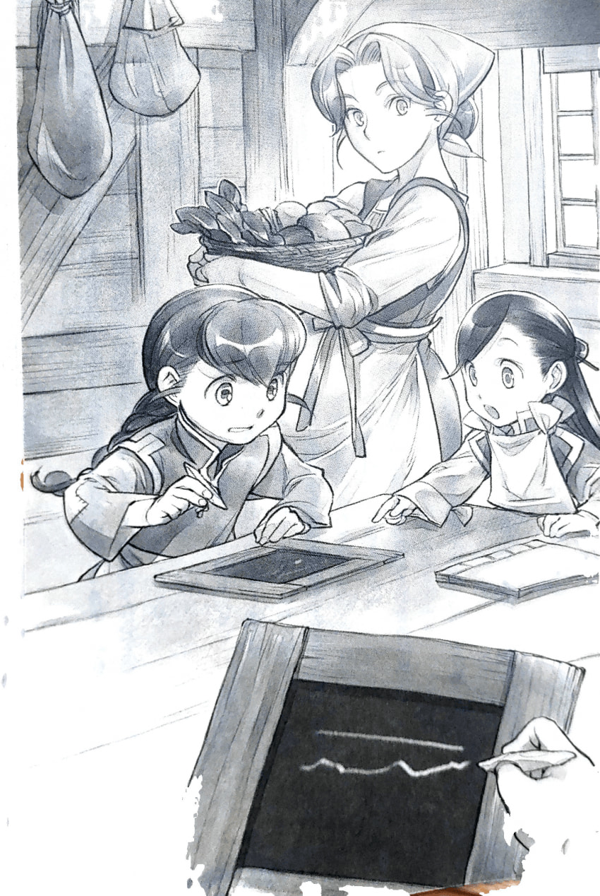

투리 - 그림책과 글자 연습
=========================

|br| |br|

"그럼, 도와줄테니 나도 책 좀 주라. 나도 글자를 배우고 싶어."

책을 마무리하는데 협력해 달라고 마인에게 부탁 받았을 때 나는 큰맘먹고 그렇게 말했다. 아이들을 돌보러 고아원에 들락거리는 일이 잦아지면, 나만 읽고 쓸 수 없을 것 같은 기분이 든다.

'이 근처에서는 읽을 수 없는 것이 보통이지만, 내 주변에만, 마구 읽고 쓸 수 있는 사람들이 있어.'

책을 만드는 마인은 물론, 문지기를 하는 아빠도 읽고 쓸 줄 안다. 전에는 읽을줄 알아도 쓰는게 별로 능숙하지 않았던 것 같은데 마인이 오토씨로부터 글씨를 배우게 되었다. 가끔 "아빠의 위엄이!" 라며 몰래 연습한 것을 알고 있다.

루츠는 견습 상인이 되기 위해 지난해 겨울 마인에게서 배웠는데 이제는 계약 서류를 읽을 수도 있다고 칼라 아줌마가 자랑했을 정도다. 코린나 님도 일하는데 사용하시는 목패에 글씨를 쓰고 있었다. 언젠가 코린나 님의 공방에서 일하려면, 글자의 읽고 쓰기는 필요하게 된다고 생각한다. 무엇보다 먼저 길베르타 상회에서 일하고 있는 루츠나 마인에게 뒤처지고 싶지 않다.

"이게 석필. 이렇게 잡으면 돼. 아, 아냐, 투리. 그렇게 잡으면 안 돼."

검은색 석판을 앞에 두고 흰색 석필 잡는 법과 선 쓰는 법을 연습했다.

'문자는 아직 멀었어.'

나는 마인이 시킨대로 석필을 들고 마인이 그린 그림과 똑같이 선을 그어 간다. 근데 뭔가 제대로 들어가지 않아서, 표본처럼 곧은 선이 그어지지 않고, 비틀비틀 얇은 선이 되고 만다.

"마인, 이렇게 잡고 있으면 힘이 안 들어."

"바늘을 올바르게 잡는 법이 있듯이, 펜도 올바르게 잡는 방법이 있어. 석필은 어떤 식으로 잡아도 선이 그어지지만, 잡는 법을 익히지 못하면 펜을 사용할 때 끝이 금방 으스러져."

마인에게 그런 말을 듣고, 나는 왠지 힘이 들어가지 않는 잡는 방법으로 석필을 움직여 오로지 선을 그었다. 그런데, 마인에게는 간단하지만, 곧은 선을 긋는 것도 의외로 어렵다.

"투리, 귀찮다고 생각하더라도 힘내. 곧은 선이나 원하는 대로 둥근 선을 그릴 수 있어야 의상 모양도 그릴 수 있으니까."

그리고 글쓰기 연습을 하는 틈틈이 글읽기 연습도 해야 할 것 같다.

"귀로 문장을 외우고 나서, 눈으로 따라 읽을 수 있게 되고, 최종적으로 손으로 쓸 수 있게 되면 돼. 투리가 코린나씨의 공방으로 옮기려면 아직 멀었으니까 루츠처럼 급하게 외우지 않아도 괜찮아."

"하지만 루츠도 반년 이상 걸렸잖아? 코린나 님의 공방으로 옮기게 부탁하려고 생각하니, 그렇게 한가롭지는 않아."

다루아 견습의 계약은 3년이다. 공방을 옮기려면 빨리 코린나 님과 이야기를 나누고 이동을 위해 약속을 해야한다. 1년정도 밖에 여유가 없다.

"1년이면 괜찮아. 그보다는 즐겁게 책을 읽는 게 좋아. 책이랑 글자를 보기가 싫어지면, 전혀 머리에 들어오지 않게 되니까. 문에서 지긋지긋하게 배우는 견습생 아이들도 글을 익히는 데 시간이 걸려서, 가르치는 오토씨가 고생했었어."

마인은 웃으며 어린이용 성전 그림책을 펼쳤다.

"어둠의 신은 아찔한 긴 시간을 홀로 보내왔습니다."

마인은 내가 알 수 있도록 손가락으로 말을 가리키며 책을 천천히 읽어간다. 참으로 기쁜 듯 얼굴에 웃음을 띠며 달 같은 금빛 눈동자를 반짝반짝 빛내고 있다. 행복한 얼굴을 하고 있는 마인을 보면서, 나는 계속 같은 말을 반복한다. 아직 문자를 봐도 모르고 마인이 시키는 대로 되뇌일 뿐이다.

"어둠의 신은 아찔한 긴 시간을 홀로 보내왔습니다."

"그래 그래, 좋아. 그럼 다음번엔. 계속 혼자였던 어둠의 신 앞에 빛의 여신이 나타나 주위를 비추었습니다."

어둠의 신이 빛의 여신을 만나고 결혼해 아이를 낳는다. 그 아이가 물의 여신, 불의 신, 바람의 여신, 흙의 여신이다.

"첫 번째로 태어난 것은 물의 여신 플류트레네입니다. 플류트레네는 치유와 청정의 힘을 갖고 있습니다."

마인이 말하는 대로 반복해서 책을 읽고, 석판에 석필로 줄을 긋는 연습을 한다.

"응, 이 정도 선을 잘 그리면 글씨도 잘 쓸 수 있을 거야."

몇 가지 선의 연습을 끝내고 이제야 글씨 연습이 시작됐다. 처음에 가르쳐 준 것은 내 이름이다.

"제일 자주 사용하는 것은 자기 이름이니까. 길베르타 상회에 들어갈 때 루츠는 서약서를 받았어. 투리도 코린나 씨의 공방에 들어가려면 필요할거야."

"그래? 그렇게 중요한 일이라면 빨리 말해줘!"

선을 긋는 것도 어려우니까, 글자를 전부 외우는 것은 더더욱 힘들다. 루츠는 겨울 동안에 외웠지만, 나도 코린나 님에게 부탁하러 갈 때까지 외울 수 있을까. 매우 불안해졌다.

나는 마인이 써 준 본보기를 보면서 내 이름을 적어 간다. 자신의 이름, 가족 이름, 친구 이름, 코린나 님의 이름, 길베르타 상회의 작성법을 배웠다.

"루츠가 데리러 왔으니 난 갈게."

마인은 겨울 채비를 위해 거의 매일 신전에 간다. 견습인데, 나와는 달리 격일이 아니다. 열이 나서 자주 쉬니까, 갈 수 있을 때는 매일 가고 있다.

마인이 시키는 대로 그림책의 글자를 베끼고 있는데 탁 소리가 났다. 고개를 들자, 배가 부른 엄마가 "열심히 하네." 라고 물을 건네주었다.

"너무 어려워. 루츠가 겨우내 외운것도 대단하지만, 문에서 계산 도와주면서 외운 마인은 더 대단한 것 같아."

언제인가, 문지기에게 가르치는 오토를 돕고 있다고 들은 적이 있다. 즉, 문에 가기 시작한지 1년도 안되었을 무렵부터 마인은 가르치는 쪽의 입장이 되어 있었던 것이다. 그때는 흘려 듣고 있었지만, 믿을 수 없다.

"후훗, 문지기 일을 도운 것 말이지……. 나도 성인이 되기 전에는 아버지 심부름을 했었단다."

"엄마의 아버지라는 것은, 할아버지?"

"맞아. 문지기 반장이었으니까. 귀족님들이 소집하는 회의가 가끔 있지? 거기서 차를 내기 위한 말투랑 차 끓이는 법을 배웠어. 필요없어서 문자는 가르쳐주진 않았지만."

할아버지도 할머니도 지금은 없다. 그래서 별로 얘기를 들어본 적이 없었다.

"마인이 신전에 들어가지 않고 대필 일을 하며 문지기 일을 거들었다면 분명 나와 똑같이 회의에서 차를 만드는 일을 하게 되었을 거야."

"음, 마인이 물을 끓일 수 있게 될 거라고 상상은 안 드네"

아직 우물에서 물 한 방울 뜨지 못한 마인이 차를 만들 수 있게 되는 것은 언제일까. 엄마와 둘이서 웃으면서 그런 이야기를 하고, 나는 석판으로 시선을 떨어뜨린다. 

"이왕이면, 엄마도 글씨 외울래?"

"지금은 아기 옷과 기저귀를 만드느라 바쁘니까 조금 있다가도 괜찮아. 겨울에 여유가 되면 투리가 나한테 가르쳐 줘."

"내가 엄마한테?"

생각지도 못한 말에 고개를 들고 눈을 깜빡이자 엄마는 "그래. 나한테 가르칠수 있게 되도록 외워줘." 라며 장난스럽게 웃었다.

"응, 힘낼게!"

엄마에게 기대받는게 기뻐서, 나는 더 열심히 해야겠다는 생각이 들었다. 의욕에 불이 붙어 열심히 연습하고 있던 도중에, 의문이 하나 떠올랐다.

'이 책은 얼마지?'

자신이 만든 머리장식이 비싼 가격에 팔리고 있다는 것을 알고 있는 나는 신전에서 돌아와서 다음 그림책에 대해 생각중인 마인에게 그림책의 가격을 물어보았다.

"음, 공방에서 만든 거라 원가가 그렇게 비싸진 않지만, 가게에서 파는 가격은 소금화 한 닢이랑 대은화 여덟 닢인가?"

"엣?"

나는 놀라서 그림책과 마인을 번갈아 보았다. 그런 고가의 물건을 이 집에 가지고 돌아오다니 믿을 수 없어. 앞으로 자꾸 늘리려고 생각한다는 것은 있을 수 없다.

"가능하면 좀 더 내리고 싶은데, 식물지도 아직 비싸고, 무엇보다 잉크값이 정말로 비싸서……. 제대로 이익을 내려는 벤노 씨도 만만치 않아서 당분간은 못 내릴 것 같아."

마인은 어떻게 가격을 낮출까를 진지하게 생각하고 있지만, 아니다. 그렇지 않다.

"그렇게 비싸다니 내가 절대로 가지고 있을 만한 물건이 아니잖아?" 글씨 연습에 그렇게 쉽게 쓸 수 있는 게 아니야!"

"……응? 아이들이 글씨를 외우는 교과서로 쓰려고 만든건데? 투리는 참 무슨 소리야?"

'멀뚱멀뚱거리고 있는 마인이야말로, 무슨 소리야!?'

소금화 두 닢정도의 가치가 있는 물건을 우리 집에 두고, 나나 앞으로 태어날 아기가 가벼운 마음으로 쓰는 것에 관해 아무 생각이 없는 것같다. 설마 이 그림책이 그렇게 비쌀거라고는 생각하지 않았다. 지금까지의 자신을 생각하니 핏기가 사라진다.

"저, 저기 마인. 이 책 씻을 수 있어?"

"씻으면 안 돼. 투리! 물에 담그면 종이가 너덜너덜해지니까 절대 안 돼!"

"어? 씻으면 안되는구나. 그럼, 책이 더러워지면 어떡해?"

석필을 만진 손으로 책을 넘기다 보니 이미 하얀 가루가 군데군데 묻어 있는 그림책을 힐끗 보았다. 내 마음속은 "어떡하지!?" 로 가득 차 있는데도 마인은 어안이 벙벙한 얼굴로 웃는다.

"더러워지지 않게 쓰는 게 제일이지만 그런데 신경 쓸 것 없어."

"그런 가격 받으면 신경 써!"

지금까지와는 달리 그림책을 만지는 것이 너무 무서워졌다.

'어떡하지!? 맘편히 책 하나 주라고 하지 말걸 그랬어!'