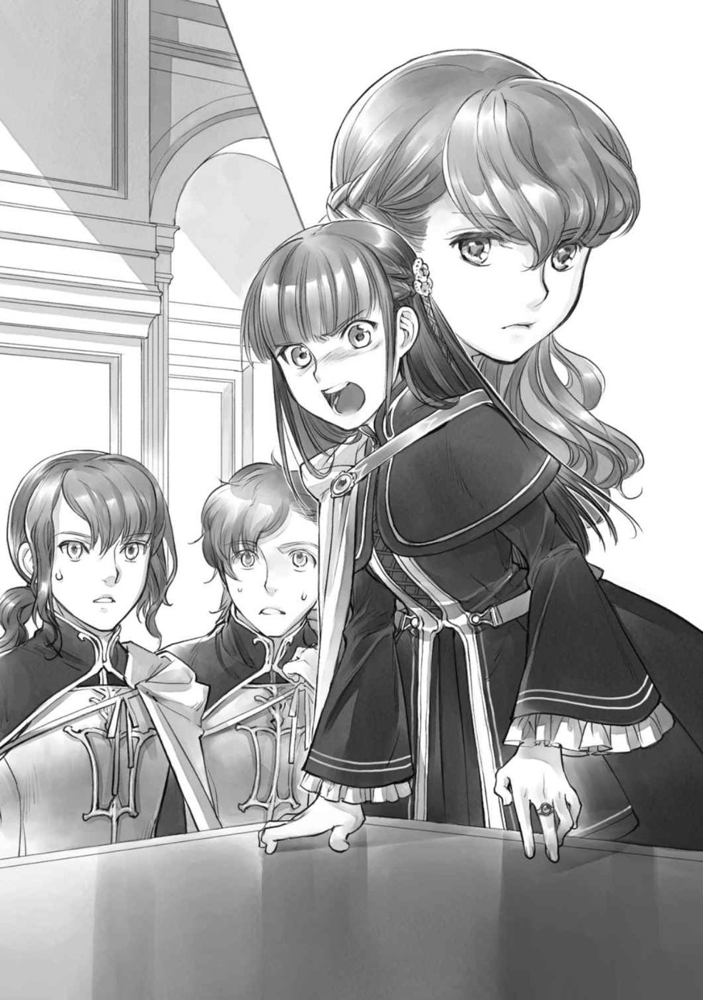

프롤로그
========

단켈페르거와의 디터는 끝났다. 중앙기사단의 난입이나 왕족에 의한 사정청취 등 예상치 못한 일이 일어났지만, 에렌페스트의 승리로 끝나서, 로제마인이 단켈페르거로 시집가는 일은 없다. 자신의 주인을 지킬 수 있었다는 사실에 마티아스는 안도했다.

하지만, 모든 것이 끝났다고 안도할 수는 없다. 그 사정청취 자리에서, 아마도 마티아스밖에 모르는 냄새를 눈치챘기 때문이다.

"사정청취를 포함해 이번 디터에 대한 상담을 하고 싶습니다. 이제부터 회의실로 모여 주시겠습니까?"

저녁식사 때, 식당에서 마티아스는 라우렌츠, 레오노레, 유디트, 거기에 더해 이번 디터에 참석한 브륀힐데에게 말을 걸었다.

"저는 없어도 괜찮습니까?"

아직 어린 얼굴로 그렇게 묻는 테오도르는 귀족원에서만의 호위기사다. 본래의 주인이 기베 쾰른베르거이므로 중요한 상담은 할 수 없다. 하지만 "나만 따돌리는 건가요!" 라고 자주 탄식하는 모습을 알기 때문에, 그것을 정면으로 지적하기를 마티아스는 조금 망설였다.

"이번에는 디터에 참가한 사람으로..."

"참관한 사람의 의견은 필요 없습니까?"

마티아스가 어떻게 말해야 상처입히지 않고 그를 멀리할 수 있을지 고민하자, 레오노레가 어쩔 수 없다는 듯 천천히 숨을 내쉬었다.

"테오도르, 당신이 귀족원만의 호위기사인 이상 선을 긋는 것이 필요해요. ㄴ이쪽 정보를 기베 쾰른베르거에 흘릴 가능성이 있으니까요. ......로제마인 님의 호위기사는 않을꺼죠?"

테오도르는 기사로서 재능이 있다. 로제마인의 호위기사는 인원 부족이고 정보관리 측면에서 볼 때도 정식으로 측근에 들어와주면 고맙다는 게 측근들의 생각이다. 하지만, 테오도르는 조금 생각한 뒤 레오노레의 권유를 거절했다.

"......제 목표는 쾰른베르거의 기사니까요"

저녁식사 후, 디터에 참석한 로제마인의 측근 다섯 명이 회의실에 모였다. 제대로 문을 닫았음을 확인한다.

"브륀힐데, 로제마인 님의 상태는 어떻습니까?"

먼저 마티아스는 견습 시종인 브륀힐데에게 로제마인의 모습을 물었다. 이성인 마티아스는 주인의 방이 있는 3층에 들어갈 수 없다. 그래서, 흙빛 얼굴로 지시를 내리며 끌려나온 로제마인의 얼굴이 쭉 뇌리에 달라붙어 떨어지지 않는 것이다. 조금은 나아졌다든가, 방에서는 나갈 수 없지만 눈을 떴다든가, 뭔가 상황을 알 수 있는 말을 원했다.

그러나, 브륀힐데의 입에서 나온 말은 기대와 완전히 반대되는 말이었다.

"......좋지 않아요. 회복약의 과용이 원인 중 하나이므로, 약을 먹일 수도 없다고 리카르다가 말했습니다. 로제마인 님이 눈을 뜨기를 기다리는 수밖에 없습니다. 사실, 우리가 식사하는 동안 열이 오르고...... 호흡이 너무 괴로운 듯 해요."

지금은 리카르다가 식사를 하러 나오고, 리젤레타와 그레티아가 차가운 천을 이마에 대거나 땀을 닦는 것 같다. 브륀힐데의 얼굴이 로제마인의 상태를 이야기하다 새파랗게 질려간다.

"제가 디터 도중에 정신을 잃지 않았다면, 로제마인 님이 허용량을 넘어선 회복약을 사용하는 것을 막을 수 있었을 텐데......"

후회와 고뇌에 찬 목소리지만, 그건 브륀힐데가 책망받을 일이 아니다. 싸움 훈련조차 제대로 하지 않은 견습 상급 시종이 단켈페르거 견습 기사 중에서 가장 강한 라르타르크의 공격을 받은 것이다. 공포에 정신을 잃어도 이상하지 않다. 그녀는 로제마인의 방패 속에 있는 것이 전제였기 때문에, 막는 방법도 피하는 방법도 그정도로는 훈련하지 않았다. 디터에 참가한 견습 시종에게 요구한 된 것은 회복약 관리와 공격용 마술구의 종류를 익히는 일이다.

"그렇게 말한다면, 방패 속에 레스티라우트 님의 침입을 허용하고 로제마인 님을 지키지 못한 호위기사의 책임입니다. 그때, 제가 무기를 들지 않았다면 방패에서 튕길 일도 없었을 텐데......"

유디트가 어두운 얼굴로 고개를 좌우로 흔든다. 하지만 그것도 어쩔 수 없다고 마티아스는 생각한다. 주인의 위기를 앞에 두고 무기를 들지 않는 호위기사는 없다. 반사적으로 그걸 할 수 있도록 훈련받는 게 호위기사니까.

"아마 유디트가 아니더라도 슈첼리아의 방패에서 튕겨 나왔을 것이다. 오히려, 그 상황에서 주인을 지키려고 움직이지 없는 자는 호위기사로서 실격이다."

마티아스의 말에 라우렌츠도 고개를 끄덕였다.

"게다가, 만약 무기를 손에 들지 않고 레스티라우트 님으로부터 보호받을 수 있었다고 해도, 로제마인 님은 회복약을 마셨을 거라고 생각해. 난입자들의 공격을 막고, 기사들이 회복할 수 있는 자리를 유지하기 위해서는 로제마인 님의 방패가 필요했으니까."

유디트를 위로하려던 라우렌츠의 말에 브륀힐데가 눈썹을 움직였다.

"라우렌츠, 우린 그걸 막았어야 했어요. 페르디난드 님이 계셨다면 측근 실격이라고 야단을 맞았을 겁니다."

마티아스에게도 라우렌츠에게도 의미를 알 수 없었다. "측근 실격" 이라는 말을 들을 만한 일이란 말인가. 지난해 영지대항전에서 타니스베팔렌으로부터 학생들을 지켰을 때도 슈첼리아의 방패가 사용됐지만, 주의를 받는 모습은 없었던 것으로 기억한다.

난입한 자들의 공격을 막기 위해, 그리고 디터로 부상을 당한 기사들이 회복에 전념하기 위해, 더 나아가 관중석에서 비전투원들을 대피시키기 위해서는 슈첼리아의 방패가 반드시 필요했다.

"어째서죠? 슈첼리아의 방패가 없으면 모두가 힘든......"

"단켈페르거에게 슈첼리아의 방패는 없습니다. 로제마인 님의 방패가 없으면 회복도, 비전투원을 지키는 일도 제대로 할 수 없다니, 에렌페스트 견습 기사들의 어리광이 아니옵니까"

브륀힐데는 따가운 눈빛으로 에렌페스트의 견습 기사들을 비난한다. 하지만, 그 방패의 유지는 로제마인이 원해서 만들고 있던 것이다. 브륀힐데의 말은 모두를 지키고 싶었던 로제마인의 생각을 무시하는 것처럼 마티아스에게는 느껴졌다.

"모두를 돕고 싶어하는 로제마인 님의 마음으로 만들어졌던 방패입니다. 로제마인 님의 성심과 그 행동은 고귀하지 않습니까."

"네. 하지만 로제마인 님의 안전과 건강이 최우선입니다. 우리들 측근은 그점을 틀려서는 안됩니다."

강렬한 황색 눈동자가 마티아스와 라우렌츠를 향했다.

"마력이 넘쳐 멈추지 않는다고 잉여마력을 모두에게 주던 때와는 달라요. 주치의인 페르디난드 님이 정하신 양을 초과하여 회복약을 사용하게 하고, 로제마인 님께 무리를 시킨 것은, 우리 에렌페스트 학생 전원입니다. 다과회에서 쓰러질 정도로 허약하다는 것을 알고 있을 텐데, 여러분은 왜 로제마인 님께 무리를 시키십니까? 어째서 그걸 후회도 반성도 하지 않고 당연한 것처럼 받아들이고 있는 거죠?"

마티아스는 브륀힐데의 지적에 뒤통수를 맞은 듯한 충격을 받았다. 그녀의 말이 맞다. 로제마인이 허약하다는 것은 주지의 사실이다. 게다가, 남들보다 많은 마력을 가지고 있다고 해도 무한정으로 있는 것은 아니다. 대량으로 마력을 소비하면 없어진다.

하지만, 회복약을 사용하지 않으면 방패를 유지할 수 없는 상태였다는데, 주인이 축복이나 마력을 사용하는 것에 관해, 마티아스는 전혀 걱정한 적이 없었다. 흙빛의 얼굴을 한 주인의 상태를 걱정하고 있었지만, 그런 상태의 주인에게 의지하는 것에 대해서는 전혀 의문을 갖지 않았던 것이다.

"미안합니다, 브륀힐데. 제가 승리를 위해서는 로제마인 님의 방패가 필요하다고 전략을 세울 때 생각했기 때문에......"

"로제마인 님 본인이 의욕이 있었고, 승리하려면 필요했을 겁니다. 저 방패가 없다면, 저는 디터에 참가하려고 생각하지 않았습니다. ......다만 한넬로레 님이 진에서 나온 시점에서 승패가 결정되었겠죠? 그렇다면, 그 시점에서 방패를 지우고, 로제마인 님의 회복을 최우선으로 할 것을 제안해야 했습니다. 저는 시종으로서 그렇게 할 수 없었던 것을 후회하고 있습니다"

승부만 나면 견습 기사들은 훈련장에서 나와도 문제 없으니까 공격이 잘 맞지 않는 곳에서 회복하면 된다. 관중석에 있는 사람들도 기본적은 방어는 할 테다. 그 때문에 공통 실기로 게티르트 연습을 시키는 것이니까. 샤를로테의 일은 승부를 마친 샤를로테의 호위기사가 구조에 나서면 된다. 시종인 브륀힐데가 본 디터의 반성점은 기사의 눈으로 본 것과 너무 다르다.

"브륀힐데, 저도 후회하고 있어요. 추락한 단켈페르거의 견습 기사를 치유하는 것을 허락하는 것은 아니었습니다. 로제마인 님이 오히려 상당히 심한 상태로 보였거든요."

레오노레는 걱정스러운 듯 로제마인의 방이 있는 쪽을 올려다보았다. 호위기사인 그녀가 브륀힐데에게 공감을 표하고 있는 것에 마티아스는 눈을 깜박인다. 주인의 소망을 이루는 것이 측근의 의무일 것이다.

......왜 그런 식으로 생각하는 거지?

레오노레와 유디트 모두 브륀힐데의 의견에 공감하고 있다. 시종과 기사라는 직책에 따른 차이는 아니다. 더 근본적인 부분이다. 섬기는 자세의 차이는 머지않아 엇갈리거나 불화로 이어질지도 모른다. 지금 상대의 의도를 이해해 두고 싶다. 목 안쪽이 따끔한 듯한 초조함을 느끼며 마티아스는 입에 열었다.

"그렇지만, 그건 로제마인 님이 원했던 거고, 그 기사에게 치유는 필요했을 거예요. 주인의 소망을 이루는 것이 측근의 본분 아닙니까?"

"반드시 그렇지만은 않아요."

딱 자라 그렇게 말한 것은 브륀힐데다. 레오노레는 조금 생각한 뒤, "이름을 바친 측근인 이상, 당신들은 알아두는 게 좋겠죠" 라고 중얼거렸다.

"우리들이 측근이 되기 전의 일이라 코르넬리우스에게서 들은 얘기예요. ......4년전, 주인의 마음에 따르는 것만 생각 하고 호위기사들이 움직인 적이 있었습니다."

조이소타크 자작에게 납치된 샤를로테를 구하려고 로제마인은 뛰쳐나왔다. 주인의 소망을 이루기 위해 호위기사들은 명령하는 대로 움직이다가 주인에게서 떨어졌다. 그 짧은 시간에 다른 사람이 로제마인을 납치했다고 한다.

"호위기사가 주인의 소망을 최우선으로 이룬 결과, 주인은 유레베에서 2년간의 잠에 빠지게 된 것입니다"

샤를로테와 그의 측근, 영주 부부에게 감사를 받았지만, 자신의 주인은 깨어나지 않는다. 시간이 지날수록 점점 존재감이 희미해지고 잊혀져 간다.

"깨어난 주인이 2년 동안의 성장불량과 지식부족, 시간의 흐름에서 뒤처진 정신적 불안정성을 보이는데도 귀족사회는 기다려주지 않습니다. 의식과 현 상황을 맞추는 여유도 없이 귀족원으로 떠나야하는 로제마인 님을 보면서, 지켜내지 못한 호위기사들이 무슨 생각을 했는지 아십니까?"

그들의 고뇌를 상상만 해도 씁쓸한 생각이 가슴속에 솟아오른다. 마티아스도 라우렌츠도 아무 말도 하지 못했다.

"두 번 다시 같은 일이 되풀이 되어서는 안됩니다. 그러기 위해서는, 주인의 소망을 끝없이 이루면 되는 것이 아니라고 이해해주세요. 특히 로제마인 님은 발상이 풍부하고 의욕과 실행력은 매우 높지만 체력이 전혀 따라가지 않습니다. 신전에서 자라 귀족의 상식에 생소한 것도 있고, 의사소통을 하려는 생각으로 인해 되지 않은 것도 많습니다."

로데리히로부터 들은 '구 베로니카파 귀족들이 섬기는 데 있어서의 주의' 보다 더 근본적인 '로제마인이라는 주인을 섬기는 데 있어서의 마음가짐' 이다. 마티아스와 라우렌츠는 진지하게 묻는다.

"그리고 빌프리트 님을 주의해 주십시오. 그 분은, 항상 로제마인 님을 업신여기는 겁니다"

그때부터 브륀힐데의 노도의 푸념이 시작됐다. 측근 외에는 보이지 않는 부분에서 빌프리트는 상당히 로제마인의 측근을 화나게 하고 있다. 하나하나는 사소한 것이지만 쌓이면 산이 되듯, 그녀들의 짜증이 더욱 혐오감을 끌어내는 악순환이 되고 있는 것 같다.

······군데군데 짚이는 곳은 있네.

"디터를 받아들였을 때는 조금 수정헀지만, 디터 후반부터 왕족과의 대화 도중에는 한넬로레 님에 대한 일만 생각하고 있지 않습니까"

"아니, 그건...... 적진에 혼자 있던 한넬로레 님을 진에서 내보냄으로써 에렌페스트의 승리가 되었으니, 어느정도의 배려는 필요하고......"

"배려하는 것은 상관없지만, 같은 정도로 로제마인 님의 낯빛에도 배려해 주셨으면 합니다. 홀로 진에 놓여 있던 타령 영주 후보들의 걱정은 할 수 있어도, 홀로 에렌페스트 모두를 지키려는 약혼자의 걱정을 하지 않는 것에 분개하고 있는겁니다"

"걱정을 안하는건 아니라고 생각하는데......"

빌프리트를 감싸는 라우렌츠를 휙하고 브륀힐데가 노려본다. 그런 그녀를 달래듯 어깨를 두드리며 레오노레가 라우렌츠와 마티아스를 번갈아 쳐다봤다.

"빌프리트 님은 저녁식사 자리에서 디터에서 승리했다는 사실을 모두에게 전하며 기뻐하셨죠? 왕족으로부터 불합리한 트집을 잡히지 않고, 사정청취를 마칠 수 있어서 다행이라고 말했죠? 그런데도, 모두를 위해 방패를 유지하던 로제마인 님에 대한 감사나 무리를 한 약혼자의 걱정을 입에 올리지 않았습니다. ......늘 있는 일이니까, 라고."

새삼스럽게 생각하면 그 말대로였다. 확실히 마티아스도 로제마인을 걱정하고 있었다. 하지만 왕족 앞에 있는 것도 하지못해 퇴장당한 주인의 모습을 보고 있으면서도, 어째서인지 "평소와 같다" "얼마 후에 눈을 뜬다" 라고 마음 한구석에서 생각하고 있었다. 어느새 그렇게 낙인찍힌 것을 깨닫고 마티아스는 숨을 삼켰다.

"모두에게 너무 걱정하지 말라는, 빌프리트 님 나름의 배려라고 생각해요. 그건 나도 알 수 있습니다. 로제마인 님이 누워 계실 때의 상태를 자세히 보고할 수도 없고......"

유디트의 목소리에, 브륀힐데가 목소리를 덮듯이 말한다.

"그렇지만, 에렌페스트를 위해 무리를 하는 로제마인 님에게 빌프리트 님은 약혼자가 된 지 어언 1년이 넘었는데 병문안 하나 준비한 적이 없잖아요. 나, 정말로 화가나서·······. 더욱이 이번에는 디터로 마력과 회복약을 지나치게 사용하여 쓰러졌으니, 평소의 일이 아니잖아요? 그렇게 생각하지 마세요!!!"

다시 브륀힐데가 달아오르기 시작했다. 어지간히 주인이 소중한 것이겠지. 평소에는 특별히 이런 점을 느낄 수 없는 그녀가 이런 상태이니, 저 하르트무트가 지금의 주인의 상태를 알면 얼마나 분노를 보일까.

......생각하고 싶지 않네.

마티아스는 곧바로 하르트무트에 관한 사고를 떨치면서, 빌프리트와의 관계 개선에 대해 제안을 해본다.

"그럼, 시종을 통해서 빌프리트 님으로부터 문안을 받을 수 있도록 전하면......"

"병문안은 그렇게 종용받아서 하는 일이 아닙니다. 게다가 브륀힐데는 화가 났습니다만, 저는 병문안의 유무따위 아무래도 좋습니다. 남성은 기숙사 3층으로 올라갈 수 없고, 정략결혼 상대에게 약한 모습을 보이고 싶지는 않으시죠?"

브륀힐데와는 다른 관점에서 분노를 느끼게 하는 목소리에 라우렌츠가 움찔하는 것이 마티아스에게도 전해진다.

"제가 마음에 들지 않는 것은, 난입자에 의해서 디터의 결착이 어중간해졌다고 빌프리트 님이 생각하고 있는 것입니다. 그 분, 단켈페르거가 패배에 납득하고 있음에도 불구하고, 그와 같은 상태에서 승패를 결정하는 것은...... 하고 왕족 앞에서 재전을 요청하려고 했습니다. 믿을 수 없어요."

레오노레의 남색의 눈에 분노가 떠올랐다. 그 의견에는 동의한다. 마티아스는 말없이 작게 고개를 끄덕였다. 빌프리트는 평소에는 "이의를 제기할 수 없다" "상위자를 따라야 한다" 라고 말하고 있으니, 이럴 때일수록 잠자코 따라주길 바랐다고 생각했다고 한다.

"디터에 참가했음에도 불구하고, 적과의 전력차를 느끼지 못하는 어리석은 자라고는 생각하지 않았습니다. 그 분은 진심으로 로제마인 님을 지킬 생각이 있나요? 어떤 수단을 써서라도 이기면 되는 겁니다. 그 이상으로 우선할 일이 있을까요."

"하지만 기사로서는 혼란스러운 승리는......"

......바보. 그만둬, 라우렌츠!

마티아스의 마음의 목소리는 닿지 않았다. 라우렌츠가 아주 조금 빌프리트를 옹호하는 발언을 하자 레오노레가 빙그레 미소를 짓는다.

"라우렌츠, 당신은 호위기사에게 적합하지 않으니 보니파티우스 님께 부탁해서 훈련을 강화해서 받으세요."

레오노레는 의미를 모르겠다는 듯 눈을 깜박이는 라우렌츠에게서 유디트로 시선을 돌린다.

"유디트, 호위기사의 마음가짐!"

"모든 일에 있어서 주인의 안전을 우선할 것! 어떤 수단을 써서라도 주인을 지켜라!"

유디트는 상쾌한 얼굴로 말한다. 그것이 말뿐이 아님은 라르타르크의 공격 때 유디트가 망토를 펼치고, 주인을 끝까지 지키던 모습에서 알 수 있었다.

"호위기사의 마음가짐을 매일 암기하세요. 승리 방법보다 로제마인 님을 지키는 것이 중요하다고 뼛속까지 스며들도록. 아무리 이름을 바쳤다해도, 명령을 받지 않으면 주인을 지킬 수 없는 호위기사로는 아무 소용이 없으니까요."

해맑은 미소지만 말하는 내용은 진지하고 베어내는 듯한 신랄함이다. 레오노레의 분노를 한 몸에 받은 라우렌츠는 몸을 움츠리면서 사과한다.

"호위기사로서의 마음가짐이 부족했습니다. 죄송합니다. ......하지만, 빌프리트 님은 로제마인 님의 호위기사가 아니니까요......"

"호위기사가 아니더라도 약혼자잖아요. 그것도, 빌프리트 님을 위한 약혼이에요. 로제마인 님과의 약혼이 없었다면 차기 아우브가 될 수 없었고, 오점이 있는 옛 베로니카파 영주 후보생으로서 이번 숙청으로 얼마나 영향을 받게 될 것인지 알 수 없었습니다. 그걸 이해하고 계시는 건가요?"

"네에.., 정말로. 정략결혼 상대이기 때문에, 심증이 중요한 거죠. 병문안 편지나 책 하나라도 보내면 로제마인 님의 호의를 얻는 것따위는 간단할텐데......"

약혼 덕분에 라이제강계 귀족들을 끌어들일 소지가 생겼고 빌프리트는 차기 영주가 될 수 있었다고 말하지만, 옛 베로니카파에서 했던 말과 사뭇 다르다. 계파에 의한 의식의 괴리를 눈앞에 두고 마티아스는 자신도 모르게 입을 열었다.

"라이제강계 귀족들에게는 아무래도 그렇게 되는건가요. 이쪽 파벌에서는, 힘을 너무 많이 깎은 베로니카파와의 균형을 유지하기 위해 빌프리트 님이 차기 영주가 된다고 말합니다만......"

파벌에 따른 의식 차이로 눈을 돌려달라는 발언으로, 레오노레와 브륀힐데는 실망의 한숨을 내쉬었다.

"어머나...... 꽤나 만만하게 보는군요. 정말 옛 베로니카파 귀족들이 그렇게 생각한다면, 빌프리트 님의 저러한 태도가 바뀌는 일은 없겠죠"

"저러한 태도라니......?"

"왕족의 사정청취에서도 빌프리트 님은 오즈발트에게 들은 대로, 우리의 의견을 묵살하고 그저 따를 뿐이었죠? 그걸 말하는 겁니다."

"자신의 측근의 의견밖에 듣지 않고, 저희 의견은 일고의 고려조차 하지 않았습니다. 적어도, 이유를 묻든지 로제마인 님의 의견도 듣고 다시 답장하든지, 뭔가 이쪽에 대한 배려가 조금이라도 있다면......이라고 생각하는 것은 잘못일까요?"

두 사람의 의견에 마티아스는 꿀꺽꿀꺽 숨을 삼켰다. 그 사정청취 자리에서 단켈페르거의 요구에 편승해 난입자에 대한 조사에 동석하기를 레오노레는 희망했다. 마티아스도 마음속으로 동의했다. 하지만 빌프리트는 "상위자에게 쓸데없는 말을 하는 것이 좋다" 는 오즈발트의 말을 우선한 것이다.

......아아, 그때, 그녀들과는 다른 곳에서 나도 빌프리트 님의 언행이 걸렸던 것을 기억했다.

그 후에 더욱 중요한 부분이 걸려서, 빌프리트의 언행을 까맣게 잊고 있었다. 떠올리듯이 생각하다 보니, 유디트가 마티아스와 레오노레 사이로 비집고 들어온다.

"브륀힐데도 레오노레도 진정해주세요! 마티아스와 라우렌츠가 당황하고 있어요. 이름을 바쳤다고는 하지만 마티아스는 옛 베로니카파니까 면전에서 빌프리트 님이 비판받으면 기분이 좋지 않겠죠, 네?"

"유디트, 그런걸로 옹호받아도 곤란하다."

라우렌츠의 어색한 표정에 마티아스는 쓴웃음을 짓는다. 분위기를 읽지 않은 유디트에게 누그러지면서 입을 열었다.

"나는 레오노레들과는 다른 부분에서 빌프리트 님의 언행이 걸렸던 것을 떠올리고 있던 참이다. 생각에 잠긴 것뿐이지 곤란했던 것은 아니다."

"어머, 마티아스는 무슨 일이 걸렸던 것을 기억했어요?"

의외라는 듯이 눈을 깜박이는 브륀힐데에게, 마티아스는 자신에게 걸리는 점을 전했다.

"레스티라우트 님의 요구에 대해, 빌프리트 님은 심각하게 받아들일 일이 아니라고 말씀하셨는데......"

중앙기사단이 왕명도 없이, 제멋대로 움직이고 있었던 것이다. 어째서 기사단의 폭주가 벌어졌는지, 일개 기사인 마티아스도 응당 원인을 밝혀내야 한다고 느꼈다. 그런데도 빌프리트는 각하했다. 에렌페스트 기사단이 아우브의 명령도 없이 같은 일을 할 가능성을 차기 영주로서 생각하지 않는 것일까. 그 심각성, 위험성을 상상할 수 없는 것일까 하고 이상하게 생각한 것이다.

"그리고, 사정청취동안 뭔가 달콤한 냄새를 느끼지 않았나요?"

모두를 모은 이유, 마티아스는 이번 회의에서 가장 묻고 싶었던 말을 꺼냈다. 그의 진지한 눈빛에 사로잡힌 듯 모두가 조금 생각에 잠긴다. 첫 번째로 고개를 든 것은 라우렌츠였다.

"...... 마티아스, 혹시 달콤한 냄새란 것은 여성의 린샴을 말하는 거야? 누구의 냄새가 궁금했던 거야?

"라우렌츠, 그런 걸 이 자리에서 물어볼 리가 없겠지."

장난치는 건지 진지하게 생각해서 나온 말인지 모르겠다. 라우렌츠를 입 다물게하고, 마티아스는 다른 이들에게 시선을 돌렸다. 눈이 마주친 브륀힐데는 고개를 좌우로 흔든다.

"저는 특별히 아무것도 느끼지 못했습니다. 설령 뭔가 냄새가 났다고 해도, 상당히 강하지 않으면 모르는 냄새를 신경 쓰는 일은 없을 거라고 생각합니다"

"......설마......"

고개를 숙이고 생각하던 레오노레가 깜짝 놀란 듯 고개를 들었다. 그 시선을 받아, 마티아스는 끄덕인다.

"중앙기사단에서 툴크가 사용되고 있을 가능성이 높습니다."

"뭐라고요!?!!"

"아나스타지우스 왕자에게 퇴실 인사를 갔을 때, 저는 달콤한 냄새를 인식했습니다. 어디서 흘러오는가 하니, 거기에는 뒹굴고 있던 기사들이 있었습니다. 그때는 무슨 냄새였는지 확실하지 않았는데, 기숙사로 돌아와 벽난로를 보는 순간 갑자기 게오르기네 님의 미소가 머리에 떠올랐던 겁니다."

그로 인해 마티아스의 뇌 안에서 달콤한 냄새와 기억이 합쳐졌다. 하지만, 다른 누구도 눈치채지 못했다. 그 위험성에 등골이 오싹해진다. 브륀힐데와 유디트도 얼굴을 뻣뻣하게 했다.

"숙청으로 인해 에렌페스트에서는 툴크가 위험한 식물로 알려졌을 겁니다. 하지만 냄새나 실물을 알고 있는 사람이 없는 것이군요. 마티아스 말고는 아무도 눈치채지 못했거든요."

"설령 눈앞에서 피워졌다고 해도, 저는 깨닫지 못할 겁니다. 정말 위험한......"

"마티아스, 당신이 수상하게 생각했던 여름의 끝과 다리, 지금 계절은 당연하다는 듯 벽난로가 달려 있다. 툴크를 피우는 것은 쉽다는 말이군?"

라우렌츠의 말에 마티아스는 고개를 끄덕였다. 이상하게 생각되지 않으면서 툴크를 피울 수 있다.

"툴크에 관해서는 저도 지식이 없습니다. 저 세 기사를 조사하는 중앙의 사람들이 눈치채면 좋겠는데......"

옛 베로니카파에 대한 엄격한 언행 때문에 마티아스는 자신의 말이 별로 신용되지 않을까 생각했지만, 레오노레는 이상할 정도로 의심의 말을 하지 않는다. 중앙 기사단에서 툴크가 사용된 것을 전제로 이야기를 진행시켜 나간다.

"툴크는 제 착각일 지도 모릅니다"

오히려, 착각이었으면 좋겠다고 마티아스는 생각한다.중앙기사단에 툴크가 만연해 있을 가능성은 생각하고 싶지 않다. 하지만 레오노레는 마티아스보다 훨씬 현실적이었다.

"로제마인 님을 해치려던 게오르기네 님 일행이 사용했고, 로제마인 님의 시집처가 걸린 디터에의 수상쩍은 난입에 사용되었습니다. 무슨 의도로 로제마인 님을 적대하는 사람들끼리 어딘가에서 연결되어 있어도 이상하지 않을 겁니다."

레오노레는 중앙기사단에 툴크가 사용된 것 이상으로 자신의 주인인 로제마인과 관련된 일에 사용된 것에 착안하고 있었다. 마티아스의 시점과 전혀 다르다. 이것이 호위기사에게 요구되는 위기관리 능력인지도 모른다.

"마티아스가 그 자리에서 툴크에 대해 말하지 않은 것은 정답입니다. 왕족이나 단켈페르거로부터 에렌페스트의 관여를 의심받을 가능성도 있으니까요. ......주인의 판단도 없이 제멋대로 할 수는 없습니다. 지금은 로제마인 님이 깨어나는 것과 회복을 기다리죠."

귀족원에서의 견습 수석 호위기사인, 그녀 나름대로의 기준으로 주인의 소망을 이루는 것을 최우선으로 생각한다. 레오노레의 결정에 마티아스가 고개를 끄덕였다. 
