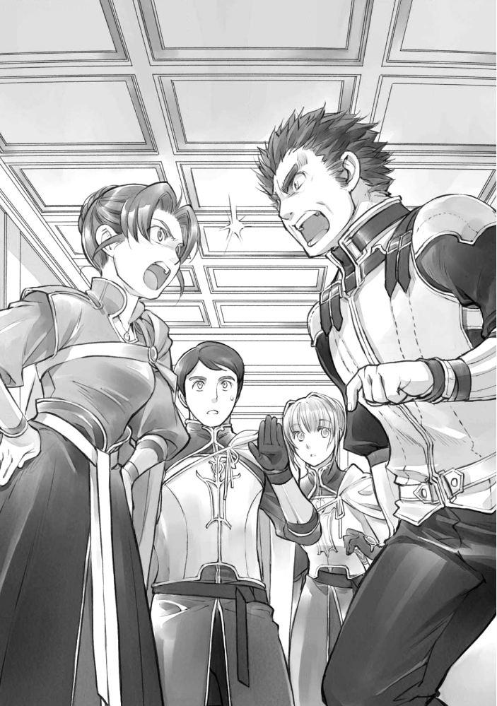

===========================
귄터 시점 - 서문에서의 공방
===========================

"동문으로부터의 보고는 이상이다"

오늘은 병사장 회의 날이다. 계절에 한번 정도의 빈도로 중앙광장 근처에 있는 병사들의 회의실로 소집된다. 예년 같으면 귀족님이 참석하는 영주회의 뒤에 있을 여름 소집이 가장 긴장되고 힘들지만, 이번에는 봄인데도 의제가 많아 힘들다. 겨울의 엄중 경계 태세에 대한 보고에 더해, 3년에 한 번의 병사장 교체가 행해지는 탓일 것이다.

"그럼 다음은 북문인가. 귄터, 북쪽 상황을 알려줘"

보고를 마친 동문의 병사장에게 재촉을 받고 나는 일어섰다. 북문은 귀족가와 접하는 문이어서 기사님도 교대로 근무하고 있다. 그래서, 가장 귀족님의 정보가 들어오기 쉽고, 기사님으로부터 평민촌에 전언도 많다. 슬그머니 귀족님의 모습을 살피는 것은 북문 병사의 역할이다. 여기서 말하는 "북쪽 모습" 이란 북문의 모습이 아니라 더 나아가 북쪽에 있는 귀족가나 귀족님을 가리키는 은어이다.

"......그러므로 자세한 것은 가르쳐 주지 않았지만, 중죄를 지은 자는 붙잡혀 처분을 받은 것 같다. 귀족님들은 아직 혼란한 것 같지만, 일단 우리들이 경계해야 할 시기는 지난 것 같아. 구원의 마술구 회수도 끝났으니 엄중 경계 태세를 풀어도 상관없다고 했다. 위험하다고, 겨울 동안 떨어져있던 로제마인 님도 신전으로 돌아간 것으로 알고 있다.

내가 북문 기사님뿐만 아니라 신전 문지기부터 들여온 정보도 섞으면, "너 여전히 로제마인 님의 정보는 빠르구나" 라거나 "신전 문지기에게 폐를 끼치지는 않았냐?" 는 익살과 웃음이 터진다.

......시끄러워. 루츠도 투리도 견습 다프라가 되어서 가게에서 생활하게 되니까, 마인 정보가 잘 안 들어온단 말이다.

어쩔 수 없기 때문에, 나는 순찰차 신전에 직접 들으러 가고 있다. 별로 신전에 폐를 끼치는 것은 아니다. 마인의 정보를 융통받는 대신 겨울사이 늘어난 귀족 출신 고아를 데리고 숲에 갈 때 남문에서의 중개나 확인도 한다. 서로 마찬가지다.

"음, 엄중 경계 태세를 풀어도 된다는 것은, 즉, 병사장 교체를 해도 문제없는 건가?"

"딱히 괜찮지 않을까?"

남문 병사장의 질문에 나는 가볍게 손을 흔들었다. 이동한지 얼마 되지 않아 익숙하지 않은 녀석들만 되면 긴급한 때에 명령 전달이나 움직임에 지장이 생길 가능성도 있다. 그래서 엄중 경계 태세 중에 병사장이 이동하는 것은 그만 두자는 얘기가 돼 있었다.

"아니, 아냐, 차라리 내년에 하지 않을래? 나, 쩔쩔매고 있을 때 북문 병사장 돼서 귀족님과 관계되는 것은, 싫다고"

"그런 건 누구나 싫다고. 북문은 귀족님이 있어서 힘들잖아. 나는 서쪽에서 남쪽이라 편한걸. 하핫."

싫은 얼굴로 이동을 연기하자고 제안하는 동문 병사장을 서문 병사장이 남의 일이라며 웃고 있는데 병사가 숨을 헐떡이며 달려왔다.

"큰일났어요, 병사장님"

여기 있는 사람은 병사장뿐이다. "어디 문이야" 라고 내가 묻는 것보다 먼저 서문 병사장이 일어선다.

"무슨 일이 있나!!"

"허가증을 가지지 않은 타령의 귀족이!"

"뭐라고!?"

조금 전까지 동문 병사장을 웃던 서문 병사장은 새파랗다.

"들여보내지 않았겠지!!"

"네! 필사적으로 막고 있어요. 영주님의 결계도 있는 덕인지, 그 앞에서 멈춰주셨어요."

뜻하지 않은 곳에서 귀족관계의 귀찮은 일이 뛰어들어왔다. 내 가슴속에 지나가는 것은, 마인이 견습 청색 무녀이었을 때의 일. 허가증에 대한 연락이 철저하지 못한 탓에 아가씨을 잃게 된 씁쓸한 기억이 되살아난다. 반 년쯤 전에는 귀족 문장을 내비치고 무리하게 문을 빠져나간 마차에서 회색 신관들이 납치됐다. 허가증을 가지고 있지 않은 귀족이라니 수상하다고 결정이다.

"신관장 하르트무트 님의 약혼자로 로제마인 님의 측근이라고 합니다만, 타령의 귀족이 측근으로 있나요? 제멋대로 막으면 질책받는거 아닙니까?"

병사는 빠르게 그렇게 말하지만, 그런 귀족이 온다고는, 나는 마인으로부터도 루츠로부터도 투리로부터도 신전의 문지기로부터도 듣지 못했다.

"귀족 사정 따윈 알까보냐! 영주의 허가증이 없는 놈은 들이지 마라! 그것뿐이다!"

내 서슬에 병사도 병사장도 경악의 얼굴을 떠올렸다. 직후, 옛 병사장의 실태를 떠올렸을 것이다. 납득하는 표정이 되었다.

"너, 마술구를 사용해서 비상사태를 기사단에 알렸나?!"

"그래서 병사장을 부르러 왔습니다! 밖에 견습이 대기하고 있습니다"

겨우내, 개개인의 병사들에게 나눠주었던 구원의 마술구가 회수된 지금, 문에 발생한 위급한 상황을 기사단에 알리기 위한 마술구는 병사장의 허락 없이는 쓸 수 없다. 그 허가를 받기 위해 견습들과 달려온 것이라고 한다. 서문 병사장은 병사가 가리킨 창문으로 날아가듯이 열어젖히며 "허가한다!" 라고 외치며 크게 팔을 흔들었다. 밖에서 대기하던 수습이 "허가한다!" 고 외치며 똑같이 팔을 흔든다. 아마도 서문에서 병사들이 달려가는 모습을 보고, 길을 지나는 어른들도 위급한 상황이라고 생각하고 있었을 것이다. 견습들과 함께 "허가한다!" 라고 소리치며 팔을 흔들어줬다. 그들의 목소리와 움직임이 넘실거리며 서문을 향해 큰길을 달려 나간다.

나는 견습이 소리를 지른 것을 확인하자마자 회의실을 뛰쳐나와 계단을 뛰어내렸다.밖으로 뛰어나가자 주변 사람들이 서문으로 시선을 돌리고 있다. 마찬가지로 서문을 보는 순간 붉은 빛이 올라갔다. 서문의 마술구가 작동한 것이다.

"좋앗!"

목소리를 높이며 다음에는 북문 쪽으로 시선을 돌렸다. 마술구보다 가는 붉은 빛이 북문에서 오른다. 북문 기사님의 확인을 알리는 빛이다. 이것으로 기사단에 소식이 갈 것이다. 이를 확인한 견습이 회의실 창문을 통해 이곳을 내려다보고 있는 험상궂은 얼굴의 병사장들을 향해 웃는 얼굴로 붉은 천을 들고 좌우로 흔든다. 북문이 보이지 않는 회의실을 향해 빛이 올랐음을 알리는 신호다.

"곧 서문으로 달려갈 거야! 그 귀족, 절대로 들어가지 마!"

……무슨 일이 있어도 막아주겠다!

나는 창문으로 내려다보고 있는 병사장들을 향해 소리치고, 대답도 듣지 않고 서문으로 달려나갔다. 알고 있듯이 견습 병사도 달리기 시작했다.

"다른 영지의 귀족이 침입하려 한다! 경계하라!"

주민들에게 소리치며 큰길을 곧장 달리는 우리 머리 위를 기사님의 기수 두 마리가 앞서나갔다.

우리가 서문에 당도했을 때에는 북문 기사님들과 다른 곳의 귀족들이 문답하고 있었다. 허가증도 없이 거리로 들어오려던 여인은 두 젊은 아가씨였다. 머리를 올리고 있어 성인이 된 것 같지만 아직 어린 생김새의 아가씨와 스무 살이 채 되지 않았을 정도의 젊은 아가씨들이다.

......이상한데.

나는 그렇게 생각했다. 보통 귀족 여성은 평민에게 모습을 보이는 것을 꺼리고 마차에서 내려오지 않는 법이다. 마차 안에서 종자에게 요구를 고하고 종자가 기사님이나 병사와 이야기를 나눈다. 하지만 두 사람은 당당히 마차에서 내려와 기사님과 이야기를 나누고 있다. 여장인 걸까, 둘 다 귀족치고는 꽤 간소한 모습을 하고 있는 것도 왠지 보통 귀족답지 않다. 아무래도 수상하다.

둘 다 파란 망토를 걸치고 있었다. 분명 귀족 망토는 영지에 따라 색깔이 달랐을 것이다. 파란 망토가 어디의 귀족인지 나는 모르지만, 기사님은 알고 계실 것이 틀림없다.

......혹시 높은 영지인가? 평소와 달리 상당히 공손한 태도 아닌가.

북문 기사님을 대하는 것은 나이가 많은 여자이지만 가끔 젊은 아가씨에게 확인하는 것을 보면, 주인은 젊은 쪽인듯 하다. 나는 작은 신전에서 마인과 그 주위의 호위기사나 신전의 시종들의 언동을 보고 있기 때문에, 다소 언동에 의한 귀족 안에서의 상하관계를 알 수 있다. 하지만 그것뿐이다. 완전히 정보가 부족하다.

......기다려라, 지금이라면 마차 내부를 탐색할 수 있지 않을까?

기사님과 두 사람이 이야기하는 모습을 곁눈질로 보면서 나는 서문의 병사 한 명을 가볍게 찌르며 작은 소리로 물었다.

"어, 저 두 사람의 마차는 어디 있지?"

마차의 격이나 가문을 보면, 그것으로 다소나마 알 수 있는 것이 있을 것이다. 만약, 짐에 투리가 만든 머리 장식 같은 것이 있다면 마인이나 그 주변과 관련이 있을 지도 모른다고 생각된다. 

하지만 서문 병사들로부터 돌아온 것은 "마차는 없습니다" 라는 대답이었다. 

"마차가 없다니 무슨 소리야!!"

"기수라고 하나요? 두 사람 모두 귀족님의 탈것을 타고 븅 하고 날아왔거든요"

"...... 뭐야, 그건. 너무 수상하잖아."

정말 귀족여성인 걸까? 라고 의심하는 데서 시작해야 할 정도로 예사롭지 않다.

"저는 로제마인 님의 측근이 되는 것을 허락받았어요. 모르시나요?" 

"죄송합니다, 클라리사님. 가지고 계신 메달로 증명할 수 있는 것은 당신이 단켈페르거의 상급 귀족이라는 것뿐입니다. 로제마인님의 측근이라고 증명할 물건이 아무것도 없고, 아우브의 허가증도 없는 상태로 마을로 들일 수는 없습니다. 아우브에게 보고하고 허가증을 얻을 때까지 이곳에서 대기해주세요."

기사님들은 두 사람에게 그렇게 말하고는 우리를 향해 돌아섰다.

"우리는 보고와 허가증을 얻기 위해 돌아간다. 귀족 대기실로 안내하도록. 알겠나?"

다른 곳의 귀족 대응이라는 귀찮은 일을 떠넘기듯 하고 기사님은 떠난다. 허가증을 받기 전까지는 서문에서 대기하지 않으면 안될 것 같다. 서문의 병사장이 필사적으로 미소를 지으며 그녀들 앞으로 나아갔다.

"그럼 이쪽으로."

"저는 로제마인 님의 측근이라고 말하고 있는데, 그것이 알려져 있지 않다니 하르트무트는 무엇을 하고 있는걸까. 당장이라도 모시고 싶다고 전했을 텐데......"

귀족 대기실에 들어가서도 볼멘 얼굴을 하고 있는 클라리사님의 말에 나는 나도 모르게 얼굴을 찡그렸다.

"에렌페스트에서는 영주님의 허가가 없으면 상위 영지의 귀족이라도 들어갈 수 없습니다. 그런 것도 모르는 분이 로제마인 님의 측근? 하르트무트 님의 약혼녀? 듣기에 좋은 말을 하지 말아주시겠습니까?"

"어, 귄터! 그만해!" 

"그 발언을 철회하고 사과하세요."

나이가 좀 많은 아가씨는 기사 같다. 순식간에 무기를 들고 나를 향했다. 서문의 병사장이 황급히 말리는 모습을 보이지만, 나는 그만둘 생각이 없다.

"허가증도 없이 찾아온 수상한 사람이니, 그런 무기를 문지기에게 돌릴 정도다. 어차피 로제마인 님이 평민을 중용하는 것도 모르시겠죠? 거리를 지키는 우리에게 공격해서 이곳을 무리하게 밀어붙이면 어떻게 생각하는지, 어떻게 말하는지, 아시나요? 만약 로제마인 님의 측근을 자처한다면, 주인의 평가를 낮추는 듯한 행동은 하지 말아주세요."

측근의 행동으로 주인의 평가가 떨어지다. 그런 것도 모르는 바보가 마인 주위에 있으면 민폐다. 게다가, 평민을 업신여기는 측근도 필요 없다. 작은 신전에서 이야기조차 할 수 없게 될 가능성도 있다. 다무엘님들 같은 측근이 있으면 그만이다.

"멈추세요, 그리젤다"

"하지만 클라리사님......"

"로제마인 님이 평민을 아끼시는 건 알고 있습니다. 친절하게 지내는 상인들이 있다는 것도, 평민들이 사랑받고 있는 것도...... 아마도, 그 병사가 말하는 것은 사실일 것입니다. 평민이라고 생각되지 않을 정도로 무례하지만요."

클라리사님은 기사에게 무기를 내리라고 명령하고, 나를 보고 승리한 듯이 웃는다.

"하지만, 제가 하르트무트의 약혼자로 로제마인 님을 모시는 것을 허락받은 것도 사실입니다. 로제마인 님은 측근에 대한 무례를 용서하는 분도 아닙니다. 언행은 조심하는 것이 좋아요. 귀족원에서 나눈 약속이나 귀족 사정에 대해 평민인 병사들이 정보를 얻을 수 있는 입장이라고는 생각되지 않기 때문에, 믿을 수 없는 것도 무리가 아니지만요."

도발적인 미소에 울컥한다. 핵심을 찌른 탓도 있을 것이다. 난 그저 병사라서 귀족사회에 대해 잘 모른다. 아가씨가 있는 세계에 대해 알고 싶어도 알 수단이 없는 실정이다. 그래도, 병사 일을 하면서 알게 된 것도 있다.

"하르트무트 님의 약혼자라고 말하는 것은 믿기 어렵다. 약혼자로서 이동해 왔다면 보통은 혼수도 함께 있을 것이고, 신랑의 일족이 영주님의 허가증을 가지고 영지의 경계문까지 데리러 가게 되어 있을 것입니다. 나는 문지기로서 지금까지 타령으로부터 시집온 귀족 여성을 여러 명 보아 왔지만, 신랑도 친족도 없는 신부 따위는 본 적이 없다. 수상한게 당연하지 않겠습니까?"

내 지적이 아픈 곳을 찔렀는지 클라리사님의 푸른 눈에 분노가 떠올랐다.

"뭐라고요!?!?! 실례되는 말을!"

"허가증도 없이 침입하려는 쪽이 상당히 실례가 아닌가!"

으르르(ぐぬぬぬ)......하고 둘이서 서로 노려보고 있는데, 그리젤다 님이 어이없다는 듯이 머리를 좌우로 흔들었다.

"클라리사 님, 지금 주고받는 대화에 관해서는 그쪽 병사가 옳아요."

"뭐! 그리젤다는 그 무례한 병사의 편을 드는거야!?"

"내 편이든 뭐든...... 폭주해온 게 사실 아닌가요?"

이번에는 주종이 둘이서 이러쿵저러쿵 말하기 시작했다. 하지만, 나쁜 사람은 아닌 것 같다. 나는 독기를 빼고 가볍게 숨을 내쉰다.

"신용해 달라고 한다면, 약혼자인 하르트무트 님께 연락을 취해 보라. 귀족님에게는 소리를 지를 수 있는 새가 있겠지? 진짜 약혼자라면 대답이 있을 것이다. 다만, 나는 신관장의 목소리를 알고 있다. 속지 않을 테니까" 

"이런 곳에 있는 평민들이 정말 하르트무트의 목소리를 알고 있을까?"

"알고 있다고. 신전에서 이야기를 하니까"

기원식이나 수확제로 마인이 우리를 배웅하러 올 때나 핫세에서 회색 신관들을 데리고 돌아왔을 때, 하르트무트 님은 신전에 있으면 얼굴을 내밀어 온다. 그리고 틈을 보고서는 병사들로부터 마인 정보를 얻으려는 것이다. 처음에는 무엇을 위한 정보 수집인지 몰라 경계하다가 루츠나 길에게서 이야기를 듣고, 지금은 충신으로 이해하고 있다.

······ 수상쩍고 괴짜같은 인상은 강해졌지만.

클라리사 님은 귀족님이 가지고 있는 막대기를 꺼내 흰 새를 만들고, "에렌페스트의 서문에 도착했습니다" 라고 말을 걸었다.

"아우브의 허가증이 없는 타령 귀족은 들어갈 수 없다고 문지기에게 제지되었습니다. 어떻게 하면 좋을까요?" 붕하고 막대를 흔들자 흰 새는 벽을 뚫고 사라진다. 그다지 기다릴 것도 없이 벽을 뚫고 흰 새는 돌아왔다.

"로제마인입니다"

어째선지 하르트무트 님께 보낸 올도난츠에 마인으로부터 답장이 왔다. 내가 딸의 목소리를 틀릴 리가 없다. 클라리사 님에 대한 호소가 있는 이상, 일단 이 여자는 아는 사이임에 틀림없는 것 같다. 놀라고 있는 나를 보고, 클라리사 님이 우쭐한 얼굴이 되었다.

"자, 보세요. 저는 로제마인 님의 측근인 겁니다."

직후

"클라리사, 병사의 말에 따라 서문에서 대기하세요. 그러지 못하면, 즉각 단켈페르거로 돌려보내겠습니다."

올도난츠에서 울리는 마인의 목소리에는 분노가 가득하다. 클라리사 님은 "어?" 하고 당황하기 시작했다. 혼날 거라고는 전혀 생각하지 않은 것 같다. 나는 흥 하고 가볍게 코를 울렸다.

"우리를 따라서 여기서 대기한다. 알겠지?"

"당신들을 따르라구요!?! 아무리 그래도 무례함이 지나치는게 않은가요!!!"

"그 새의 말을 들었잖아!?"

"로제마인 님은 따르겠지만, 당신들을 따른다고 생각하는 것은 곤란합니다!"

우리들이 서로 노려보고 있는 곳에, 다무엘 님과 안게리카 님이 도착했다.

"귄터, 거기까지 하세요. 평민 병사들에게 상위 영지 귀족의 대응은 부담스러울 것이라고 생각한 로제마인 님의 명령에 따라 왔습니다. 나머지는 제가 맡겠습니다."

우리를 향한 다무엘 님의 말에 병사들의 함성이 터져 나온다.

"역시 로제마인 님이다. 잘 알고 계신다."

"다무엘 님 감사합니다!"

"어이, 이제 괜찮다고 주민들에게 알려와!"

평민촌에 볼일이 있을 때 로제마인 님은 항상 다무엘 님을 보내신다. 사람됨이 좋고 귀족 특유의 오만함이 없고, 마인의 사정을 알기 때문에 나에게는 가장 안심할 수 있는 기사다.

그건 다른 병사들에게도 마찬가지였다. 성무에 동행하는 것이 다무엘 님과 안게리카 님이기 때문에 얼굴을 아는 사람은 많다.

우리에게 로제마인 님의 말씀을 전한 후, 다무엘 님은 클라리사님 들 앞에 무릎을 꿇었다.

"하급 호위기사 다무엘이라고 합니다. 물의 여신 플류트레네의 청아한 흐름에 인도된 좋은 만남에 축복을 비는 것을 허가해 주세요."

"허가합니다"

"물의 여신 플류트레네여 새로운 만남에 축복을."

반지 속에서 초록빛이 둥실둥실 나온다. 귀족님의 인사 같다. 기수도 기사답고 멋지지만, 이렇게 무릎을 꿇고 빛을 내며 인사를 하는 것도 멋있다.

......구혼의 마석처럼 뭔가 흉내낼 수 없을까?

뭔가 그럴듯한 일을 할 수 없을까 생각하고 있는 내 앞에서, 다무엘 님은 클라리사 님께 앞으로의 예정에 대해 이야기를 하고 있다. 아무래도 허가증을 얻을 수 있을 때까지 꽤 시간이 걸릴 것 같다.

"현재 로제마인 님과 하르트무트는 회의 중이니 이곳에서 대기해 달라는 것. 모임이 끝나고 허가증을 얻는 대로 로제마인 님이 오실겁니다."

"뭐, 로제마인 님이? 알겠습니다. 로제마인 님이 저를 데리러 오실 때까지 얌전히 기다리죠."

서문의 병사들에게도, 북문에서 온 기사님에게도 "빨리 들여보내라" 고 호소하던 클라리사 님은 담백하게 다무엘 님의 말에 고개를 끄덕였다. 그리고, 조금 어깨의 힘을 뺀 다무엘에게 빙그레 미소를 짓는다. 웃고는 있지만, 그 파란 눈은 사냥감을 발견한 육식동물 같은 빛으로 가득했다.

"그동안, 에렌페스트에서의 로제마인 님에 대해 꼭 이야기를 들려주세요. 제가 로제마인 님의 측근으로서 알아두는 게 좋은 걸 알려줬으면 좋겠어요."

겁먹은 듯한 얼굴을 하고있는 다무엘 님에게는 미안하지만, 나는 슬쩍 주먹을 쥔다.

......그건 좋은 생각이야! 나도 듣고 싶어!

귀족으로 지내고 있는 마인 이야기를 들을 수 있는 소중한 기회가 된다. 최근에는 상인들과의 모임이 줄어들고 있는 것 같고, 그 모임에 귀족님이 동석하기 때문에 예전처럼 이야기를 나누기 어려운 것 같고, 루츠도 투리도 견습 다프라가 되어 집으로 돌아오는 일이 적어서 마인의 정보에 굶주려 있는 것이다.

"다무엘님은 이쪽으로. 꼭 안게리카 님도......"

"저는 이쪽에서 경계에 임하겠습니다. 클라리사의 말동무는 다무엘에게 맡기죠."

안게리카 님은 그렇게 말하고 귀족 대기실 문 앞에 섰다. 무기에 손을 댄 상태에서 실내를 둘러보고 있다. 늘 마인의 호위로 그렇게 지내고 있다는 것을 알 수 있는 익숙한 움직임이다. 모처럼의 기회이기에 안게리카 님에게서도 이야기를 듣고 싶었지만 어쩔 수 없다.

"귄터, 그쪽은......"

"허가증이 도착할 때까지 잘 부탁합니다. 물론, 이곳에서도 경호할 테니까요."

내가 오른손의 주먹으로 두 번 왼쪽 가슴을 두드려 경의를 표하자 다무엘님은 "하, 시간보내기로는 괜찮으려나" 고 쓴웃음을 지으며 클라리사 님에게로 돌아선다.

"......다만, 이야기하라고 말하는 것도 곤란하니, 당신의 질문에 대답하는 형식으로 괜찮을까요? 죄송하지만, 영지의 사업내용의 세부 사항 등 지금 여기서 답변을 할 수 없는 것도 있습니다. 그것에 대해서는 미리 양해해 주십시오."

"그럼요. 우선 로제마인 님의 하루 예정에 대해 알려주세요. 귀족원에서의 대략적인 생활 흐름은 알고 있습니다만, 에렌페스트에서는 어떤 느낌일까요? 성과 신전에서 생활의 흐름에 차이는 있습니까? 로제마인 님은 어느 정도의 빈도로 신전에 다니십니까?"

청산유수로 질문을 늘어놓는 클라리사 님께 다무엘 님이 "하나씩 부탁드립니다" 라고 힘없이 요청하며 대답하기 시작한다.

"성에서의 생활은 귀족원과 크게 다르지 않습니다. 두점 종으로 측근이 집합하기 때문에 그것이 로제마인 님의 기상 시간이 되고 있습니다."

"어머, 두점 종이라니 느긋하군요. 아침 훈련은 없으신가요?"

그리젤다 님이 신기한 얼굴로 고개를 갸웃거리자, 클라리사 님이 "귀족원에서도 에렌페스트에는 없습니다" 라고 변명하는 얼굴로 대답했다. 하지만, 아침 훈련이란 무엇일까. 병사나 기사도 아닌 귀족 여성이 할 일은 아닐 것이다.

......그러고 보니, 체력을 키우기 위해 마인도 기사 훈련장에서 걷는 연습을 하고 있었다고 들은 적이 있네. 다른 곳의 아가씨도 걷는 연습을 한다는 건가?

"기상은 두점 종으로 되어 있지만 로제마인 님은 일찍 일어나셔서 침대로 책을 가져와 독서를 하는 경우도 많다고 합니다. 기상 시 문관의 일은 책 정리라고 필린느가 말했습니다."

"어머. 그럼 저도 일이 있군요."

클라리사 님이 유쾌한 소리를 질렀다. 아무래도 보통의 귀족 여성은 매일 같이 침대에서 책을 읽거나 하지 않기 때문에, 아침 준비 시간대에 문관의 일은 없는 것 같다. 눈을 반짝이며 마인 이야기를 듣고 싶어하는 클라리사 님과는 좀 친해질 수 있을 것 같다.

"아침 준비를 마치면 아침식사예요. 아침 식사 때가 되면, 남성 측근도 방을 드나들 수 있게 됩니다."

감시라는 명목으로 그들 가까이에 있던, 나는 다무엘 님에게 흰 새가 날아올 때까지 마인의 시시한 이야기가 이어지는 지극히 행복한 시간을 보내고 있었다.

허가증이 나왔으니 이제부터 기수로 서문에 간다는 소식에, 우리는 귀족 대기실을 나서서 기수로 내려설 수 있는 탑 위로 나왔다. 병사들과 서문 병사장들도 찾아온다.

모두가 정렬한 곳에 마인과 하르트무트 님과 귀족들이 내려섰다. 마인은 한 손을 들어 달려가려는 클라리사를 제지하고, 가슴을 두 번 두드리는 경례를 하며 늘어선 병사들을 차례로 본다.

......아, 컸구나.

원래대로라면 작은 신전이 아니면 이토록 가까이서 모습을 보거나 이야기를 나눌 수 없다. 내 안의 가장 강한 기억이 헤어질 때라서일까. 언제 봐도 마인이 성장하고 있는 것처럼 보인다. 게다가 귀족다움이 몸에 밴다.

나는 성장하는 딸의 모습에 가슴이 뜨거워지는 것을 느끼며, 서문 병사장과 마인을 소개한다. 마인은 안심시키려는 듯 미소를 지으며 허가증과 돈을 서문 병사장에게 건넸다.

"거리를 지키기 위해 애써준 병사들의 책임을 물을 일은 없습니다. 이걸로 애써준 병사들을 위로해 주세요."

마인은 병사장과 병사들을 위로하고, 클라리사님 들을 연행하듯 재빨리 떠났다. 나로서는 딸의 모습을 좀 더 보고 싶지만, 다른 병사들을 위해서는 오래 머물러도 곤란하다. 어려운 대목이다.

"병사장님, 병사장님. 로제마인 님께 얼마를 받으셨나요?"

"교대가 끝나면 가시죠. 독차지는 안됩니다."

"병사장 교대식을 위해 다시 중앙 회의실로 돌아가는 것도 귀찮다. 술집에서 할까?"

귀족들이 떠난 서문에 맥빠진 병사들의 목소리가 난무한다. 오늘밤은 서문의 병사장이 마인에게 받은 대은화로 건배다.

"......그래서, 로제마인 님 주위에 이번에는 타령의 귀족이 늘어나는 것 같아."

"맞아. 로제마인 님도 힘들겠다. 하지만 안절부절 못하니까 귄터는 빨리 갈아입고 앉아주지 않을래? 건배만으로 끝내고 왔다면, 마시겠지?"

건배만으로 끝내고 귀가한 나는 에파에게 위로를 받고 옷을 갈아입기로 했다. 다무엘 님으로부터 들은 마인 일상도 아직 이야기하지 않았기 때문에, 오늘의 이야기는 길어진다.

"로제마인 님은 겨울 동안 상당히 성장하셨다. 나이에 어울려 보였어. 게다가, 오늘은 꽤 엄격한 얼굴을 하고 있었어. 서문에 클라리사 님을 데리러 왔을 때는 이런 얼굴로......"

"다음에 투리에게도 가르쳐줘. 아니면, 투리가 항상 보는 얼굴이 그런 얼굴일 지도 모르겠네."

요즘은 마인 얘기가 안 들어오니까 에파도 재미있는 거겠지. 반갑게 들으며 술을 따라준다. 하지만, 맞은편에서 저녁을 먹고 있는 카밀은 시큰둥한 듯 입술을 삐죽 내밀었다.

"아빠도 엄마도...... 우리 가족은 로제마인 님의 일만 되면 갑자기 이상해진다니까."

마인에 대한 추억이 없는 카밀에게는 별로 즐거운 화제가 아닌 것 같다. 하지만, 플랑탱 상회에 견습으로 들어가기로 결정되었으니, 곧 화제에 넣게 될 것이다.

"너도 곧 알게 될 거야. 기대되는구나, 카밀"

"나는 플랑탱 상회에 들어가도 아빠나 엄마처럼 되지는 않을 테니까!"

카밀의 우기는 말투에 나는 에파와 얼굴을 마주보고 웃었다. 그거면 됐다. 플랑탱 상회에 들어가면 카밀이 마인을 누나로 인식하지 않더라도, 언젠가 두 사람이 만날 수 있는 날이 올 것이다. 그런 미래를 상상하면서 나는 술잔을 들었다.

"반토르에게 감사를"
