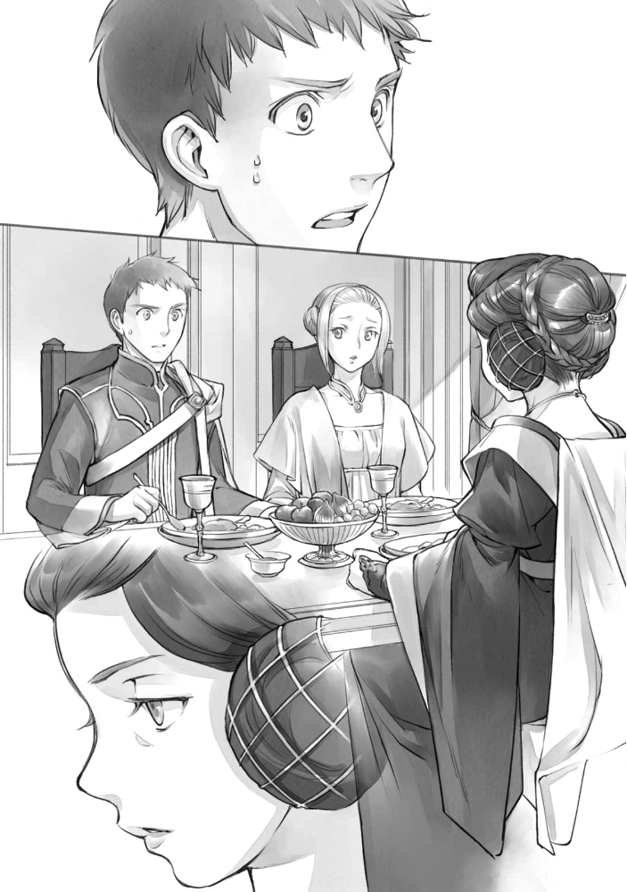

프롤로그
========

겨울의 주인의 토벌이 끝나면서 눈보라가 그쳤다. 오랜만의 청명한 하늘이 보이고, 회랑은 매우 밝다. 햇살이 비치는 것만으로도, 마음이 가벼워지는 것 같다. 램프레히트는 그렇게 느끼며 기사단장실로 서둘러 가고 있었다.

......휴가 이야기라면 좋겠지만......

초겨울에 갑자기 예정이 앞당겨진 숙청과 겨울의 주인의 토벌. 어느 쪽에도 연루된 기사들은 바빴고, 대부분 기숙사에 발이 묶여 있어 제대로 집에 돌아가지 못하는 상태였다. 영주 일족의 호위기사인 램프레히트는 "그대들의 주인은 귀족원에 가 있으니 호위기사 일은 없고 한가할 테지" 라는 말을 들으며, 아버님인 칼스테드로부터 평소보다 훨씬 혹사당하고 있다. 예외는 로제마인의 호위 기사들일 것이다. 그들은 바쁜 와중에도 휴가를 얻을 수 있었던 것 같다. 얼굴을 못 본 날이 몇 번이나 있었다.

......출산 때밖에 귀가 허가가 나지 않으리라고는 생각치 못했다. 아우렐리아의 출산은 숨겨두는 것이라 하더라도, 아버님은 기사단장이시니 코르넬리우스들에게 휴가를 줄 수 있다면, 나에게도 융통성 있게 해주셔도 되지 않을까.

예년 같으면, 주인이 귀족원에 가 있기 때문에, 겨울의 주인의 토벌 기간 이외에는 휴가를 가기 쉬울 터였다. 하지만 현실은 램프레히트의 예정대로는 전혀 진척되지 않았다. 숙청은 겨울 초에 앞당겨 이루어졌고, 겨울의 주인의 토벌은 인원이 줄어든 가운데 강행되었다. 이 때문에, 혹독한 겨울이 되었고 겨울의 주인의 토벌 후에는 하급 기사부터 차례로 휴가를 보내고 있었기 때문에, 아직도 램프레히트는 집으로 돌아가지 못하고 있다.

"실례하겠습니다"

기사단장실에 들어서자, 지칠 대로 지친 얼굴의 칼스테드가 손에 들고 있는 목패를 가볍게 흔들었다.

"램프레히트, 그대에게 내일부터 이틀간의 휴가를 주겠다. 짧은 시간밖에 없지만 가족과 함께 지내면 좋다. 북쪽 별채에는 이것을 건네라."

"헉!"

내민 목패에는 기사단장의 휴가 명령이 적혀 있다. 램프레히트는 목패를 받으며 조금 원망스러운 눈으로 칼스테드를 바라보았다.

"로제마인의 호위기사들에게는 여러 차례 휴가를 주었던 것이 아닙니까. 저도 휴가를 더 받고 싶습니다."

"바보 녀석. 코르넬리우스들은 아우브와 신관장 하르트무트의 요청으로 성무를 위해 신전에 모일 필요가 있기 때문에 훈련을 면제해 주었을 뿐이다. 휴가는 아니야."

올해는 주인인 로제마인이 귀환하지 않기 때문에, 호위 기사들이 신전에 모일 필요가 없다고 생각했다. 그러나 귀환하지 않는 주인의 빈자리를 메우는 것을 측근들이 해야 했던 모양이다.

"영주 일족의 호위기사에게 청색신관 흉내를 내게하는 것은 외견상 좋지 않겠지? 그래서, 훈련 면제 이유에 관해서는 잠자코 있었다만 귀찮은 일이 된 것 같군. 로제마인 님의 호위 기사들을 매우 편애하고 있다든가, 그들만이 몇 번이나 휴가를 받았다고 생각된다면, 앞으로의 통제에 관계된다. 정말 골치가 아프다."

칼스테드는 미간을 주무르듯 손가락으로 누른다.

"하지만, 첸트에게도 성무의 유용성을 인정받은 것 같고, 조금은 외견도 좋으려나?"

그러고 보니, 겨울의 주인의 토벌에서 돌아올 무렵, "귀족원에서 성무를 행하니 빌프리트 님의 의식용 의상을 준비하라고 귀족원에서 명령이 내려와 준비가 큰일이었다" 라는 시종의 푸념을 들었던 것 같은 기억이 있다. 귀족원에서는 로제마인의 폭주가 심하다고 주인의 측근들에게서의 보고에 적혀 있었다.

......기사단 관계뿐 아니라, 로제마인의 동향에도 주의를 기울이고 있는가. 아버님도 힘드셨군.

램프레히트는 그제사 처음으로 아버지의 얼굴을 찬찬히 들여다보았다. 피로의 빛이 역력하다. 하급 기사부터 돌아가며 휴가를 보내고 있다는 것은, 기사단장인 칼스테드는 자신 이상으로 휴가를 내지 못하고 있는 것일 것이다. 장기간의 대응을 할 수 있도록 기숙사에서의 휴식 시간은 확보하고 있을 것이지만, 귀가하지 못한 것은 틀림없다.

"기사단장도 어서 휴가를 냈으면 좋겠어요."

"아, 영지대항전까지 한번 얻고 싶군......나도 귀가를 기대하고 있어."

아무래도 첫 손자를 만나기를 기대해 주는 것 같다. 작게 덧붙인 말에 쓴웃음을 지으며, 램프레히트는 기사단장실을 나선다. 그대로 휴가명령 목패를 들고 북쪽 별채로 향했다.

"드디어 휴가를 얻은 겁니까? 다행이네요."

"램프레히트도 푹 쉬세요"

빌프리트의 측근방에서 목패를 전달하고 휴가 연락을 하면, 측근 동료들이 그제야 휴가를 얻을 수 있었던 램프레히트를 격려해 준다. 시종이나 문관들은 비교적 쉽게 휴가를 낼 수 있다.

미소를 지으며 절차를 마친 램프레히트는 휴가를 얻었다는 사실을 전하는 올도난츠를 아내 아우렐리아와 어머니인 엘비라에게 보낸다. 두 사람에게서는 곧 답장이 왔다.

"엘비라입니다. 지금, 아우렐리아는 저의 관리하에 있습니다. 오늘은 본관으로 돌아오세요. 그리고, 우리 집에 싸움의 기미나 피 냄새를 들이고 싶지 않습니다. 기숙사에서 깨끗이 씻고 옷을 갈아입고 귀가하세요."

"아우렐리아입니다. 돌아오시기를 기다리겠습니다."

두 사람에게서의 올도난츠를 듣던 측근 동료들은, "우와" 하며 가볍게 어깨를 움츠린다.

"엘비라 님은 무섭구나. 아렌스바흐에서 온 아들의 며느리를 관리하에 두고 있는건가......"

"기사단장의 첫째 부인인데 싸움의 기미나 피냄새를 싫어하는 건가"

저마다 말하고 있는 모두에게 램프레히트는 가볍게 한숨을 내쉬었다.

"아우렐리아에게 심한 짓을 하는 것처럼 들릴지 모르지만, 아렌스바흐에서 시집온 그녀가 의심받지 않도록 하기 위해서다. 안전하게 지내려면 어머님의 관리 아래 있는 쪽이 좋다."

아우렐리아와 함께 아렌스바흐에서 온 베티나는 기베 빌트르의 아들에게 시집갔다.

시댁 식구들이 게오르기네에게 이름을 바쳤다는 점, 그녀 자신이 아렌스바흐의 친정을 통해 게오르기네와 통했다는 점 등이 발각되면서 그녀는 붙잡혀 처형당했다.

아우렐리아는 시집온 이후 줄곧 엘비라의 관리하에 있었고, 교류할 상대를 엘비라에게 맡겼던 것, 아렌스바흐나 옛 베로니카파와의 교류가 전혀 없었기 때문에 기사단에 끌려가 심문받는 일도 없었다고 들었다.

......게다가, 싸움의 기미나 피냄새를 들이지 말라는 어머님의 말은, 아기 때문일 것이다.

램프레히트의 아이가 태어나면서 할머니가 된 것이다. 엘비라가 아우렐리아와 아기를 지키기 위해 분투해 주고 있는 것이 전해진다.

"지나치지 않은가. 그렇게 엄격하게 관리하지 않더라도, 램프레히트의 아내가 붙잡히지는 않을 것이다. 차기 영주 빌프리트의 호위기사 가족이야. 우리도 베로니카 님에게 가담한 죄로 잡혀도 이상할 게 없지만, 빌프리트의 측근은 아무도 잡히지 않지 않았는가"

영주 부부의 측근은 여러 명 해임되거나 붙잡혀 처벌받고 있지만, 빌프리트의 측근은 아직 아무도 잡히지 않았다. 측근 동료들은 낙관하고, 현실을 굳이 외면하는 건지, 자기 가족의 알선을 주인에게 부탁하자고 한다.

...... 측근의 해임은 주인이 할 일이다. 빌프리트가 귀환하면, 죄에 따른 처벌이 결정되지 않을까?

램프레히트는 도저히 낙관적이 될 수 없다. 하지만, 도망가거나 혼란스러운 사람을 만들지 않기 위해서라도 쓸데없는 추측을 입 밖에 낼 생각은 없었다.

엘비라가 말했던 대로, 램프레히트는 기숙사에서 옷을 갈아입은 뒤 기수를 몰았다. 겨울 공기는 살을 찌를 듯 차갑지만 모처럼 쾌청하다. 햇살은 따스하게 느껴진다.

"어서 오세요."

"방금 돌아왔어요. ......어? 베일을 벗은 거야?"

마중 나온 사람은 엘비라와 아우렐리아. 하지만, 아내의 얼굴에 베일이 보이지 않는다.

"아이가 엄마의 얼굴을 인식하지 못할 거예요, 라고 꾸중을 들어서......"

"그렇군요. 바로 그 아들은 어디에 있어?"

램프레히트에게는 출산 시에 입회한 이래 첫 귀가다. 아이의 얼굴을 보는 것을 고대하다 보니, 아들의 마중이 없는 것을 아무래도 못마땅하게 생각한다.

"그대의 기분은 알지만 식사 후까지 기다리세요. 아우렐리아가 저녁을 함께 먹을 수 있도록 여러 가지로 조정한 것입니다. 아우렐리아나 유모들의 노력을 헛되이 돌리는 짓은 용납하지 않을 테니까요."

마력 관계상 아기에게 젖을 먹이는 것은 어머니의 몫이다. 그 정도는 램프레히트도 알고 있다. 하지만, 부부가 함께 저녁을 먹기 위해 시간을 맞추는 노력이 필요하다는 것은 몰랐다.

"우리 가문의 후사는 건강하게 자라고 있습니다. 안심하세요. 자, 식당으로 갈지요. 서둘러 식사를 끝내야죠."

후계자가 정식으로 결정된 것은, 에크하르트가 아렌스바흐로 향하기로 결정됐을 때다. 램프레히트와 코르넬리우스 중 한 쪽이 에크하르트의 집을 물려받아, 한동안 그의 짐 관리를 해야 했다. 그 때 어느 쪽이 집을 떠날 것인지 의논한 것이다.

코르넬리우스와 레오노레는 라이제강계 귀족들에게 매우 좋은 혼담이었기 때문에, 친족들로부터 후계자가 되기를 요구받았다. 친척 중에는 대를 이은 첫째 부인으로 아렌스바흐 출신의 아우렐리아를 두는 것이 어떻겠느냐고 불평을 하는 자도 있다. 생소해서 어려운 친족들과 사귀어야 하는 아내의 노고를 생각하면 후계자 따위는 특별히 원하지 않는다. 그래서 램프레히트는 자신들이 집에서 나오고 코르넬리우스들이 별채에 살면 된다고 제안한 것이다.

하지만, 엘비라는 그것을 허락하지 않았다.

"숙청을 전후해 아렌스바흐 출신인 아우렐리아가 기사단장 집에 있는 것과 밖에 나가는 것은 주위의 시선이 달라집니다. 후계자 따위 램프레히트든 코르넬리우스든 상관 없습니다. 타령에서 시집온 데다 출산이 임박한 아우렐리아의 입장과 안전을 최우선으로 하세요."

램프레히트들을 집에서 내보내는 것이 쉽고 친족들도 만족시킬 수 있다. 그런데도 엘비라는 아우렐리아와 앞으로 태어날 아이의 안전을 챙겼다. 그 선택은 램프레히트에게 너무나 든든했고, 숙청이나 겨울의 주인의 토벌로 귀가하지 못해도 처자의 안전을 믿을 수 있었던 것이었다.

"지금, 아우렐리아가 본관 객실에서 지내는 줄 몰랐어요"

"별채로는 위험하니까요."

기사단장 일가 안에 있는 아렌스바흐 출신인 그녀 곁에는, 처벌을 받는 옛 베로니카파나 게오르기네와의 관계가 깊었던 자들의 면회 의뢰가 들어온다고 한다. 어떤식으로 불똥이 튀어 아우렐리아 자신이 의심받을지 모른다. 안전면을 고려해 삶의 터전을 본관으로 옮겼고, 면회 의뢰는 전부 엘비라의 이름으로 거절했다고 한다.

"아우렐리아는 무서운 생각이 들진 않았어?"

"네. 저도 아들도 평온하게 지내고 있어요. 본래라면, 출산 직후에 기사단으로부터 사정 청취 호출이 있었다고 합니다만, 그것도 거절해 주셨습니다. 나중에 당신도 감사 인사를 해 주세요."

아우렐리아의 생활이나 사람과의 교류를 모두 엘비라의 관리 하에 둠으로써 기사단으로부터의 호출을 피할 수 있었던 것 같다. 아우렐리아의 사정을 잘 알고 있는 칼스테드가 직권을 남용하면서, 몹시 애를 써 준 것 같다. 속사정을 자세히 알고서, 램프레히트는 가슴을 쓸어내리며 엘비라에게 감사를 표했다.

"감사인사는 괜찮아요. 그보다 그 숙청으로 옛 베로니카파, 특히 아렌스바흐 출신에 대한 시선이 매우 엄격해지고 있다는 것은 당신도 잘 알고 있지요?"

"네. 영주 부부를 섬기는 옛 베로니카파 측근 중에도 붙잡힌 사람이 있는 것으로 알고 있습니다."

"예, 죄지은 자가 붙잡히는 건 당연하죠. 하지만, 그 주변 사람들에게는 힘든 시기가 되겠지요. 사실 트루델리데도 잡혔어요. 그녀는 베로니카 님의 시종이었다는 것을 자랑스러워 했고, 여러 가지 일을 했으니까요."

트루델리데는 베로니카의 명령으로 칼스테드가 맞은 둘째 부인이다. 그녀의 언행에 질려 있던 첫째 부인 엘비라는, 이번 숙청을 틈타 베로니카의 앞잡이로 그녀가 저지른 죄의 증거를 몇 개인가 기사단에 제출했던 것 같다.

"트루델리데의 아들, 니콜라우스는 성의 어린이 방에서 지내고 있습니다. 이복동생이라는 입장으로 로제마인에게 접근하지 않도록 당신도 지켜봐 주세요. 로제마인은 연하에게 무르다고 코르넬리우스로부터 보고가 있었습니다. 니콜라우스를 돕기 위해 트루델리데를 구해달라거나, 감형해 달라거나, 니콜라우스를 본관으로 인수해 달라고 하면 곤란합니다."

로제마인은 자신의 시야에 들어오는 자를 누구나 구하고 싶어하는 부분이 있다. 하지만, 그런 점을 옛 베로니카파의 귀족에게 이용당하면 귀찮은 일로 발전할 것이 틀림없다. 다만, 로제마인에 대한 주의는 그녀의 측근인 코르넬리우스 쪽의 몫이다. 램프레히트가 로제마인과 관련되는 일은 적다.

"저는 결혼 전에는 디트린데 님의 호위 기사였기 때문에, 정상 상태라면 귀족원에도 들어가지 않은 것 같은 아이에게는 지지 않습니다만, 지금은......저기"

"아우렐리아가 무리할 일은 없다. 로제마인에게 주의는 해 두겠습니다. 저도 니콜라우스를 본관에 들여보내고 싶지는 않으니까요."

니콜라우스는 견습 기사로서 훈련을 시작했고 체격도 좋은 편이다. 갓 태어난 아기나 산후로 바로 움직일 수 없는 아우렐리아에게는 접근시키고 싶지 않다고 램프레히트도 생각한다.

"그리고 나서 트루델리데가 지내던 별채는 폐쇄했습니다. 거기서, 모시던 자들도 이미 해산시켰어요. 본관에는 아무도 들이지 않았습니다."

"겨울에 갑자기 해고되면, 허드렛일꾼들은 난처하지 않았을까요?"

별채에서 트루델리데에게 고용돼 월동할 작정이었던 평민들인 허드레꾼들은, 제대로 월동 준비도 안 됐을 것이다. 램프레히트는 겨울 하늘 아래 쫓겨난 이들을 불쌍히 여겼지만, 엘비라는 가볍게 숨을 내쉬며 "어쩔 수 없네요" 라고 한마디로 잘라버렸다.

"성에서 기사단이 붙잡힌 자들을 보살펴 줄 사람을 모집하고 있었으니, 그리로 가라고 권했습니다. 그 이상은 제가 관여할 바가 아닙니다. 트루델리데의 자식을 본관에 들이는 일은 할 수 없습니다. 제 역할은 이 집과 아들의 며느리와 손자를 지키는 일이니까요."

우선순위를 분명히 하고, 조금이라도 위험한 존재는 배제한다. 좀 가열차지만, 기사단장의 첫째 부인으로서의 위기관리는 완벽하다.

"상황이 이렇다 보니 아우렐리아의 출산은 친족에게도 숨겨두기로 했습니다. 부모가 된 당신들도 갓 태어났을 뿐인 아이도 불쌍하지만, 세례식 전까지는 새삼 축하도 하지 않아요."

아이가 태어나 마력 확인을 하면, 친분이 깊은 친족에게는 알리고 축하를 하는 것이다. 하지만, 이번에는 그걸 덮어두겠다고 말한다. 걱정이 많은 어머니라고 생각하지만, 덕분에 기사단 일에 구속되어도 램프레히트는 처자를 걱정하지 않을 수 있는 것이다.

"램프레히트 님, 로제마인 님에게 보고를 부탁드려도 될까요?"

아우렐리아가 툭 그렇게 말했다.

"로제마인 님은 아이가 태어나는 것을 무척 기대하고 계셨고, 저에게도 상당히 잘해주셨습니다. 당신이 직접 알려주세요."

시집올 때 말을 걸어주고, 새로운 천의 유행을 만드는 자리에서 함께 있어주고, 임신 중 고향의 생선요리를 대접해주며 아우렐리아를 걱정해주었다. 로제마인에게 알리고 싶은 마음은 잘 안다.

"내가 성에서 몰래 이야기하는 것보다 로제마인을 이곳으로 부르면 되지 않을까? 어머님이 불러내는 쪽이 아기의 존재를 주위에 알릴 위험성도 낮고......"

램프레히트는 그렇게 말하며 어머니의 모습을 살핀다. 피식 웃으며 엘비라는 "안 돼요" 라고 딱 잘라 말했다.

"옛 베로니카파 귀족들이 로제마인과 아우렐리아의 친분에 눈독을 들이지 않기 위해서라도, 그리고, 그 아이를 차기 영주로 삼으려고 움직이는 라이제강계 귀족들에게 쓸데없는 기대를 갖게 하지 않기 위해서라도, 지금은 로제마인을 너무 이곳에 접근시키지 않는 쪽이 좋아요"

전반의 이유는 어쨌든, 후반의 이유는 그냥 지나쳐서는 안 된다. 램프레히트는 예상치 못한 말에 눈을 떴다.

"라이제강계 귀족이 어째서죠? 약혼에 따라 차기 영주는 빌프리트 님, 첫째 부인으로 로제마인이라고 정해졌고, 그걸로 납득하고 있었던 것은 아닌가요?"

"숙청으로 오랜 설욕을 했다고, 얼마 전, 전 기베 라이제강이 아득히 높은 계단을 올라갔습니다."

"증조할아버님이......?"

그것은 금시초문이었다. 숙청으로 처형된 자나 처벌을 받은 자에 대해서는 영주 일족의 호위기사로서 알려지고 있었다. 하지만 그 이외로 사망한 사람에 대해 램프레히트는 전혀 알지 못했다. 올겨울 사교부족을 실감한다.

"빌프리트 님이 차기 영주가 되는 것을 가장 꺼려하셨던 증조할아버님이 아득히 높은 곳으로 향했는데, 어째서 로제마인이 다시 차기 영주로 요구받는 겁니까!?!?"

"숙청으로 숙적을 멸했다고 생각한 그 분의 최후 소망이, 로제마인을 차기 영주로, 라는 언제나의 소망이었기 때문이에요. 원로들이 기세등등하고 베로니카 님 때문에 잃은 것을 되찾으려고 생각하는 사람도 있는 것 같습니다."

엘비라는 귀찮은 듯 한숨을 내쉬었다. 부모님은 일관되게 로제마인을 차기 영주로 삼으려 하지 않는다. 친족들의 요구에 부응하는 일은 없을 것이다.

"그렇다 치더라도, 베로니카 님이나 그 주위가 한 일과 아우브나 빌프리트 님은 다르지 않습니까. 라이제강계 귀족에 대해 갖가지 괴롭힘을 일삼던 베로니카 님과 자신의 파벌을 잘라내면서 자령의 고름을 짜려는 영주 일족을 함께 묶어서는 안 됩니다."

램프레히트에게는 당연한 주장을 엘비라는 일소에 부쳤다.

"어머, 무슨 말을 하는거에요? 이번 숙청으로 본인은 무죄인데도, 친족이 죄를 지어서 붙잡힌 사람은 많지 않습니까."

귀족원 학생들은 이름을 바치고 연좌를 면했지만, 면치 못한 성인은 있다. 처형을 당하지 않더라도 벌을 받은 사람은 많다. 그렇다면, 베로니카의 혈연인 영주 일족도 똑같이 볼 수 있을 것이라고 엘비라는 말했다.

"하지만, 베로니카 님이 실각하신 지 벌써 몇 년이 지났는데......"

"원로의 시간감각을 당신과 똑같이 생각하지 않는 게 좋아요"

인생의 비율로 생각하면 원로에게 있어서의 6년은, 램프레히트에게 있어서의 2년 정도의 감각이라고 어머니는 날카로운 눈으로 말했다. 거기에 더해, 베로니카 때문에 30년 넘게 고행의 시간을 보냈다고 한다. 자신이 태어나기 훨씬 전부터라는 말을 듣고 램프레히트는 그 길이와 분노의 깊이에 현기증이 났다.

"게다가, 질베스타 님이 영주로 취임하자마자 베로니카 님을 실각시켰다면 몰라도 묵인하고 있던 기간이 길고, 빌프리트 님의 세례식은 베로니카 님이 주관하고 계셨던 겁니다. 떼어놓고 생각할 수 있는 귀족은 많지 않을 거에요."

평소 빌프리트의 곁에서 섬길 때는 전혀 느낀 적이 없는 사고였다. 램프레히트 역시 베로니카의 괴롭힘을 받고 있었지만, 기간이 짧아서인지 낙관적인 성격 탓인지 라이제강계 귀족들이 그토록 깊고 오래 분노하는 마음을 이해할 수 없다.

"지금까지의 행적을 떠나, 자신의 파벌을 잘라 버리고도 이번 숙청을 실시한 아우브의 행동을 저는 평가하고 있습니다. 하지만, 그 숙청으로 인해 최대 세력이 된 라이제강에 저항하기 어려운 것도 사실입니다. 영주 일족의 결속을 강화할 필요가 있겠죠."

램프레히트의 눈으로 보면 영주 일족의 결속은 이미 굳어져 있다. 더 이상 어쩔 수 없는 것 같았다. 우쭐해지는 라이제강계 귀족을 어떻게든 해야 한다던 측근 동료들의 목소리가 뇌리에 되살아난다.

"시간이 흘러도 아무래도 아우브나 빌프리트 님에게는 베로니카 님의 그림자가 따라다닙니다. 반대로, 아무리 멀리해도 로제마인에겐 라이제강이 따라다닙니다."

"그렇다면, 차라리 로제마인에게 라이제강계 귀족을 정리해 달라고 하면......"

램프레히트는 측근 동료들이 했던 말을 그대로 했을 뿐이지만, 너무 안이하게 생각했던 것 같다. 엘비라의 눈빛이 날카로워졌다.

"바보같은 소리 하는 게 아니에요. 세례식까지 신전에서 자라고, 입양 후에도 라이제강계 귀족에게 포섭될 것을 우려한 아우브나 우리의 방침에 따라, 제대로 친족과 교류가 없는 그 아이에게 무엇을 기대하는 겁니까?"

딱하고 뿌리쳐지며, 램프레히트는 필사적으로 어머니의 분노를 피할 수 있을 만한 말을 찾는다. 여기서 엘비라의 기분을 상하게 하고 비협조적이 되면 곤란하다. 램프레히트는 그것을 잘 알고 있다. 앞으로 라이제강계 귀족들의 정보를 얻거나 빌프리트를 위해 움직일 때 큰일이 된다.

"아......아니, 그, 로제마인이 앞장서서 펼치고 있는 인쇄업은, 처음에는 측근이었던 브리기테를 세우고 있었습니다만, 그 외에는 친족 기베의 땅뿐이 아닙니까. 그 때 친족과의 교류가 깊어지고 있다고 생각하고......"

"그러면, 인쇄업의 대표로서 각지를 방문하는 빌프리트 님은, 로제마인과 같은 빈도로 라이제강계 귀족들과 교류하고 있다고 할 수 있겠네요. 당신도 호위기사로 따라다니고 있었거든요. 필시 친족과의 교류가 깊어졌겠지요"

이번에야말로 램프레히트는 말이 막혔다. 인쇄업을 시작할 준비가 됐는지 최종확인을 하기 위해, 그는 빌프리트와 함께 기베 땅을 찾았다. 하지만, 호위 기사로서 방문하고 있는데도, 친족으로서 교류는 이루어지지 않는다.

로제마인도 마찬가지란 말인가.

"정말이지...... 어릴 때부터의 교류를 생각하면, 로제마인보다 램프레히트가 상당히 친족과 친밀한 것입니다. 설령, 빌프리트 님이 라이제강계 귀족과 교류를 원하더라도 그 아이에게 의지하는 것은 아닙니다. 당신이 전면에 나서세요."

램프레히트는 빌프리트의 측근이 된 이후 라이제강계 귀족의 친족과는 그다지 교류를 갖고 있지 않다. 아렌스바흐 출신인 아우렐리아를 만난 뒤는 더욱 그렇다. 전면에 나서라고 말을 들어도 곤란하다. 하지만, 아우렐리아 앞에서 그런 말을 할 수 있을 리 없다. 분명, 그녀는 자신이 시집와서 그런다고 신경쓸 것이다.

"우리가 로제마인에게 친족과 거리를 두게 한 것은, 그 아이를 차기 영주로 삼지 않기 위해서입니다. 그런 그 아이에게 친족과 가까이 다가가라고 요구하다니, 빌프리트의 측근들은 아직도 어리석고 정보수집도 생각조차 포기했다고 말하는 것인가요?"

"아니, 설마......"

실체는 아마 엘비라가 말한 대로겠지만, 램프레히트는 역시 여기서 고개를 끄덕일 수가 없었다. 약혼으로 빌프리트의 차기 영주가 확정된 뒤로는, 정보수집도 예전만큼 성실하게 하지 않는 것 같다.

"어떻게 정보를 모으고, 어떻게 섬길 것인지는 당신이 생각할 일입니다. 다만, 옛 베로니카파가 궁지에 있는 지금, 당신은 다시 어려운 처지에 놓이겠지요. 빌프리트 님이 고려해주시면 좋겠지만, 그 분은 아무래도 옛 베로니카파를 편애할 것 같으니까요"

주위의 귀족들이 아무리 빌프리트를 옛 베로니카파로 취급해도, 그는 세례식으로부터 거의 시간을 두지 않고 베로니카와 떨어져 나갔다. 이후 약 6년간 영주 부부의 방침에 따라 살아왔다. 게다가, 특정 계파를 편애할 성품이 아니다.

"나의 주인은 그렇게 어리석지 않습니다. 게다가, 의견을 말하면 귀 기울여주는 솔직한 기상을 하고 있습니다." 

램프레히트가 딱하고 잘라 말하자 엘비라는 "그래요" 라며 천천히 숨을 내쉬었다.

"그럼, 빌프리트 님의 설득은 당신에게 맡기겠어요. 라이제강계 귀족들에게 빈틈을 보일 수 있기 때문에, 파벌 관계 조정에 로제마인을 이용하는 것은 허용하지 않습니다."

단단히 못 박혀, 램프레히트는 한숨을 내쉬고 싶어졌다. 엘비라에 숨기고 협력을 받기 위해 코르넬리우스나 로제마인과 상의할 필요가 있을 것 같다.

"정말로 조심하는 겁니다. 곤란하게도 보니파티우스 님이 구슬려지실 것 같습니다. 아무래도 로제마인을 어떻게든 신전에 관여시키고 싶지 않은 것 같아서......"

"할아버님이?"

"네. 보니파티우스 님의 협력을 얻으면, 힘을 더한 과격파에 빌프리트 님이 배제될 수도 있어요. 흰탑 건으로 오점이 붙은 그 분이 차기 영주의 입장에 있는 것은 로제마인과 약혼했기 때문입니다. 빌프리트 님이 없다면, 로제마인이 차기 영주의 입장에 가장 적합해질 것은 누구의 눈에도 분명하겠죠."

부왁하고 식은땀이 뿜어져 나오는 것을 램프레히트는 느꼈다. 보니파티우스가 적대할 가능성 따위, 요만큼도 생각해 본 적이 없다. 어처구니 없는 일이 될 것 같다.

"지금은 라이제강계 귀족을 자극하지 않는 것을 제일로 생각하고 행동하라고 빌프리트 님께 충고하세요. 서둘러, 모든 처벌을 마친 영주 부부가 자신들의 측근을 재편성할 때까지. 아니면 라이제강계 귀족들이 포기할 수밖에 없는 로제마인과의 혼인까지는......"

램프레히트는 어머니의 충고에 고개를 끄덕였다. 영주 부부가 측근 재편성을 하기까지라면, 그리 오래걸리지는 않을 것이다.

"잠깐 괜찮으시겠어요? 아우렐리아 님, 도련님이 배고픈 것 같아요."

저녁 식사가 끝나기 전에 아기를 지켜보던 유모가 아우렐리아를 부르러 왔다. 정말 식사도 차분하게 못 먹는 것 같다. 아우렐리아는 무례함을 사과하며 자리를 떠난다.

"램프레히트, 어머니는 생활의 모든 것이 아기 중심이 됩니다. 오랜만의 휴가라고는 하지만, 당신을 위해 아우렐리아를 움직이는 것은 아니에요. 차라리, 당신이 아우렐리아를 위로하며 움직이세요."

엘비라가 힐끗 램프레히트를 노려보았다. 그때부터 도도히 출산 후의 여성이 얼마나 힘든지, 자신의 경험을 섞어 말하기 시작한다. 요즘, 이야기를 쓰는 탓일까. 엘비라의 이야기는 유난히 길어지고 있다. 

"아우렐리아는 출산하면서 자신의 친족을 부를 수도 없었고, 숙청으로 별채에서 본관으로 이동하게 됐습니다. 얼마나 든든한 생활을 하고 있는지, 저는 정확히 모릅니다. 하지만 시어머니인 제가 마음을 다하는 것과 남편인 당신이 마음을 다하는 것은 다릅니다. 저 때에, 칼스테드님은......"

"그럼, 어머님 말씀대로 저는 아우렐리아를 위로하기 위해 물러가겠습니다"

끝이 없다고 느낀 램프레히트는 얼른 도망가기로 했다. 자신이 태어났을 때의 일은 몇 번이나 들어본 적이 있다. 어머니의 푸념이나 설교를 듣는 것보다 내 아이의 얼굴을 보고 싶다.

안내해주는 시종에 따르면, 아우렐리아들은 본관 객실에서 지내고 있다고 한다.

"본관에서 지낸다면 아우렐리아는 내 방을 쓰고 있다고 생각했어."

"램프레히트님의 방은 마술구인 무기따위가 여러 개 있기 때문에, 여성과 갓 태어난 아기가 지내기에는 적합하지 않아요. 게다가, 산후 얼마 되지 않은 시기에 가구를 바꾸거나 움직이는 것을 아우렐리아 님이 싫어하셨어요."

지금은 아무것도 생각하고 싶지 않아서, 스스로 이런저런 생각을 하고 방을 마련하기보다, 생활에 필요한 물건이 갖춰져 있는 방으로 옮기고 싶다고 아우렐리아가 원했던 모양이다. 납득했다. 그녀라면 그렇게 말할 것 같아.

"도련님은 젖을 먹고 있는 중이에요. 놀라지 않게 조용히 들어오세요."

시종의 권유로, 살며시 입실한 램프레히트는 그제야 아들의 얼굴을 볼 수 있었다. 출산 직후에 봤을 때는 빨갛고 얼굴이 더 구겨져 있었다. 동물 같은 외모라고 생각했지만 지금은 인간 아기 얼굴을 하고 있다. 램프레히트가 양 손바닥을 벌리면 들 수 있을 것 같은 크기였는데, 양팔로 안아들지 않으면 떨어뜨릴 것 같이 성장하고 있다. 가늘었던 손발에도 아기 특유의 쫄깃한 살이 붙어 있어 촉감이 좋을 듯하다.

열심히 젖을 빨고 있는 모습을 보는 것만으로도, 램프레히트는 뭉클한 감동이 치밀어 오르는 것을 느꼈다.

"크고 있구나"

"네에, 나날이 무거워지고 있는 것 같아요"

아우렐리아가 쿡쿡 웃는다.

"본관에서 생활은 어때? 그, 어머님 관리하에 있다는데, 힘들지 않아?"

"아니요, 조금도. 저 대신, 면회 의뢰를 거절해 주시고, 장인 어른께 부탁해서 산후 바로 제가 기사단에 출두하지 않아도 되도록 조처해 주신 겁니다. 거기다, 믿을 수 있는 유모를 준비해 주거나, 수상한 사람의 침입을 막아 주거나 해주시고 있습니다. 제가 이 아이를 돌보는 것에만 전념할 수 있는 것은, 시어머님 덕분입니다.

아우렐리아는 엘비라에게 무척 고마워하고 있다. 잔잔한 미소는 자연스러운 것이지, 귀족다운 만들어낸 미소가 아니다.

"저는 이제 친어머니가 없고, 여동생과의 관계도 양호하지 않습니다. 비록 아렌스바흐에서 결혼하더라도, 아버님의 첫째 부인이 이렇게까지 배려를 해주지는 않았을 것입니다. 시어머님 덕분에 저희는 아주 편안하게 지내고 있습니다. 당신도 감사하다고 전해 주세요."

숙청으로 트루델리데가 붙잡혔을 때, 아우렐리아는 아렌스바흐 출신인 자신은 더욱 봉변을 당하지 않을까 생각했다고 한다. 하지만, 기사단과의 대응은 모두 엘비라가 대신할테니 본관으로 대피하도록 했다고 한다.

"저와 결혼한 것 때문에 당신은 귀찮은 입장에 있지요? 친족들에게 자식을 보여드릴 수도 없는 점, 죄송하게 생각하고 있습니다."

"그건 당신이 고민할 일이 아니다. 오히려, 나야말로 당신에게 미안하게 생각하고 있다. 타령에서 시집와 마음이 불안한데, 제일 힘들 때 곁에 있을 수도 없으니."

램프레히트는 애써 젖을 빨고 있는 아들을 물끄러미 바라본다. 좀 더 이 아이의 성장을 가까이서 제대로 보고 싶었다는 생각과, 이 작은 존재를 아버지로서 지켜나가야겠다는 생각이 강하게 싹텄다. 

"열주 일족의 측근은 주인이 최우선이지요. 저도 한때라고는 하지만, 디트린데 님을 모시고 있었던 것입니다. 당신의 입장은 어림으로 이해하고 있어요"

램프레히트는 여동생 로제마인이 아니라, 이번에 숙청 대상이 된 옛 베로니카파가 많은 빌프리트의 호위 기사다. 측근 동료 가운데 앞으로 내가 어떤 입장에 서게될 지, 어느정도 짐작은 할 수 있다.

"빌프리트 님은 특별히 파벌에 집착하는 분이 아니고, 말하면 알아주시는 분이다."

"저는 로제마인 님도 걱정입니다. 임신중인 저를 배려해서, 여러모로 편의를 봐주셨죠? 그 일로 그 분이 친족들에게 휘둘리는 일이 없었으면, 하고 바라고 있습니다"

아우렐리아는 아버지의 명령으로 기사 코스로 나아가게 되는가 하면, 게오르기네에 환심을 사기 위해 디트린데의 측근으로 등극하며 곤욕을 치렀다. 그래서, 로제마인이 그런 생각을 하지 않았으면 좋겠다고 한다.

"어머님은 걱정이 많으시니 여러 가지를 미리 생각하고 고민하시지만, 그만큼 대책을 세우고 있으니 문제없다. 로제마인은 처음부터 차기 영주가 될 생각이 없고, 라이제강 원로들이 뭐라고 해도 차기 영주를 원할 것 같지는 않다. 게다가 영주 후보생들은 사이가 좋아, 차기 영주 빌프리트 님을 중심으로 뭉쳐 있다. 다소의 일로는 균열은 생기지 않을 것이다"

램프레히트는 웃는 얼굴로 아우렐리아에게 그렇게 안심을 준다. 그때 아기가 작은 입을 홱 떼었다. 아우렐리아가 안아올려 가볍게 등을 두드린다. 램프레히트가 가만히 보고 있자, 벌컥 트림한 아들과 눈이 마주쳤다.

"많이 마시고 만족한 건가? 웃고 있네"

"뭐, 아버님이 그걸 아실 수 있을까? 그럼, 이름을 어서 생각해 주세요 하고 부탁하죠"

아기의 작은 손을 잡고 미소 짓는 아우렐리아에게 램프레히트도 웃었다.

"만나지 못한 사이에 많은 생각을 했지. 내 추천은 지크레히트다."

평온한 휴가를 보내는 램프레히트는 아직 모른다.

오르트빈에게서의 정보를 그대로 받아들인 빌프리트가 로제마인에게 불신감을 품고 귀족원에서 귀환하는 일도, 작은 불신감의 불꽃을 부추기는 존재가 측근으로 들어가고 있다는 것도......
