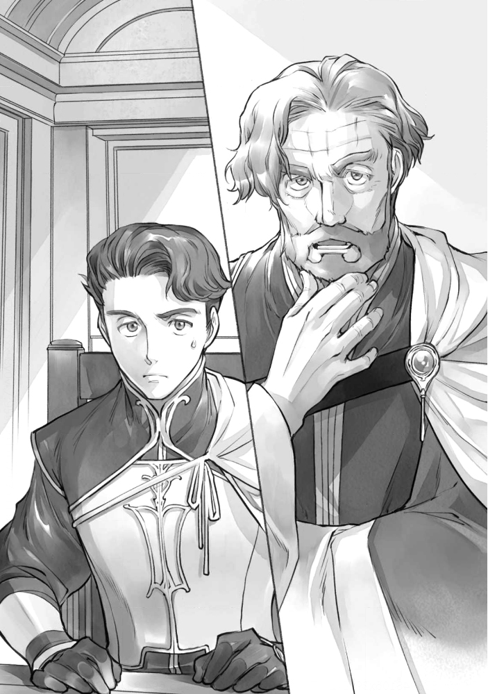

에필로그
========

쾰른베르거로 향하는 기수가 단숨에 하늘을 달려간다. 에렌페스트를 나왔을 때는 밝은 푸른 하늘밖에 시야에 보이지 않았지만 쾰른베르거에 가까워지면서 어두운 구름이 늘어나기 시작했다.

하늘의 변화를 노려보던 알렉시스는, 한 손으로 허리의 약통을 뒤져 회복약을 손에 들고 단숨에 마셨다. 비가 오기 전에 쾰른베르거에 도착하고 싶다. 그는 고삐에 마력을 담아 기수의 속도를 높여간다.

......자, 내 이야기를 들은 아버님께서는 뭐라고 말씀하실까.

알렉시스는 기베・쾰른베르거의 둘째 부인의 아들로, 빌프리트의 호위기사다. 주인의 명령을 받은 이번 임무는 "기원식에서 로제마인과 만난 기베・쾰른베르거의 모습을 살펴라. 가능하면, 기베의 협력을 얻어오도록" 이라는 것이다.

아버님은 아들의 주인이니까라는 이유로 차기 영주로 지지하지는 않겠다고 단언했다. 알렉시스가 거든다고 해도, 도저히 협력을 얻을 수 있을 것 같지 않다. 최근 기분이 좋지 않은 주인을 위해서라도, 적어도 로제마인에 대한 인상이 그리 좋지 않기를 그는 바라고 만다. 하지만, 그 소원은 정말 비겁하고 소극적인 것이다.

이토록 무거운 기분으로 귀향하게 될 것이라고 알렉시스는 생각하지 않았다. 쾰른베르거 도착을 조금이라도 늦추고 싶지만, 하늘에는 점점 어두운 구름이 늘어간다. 마음과 달리 알렉시스는 기수의 속도를 높일 수밖에 없었다.

"아, 알렉시스 님. 심해지기 전에 도착할 수 있었던 것 같아 안심했습니다."

억수같이 쏟아지기 전에 도착한 알렉시스를 맞이한 것은 기베・쾰른베르거를 섬기는 기사들이었다. 빌프리트의 호위기사가 될 때까지 이들의 지도를 받았던 그에게는 친숙한 자들이다. 알렉시스는 건네진 수건으로 붉은 기가 강한 오렌지색 머리에 묻은 물방울을 가볍게 닦는다.

"알렉시스님이 드디어 성인이 되신건가요? 빠르군요. 이번에는 임무입니까?"

"아, 그렇구나. 역시 주인의 명령도 없이 귀족가를 떠날 수 없다."

미성년자는 임무일지라도 귀족가에서 나와서는 안 된다. 최근에는 미성년 영주 후보생들이 인쇄업 관계나 성무 등으로 귀족가에서 나가야 하는 임무가 늘고 있어서, "귀성을 겸한다면 동행가능" 처럼 다소 융통성이 있게 됐다. 그래도, 예외적인 취급이다.

알렉시스는 겨울 마지막에 귀족원을 갓 졸업한 성인이다. 기원식이 끝난 이 시기에 그가 쾰른베르거로 돌아오는 것은 처음이다. 이렇게, 친숙한 사람들에게 환영을 받으면, 홀로 임무를 완수할 수 있는 성인이 된 뿌듯함이 가슴에 벅차오른다. 왠지 부담스러웠던 임무가 조금은 가벼워진 것 같았다.

"알렉시스님, 유디트의 모습은 알고 계십니까? 얼마 전, 로제마인 님을 모시고 성무를 위해 돌아오셨는데, 주인 얘기만 하고 자신의 얘기를 그다지 하지 않으셔서요."

기사 한 명이 안절부절못하는 모습으로 말을 걸어왔다. 그는 알렉시스가 호위기사가 되기로 결정됐을 때 특별히 지도받은 솜씨좋은 사람이다. 그에 대해서는 알면서도, 그의 딸인 유디트를 알렉시스는 잘 모른다. 기베를 섬기는 기사의 딸이라도 세례식 전에 기베의 저택에 출입하는 일은 없기 때문이다. 동향이라고는 하지만 알렉시스가 유디트를 처음 본 곳은 성의 어린이 방이었다. 지금도 영주 후보생의 호위기사라는 의미에서는 같은 입장이지만, 나이도 성별도 섬기는 주인도 달라 접점은 적다.

......유디트가 견습 기사여서 도움이 되었군.

만약 그녀가 견습 시종이나 견습 문관이었다면, 정말 접점이 없어서 알렉시스는 아무 말도 하지 못했을 것이다. 호위기사끼리여서 기사단 훈련장에서 볼 수 있고, 유디트의 높은 명중율은 유명하다. 보니파티우스도 눈독을 들이고 있어 화제다.

"신전에 틀어박히는 일이 많은 로제마인 님의 측근과 성에 있는 내가 만나는 일은 비교적 적다. 유디트를 보는 것은 훈련할 때 정도이지만 언제나 보니파티우스 님의 칭찬을 들을 정도로 진지하게 임하고 있다. 나도 그녀의 명중률과 집중력이 훌륭하다고 생각한다."

"그렇군요. 정말로 보니파티우스 님이......"

딸을 칭찬받고 반가워하는 그를 보며, 알렉시스는 "아들이 저와 함께 기베를 지키는 기사가 된대요" 라는 아들 자랑을 여러 차례 들었던 기억이 난다. 귀족원 기간에만 로제마인을 섬기는 특이한 견습 기사 테오도르가 그의 아들이다. 여전히 가족 사이가 좋은 것 같다. 작게 웃으며 알렉시스는 기베・쾰른베르거의 소재를 묻는다.

"아버님은 집무실인가? 일단 연락은 넣었다만......"

"네. 집무실에서 기다리세요. 안내해 드리겠습니다."

"아니, 별로 필요 없다. 그대들은 훈련으로 돌아가도 좋다."

요즘은 좀처럼 귀환하지 못하지만 원래 자신이 살던 저택이다. 안내받지 않아도 집무실 위치는 알고 있다. 하지만 "손님을 안내하지 않고 끝내다가는 기베에게 꾸중을 듣는다" 고 시종과 기사들이 이구동성으로 말하기에 어쩔 수 없이 알렉시스는 그들의 뒤를 걸었다.

"실례합니다, 기베・쾰른베르거."

기베・쾰른베르거는 토지에 이상이 없는지 확인하기 위해 기수로 뛰어다니는 경우가 많기 때문에, 간혹 저택에 있을 때는 집무실에 들어오는 사람이 많다. 하지만, 오늘은 미리 연락을 해서인지 집무실은 차를 준비하는 시종과 기베 뒤에 대기하는 문관 외에는 인기척이 없었다.

"이쪽으로 들어오세요."

아버님이 평소와 같이 집무를 보는 모습을 알렉시스는 예상했지만, 지금까지와 대응이 다르다. 아무래도 아들의 귀환을 기다리는 아버님이 아닌, 영주 일족의 명을 받은 호위기사를 대하는 기베로서 대응할 생각으로 준비하는 듯하다. 알렉시스는 임무를 띤 호위기사로 취급받고 있다는 것을 느꼈고, 새삼스럽게 임무를 무겁게 느꼈다. 그 무게를 물리치듯이 등을 곧게 폈다.

"기베・쾰른베르거, 빌프리트 님으로부터 기원식에서의 로제마인 님에 대한 정보를 얻어오도록, 이라는 명령을 받았습니다."

알렉시스가 자세를 바로잡은 모습을 보자, 기베・쾰른베르거는 가볍게 눈썹을 치켜들었다. 그대로 만족스럽게 고개를 한 번 끄덕였다. 알렉시스의 태도는 아무래도 급제점이었던 듯, 기베는 자리를 권해 주었다.

"그렇다 치더라도, 로제마인 님의 정보라는 건? 기원식 보고에 뭔가 문제가 있었는가?"

탐색하듯 바라본 알렉시스는 몸을 굳혔다. 아버님의 얼굴을 하고 있지 않은 기베・쾰른베르거와 마주하는 것은 처음이다. 알렉시스가 빌프리트의 호위 기사가 된 후에도, 성에서 귀족들의 대응은 문관이나 시종의 몫이었고, 귀족원에서는 모두가 아이였다. 자신이 당사자로서 귀족끼리의 속내를 떠본 경험은 적다. 팽팽한 긴장감 속에서 나이 든 귀족의 노회함을 느끼며, 그의 목이 꿀꺽 소리가 난다.

"기원식 보고가 부족했다고 말하는 것은 아니옵니다. 빌프리트 님이 정보를 원하셔서......"

"흠. 겨우내 몇 명이나 영주 일족의 측근이 해임되었다고 하던데, 성인 직후의 호위 기사를 귀족가에서 내보내 정보 수집을 명령해야 할 정도의 사태인가?"

밖에서의 정보 수집은 문관의 몫이다. 물론 호위 기사도 밖에 나가 깨달은 게 있으면 주인에게 보고한다. 다만, 정보수집 자체를 임무로 받는 일은 적다. 호위기사에게 정보 수집을 명령해야 할 정도의 사태인가 하는 눈총을 받고, 알렉시스는 천천히 고개를 끄덕였다.

"숙청의 영향이 매우 큽니다. 영주 일족은 이전처럼 있을 수 없을 겁니다."

"그대로부터 영주후보생들의 관계가 바뀌고 있다고 보고받았지만, 기원식에서의 로제마인 님은 그것을 조금도 느끼지 않고 계셧다. 빌프리트 님을 차기 영주로 밀면서, 자신은 그 입장을 바라지 않는다고 말씀하셨다"

그 말에 알렉시스는 온몸에서 힘이 빠지는 듯한 안도를 느꼈다. 최근엔 "라이제강계 귀족뿐 아니라 로제마인도 마음에 걸린다" 거나 "영주의 양녀가 된 것은 차기 영주가 되기 위해서 였다" 라는 말이 빌프리트의 입에서 나온다. 그것을 부정하는 것은 그의 주위에서 램프레히트와 로제마인의 측근뿐이 되었다.

숙청으로 인해 파벌 세력이 새로이 형성되는 지금, 성에 있는 옛 베로니카파는 적고 중립파와 라이제강계 귀족이 상당수를 차지하고 있다. 그래서, 차기 영주여야 할 빌프리트는 심히 입지가 좁았다. 지금의 의견을 알면, 조금은 주인의 불안이 가라앉을지도 모른다.

"기베의 눈으로 보아, 로제마인 님은 어떠셨나요? 그, 차기 영주로서......"

그가 조심스레 묻자, 기베는 천천히 턱을 쓰다듬으며 "로제마인 님 말인가......" 라며 만족스러운 미소를 지었다.

"아우브로서의 소질은 예상 이상이었다. 친족이 아닌 초면인 기베가 상대라도 주눅들지 않고 자신의 의견을 피력한다. 그것도, 다른 사람의 의견을 들어주면서 휩쓸리지 않고. 역시 보니파티우스 님의 손녀다. 계파를 이용하는 일은 있어도, 계파에게 이용당하는 영주는 되지 않을 것 같다"

기베가 로제마인을 칭찬하는 가운데, 알렉시스는 자신이 기베로서의 아버님에게 겁을 먹었던 속내를 궤뚫어 보고 있었다는 것을 깨닫고 숨을 삼켰다.

"그리고, 귀족원에서 행했던 일이나 인쇄 사업의 발전 방법에 대해 보고를 받았는데, 로제마인 님의 언행에서는 장래의 전망을 느낄 수 있다. 책을 늘리고 싶다. 귀족원의 성적을 올리고 싶다, 귀족들의 마력을 늘리고 싶다, 성무나 신전의 본연의 자세를 재검토해 주었으면 좋겠다, 평민의 입장을 향상시키고 싶다......와 같이. 하고 싶은 일이 명확하면 아랫사람은 따라가기 쉽다. 아무런 의사표시를 하지 않고 측근에게 조종당하는 것처럼 보이는 영주보다, 지방에 있는 기베로서는 안심할 수 있다.

알렉시스의 예상 이상의 칭찬이었다. 하지만, 기베・쾰른베르거는 한 번 만났을 뿐이다. 로제마인에 대해서 잘 모른다. 밖에서는 좋아 보일지 몰라도, 가까이 가면 결점도 보이는 법이다. 실태를 알고도, 기베는 의견을 바꾸지는 않을까.

"확실히, 로제마인 님의 생각이나 성적은 훌륭하다고 생각합니다. 하지만 그 분은 너무 독창적이에요. 언행이나 요구는 너무나도 엉뚱해서 주위를 항상 당황하게 만들고 있습니다. 영주가 되면 도저히 따라갈 수 없을 겁니다."

하지만, 거기에 전혀 동요하지 않고, 기베・쾰른베르거는 흥하고 코웃음을 쳤다.

"주인의 의견과 전망을 실현 가능하도록 조정하는 완충재나 고삐 역할이 측근이나 배우자의 몫이다. 그러기 위해 영주일족에게 유능한 측근이 붙는 것이 아닌가. 사실, 로제마인 님은 잘하고 계신다. 그렇기에, 개인이 아닌 에렌페스트 전체의 성적이 올랐고 왕족이나 상위 영지와 연결도 가능했다. 핵심 측근들로부터는 부정적인 의견도 없다. 유디트나 테오도르는 자랑스러운 듯 로제마인 님을 말하고 있었다. 특별히 문제가 있는 것처럼 보이지는 않는다"

단순한 질투일 것이라는 말을 들은 알렉시스는, "측근들로부터도 라이제강계 귀족들로부터도 부정적인 의견은 나오고 있습니다" 라며 고개를 저었다. 그리고는 짙은 파란색 눈으로 도전적으로 기베・쾰른베르거를 바라본다.

"트라우고트 님은 도저히 따라갈 수 없다며 측근에서 물러났습니다. 게다가, 자신의 뒤를 받쳐주는 라이제강계 귀족에게서도 성적을 낮추는 것을 원한다고 들을 정도로 나아가는 겁니다. 도저히 아우브에게 적합하다고는 생각되지 않아요." 

"음? 트라우고트 님 자신에게 문제가 있었다고 보니파티우스 님이 격노해 계셨고, 라이제강계 귀족은 로제마인 님이 차기 영주가 된다면, 그 방침을 따르겠다는 보고가 있었다. ......그게 누구 말이냐? 그대 자신의 의견은 아니겠지?"

쾰른베르거라는 외딴 시골에 틀어박혀 있는데도 불구하고, 여러 정보를 얻고 있는 아버님에게 알렉시스는 혀를 내두른다. 조금의 반론으로는 의견을 번복할 일도 없다. 묵직한 모습을 듬직하게 여기면서 그는 쓴웃음을 지었다.

"빌프리트 님의 수석 시종이었던 오즈발트입니다. 로제마인 님과 달리 주위를 곤란하게 하는 생각이나 언행을 하지 않는 빌프리트 님은, 아주 우수한 영주후보생이라고."

"어처구니없다. 그것은 측근에게 형편이 좋은 것뿐이지, 영지를 위하는 소질이 아닐 것이다."

빌프리트의 측근들 중에서는 상식처럼 들리지만, 밖에서는 통하지 않는다. 측근 동료와 그 이외에서 의견의 괴리가 크다는 것을 확인할 수 있었기에 알렉시스는 왠지 모르게 숨통이 트인 듯한 기분이 들었다. 측근 동료들의 주장은 옛 베로니카파에 치우쳐 있어, 이제는 반론도 허용되지 않는 분위기로 가득 차 있다. 몹시 갑갑하여 숨쉬기 힘들다.

"영주에게 필요한 것은, 목표를 정하고 나아갈 의사와 중요한 국면에서 선택하고 그 책임을 질 각오다. 귀족원에서 우수자가 되었으니까 빌프리트 님이라도 무난한 영주는 될 수 있을 것이다. 하지만, 측근들의 말대로라면 상위 영지와 어깨를 나란히 하기 위한 혁신적인 정책을 펴는 영주는 될 수 없다. 나는 그런 의미에서, 로제마인 님을 첫째 부인보다 영주감이라고 생각한다."

기베・쾰른베르거의 단언에 알렉시스는 작게 한숨을 내쉬었다. 

"역시 빌프리트 님이 원하는 답변을 가져가는 것은 할 수 없는건가요. ......아버님, 만약 이 답변을 가져간 것으로 주인에게 책망을 받는다면, 저는 쾰른베르거로 돌아와도 괜찮겠습니까?" 

"무슨 의미인가? 내 선택으로 그대를 책망한다는 것은?"

"라이제강계의 기베를 돌며 뜻대로 되지 않은 책임은 램프레히트에게 있다고 책망하고 있었으니, 쾰른베르거에서의 실패는 저의 책임이 될 거라고......"

빌프리트는 기원식을 계기로 라이제강계 귀족을 포섭하는 것이라고 으스대고 있었다. 로제마인과 약혼한 것으로 차기 영주의 자리에 올랐기 때문에, 라이제강계 귀족들도 어느 정도 빌프리트를 받아들이고 있다고 생각했던 모양이다. 실제로, 지금까지 인쇄업 등으로 찾은 지역에서는 차기 영주로 존중받았다.

램프레히트도 로제마인의 측근도 "지금은 그만두라" 고 충고했지만 빌프리트는 이전 경험을 바탕으로 "말하면 알아준다" 고 강행했다. 알렉시스는 제지하지 않았다. 분발하는 것은 별로 상관없다고 생각했기 때문이다. 자신들이 호위 임무에 힘쓰면 될 뿐이고, 빌프리트 자신도 처음부터 모든 게 잘 될 거라고 생각하지는 않을 거라고 생각했다.

하지만 아니었다. 그 자리에서 라이제강계 기베들로부터 싸늘한 시선을 받았고, 은근무례한 대응을 받은 빌프리트는 "끔찍한 처사를 받았다" 며 풀이 죽은 것이다. 라이제강계 귀족들은 자신의 뒷배가 되지 않는다. 그들이 지지하고 있는 것은 어디까지나 로제마인. 그녀를 차기 영주로 삼을 수 있는 기회가 있다면, 약혼자라도 빌프리트는 배제 대상이 된다. 그 현실을 목도한 그는 "실패의 원인은 사전교섭을 게을리한 램프레히트와 약혼자인데도 비협조적인 로제마인에게 있다" 며 분노와 책임을 돌렸다.

"지금의 라이제강계 귀족들이 그렇게 쉽게 빌프리트 님을 받아들일 리 없다. 갑자기 성공할 것으로 생각했다면 난관적인 것도 정도가 있을 것이다. 빌프리트 님은 자기 할머니가 라이제강계 귀족으로 했던 일을 인식하지 않고 있는 건가?"

"......지식으로서 알고 있지만, 그것이 얼마나 원망받고 있는지, 분노를 사고 있는지 이해하고 있지 않다고 생각합니다. 저도 베로니카 님으로부터 어머님이 당한 처사를 알지만, 제가 직접 뭔가를 받은 것은 아니어서, 그렇게 깊이 생각해 본 적이 없었으니까요."

알렉시스의 어머니는 라이제강계 귀족이다. 베로니카의 괴롭힘을 받고 싶지 않아 보니파티우스의 첫째 부인에게 직접 교섭해서, 보니파티우스의 주선으로 쾰른베르거로 시집왔다. 그녀는 베로니카의 방식에는 질려 있었지만, 시간과 마음의 낭비이기 때문에 일부러 싫어하는 사람을 생각하거나 입에 올리거나 시야에 넣거나 하는 사람이 아니었다.

그래서, 알렉시스는 어머님이 당한 과거의 괴롭힘에 대해, 피로연으로 처음 성에 갈 때 주의를 받았던 정도밖에 모른다. "당신에게 도움이 되지 않을 테니, 성에서는 저를 가까이하지 않도록" 이라고 접근을 금지 당한 것이 훨씬 기억에 남아 있다.

성에서 알렉시스는 기베・쾰른베르거의 아들로 소개되었고, 어머님을 가까이 하지 못했기 때문에 아버님과 첫째 부인과 근접해 있었다. 그래서, 그는 라이제강계 귀족과의 연결고리가 잘 보이지 않는 존재였다. 지금에와서 베로니카에게 눈에 띄이지 않도록 부모님이나 아버님의 첫째 부인이 여러 가지로 생각하고 지켜준 것임을 알 수 있다.

부모의 대책은 정답이었다. 당시의 베로니카에게는 중립파 기베의 아들보다 라이제강계 귀족의 중심을 무너뜨리는 쪽이 상당히 중요했을 것이다. 알렉시스는 베로니카와 초면의 인사 정도밖에 말을 나눈 적이 없다. 귀여운 손자의 측근 후보라는 의미에서도, 말을 듣도록 하는 것이 어려운 기베・쾰른베르거의 아들은 그녀의 시야에 들어오지 않았다.

알렉시스에게 아무래도 베로니카는 먼 사람이다. "왠지 영주인 질베스타 님보다 잘난 체하는 사람이구나" 싶더니 어느새 실각하고 있었다. 그 정도밖에 기억이 없다. 그래서, 실각했을 때도 그는 "그런가" 라고 밖에 생각하지 않았다. 라이제강계 귀족에게도 베로니카파 귀족에게도 공감할 수 없었기 때문에, 자신의 할머니의 행동에 무관심한 빌프리트에게도 혐오감은 딱히 없고, "뭐, 그런 것일 것이다" 라고 납득할 수 있었다.

"빌프리트 님은 자신이 관여하지 않은 옛 일에 무관심하고, 낙관적인 것은 부정하지 않습니다. 다만, 귀족원에서 돌아와 숙청의 영향을 목도하기 전까지는, 정말 이상적인 주인이었거든요."

"무엇이 어떻게 변했다는 건가?"

"가장 큰 변화는, 빌프리트 님이 묘하게 로제마인 님을 눈엣가시로 여기게 된겁니다. 게다가 다른 영주후보생들에게, 갑자기 차기 영주인 자신에게 공적을 양보하라거나, 자신의 보좌를 하도록 말하게 되었습니다."

그때까지 오즈발트가 암약하고 있었다는 것은 어느정도 알지만, 빌프리트가 성과 헌상을 강요하지는 않았다. 오히려, "동생에게 양보받는 것은 싫다" 고 했다. 적어도 귀족원의 표창식에서 로제마인에 관해서 그렇게 말한 것을 알렉시스는 알고 있다. 그런데도 갑자기 "약혼자나 동복동생이라면 차기 영주에게 성과를 바쳐야 한다" 고 말하게 된 것이다.

"빌프리트 님은 대영지 방식에 따르면 그렇게 되고, 옛부터 에렌페스트에서도 그렇게 해 왔다고 자신 있게 말씀하시는데요......"

"대영지 방식인가...... 하긴, 이복 형제와 차기 영주를 다투고 있고, 평가를 겨루는 경우는 동복 형제끼리 성과를 양도하기도 한다. 하지만, 지금의 에렌페스트에서는 약혼에 따라 빌프리트가 차기 영주로 정해져 있지 않은가. 남의 성과를 빼앗을 필요는 없다."

기베・쾰른베르거는 그렇게 말한 뒤, 뭔가 궁리하듯 먼 곳을 바라보다가, 깊은 한숨을 내쉬었다.

"질베스타 님을 위해 베로니카 님이 측근들의 성과를 빼앗은 이야기는 유명하다. 그렇다면, 에렌페스트의 영주 일족은 오래전부터 행했다고 하겠다."

알렉시스는 신음하며 머리를 감싸고 싶어졌다. 빌프리트의 말 자체는 틀리지 않았다. 근거로 삼고 있는 "옛날" 이 "베로니카의 전성기" 였던 것 뿐이다. 옛 베로니카파 측근들은 오래전부터 해온 당연한 행동이라고 생각했지만, 현재는 빌프리트가 지금도 베로니카파라고 각인시키는 최악의 행동이 된다. 라이제강계 귀족으로부터의 심증은 나빠지기만 할 것이다.

"제가 베로니카 님의 옛 행적에 관심을 가졌다면 조금은 막았을까요?"

"그대 한 사람이 뭐라고 해봐야 어려울 것이다. ......하지만, 빌프리트 님의 변화가 너무 가파르군. 원인에 뭔가 짚이는 것은 없는가? 영주의 측근이 해임됐을 정도다. 빌프리트 님의 환경도 상당히 변화했겠지?"

변화의 원인을 명확히 하고, 원인을 제거하라는 지적에 알렉시스는 새삼 생각에 잠긴다. 확실히 주인를 둘러싼 환경은 크게 달라졌다.

"생활 큰 변화는, 수석 시종인 오즈발트가 사임으로 보이도록 한 해임이 된 것일까요."

오즈발트는 "파벌의 누가 끼칠 것을 우려한 해임입니다. 빌프리트 님이 아우브에게 반발을 느끼지 않도록 사임으로 위장하라는 명령을 받았습니다" 라고 측근들에게 전한 뒤, 주인에게는 "제가 있어서는 빌프리트 님께 도움이 되지 않는다" 며 눈물을 흘리며 사임 허가를 요청했다. 그가 가족의 누가 미치는 자들에게도 사임을 권유한 결과, 4명의 성인 측근이 그만둔 것이다.

"가장 오래 모셔준 충신을 잃은 빌프리트 님은, 자신의 무력함을 탓하고 계셨습니다. 그래서인지, 봄의 축연에서 그 억울함과 슬픔에 약혼자가 공감해주지 않은 것에 분개했던 것 같습니다."

후에 이름을 바친 측근 바르톨트에게 "라이제강의 공주에게는 기쁜 일이겠지요. 베로니카 님에게 앙심을 품고 있는 파벌이니까요" 라며 위로를 받는 모습을 알렉시스는 봤다.

"세례식 전부터 측근이었던 사람이 갑자기 빠지면서, 정신적으로 불안정해진 게 아닌가 생각합니다. 베로니카 님에게 양육된 빌프리트 님에게는 영주 부부보다 훨씬 오즈발트가 가까웠을 테니까요."

"흠...... 어쩌면, 달래거나 꾸짖는 수석 시종이 없어짐으로써, 그때까지 억눌렸던 방자함이 표면화되었던 것일지도 모른다. 아니면, 그들을 측근으로 돌려보내라는 아우브에 대한 무의식적인 항의행동인가?

아버님의 추측에 알렉시스는 팔짱을 꼈다. 그는 주인의 갑작스러운 변화에 당황해서 눈살을 찌푸리고 있었지만, 그런 생각은 해본 적이 없었다. 신선한 의견이다. 제삼자의 의견은 귀하다. 모처럼의 기회이므로 아버님의 의견이 탐나서 알렉시스는 그 밖에도 생각난 것을 말해 나간다.

"집무 환경이 바뀐 것도 크다고 생각합니다. 이전과 달리, 성 안에서는 중립파와 라이제강계 귀족들이 눈에 띄게 되어 있습니다. 그래서, 빌프리트 님의 주위를 옛 베로니카파 귀족들로 채웠던 때와는, 집무 환경도 달라졌습니다."

"치켜세우고 칭찬하는 자만 있는 게 아니었단 말인가."

아버님의 신랄한 말에 쓴웃음을 지으며, 알렉시스는 고개를 끄덕인다.

"기본적으로 빌프리트 님의 측근들은 칭찬하고 세워주는 방침이지만, 지금은 보니파티우스 님의 질책이 날아드는 환경이 되고 있습니다."

"보니파티우스 님의?"

"네. 페르디난드 님이 신전에서 하시던 일을 로제마인 님이, 성에서 하시던 일을 보니파티우스 님과 빌프리트 님이 분담하게 되었기 때문입니다."

주인의 집무시간은 크게 늘고 자유시간이 줄었다. 또, 집무 때마다 보니파티우스와 얼굴을 마주치지 않으면 안된다. 빌프리트는 손녀에 대한 애정이 가득한 백부님과 집무를 하는 것은 답답한 것 같다.

그 마음은 알렉시스도 알겠지만, "성의 집무를 로제마인으로 바꿨으면 좋겠다" 거나 "신전에 틀어박혀 있는 로제마인은 편안하고 좋다" 거나 "차기 영주의 첫째 부인으로서의 일을 제대로 하지 않는다" 라는 문구는 이해할 수 없다.

페르디난드가 성에서 보낸 시간은 그리 길지 않았다. 아마 신전의 업무량은 많을 것 같다. 게다가, 로제마인에게는 성인이 된 문관이 하르트무트밖에 없다. 견습 문관을 포함해도 집무를 할 수 있는 사람은 매우 적은 것이다.

"빌프리트 님에게는 문관이 세명, 견습 문관이 세 명이 있으니, 보니파티우스 님과 일하고 싶지 않으면, 자신의 문관들만으로 집무를 하면 된다고 생각하지 않습니까?"

"그렇게 제안하지 않았던 것인가?"

"문관들에게 각하당했습니다. 아직 책임질 만큼 집무에 정통하지 않아 무리다, 라고."

신전에서 멜키오르 측근들이 인수인계 기간을 갖듯이, 빌프리트와 그의 측근들에게도 인수인계가 필요하다고 들었다. 에렌페스트는 영주 일족이 적어 지금은 측근을 해임하고 곤란해진 영주 부부에게 빌프리트의 교육을 부탁할 수 없다. 보니파티우스에게 차기 영주 교육을 부탁할 수밖에 없는 것이다.

"집무 환경을 개선하고 싶다면 빌프리트 님이 조속히 인수인계를 끝낼 수밖에 없을 것이다. 변화는 그것뿐인가?"

알렉시스는 최근 빌프리트가 내뱉는 문구를 되새기며, 손뼉을 쳤다.

"빌프리트님은 아우브가 두 번째 부인을 맞는 것에 상당한 기피감을 가지고 있는 듯 합니다."

"막무가내로 둘째 부인을 구하려 하지 않았던 아우브・에렌페스트치고는 잘 결단한 것이라고 생각했는데......도대체 뭐가 불만인 것인가?"

식당에서 알게되었을 때는 아무 말도 하지 않았지만, 빌프리트는 자기 방으로 돌아가자 "라이제강에서 온 며느리는 로제마인이 있지 않느냐" 라거나 "브륀힐데를 아내로 맞아들일 거라면, 로제마인을 아버님의 둘째 부인으로 삼았으면 좋았다" 라거나 "로제마인이 라이제강의 공주로서 그들을 그들을 억누를 수 없으니까 나쁘다" 라는 문구를 되뇌었다. 

생각을 바꾸도록 아우브를 설득하기 위해 샤를로테에게 협력을 요청하거나 브륀힐데에게 사퇴하라고 했던 것을 떠올리며, 알렉시스는 뭐라 말할 수 없을 정도로 무거운 기분이 든다. 양측으로부터 거부당해 거칠어진 빌프리트를 달래기는 힘들었다.

"브륀힐데 님의 나이가 자신들과 크게 다르지 않다는 점과 로제마인 님의 측근에서 영주 일족이 늘어난다는 점이 마음에 들지 않아 보였습니다."

"하지만, 둘째 부인을 맞아 파벌 조정을 하거나, 집무를 분담하는 것은 영주라면 당연하다. 게다가 빌프리트 님 자신도 조만간 두 번째 부인을 맞을 처지 아닌가."

에렌페스트는 가뜩이나 영주 일족이 적은 것이다. 다음 세대의 아우브가 둘째 부인을 얻지 않고 끝낼 수 있을 것 같지는 않다.

"네. 저로서는 라이제강계 귀족을 억누르기위한 최선의 결연이라고 생각하지만, 지금 이상으로 라이제강계 귀족의 기세가 더해지고, 자신의 측근을 영주일족으로 보낸 로제마인 님이 차기 영주에 가까워지자, 측근 동료들 사이에서는 평판이 좋지 않습니다."

알렉시스는 여기서 말을 꺼내고서 처음으로 알았다. 브륀힐데가 둘째 부인이 되는 것을 꺼리는 사람은 빌프리트와 그의 측근들뿐이다. 옛 베로니카파 귀족들이 대거 붙잡힌 지금, 라이제강계 귀족들을 제압할 수단을 영주가 택한 것에 기베들은 납득하고 있다.

"둘째 부인을 싫어하는 것은 베로니카 님의 교육의 산물인지도 모른다. 그분은 자기 남편에게도 둘째 부인을 허락하지 않았고, 질베스타 님이 둘째 부인을 마다하는 발언을 해도 나무라지 않았을 정도다."

"어릴 적 교육이 그런 부분에도 영향을 미친다면, 빌프리트 님이 베로니카 님의 그림자에서 벗어나기는 어렵겠지요. 최근의 태도의 급변으로 빌프리트 님은 틀림없이 베로니카파라는 것이 명확해졌습니다. ......로제마인 님의 오라버니인 램프레히트는 눈엣가시가 되어 매우 곤란해졌습니다"

알렉시스는 발밑으로 시선을 떨어뜨린다. 빌프리트가 기원식에서 라이제강계 귀족 기베의 지역을 돌아보는 제안을 했을 때, 램프레히트는 그만두라고 주의를 주었다. 이후 그는 무슨 일이 있으면, 측근 동료들로부터 충성을 의심받고 있다. 무심코 알렉시스가 말리러 들어갔을 때, 바르톨트로부터 "쾰른베르거도 로제마인 님의 편입니까?" 라고 말했고, 램프레히트에게는 "자기는 익숙하니 떨어져 있으라" 들었다. 그리고는 되도록이면 말을 하지 않고 있다. 

그런 가운데 빌프리트는 기베들과의 면회를 강행했고, 알렉시스의 예상대로 실패로 끝났다. 성으로 귀환해 침울해진 빌프리트는 원망스러운 표정으로 램프레히트를 바라봤다.

"이번 실패의 원인은 빌프리트 님이 주위의 주의를 듣지 않은 것과 라이제강계 귀족들의 오랜 분노를 만만하게 여겼다는 것입니다. 오랜 분노가 단 한 번의 면회로 풀릴 리가 없습니다. 느긋하게 이해를 얻어갑시다."

램프레히트의 말은 지극히 올곧다고 알렉시스는 생각했다. 반성해서 다음에 살리면 될 뿐이다. 하지만, 램프레히트의 말은 "냉정하다" "인정이 없다" 라고 뿌리쳤다.

"저는 입을 열지 않아서 다행이었습니다"

"알렉시스는 뭐라고 말할 생각이었나?"

"램프레히트에게도 로제마인 님의 측근들에게도 그만두라고 들었을텐데 강행한 것이 누구입니까? 생각했던 것 같은 결과가 나오지 않는 걸로 토라지는 것도 한도가 있습니다, 라고."

"흠. 쾰른베르거가 눈 앞의 적이 될 위험성이 크다. 그대는 잠자코 있어라."

램프레히트의 말에 더 토라진 빌프리트에게 달려간 것은, 이름을 바친 측근 바르톨트였다. "이렇게 노력하고 있는데 불쌍하게......" "로제마인 님이나 램프레히트가 사전에 교섭을 해서 더욱 협력을 해주지 않으면......" 이라며, 빌프리트의 책임이 아님을 강조하며 위로한다. 

그걸로 주인의 기분이 나아지자, 다른 측근들도 그를 추종해 램프레히트의 사전교섭이 부족했다고 말하게 됐다. 알렉시스는 도대체 무슨 작은 연극인가 싶었을 정도다. 실패의 원인으로 책망받는 램프레히트가 훨씬 불쌍하다고 생각한다. 

"그대의 어머니도 라이제강계 귀족인데, 그대는 아무 말도 하지 않는가?"

"빌프리트 님은 아무래도 베로니카 님과 똑같이, 저를 기베・쾰른베르거의 아들로만 보는 것은 아닐까 합니다. 중립파이고 파벌은 상관없다고 단언하는 쾰른베르거의 귀족이라고 생각되고 있습니다.

사실, 호위기사는 주인을 지킬 수 있으면 그만이라고 알렉시스는 생각한다. 쓸데없는 건 생각하고 싶지도 않다. 다만, 알렉시스가 빌프리트의 호위기사가 된 것은, 램프레히트에게 권유받았기 때문이다. 베로니카 실각 후, 측근의 파벌 관계를 베로니카파로부터 중립이나 라이제강으로 옮기고 싶다고 듣고, 그는 응했다.

그래서, 램프레히트가 이유 없는 반감을 사고 있는 상황이, 알렉시스는 마음에 들지 않는다. 하지만, 당사자는 "영주 부부가 측근의 재편성을 끝내고, 처벌을 받은 구 베로니카파의 귀족들이 집무에 복귀할 수 있게 될 무렵에는, 빌프리트 님도 라이제강계 귀족도 진정될 것이다. 일회성 짜증이다" 라고 할 뿐이다. 조금만 참으면 된다, 라고.

"여러 가지 말했습니다만, 지금까지의 빌프리트 님의 노력은 인정하고 있습니다"

흰 탑 사건으로 오점이 생겨도 썩지 않고 노력을 계속할 수 있었다. 로제마인과 비교되는 같은 학년이라는 힘든 입장에서도, 우수자로 선정되는 성적을 계속 거두고 있다. 기숙사 정리도 잘하고 동생과의 관계도 지금까지는 양호했다. 숙청으로 자신의 파벌인 옛 베로니카파 학생들에게 원망을 받으면서도 영주 후보생으로서의 역할을 다했고, 단켈페르거에게 불합리한 디터를 맞고도 기사들을 이끌고 승리했다.

"그렇기에, 급변한 주인의 모습이 슬프고 한심해서 견딜 수 없습니다. 분합니다. 단켈페르거와의 디터에서 로제마인 님을 지키겠다고 분투하고 있던 모습은 무엇이었습니까. 빌프리트 님과 함께 저는 로제마인님과 에렌페스트를 단켈페르거로부터 지켜냈습니다. 그때는 정말 자랑스러운 마음이었어요. 호위기사로서 이 싸움에 참가하고, 승리할 수 있어서 다행이었다라고......"

그때는 숙청이 있어도, 자신들은 괜찮다고 생각했다. 무슨 일이 있어도 차기 영주인 빌프리트를 중심으로 뭉쳐, 밝은 미래로 나아갈 것이라고 근거 없이 믿었다. 하지만 지금은 그런 미래를 꿈에서도 볼 수 없다.

"계파는 정말 귀찮다고 말했던 아버님의 말씀이 뼈저리게 느껴졌어요. 빌프리트 님이 스스로 베로니카님의 부정적인 유산으로 파고드는 듯한 언동을 하는 것은 왜인지, 저로서는 이해할 수 없고, 지금은 성의 공기가 답답합니다. 측근을 사임하고 쾰른베르거로 돌아오고 싶습니다."

알렉시스가 내뱉는 말을 조용히 듣던 아버님은, 천천히 숨을 내쉰 뒤 미간에 깊은 주름을 새기고 팔짱을 꼈다. 새로운 과제를 부과할 때 보여주는 행동에, 알렉시스는 자세를 바로잡는다.

"......지금 그대는 주인이 자신의 이상에서 벗어난 것이 마음에 들지 않아, 측근으로서의 역할을 내팽개치려고 하실 뿐이다. 자신의 뜻대로 일이 진행되지 않아 초조해하는 빌프리트 님과 그대의 행동은 아무런 차이가 없다."

낮은 목소리로 지적된 말에 알렉시스는 숨을 삼켰다. "다르다" 라고 반박할 수 있었으면 좋았을 텐데, 당장 반박할 말이 나오지 않는다.

"사라진 측근은 누구냐. 그 자가 정말로 지금까지 빌프리트 님의 방자함을 억누르고 있었던 것일까? 아니면, 아직도 그들과 비밀리에 연락을 취하고 있고, 반대로 뭔가 불어넣어지고 있는 것은 아닐까? 부모의 연좌에서 벗어나기 위해 이름을 바치고 측근에 들어간 사람이 있다고 하던데, 그 자는 정말 믿을 수 있는가?"

"이름을 바친 자는 빌프리트 님을 거역할 수 없는 거죠?"

주인를 위해 목숨을 거는 것이 이름을 바친 측근이다. 의심한다는 것조차 알렉시스는 생각해 본 적이 없었다.

"이번 이름을 바치는 것은 목숨을 구하는 것과의 교환으로 강제된 것이다. 충성이 다다라 이름을 바친 자와 같지 않다. 베로니카님께 이름을 바칠 것을 강요받았지만 충성심이 부족한 언행을 한 자를 안다. 명령을 배신하지 못할 뿐, 마음 속에서 무슨 생각을 하는지 알 수 있던 것은 아니다. 그 복잡성과 위험성은 명심하라."

빌프리트에게 바짝 다가섰던 바르톨트의 모습이 뇌리에 되살아났다. 그러고 보니, 이름을 바친 것으로 상당히 신용하고 있는 것 같고, 신입임에도 불구하고 빌프리트는 바르톨트를 중용하고 있다.

"주인의 업무 환경을 주시하라. 차기 영주이면서도, 영주를 보좌하는 일의 양이 너무 많아 따라가지 못한다면, 영주가 돼도 만족스러운 일을 할 수 있을 것 같지는 않다. 하지만, 거기에 방해가 있을 가능성은 없는가? 일하는 동안 라이제강계 귀족들로부터 세세한 괴롭힘을 당하지는 않았는지 확인하라."

문서를 대할 때, 주인의 일을 보좌하는 것이 문관. 그들의 눈이 닿지 않는 부분을 보는 것이 호위기사라고 기베・쾰른베르거는 말했다. 집무실에서 우두커니 서 있으면 되는 게 아니라고 들으며, 공격 따위의 경계는 어쨌든, 집무 방해에 대해서는 생각해 본 적이 없었던 알렉시스는 반성한다.

"반대로, 그대들의 언동이 라이제강계 귀족들의 감정을 거스르지 않았는지 되돌아보는 것도 중요하다. 베로니카 님이 라이제강에 대해 행한 무도한 짓을 잊은 듯한 언동을 하고 있지 않은가?""

그것은 상당히 가능성이 높다고 알렉시스는 생각했다. 자세한 것을 모르기 때문에, 주의할 수 없다. 하지만, 그것은 알려는 노력조차 포기하고 있다는 것이다.

"제대로 보도록 주인의 행동을, 제대로 들어라 주위의 목소리를. 호위기사로서 지켜라, 주인의 명성을. 주인께서 길을 벗어났다면 끌어다 놓아라. 그것이 측근의 역할이다. 주위의 변화에 휘둘려, 싫은 일에서 눈을 떼고 물러나는 얼빠진 얼굴로 쾰른베르거로 돌아오는 것도 곤란하다."

아버님의 질책에 알렉시스는 한숨을 푹 쉬었다.

"제가 측근으로서 할 수 있는 모든 노력을 하고, 그래도 어쩔 수 없었던 경우는......"

"쉬운 일이다. 영주후보생 실격 증거를 갖추고 아우브에게 폐적을 건의하고, 측근 자체를 해산시켜라. 그런 다음 돌아온다면, 기꺼이 맞이하겠다. 자신의 일에 책임을 가지도록."

알렉시스가 사임하는 것은 쉽지만, 빌프리트가 주인으로서 걸맞지 않다는 것을 증명하기는 쉽지 않다. 진심으로 주인의 모습을 유심히 살피고, 그 주위를 꼼꼼히 살펴야 한다. 오늘, 지적을 받은 것들을 반성해도 알렉시스의 일은 어중간하다. 빌프리트를 영주 후보생 실격으로 만들기보다 먼저 알렉시스 자신이 호위기사 실격으로 낙인찍힐 것이다.

"한심한 것을 말씀드렸습니다. 온 힘을 다해 빌프리트님을 모시겠습니다."

자신의 섬김이 얼마나 어중간한지 지적받고 꾸중을 들은 것은 솔직히 억울하다. 하지만 자신이 해야 할 일과 나아갈 방향이 보였다. 쾰른베르거로 돌아왔을 때의 흐릿함과 답답한 기분과는 달리, 자신의 시야가 밝아진 것 같기도 하다.

우선, 빌프리트의 주위를 세밀하게 조사하고 싶다. 램프레히트와 협력해 다양한 각도에서 변화의 원인을 검증하고 싶다. 해야 할 일을 가슴에 품고, 알렉시스는 도전적인 미소로 일어섰다.