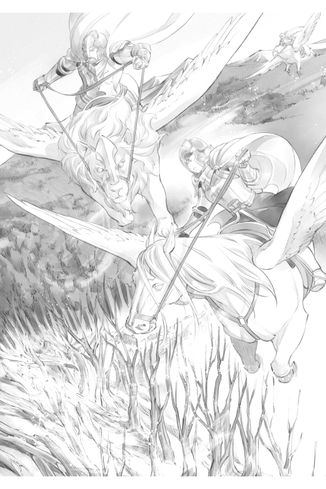

브리기테 - 일크너 전투
======================

"헬프리트다. 브리기테, 집무실로 와주지 않겠어?"

기베 일크너인 오라버님의 올도난츠를 받고 나는 고개를 갸웃했습니다. 제가 빅토아와 결혼하고 제지업이 궤도에 오른 지금, 일크너에는 조금 귀족이 늘어났습니다. 그 때문에, 제가 집무실로 호출되는 일은 적어지고 있습니다. 지난 번에 호출된 것은 로제마인 님께 많은 마술지를 드릴 때였습니다.

"또 로제마인 님이 마술지를 원하시는 걸까요?"

"올도난츠로 불러내는 겁니다. 급한 거겠죠? 릴라로제는 제가 보고 있으니까 빨리 다녀오세요"

아이방에서 함께 자수를 하던 어머님이 웃으며 손을 흔듭니다. 나는 바늘이나 실을 정리하고 낮잠을 자고 있는 우리 아이에게 시선을 옮겼습니다.

"부탁합니다, 어머님. 릴라로제가 착한 아이처럼 자주면 좋을텐데요"

한 살 반 된 딸을 어머님에게 맡기고 나는 재빨리 집무실로 향했습니다. 제 발소리가 들렸던 걸까요. 집무실에서 전(前) 회색 신관으로 오라버님의 집무를 돕고 있는 볼크가 나옵니다.

볼크, 오라버님이 호출했어. 전해주겠어?

"기베가 기다리고 있어요. 들어오세요."

볼크가 문을 열어주어서, 저는 안으로 들어갑니다. 남편 빅토아와 오라버님이 편지를 보면서 난처한 표정을 짓고 있는 것을 알았습니다.

"오라버님, 왜 그러세요?"

"플로렌치아 님으로부터 편지다. 아무래도 모든 기베에 보내진 것 같다.

저는 그 편지를 훑어봅니다. 내용은 아렌스바흐의 게오르기네 님이 에렌페스트의 초석을 노리고 침공해 왔을 가능성이 높기 때문에 토지 순찰을 강화하고 수상한 자가 발견되면 성으로 연락하라는 것이었습니다.

"봄의 시작때도 비슷한 요청이 있었지? 이번에는 어떻게 대응해야 할지 생각하자."

뭔가 싸움이 일어났을 때를 대비해 회복약 등은 만들고 있습니다만, 원래 기사가 적은 땅입니다. 아렌스바흐로부터의 침공에 대비하라는 말을 들어도 할 수 있는 것은 그다지 많지 않습니다.

"가능성이 높다고 적혀 있는데 특별히 시급해 보이진 않는다. 초석의 마술을 노릴 때 중시되는 땅은 아니니까."

일크너가 아렌스바흐와 맞닿아 있는 땅은 얼마 되지 않습니다. 지금이야말로 제지업으로 조금씩 재정 등도 증가해 왔지만, 전략상으로는 특별히 중요한 토지는 아닙니다. 초석의 마술을 얻기 위한 거점으로 삼기에는 성에서 너무 멀고, 프뢰벨타크와 맞닿아 있는 면이 많기 때문에 일크너를 공격하면 프뢰벨타크에게도 공격이 미칠 수 있기 때문입니다.

"게다가, 영지의 경계를 타령 귀족이 넘으면, 역시 아우브가 눈치채겠지? 연락을 받고 움직이면 문제 없을 것 같지 않니?""

"우선 기사들의 순찰을 늘리죠. 경계선 부근에 공을 들이고. 낮과 밤 두 번으로 어때요? 개인적으로 별로 하고 싶지 않지만 어쩔 수 없어요."

아렌스바흐에서는 토지의 마력이 줄어들고 있는 것 같고, 굶주려 가는 평민들이 산의 은혜를 찾아 일크너에 들어오는 경우가 종종 있습니다. 아렌스바흐를 경계한다면 그들에 대해서도 경계하거나 쫓아야 합니다.

"그동안 놓친 것을 아우브로부터 책망받을 가능성도 있습니다. 평민들에게는 안됐지만 그 점은 포기하시죠. 원래대로라면 아렌스바흐 영주 일족과 신전이 채워야 할 토지입니다"

신전에서 자란 볼크는 의외로 선뜻 평민들을 잘라 버렸습니다. 우리가 놀라서 시선을 돌리자, 그는 약간 난처한 듯 미소를 지었습니다.

"상황이 바뀌면 평민에 대한 취급이 크게 달라지는 것은 당연한 일입니다. 지금은 일크너를 위해 타령의 평민보다 영주 일족의 요구를 들어주는 것을 우선으로 생각하죠. 상인들에게 정보를 모으는 것은 좋다고 생각해요. 목재상들은 여기저기 돌아다니니까요"

빅토아나 볼크와 함께 대화를 해도 순찰을 강화해 보는 것 외에 그다지 좋은 방법은 떠오르지 않습니다. 큰 수입원인 제지업을 우선하고 싶은 마음이 더 강하기 때문에 게오르기네 님이 정말 오는지, 언제 올지 모르는 상태에서 장기간의 경계태세는 어렵습니다.

"그럼 기사들에게...... 어? 올도난츠가"

몇 안 되는 일크너 기사들에게 명령하려는데 올도난츠가 날아들었습니다. 오라버님이나 빅토아에게로 향할 거라고 생각했던 하얀 새는 제 팔에 멈춥니다.

"로제마인입니다"

봄의 축연에도 참석하지 못할 정도로 상태가 나빴던 것 같습니다만, 로제마인 님은 회복한 것 같습니다. 예전보다 목소리가 더 커졌어요. 모습은 보이지 않지만, 성장을 여실히 느꼈습니다.

"아렌스바흐에 계신 페르디난드 님이 게오르기네 님의 계략으로 인해 위기에 빠졌습니다. 이를 절호의 기회로 삼아 침공이 예상되고 있습니다. 이미 에렌페스트에 가까운 곳까지 이동하고 있는 것 같습니다. 빠르면 오늘이나 내일. 늦어도 며칠 안에는 뭔가 움직임이 보일 겁니다."

로제마인 님의 올도난츠에 우리는 얼굴을 마주했습니다. 이미 경계선 근처로 이동하고 있다면 긴급 사태가 아닐까요. 플로렌치아 님으로부터의 편지로는 전해지지 않았던 긴급성과 그 목소리에서 우리를 걱정해 주고 있는 것이 전해집니다. 또한 로제마인 님은 싸움에 있어서의 주의 사항을 가르쳐 주었습니다.

"적이 은으로 된 천을 들고 있을 때는 정말 주의하세요. 은으로 된 천은 마력 공격이 전혀 듣지 않아요. 슈타프 무기나 공격용 마술 도구가 통용되지 않기 때문에 평민들이 사용하는 무기를 휴대해 두는 것이 좋습니다. 또한, 분말 형태의 독이 사용될 가능성이 있습니다. 입가를 가리는 것을 잊지 말도록. 게오르기네님 일행이 은밀 행동을 취한다면, 기수가 아닌 마차를 사용하고 있을지도 모릅니다. 평민들로부터 퍼져있는 수상한 귀족의 정보를 수집하거나 주변의 기베들과 연락을 긴밀히 하고 제휴하거나 하여 대응해 주십시오. 할아버님이 이끄는 기사단은 언제든지 출진 준비가 되어 있습니다. 뭔가 이변을 느끼면 연락을 주세요."

세 번, 같은 내용을 전하고 올도난츠가 노란색 마석으로 돌아왔습니다. 우리는 임박한 위기를 알려준 노란색 마석을 바라봅니다.

"플로렌치아 님으로부터의 편지와는 상당히 내용이 다르게 들렸습니다만......"

"긴급히 둘러보는 게 좋겠다. 늦어도 며칠 안 된 것 같다."

"저, 싸움에 참가할 수 있도록 훈련을 강화할께요"

봄에 연락이 닿아서 기사로서 싸울 수 있도록 훈련은 해 왔지만 출산으로 훈련에서 멀어져 있던 기간은 길어, 육아 중 틈틈이 한 훈련으로는 전성기 때의 전력에 크게 미치지 못합니다. 그래도 일크너나 자신의 가족을 지키기 위해서는 한 명이라도 기사가 많이 필요합니다. 저는 조금이라도 훈련시간을 늘리고 싶습니다.

"브리기테, 긴장한 마음은 알지만 먼저 로제마인 님께 감사의 올도난츠를 보내줘. 아마 그대가 전 측근이었기에 보내주신 정보다. 임무를 벗어나 멀리 떨어져도 걱정해 주시고 있는 거야"

빅토아에게 지적받고, 나는 즉시 감사의 올도난츠를 날립니다. 로제마인 님을 모셨던 날들이 떠올라, 지금도 연결이 되어 있다는 것을 실감하고 가슴이 따뜻해졌습니다.

"로제마인 님, 브리기테입니다. 플로렌치아 님도 각 기베에게 경계하라는 연락이 있었습니다만, 그 이상으로 자세하고 귀중한 정보, 감사드립니다. 주변 기베는 물론 평민들에게도 알려서 경계하겠습니다."

날아가는 올도난츠를 보고 있는데, 오라버님이 올도난츠용 황색 마석을 책상에 늘어놓기 시작했습니다.

"브리기테, 주변 기베들에게도 올도난츠를 부탁한다. 로제마인 님의 측근이었던 그대가 직접 전달하는 쪽이, 일의 중요성이 잘 전달될 것이다."

플로렌치아 님의 편지에서 긴급성을 느끼지 못한다면, 일크너로부터의 연락도 무겁게 받아들여지지 않을지도 모릅니다. 하지만 제가 로제마인 님의 측근이었던 것과 함께 "로제마인 님으로부터 긴급 연락을 받았습니다" 라고 말하면 흘려넘길 수 없을 것입니다.

제가 올도난츠를 날리는 동안, 오라버님은 향후에 대해 이야기를 시작하고 있습니다. 오늘에라도 올지도 모른다고 하면 무엇부터 시작해야 할까. 생각해야 할 것은 많이 있습니다.

"평민들에게 정보를 얻는 것도 중요하지만 산으로 들어가는 이들에게 위험을 주지시켜야 하지 않겠습니까? 침공해 오는 타령 기사들과 마주치면 큰일납니다."

"며칠간 이곳에서 농성할 수 있는 정도의 식량 확보와 피난처 준비는 끝났습니다. 평민들의 안내에 대해서도 생각해 주세요."

"경계선 부근 산에는 게오르기네 님의 속보가 들어올 때까지 접근하지 말라는 경고를 내려놓기로 하자. 며칠 사이에 뭔가가 바뀔 것이다."

오라버님의 의식이 평민들을 지키는 것만을 생각하고 있다는 사실에, 저는 가볍게 숨을 내쉬었습니다. 백성을 지키는 기베로서는 맞을지도 모르지만, 그 전 단계에 대해서도 생각해 주셔야 기사들이 움직일 수 있습니다.

"오라버님, 평민들의 피난을 고려한다고 해도 경계선을 향해 아렌스바흐에서 많은 기사들이 쳐들어올 것인지, 아니면 초석의 마술만을 노리기 위해 소수로 은밀하게 성으로 향하느냐에 따라 기사들의 대비나 순찰 인원 등도 달라집니다. 필연적으로 피난시키는 사람의 수나 범위에도 차이가 나지 않습니까?"

"브리기테, 하고 싶은 말은 알지만 지금 시점에서는 어떻게 공격해 올지 모르겠다. 아렌스바흐에서 공격해 온다면 게를라흐, 뷜토르, 갈둔, 그리벨이 가능성이 높을 것이다. 나는 일부러 일크너에 들어올 가능성은 낮다고 생각한다."

빅토아가 지도를 보면서 그렇게 말했어요. 아렌스바흐와 경계를 접하고 있는 면적을 생각하면 확실히 일크너를 공격해 올 가능성은 낮을 것입니다. 거기에는 오라버님도 같은 생각이었던 것 같습니다. 하지만 방심할 수 없습니다.

"빅토아의 말도 이해하지만 귀족이 적고 수비가 취약한 것이 일크너다. 게오르기네 님이 그걸 안다면 양동 공격으로 사용하기 좋은 땅으로 노려질 가능성은 있다."

"양동......"

"아. 일이 생기면 보니파티우스 님의 협조를 얻을 수 있을 것 같은데, 기사단 파견을 요청하고 아우브의 승인을 받아 기사단에 명령이 떨어져, 출발 준비가 되기까지 얼마나 시간이 걸릴지 모른다."

"네. 게다가 귀족가에서 일크너로 기수로 이동하려면 아무리 서둘러도 꼬박 하루가 걸립니다. 그동안 우리끼리 버텨야 합니다."

기사단의 움직임이나 내정을 가장 잘 알고 있는 것은 로제마인 님의 호위 기사로서 기사단에 출입하고 있던 저입니다. 그런 만큼, 생각하면 할수록 양동 공격이 일크너에서 이루어졌을 때의 위험성이 몸에 배어 왔습니다. 우리들의 설명으로 빅토아도 그 위험성을 이해한 것 같습니다.

"조속한 발견과 연락이 관건이라면 순찰을 늘립시다. 며칠 내라고 예상되고 있는 겁니다. 경계선 부근만 순찰 빈도를 높이는 정도면 인원이 적어도 가능할 것 같아요."

오라버님이 고개를 끄덕였습니다.

"적이 지향하는 것이 에렌페스트의 초석이라면 앞길을 서두를테니 평민들을 학살하면서 나아가지 않을 것이다. 우리는 가능한 한 피해를 경미하게 할 것, 기사단이 도착할 때까지의 시간을 버는 데 철저히 하도록 하자."

나는 서둘러 기사들의 훈련장으로 가서 사정을 설명했습니다.

"......그런 이유로 경계선 부근의 순찰을 늘려주세요. 저도 동행하겠습니다. 어젯밤 순찰에서 뭔가 보고는?"

"어젯밤에도 이름 아침에도 별 이상은 없었던 것 같습니다"

일크너 기사단장의 보고에 저는 가슴을 쓸어내렸습니다.

"로제마인 님은 며칠 안에 움직임이 있을 것이라고 말씀하셨습니다. 야간 순찰은 신중하게 해 주세요. 몰래 들어온다면 야음을 틈타는 것이 제일이니까요"

"평민들이 잠든 사이에 몰래 진군해서 지나가면 이쪽은 영주 일족에게 연락하기만 하면 해결되니 다행입니다만......"

이곳의 기사는 마수를 쓰러뜨리기만 할 뿐 귀족원 시절의 실기를 제외하면 기사끼리의 싸움을 경험하지 않았습니다. 게다가 일크너에 있는 성인 기사는 15명입니다. 견습이나 복귀하는 저를 포함해도 20명이 채 되지 않습니다. 대영지와의 전투에 대해 소극적이 되는 마음은 저도 잘 압니다.

"그렇게 되면 좋겠지만 그럴 경우에는 일크너가 아닌 그리벨을 지나겠죠. 적이 일크너에 나타나리라고는 할 수 없지만 순찰을 게을리하지 마세요."

"확실히. 가능한 한 싸우는 것은 귀족가에서 오는 기사에게 부탁하고 싶은 것입니다. 하지만, 마술구를 사용하는 화려한 싸움은 삼가 주셨으면 좋겠어요.

공격용 마술구로 산과 숲을 파괴하면, 향후 제지업에 크게 영향이 미칩니다. 그다지 대규모로 마술구를 사용하는 전투는 가능한 피하고 싶은 것입니다.

"적의 움직임은 몰라도 브리기테 님이 기사단에 계시면 기베에게 의견을 전달하기 쉽고, 당신은 중급 귀족으로 귀중한 전력이니까요."

중점적으로 둘러보는 것은 아렌스바흐와의 경계선 부근입니다. 프뢰벨타크와의 관계는 양호하고, 로제마인 님으로부터 아무런 주의가 없었기 때문에 그쪽으로부터의 침공은 없다고 생각됩니다. 기사단의 순찰에 동행했지만 그날은 별다른 일이 없었어요.

다음날 오후 순찰 때였어요.

"저 능선의 모양이 좀 바뀐 것처럼 보이지 않나요?"

다섯 명의 기사들과 함께 기수를 몰다 보니 조금 경치가 달라진 것 같았습니다. 나무들이 늘어선 산의 일부분에 침울함이 보인다고 할까, 완만한 곡선을 그리는 능선에 부자연스러운 움푹 패인 듯한 느낌이 들었습니다.

"기수를 더 낮추고 다가가죠."

이변을 느끼고 경계하며 다가가자 기베의 관에서 보던 산의 반대편, 아렌스바흐 쪽의 나무들이 싹 사라지고 있었습니다. 토론베 토벌 후처럼 붉은 흙이 노출되어 있습니다.

"뭡니까, 이건?"

내가 눈을 가늘게 뜨고 살펴보려는 순간, 더 앞쪽 토지에서 나무들이 사라졌습니다. 무슨 일이 일어났는지 알 수 없어 멍하니 있을 때 기사로부터 목소리가 터져 나왔습니다.

"저쪽을 봐주세요! 사람 모습이 있어요!"

"아렌스바흐의 망토다."

붉게 변한 땅의 중심부에 다수의 사람의 모습이 보였습니다. 누구나 검은 무기를 들고 있습니다. 그걸 보고 깜짝 놀랐습니다. 

"저 무기는 검은 마물로부터 마력을 빼앗는 것입니다. 어쩌면, 마수뿐 아니라 토지에서도 마력을 빼앗을 수 있을지도 모릅니다."

우리는 영주 일족으로부터 정보를 얻고 있었기 때문에, 침공이 있을지도 모른다고 마음가짐을 하고 있었습니다. 하지만, 그 침공 방법은 완전히 예상 밖이었습니다. 적이 초석의 마술을 향해 진군해 가는 것이 아니라 토지의 마력을 빼앗을 것이라고는 전혀 생각하지 않았습니다.

"일크너를 통과하기만 한다면 멀리서 지켜보는 것만으로도 좋았을 겁니다. 하지만 토지의 마력을 빼앗기고, 산에서 숲과 나무가 사라지는 것을 가만히 지켜볼 수는 없습니다."

끔찍했어요. 산에서 나무가 손실되면 제지업에 큰 영향을 미칠 것입니다. 산의 은혜에 평민들의 식량을 의지하고 있는 부분도 큽니다. 비가 왔을 때 강의 흐름에 변화가 일어날 것입니다. 재해로 인해 일크너의 생활이 손실될 가능성도 있습니다.

"네 명인가? 저들만이라도 공격하겠습니까?"

"...... 아니요. 일단 돌아가서 아우브에게 연락해 원군을 불러요. 그 밖에도 숨어 있는 사람이 있으면 여기 있는 사람으로는 대응할 수 없습니다."

그 순간, 휙 하고 화살이 날아왔습니다. 적이 이쪽에 화살을 쏘면서 나무 그늘을 향해 달려갑니다.

"눈치챘어요! 이쪽으로 무기를 돌리고 있어요."

"숨기 전에 해치워라!"

"마력 공격은 검은 무기에 흡수됩니다! 조심해!"

이미 나무가 없어져 붉게 변한 곳이라면 공격용 마술구를 던져도 문제 없을 것입니다. 우리들은 그들의 머리 위에서 마술구를 떨어뜨려 갑니다. 두 사람이 검은 무기를 해제하고 방패를 손에 들었습니다.

"한 번 해제하면 다시 검은 주문을 사용할 수 있게 될 때까지 하루 정도 걸립니다! 해제시켜 방패를 갖게 하는 방향으로 공격을!"

가호를 해제시키면, 오늘은 더 이상 토지의 마력을 빼앗을 수 없게 됩니다. 우리는 공격을 가했습니다만, 여러명의 기척에 저는 숨을 삼켰습니다.

"근처에 여러 명의 별동대가 있습니다! 제 마력 감지에 걸렸습니다! 이쪽으로 다가옵니다!"

근본적인 기사의 강함에 차이가 있어요. 게다가 근처에 있던 별동대와 합류해 오는 것입니다. 저희들이 압도적으로 불리합니다. 더 이상 버텨도 승산이 없어요. 오히려 대피할 여유조차 없어질 겁니다.

"깊이 쫓지 마! 일단 돌아가자!"

올도난츠를 날려 경계를 촉구하면서 우리는 쏜살같이 기베의 저택으로 돌아갔습니다.

"오라버님, 로제마인 님의 말씀대로 적이 나타났습니다. 토지의 마력을 빼앗긴다는 예상 밖의 공격에 더해, 인원이 많고 광범위한 지역에 걸쳐 있습니다. 도저히 저희만으로는 대응할 수 없습니다. 당장 기베로부터 아우브에게 원군을 요청해주세요"

기사단장과 함께 오라버님 집무실로 직행하자 오라버님과 빅토아는 일크너의 지도를 펼쳐놓고 우리를 기다리고 있었습니다.

"그대에게서 올도난츠를 받고 바로 부탁했어. 보니파티우스 님이 기사단을 이끌어 주신다고 한다. 다만 이 짧은 시간에 그만큼 광범위하게 피해를 입었는데도 원군이 도착할 때까지 일크너는 버틸 수 있을까? 브리기테, 너는 기사로서 어떻게 생각해?"

이번 싸움에서는 그저 적을 물리치면 되는 게 아닙니다. 일크너 백성들의 생활에 지장이 없도록 피해를 억제할 수 있을지가 중요한 것입니다.

"조우한 적은 소수 인원으로 나뉘어 움직였지만, 여기저기서 마력의 감각이 있었습니다. 일크너 기사들을 모두 모아도 얼마나 싸울 수 있을지 몰라요. 원군이 도착할 때까지 얼마나 피해가 확산될지 가늠할 수 없습니다." 

땅의 마력을 빼앗는 것만이 목적이라면 잠자코 농성하고 있으면 인적 피해는 적을지도 모릅니다. 하지만 토지로서의 일크너는 괴멸적인 피해를 입을 것입니다.

"......저건 옛 베르케슈토크 귀족이었어요."

"네?"

"귀족원에서 본 얼굴이었으니 틀림없어요. 그들이 지키고 있던 것은, 옛 베르케슈토크의 기베입니다."

기사단장이 그렇게 말했습니다. 옛 베르케슈토크나 아렌스바흐의 토지가 마력부족이라는 것은 산의 은혜를 찾아 침입해 오는 평민들의 모습에서도 잘 알 수 있습니다. 하지만, 설마 기베가 토지의 마력을 빼앗기 위해 타령으로 침입해 올 것이라고는 생각하지 않았습니다.

"게오르기네 님의 계획과 뒷받침으로 시작한 침공에서, 토지의 마력이 곤궁한 기베가 앞장서고 있다면 그들이 멈추지는 않을 것입니다."

마력이 없는 땅, 굶주리는 백성을 안고 있는 기베가 얼마나 마력을 원하는지, 기베의 일족인 우리는 잘 압니다. 서로 절대 물러설 수 없어요.

"옛 베르케슈토크도 아렌스바흐도 대영지로 인원수는 압도적인 차이가 납니다. 일크너가 그들에게 유린당하는건 시간문제겠죠. 무모하다는 것을 알더라도, 아무리 불리하더라도, 보니파티우스 님의 원군이 도착할 때까지 결사의 각오로 싸울 수밖에 없습니다. 하지만, 젊은이가 희생되는 것은 가능한 피하고 싶습니다."

기사단장이 깊은 한숨을 내쉬었어요.

"일크너 백성의 삶을 일크너 기사가 온 힘을 다해 지키지 않으면 어떡합니까? 저는 가겠습니다."

"브리기테, 기다려줘"

저의 선언에 빅토아의 얼굴이 창백해졌습니다. 믿을 수 없다는 듯이 고개를 좌우로 흔듭니다.

"그대는 이제 기사가 아니다. 기베의 일족으로 릴라로제의 어머니다. 딸을 위해서라도 기사단장이 무모하다고 생각하는 싸움에 나서는 것은 그만둬줘. 그대는 출산과 육아로 한동안 기사 훈련이나 임무에서 떨어져 있지 않았던가. 다른 기사보다 위험하다."

빅토아가 하고 싶은 말은 알고있습니다. 하지만, 저는 그의 의견을 받아들일 수 없습니다.

"저는 기베의 일족이며 기사입니다. 제가 일크너를 지키기 위해 나서는 것은 당연한 것 아닙니까? 여기서 제가 물러나면 사기에 관계됩니다."

"하지만......"

"이번 싸움이 위험하기는 다른 기사들도 마찬가지예요. 게다가 결혼하면서 제가 로제마인 님의 호위기사를 사임한 것은 일크너를 위해서였어요. 저는 일크너를 지키는 싸움에서 물러설 생각이 없어요."

호위기사를 사임하고, 에렌페스트와 일크너로 멀리 떨어져 있어도 로제마인 님은 우리를 신경쓰시고 있습니다. 제지업으로 후원을 해 주었고, 이번에는 사전에 상세한 정보를 흘려 주었어요. 모신 기간이 짧음에도 불구하고 많은 은혜를 입었습니다. 저는 로제마인 님께 부끄럽지 않은 기사이고 싶습니다.

"게다가, 여기서 일크너를 지키지 못하면, 릴라로제를 지킬 수도 없습니다. 만일 제가 이번 싸움에서 희생이 되더라도 릴라로제에게는 아버지인 당신도, 기베인 오라버님도, 어머님도 있습니다. 하지만 일크너를 지킬 수 있는 기사는 정말 적습니다. 딸의 일은 당신에게 맡기겠습니다. 가게 해주세요."

빅토아는 고뇌에 찬 얼굴로 오라버님에게 시선을 돌렸습니다. 오라버님은 저를 막지 않습니다.

"미안하지만 빅토아. 나는 기베로서 한 명이라도 더 많은 기사를 원한다. 게다가 일크너를 위해 싸우고 싶다는 여동생의 의견을 위험하다고 각하하고서, 다른 이들에게 싸우라고 할 수는 없다. 브리기테, 그대가 일크너를 지키고 싶다고 말한다면, 나는 그것을 존중하겠다. ......가능한 한 무리한 짓은 하지 않았으면 좋겠지만"

오라버님의 말에 빅토아가 고개를 숙이고 천천히 숨을 내쉬었습니다.

"정말 싫을 정도로 그대는 타고난 기사구나. 일크너를 지키고 싶은 마음과 기사로서의 긍지는 이해했다. 하지만, 그대는 릴라로제의 엄마다. 되도록이면 무리는 하지 않도록 해주게. 물러날 때를 잘 지켜봐 주게. 이번엔 시간을 버는 것이 최우선이니까."

양보한 빅토아를 보고 기사단장은 어쩔 수 없다는 듯 쓴웃음을 지었습니다.

"브리기테 님은 모두의 걱정을 가볍게 여기지 마세요. 희생은 적으면 적을수록 좋으니까요. 빅토아 님의 말씀대로 시간벌기가 최우선입니다. 검은 주문에 의한 가호를 중단시킬 수 있다면 시간을 벌 수 있습니다. 일크너 기사 전원으로 각개 격파를 노립시다."

어떻게 가호를 중단시킬 것인지, 무슨 마술구가 유효한지 논의하고 있는 중에 올도난츠가 날아왔습니다.

"보니파티우스다. 아우브에게 전이진의 사용 허가를 받았다. 다섯 점 종에 전이한다. 기베의 관 앞마당에 있는 전이진 주변을 비우고, 남은 기사들의 출진 준비를 끝내라. 도착하는 대로, 나가겠다."

세 번 같은 말을 전하고 올도난츠는 노란색 마석으로 돌아갑니다. 세 번 들었어도 저는 믿을 수 없었습니다.

"다섯 점 종? 오늘, 이지요? 전이한다고 말씀하셨죠? 기사단이?"

우리가 적을 발견한 것이 점심 식사 후에 출발한 순찰 때입니다. 싸움에서 돌아와서, 바로 오라버님에게 보고하고 있었지만 일크너 기사들에게 보고조차 끝나지 않았습니다. 그런데도 곧 원군이 도착한다고 들은겁니다.

"다섯 점 종은 얼마 안 남지 않았는가! 전이진은 어디에 있지!?!? 앞마당이 어디야!?"

"진정하세요, 헬프리트님. 앞마당은 앞마당입니다."

"브리기테 님, 우리는 기사들에게 연락을! 이쪽의 출진 준비가 안 됐어요!"

비장한 각오가 날아가 버렸어요. 우선 기사단을 받아들일 수 있도록 해야 하고, 순찰을 했던 우리에게는 회복과 다음 싸움 준비가 필요합니다.

올도난츠로 전해받은 대로 다섯 점 종이 울리자마자 앞마당에 마법진이 떠올랐습니다. 전이 특유의 검은색과 금색 불꽃이 흩날리고, 그 안쪽에 사람의 그림자가 보이기 시작합니다. 귀족원으로 전이되는 마법진은 최대 3명까지만 한 번에 사용할 수 있는 것으로 알고 있는데, 이 전이진에는 50명 정도의 인적이 보였습니다.

불길의 흔들림이 진정되자 보니파티우스 님을 선두로 기사들이 정연하게 걸어 전이진을 나옵니다. 하지만 그 전이진에서 움직이지 않는 사람들이 십여 명 있었습니다. 그 중심에 있는 인물을 보고 오라버님이 놀라운 목소리를 냅니다.

"아우브・에렌페스트!"

기사단의 원군이 전이되는 것은 알고 있었지만, 거기에 아우브가 동행하고 있다고는 생각하지 못했습니다. 놀라움에 눈이 휘둥그레진 우리에게 아우브는 "놀랄 필요는 없다" 라며 가볍게 손을 흔들었습니다.

"이 전이진은 내가 아니면 움직일 수 없기 때문에 원군을 전하러 왔을 뿐이다. 나는 바로 돌아간다."

"아우브・에렌페스트, 전이진을 통한 원군, 고마움을 금치 못합니다. 저는 이런 전이진이 관에 있었는지조차 몰랐습니다."

기베인 오라버님이 감사를 표하자 아우브는 가볍게 고개를 끄덕였습니다.

"로제마인이 말을 꺼내지 않았다면 나도 몰랐다. 이번 싸움에서 처음 사용한 것이다. 어딘가 옛 문헌에서 존재를 알게 된 것 같다. 그녀가 성전이나 옛 문헌에서 마법진이나 성무를 부활시키고 있다는 것은 알고 있지? 그것이 이번 전이진의 발견으로도 이어진 것 같다."

"로제마인 님이......"

저는 얼마나 로제마인 님께 감사드리면 좋은 것일까요. 아마 로제마인 님이 계시지 않았다면, 이 전이진이 발견되지는 않았을 겁니다. 이런 벽지에 보니파티우스 님이 시간에 맞춰 오시는 것은 할 수 없었겠죠.
 
"기베 일크너, 그들은 전이진을 기동시키기 위해 데려온 것뿐인 문관들이다. 전투 요원에는 넣지 말아 주게."

전이진에 남아있는 자들은 아우브가 귀환하기 위해 필요한 마력을 담당하는 자들이라고 합니다.

"지금의 에렌페스트에서 내놓을 수 있는 원군은 이것뿐이다. 일크너를 부탁한다."

아우브의 귀환을 배웅하는 일은 오라버님들에게 맡기고, 저는 기사들에게 지시를 내리고 있는 보니파티우스 님께로 갑니다.

"전이에 마력을 사용한 절반의 기사는 집을 지킨다. 회복을 우선하도록. 먼저 움직이는 것은 우리뿐이다. 일크너 측 책임자는 누구냐? 상세한 상황의 보고를"

"보니파티우스 님, 기베의 일족으로서 제가 설명하겠습니다. 순찰 중에 이번 적을 발견했습니다."

"아, 브리기테인가. 오래만이군."

본래 보니파티우스 님에게 설명은 일크너의 기사단장이 해야하지만, "긴장으로 영주 일족에게 어떤 실수를 할 지 모르겠다" 며 교대를 부탁받았습니다. 저는 로제마인 님의 호위 기사로서 보니파티우스 님의 특별 훈련을 받은 적도 있기 때문에 직접 대화하는 것에 그다지 긴장은 없습니다.

"과연. 검은 무기는 귀찮군. 토지의 마력을 빼앗기는데다가 이쪽의 마력 공격이 상대의 이익이 된다. 우리는 은의 대응 무기를 사용하는 것이 좋을 것 같다. 그러고 보니, 적은 은빛 천을 걸치고 있었는가?"

"아니요, 눈으로 확인할 수 있는 범위에서는 확인되지 않았습니다. 검은 무기로 적의 마력까지 얻으려면 은으로 된 천을 사용할 필요가 없겠지요."

"아우브가 타령 귀족들의 침입을 인식하지 못한 것이다. 가지고 있을 가능성이 높은가......"

보니파티우스 님은 잠시 생각한 후 한 번 고개를 끄덕였습니다.

"가호의 중단을 우선으로 하는 방침은 나쁘지 않다. 그리고, 땅의 마력을 빼앗는 기베는 소성배를 사용하고 있을 가능성이 높다고 한다. 그것을 빼앗으면 토지의 마력을 되돌릴 수 있다고 한다. 가자"

어쩌면 그것도 로제마인 님의 정보일까요. 나는 로제마인 님의 성무에 동행했던 날들이 생각났습니다. 소성배는 땅에 마력을 채우는 신구 중 하나인데, 아마 악용하면 토지의 마력을 빼앗는 것도 가능하겠죠.

회복약을 먹고 있는 기사들을 남겨두고 보니파티우스 님은 나머지 절반의 기사를 이끌고 걸어갑니다.

......아, 일크너는 이제 괜찮아요.

이제부터 싸움이 시작되는 것이지 끝난 것은 아닙니다. 그런데도 그 믿음직한 모습에 안도했고 왠지 이젠 괜찮다고 믿었습니다.

......우선 저의 주인을 비롯해, 신전 사람들이 채워주신 일크너의 마력을 돌려받읍시다.

"보니파티우스 님, 저 부근입니다. ......조금 전부터 마력을 빼앗긴 토지가 늘고 있군요."

저는 경계를 향해 보니파티우스 님을 안내합니다. 아까보다 붉게 변한 토지가 늘고 있는 것이 안타까워서 견딜 수 없습니다.

"적의 마력을 느끼는 자가 있는가?"

"......좀 더 고도를 낮춰보죠"

너무 멀면 마력 감지도 못해요. 쓱 고도를 낮추기 시작했을 때 시야 끝에서 나무들이 사라지는 것이 보였습니다. 

"저기요!"

"그대들은 뒤에서 다가가서 소성배를 빼앗아라!"

보니파티우스 님은 그렇게 지시를 내리고 기수의 속도를 단숨에 높여 기사들을 뿌리치고 홀로 돌진해 갔습니다. 토지의 마력을 빼앗아 도주하려던 자들의 진로를 앞서는 보니파티우스 님의 손에 슈타프가 보입니다. 검은 무기에 대응하기 위해 은 대응 무기를 사용하라고 기사들에게는 명령했는데 본인은 슈타프를 할버드로 변화시킨 것입니다.

"보니파티우스 님!!"

무엇을 노리고 있는지 알 수 없어 무심코 목소리를 높인 우리 앞에서 보니파티우스 님은 할버드를 크게 치켜들었습니다.

"보니파티우스 님이라고?!? 어째서 여기에!!"

"멈추지 마! 검은 무기로 마력을 빼앗아라!"

"기베를 지켜라!"

"산개해서 도망가!"

적에게는 보니파티우스 님이 정면으로 파고드는 것처럼 보일 것입니다. 적이 혼란스러워지기 시작할 때 할버드가 휘둘러졌습니다.

"흥!"

그 공격은 적을 향한 마력 공격이 아니라 적의 진로에 있는 나무들을 마력으로 자르는 것이었습니다. 적을 향해 나무 몇 그루가 쓰러지고 대충 조각난 통나무와 굵은 가지가 힘차게 쏟아집니다.

"우와아악!"

"엔트바흐...으윽!"

마력이 없는 나무토막에 검은 무기는 효과가 없습니다. 축복을 끊고 나서 방패를 내밀 여유가 없는 듯, 적이 힘차게 쏟아지는 나무들에 휩쓸려 갑니다.

"놓치지 마라!

따라잡은 우리에게 보니파티우스 님의 명령이 떨어졌습니다. 그 다음은 빨랐습니다. 나무에 파묻힌 적 기사들은 중상을 입은 자들뿐이었고 경미한 자들도 도망치지 못해 쉽게 잡을 수 있었습니다. 

"찾았다, 소성배다! 이걸로 토지의 마력을 되돌릴 수 있다!

잡은 기베의 몸을 벗겨내고 소성배를 빼앗았을 때 일크너 기사들은 승리의 목소리를 높였습니다.

하지만 그것으로 싸움은 끝나지 않았습니다. 지난 번은 주위에서 합류해 온 적이 보니파티우스 님께 겁을 먹고 이번에는 뿔뿔이 도망쳤기 때문입니다.

"프뢰벨타크에게도 경계를 요청하고 있어서 적이 도망갈 곳은 한정돼 있다. 별로 강하지 않지만 피해가 광범위해지면 싸움은 길어질 것이다. 그야말로 적의 노림수가 아닐 수 없다. 기사단을 불러오기 위한 양동이군. 적의 수가 예상보다 적다."

보니파티우스 님은 씁쓸한 얼굴로 말씀하셨습니다. 일크너를 무너뜨릴 정도의 공격은 아니지만, 일크너에 있는 기사만으로 대처하기에는 어렵고, 토지의 마력을 빼앗겼기 때문에 영주 일족으로서 대응하지 않을 수 없다, 라고. 그 말에 틀림은 없었습니다. 일크너의 경계에 출몰해 있던 적이 다음날 그리벨에도 모습을 드러내게 된 것입니다.

"그리벨로부터도 원군 요청이 있었다. 우리는 일크너의 경계에서 적을 소탕하면서 그리벨을 향해 나아간다. 브리기테, 너희들은 경계에서 움직이지 마라!"

"옛!"

일크너 기사는 경계 부근에서 야영을 하면서 적의 침입을 막게 되었습니다. 여러 명의 기사를 남겨주시는 것 같지만, 솔직하게 말하자면 보니파티우스 님이 그리벨로 이동하는 건 불안하게 느껴집니다.

"걱정하지 마라. 전망을 좋게 해 놓을 테니 그대들은 경계만 지켜라. 적이 많으면 나에게 알려라."

보니파티우스 님 일행은 짜증을 낼 듯한 기세로 아렌스바흐에게 마력 공격을 퍼붓고 경계 너머의 나무들을 베어 넘기며 그리벨로 향합니다.

"과연. 전망이 아주 좋아졌군요."

"적은 숨을 수 없게 됐지만 당당히 하늘에서 오는 사람은 있을 것입니다. 경계를 계속합시다."

이곳에 기사단을 끌어들이는 것이 목적이라고 보니파티우스 님께서 말씀하신 대로 그리 강하지 않은 적이 간헐적으로 찾아옵니다.

"브리기테님, 보고가 있습니다. 사실은 기베에게 알려드리고 싶었는데 소집명령으로 끌려와서......"

전투와 전투의 사이에서 견습 기사 중 한 명이 제게 말을 걸어왔습니다.

"배로 라이제강에 나무를 나르고 있는 목재상이 라이제강에서 에렌페스트행 배를 타려는 귀족스러운 특이한 사람들을 보았다고 합니다."

나는 그에게서 자세한 내용을 들으면서 식은땀이 흐르는 것을 느꼈습니다. 목재상이 귀족스러운 사람들을 본 지 이틀이 지났습니다. 아무리 이곳저곳을 돌아다니면서 나아가는 상선이라도 에렌페스트에 도착해 있을 가능성이 있습니다.

"바로 로제마인 님에게 연락해야해!"

저는 올도난츠를 보내려고 했습니다. 하지만 올도난츠가 돌아왔습니다.

......설마 로제마인 님이......?

머리를 스친 최악의 예상에 숨을 삼켰습니다. 상대가 죽었을 때는 올도난츠가 날아가지 않는 것입니다. 떨리는 손으로, 저는 코르넬리우스나 안게리카에게 올도난츠를 보냅니다. "브리기테입니다. 그쪽 상황은 어떻게 되고 있습니까?" 라고 불어넣어진 올도난츠는 모두 날아오르지 않고 돌아왔습니다.

"그럼, 다무엘도......?"

예상을 깨고, 그를 향한 올도난츠는 평범하게 날아갔습니다. 그리고 돌아온 것은 "적습을 경계 중입니다" 라는 아무 일도 일어나지 않은 듯한 대답이었습니다. 싸움이 계속되면서 여유가 없어져, 로제마인 님과 호위기사들이 모두 돌아가신 것은 아닐까 하는 예상에 두려움에 떨고 있던 저는 예전 기억과 다름없는 다무엘의 태평스러운 목소리에 뭐라 말할 수 없는 초조함을 느꼈습니다.

그것이 불합리한 분노인 것은 머리 한구석에서 자각하고 있습니다. 하지만 아직 적습이 없다면 어째서 올도난츠가 날아가지 않았을까요. 전투와 전투의 틈틈이 말하느라 여유가 없어서 저는 평소보다 감정적이었던 데다, 그때처럼 허물없는 대화가 허용되는 분위기를 느꼈던 탓이겠지요. 다음에 보낸 올도난츠는 분노에 차 있었습니다.

"중요한 보고가 있는데, 이 중대한 때에 좀처럼 올도난츠를 보낼 수 없는 것은 어째서입니까? 로제마인 님도, 코르넬리우스도, 안게리카도 어디에서 무엇을 하고 있나요?"

그런 첫마디와 함께, 나는 목재상의 보고를 전했습니다.

"이곳은 전투 중이라 라이제강을 떠난 배가 언제 도착하는지 알아볼 수 없습니다. 확인하고 경계해 주시기 바랍니다."

"이쪽에서 라이제강에 확인하지. 힘든 전투 중에 귀중한 정보, 감사하다......아, 로제마인 님 일행은 아렌스바흐에 있어서 올도난츠는 도착하지 않을 거야."

저의 불합리한 분노에 대한 말은 아무것도 없었고, 다무엘은 부드러운 말투로 로제마인 님의 정보를 덧붙여 주었습니다. 왠지 자신만이 감정적으로 되어 있는 것이 부끄러워져, 화가 식어버립니다. 냉정해지자 다무엘이 흘려준 정보는 보니파티우스 님조차 입에 담지 않은 것임을 알게 되었습니다.

...... 로제마인 님이 아렌스바흐에 계신다?

더 이상의 원군을 보낼 수 없다고 아우브는 말씀하셨는데, 에렌페스트를 지키기 위해 로제마인 님도 싸우고 계시다는 거죠.

...….. 변함없이 매사에 온 힘을 다하시는군요.

저는 유레베 소재 채집에서 싸우며 함께했던 날들을 생각합니다. 보통 영주 후보생이라면 호위기사에게 채집을 맡기는데도 로제마인 님은 허약한 몸으로 여러 차례 몸져 누우며 싸우고 있었습니다. 그때부터 로제마인 님은 그저 지켜지기만 하는 공주님이 아니었습니다.

......주위를 지키는 자들은 변한 것 같습니다만.

그때는 저와 다무엘, 페르디난드 님과 그 측근이 함께 싸우고 있었습니다. 미성년자였던 코르넬리우스와 안게리카는 성에서 집을 지키고 있었던 것입니다. 지금은 그들이 성인이 되고, 새로운 호위 기사가 늘고 있습니다. 제가 결혼으로 떠나고 페르디난드 님과 그 측근도 약혼으로 아렌스바흐로 이동했습니다.

로제마인 님의 주위를 지키고 있는 얼굴들이 달라지고 있다는 사실에 시간의 흐름을 느끼며 그때와 입장이 달라졌음을 실감합니다. 제가 지키는 것은 로제마인 님이 아니라 일크너와 제 가족이 되어 있습니다. 하지만 소중한 것을 지키기 위해 싸운다는 생각은 변하지 않았습니다. 로제마인 님이 에렌페스트를 지키기 위해 싸우고 있다면, 전(前) 호위 기사로서 저도 질 수 없습니다. 이 경계에서 싸워서 승리하는 것이 로제마인 님과 함께 에렌페스트를 지키는 것으로 이어질 것입니다.

"브리기테 님, 적의 모습이 보였습니다!"

파수꾼의 목소리에 저는 튕기 듯 일어섭니다. 주위의 기사들도 전의에 찬 얼굴로 기수에 올라탑니다. 

...... 로제마인 님, 무운을. 저도 일크너를 지키는 일에 전력을 다하겠습니다.
