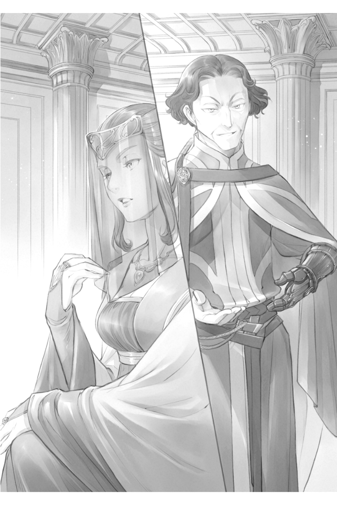

========
에필로그
========

디트린데로부터 계획의 성공을 알리는 올도난츠가 날아왔을 때, 게오르기네는 빈데발트에 있는 기베의 관에 있었다. 빈데발트는 에렌페스트 게를라흐와 경계를 접하는 땅이다. 선대 기베가 에렌페스트의 신전에서 영주의 양녀인 로제마인을 공격하다 붙잡힌 일로 쇠퇴 일로를 걷고 있다. 에렌페스트와 그의 영주 일족에 대해 원한이 깊어 이번 계획으로 게오르기네에게 매우 이용하기 좋은 곳이다.

"디트린데 님은 성공하셨습니까?"

시종 젤티에에게 확인받고 게오르기네는 고개를 끄덕였다.

"네, 아직 며칠은 걸릴 거라고 생각했는데, 레티치아님의 한계가 예상보다 빨랐던 거겠죠." 계획대로 일은 진행되었다고 한다. 수석 시종인 로스비타를 잡으면 레티치아가 필사적으로 찾아다니는 것을 게오르기네는 이해하고 있었다. 그럴 경우 측근 외에 그녀가 기댈 곳은 왕명으로 교육계가 된 페르디난드뿐이다. 교류가 없고, 파벌적으로 대립하고 있는 디트린데나 게오르기네에게 그녀가 의지할 일은 없다.

......페르디난드 님을 의지해 봤자 거절당하겠지만요.

그는 에렌페스트의 영주 일족으로 게오르기네에게 이복동생이라는 입장이다. 그러나 게오르기네가 결혼하여 영지를 떠난 후 그의 세례식이 거행되었기 때문에, 직접적인 교류를 가진 적은 거의 없고, 친족이라는 생각도 없다. 아렌스바흐에 온 뒤 인사를 하거나 회식이나 회식 자리에서 만나는 일은 있지만, 서로 정보 수집을 목적으로 하고 있기 때문에 교류를 한다고는 말할 수 없을 것이다. 

......그래도, 디트린데나 질베스타보다 훨씬 알기 쉽답니다.

게오르기네가 정보를 모은 한에서지만 페르디난드는 필요하다면 어디까지나 비정한 판단을 할 수 있는 영주 일족으로 여겨진다. 사고 회로가 비슷한 구석이 있는걸까. 아니면 베로니카에 의해 소중한 것을 계속 빼앗겼다는 의미에서, 자라온 환경이 비슷한 것일까. 레티치아가 상담을 제의해 봤자 페르디난드가 포기하라고 말할 것은 예상할 수 있었다. 게오르기네 자신도 마찬가지였을 것이다.

교육계에게 거절당해 의지할 곳이 없게 되자 레온지오가 툴크가 든 과자를 사용해 은색통을 사용하도록 유도한다. "아직 올도난츠는 날아오르니까, 이것을 사용해 부탁해 보는 것이 좋다" 라고. 수석 시종이 살아있다는 것을 알면, 그리 쉽게 포기할 수 있는 것이 아니다.

세례식 전부터 곁에 있는 수석 시종은 영주 후보생에게 제2의 어머니라고 할 수 있는 존재다. 드레반헬에서 입양하기 위해 이동해 온 레티치아에게는 더욱 그렇다. 세례식으로 본관에서 북쪽 별체에 방을 두고 살게 될 영주 후보생들에게 얼마나 중요한 존재인지 게오르기네는 알고 있다. 자신의 의지로 떠나보내는 것이 아니라 다른 사람에게서 불합리하게 빼앗기는 공포와 절망을 경험한 적이 있기 때문이다.

"예상보다 쉽게 일이 진행됐네요. 레티치아 님께는 조금 위기감이 부족한 것 아닌지요? 페르디난드 님의 교육이 부족한 것일까요?"

왼손의 의수를 건드리며 그라오잠이 눈썹을 올렸다.

"우리와의 교류를 경계해, 북쪽 별채에 갇혀 있는 탓이겠죠. 위기를 헤아려 스스로의 판단으로 틀어박히는 것이 아니라, 주위의 판단으로 북쪽 별채에 있는 것이라고 말하는 것뿐입니다. 답답하다고 생각하고 있겠지만, 위기감이 길러질 것이라고는 생각하지 않아요."

"의지할 부모가 없다는 점에서 게오르기네님과 처지가 비슷하다고 생각했습니다만, 그렇지 않습니까?"

레티치아를 과대평가했을지도 모른다고 그라오잠이 중얼거리는 것을 보고 게오르기네는 입술을 약간 일그러뜨렸다.

"부모가 존재하는데 해밖에 안되서 기댈 수 없는지, 존재하지 않기때문에 기댈 수 없는지는 처지가 다르겠죠."

게오르기네에게 있어서 부모님이 나를 곤경에 빠뜨린 존재였다. 죽었으면 좋겠다고 생각한 적은 몇 번이나 있다. 측근이나 자신에게 이름을 바쳐준 귀족들이 보다 믿을 수 있었다.

"게다가, 레티치아 님은 왕명으로 차기 영주가 되기로 정해져 있습니다. 입장에 흔들림이 없습니다. 위기감 따위는 자랄 리가 없습니다. 게다가, 저, 그 아이의 위기감이 자라지 않도록 처신했습니다"

게오르기네는 파벌이 달라도 공식적인 자리에서는 레티치아을 존중했고, 디트린데가 그녀를 적대시했을 때는 몇 가지 제안을 해 직접적으로 공격하는 것을 자제시켰다. 레티치아나 그 주위에게 게오르기네는 파벌이 달라서 교류가 적고 적대는 하지만 특별히 실질적인 해는 없다. 다가왔을 때만 경계하면 된다고 할 정도로 인식하도록 조절해왔다.

......적의를 보이는 것은 배제할 때뿐입니다.

그걸 생각하면, 마주쳤을 때는 계속 웃는 얼굴을 보이면서 경계를 게을리하지 않고, 일 년 넘게 긴장을 늦추지 않으며 게오르기네의 틈을 노리고 있는 페르디난드가 더 위험한 것이다. 서로 상대방이 언제 이빨을 드러낼지 모르는 일이라고 생각하고 있는 것이다.

"레티치아 님은 측근들과의 거리가 너무 가까워서, 만일의 경우에 측근을 잘라 버리는 귀족적 판단을 한다는 것이 어렵겠죠. 응석받이로 자란 영주 후보생에게 흔한 경향이죠."

육친의 정에 휘둘리고 있는 영주 질베스타를 떠올리며, 게오르기네는 베일 밑에서 살짝 눈을 가늘게 떴다.

"레티치아님은 이제부터 란체나베의 배로 옮겨질 것 같고, 페르디난드 님도 돌아가셨습니다. 하지만, 설마 공급의 제단에서 일이 벌어질 줄은 몰랐어요."

공급의 제단에 불필요한 물건을 반입하는 것은 원칙적으로 금지되어 있다. 등록된 영주 일족만 들어갈 수 있는 공급의 제단은, 예로부터 차기 영주 자리를 둘러싼 참극의 무대가 되기 십상이었기 때문이다. 게오르기네는 페르디난드의 방이나 레티치아 방에서 상담이 이루어져서, 그 때 즉사독이 든 은색 통이 사용될 것으로 생각했다.

.......그 자리에 동석하고 있던 그들의 측근들도 일소할 수 있다고 생각했습니다만.

하지만, 공급의 제단에서 이뤄졌기 때문에 즉사독 피해자는 페르디난드뿐이었다. 영주 집무실조차 들어갈 수 없는 유스톡스와 에크하르트는 영향을 완전히 피했을 것이다. 게다가 현장을 확인하고 자세한 내용을 보고할 수 있는 사람이 디트린데뿐이 되어버렸다. 아무래도 딸을 믿을 수 없기 때문에, 좀 더 다양한 자로부터 보고가 있으면 좋겠다고 게오르기네는 생각했지만 포기할 수밖에 없을 것 같다.

"경계심이 강해 가장 배제하기 어렵다고 생각했던 페르디난드 님을 배제할 수 있었습니다. 일단 잘 되었다고 할 수밖에 없죠."

페르디난드는 질베스타의 보좌를 맡고 있었고, 아렌스바흐로 이동한 지금도 에렌페스트와 교류가 있다. 질베스타에게 정보를 흘리거나 대처방법을 생각할 수 있으면 귀찮다. 귀족원에서 최우수으로 유지하고, 아렌스바흐의 집무를 아무리 떠넘겨도 시원시원한 얼굴로 처리해버릴 수 있는 남자다. 게오르기네로서는 자신이 움직이기 전에 배제하고 싶다고 생각하고 있었다.

"귀찮은 측근이 남아 있지만 우리 계획도 다음으로 넘어가죠. 유스톡스나 에크하르트로부터 정보가 도착하는 것과 내가 초석의 마술을 얻는 것 중 어느 쪽이 빠를까?"

"경계문은 장악하고 있습니다. 그들의 올도난츠도 편지도 에렌페스트에게는 도착하지 않습니다. 정보를 얻을 수 있는 수단은 없을겁니다. 나머지는 기수를 사용한 이동입니다만, 성에서 경계문까지 약 이틀. 거기서 에렌페스트의 성에 가는 것을 생각하면 하루 더 가야 한다. 경계문에서 수상한 사람으로 저지되면 바로 움직일 수 없고, 은색천이 없는 그들은 개인으로 경계선을 넘을 수 없습니다. 게오르기네 님이 움직이기 시작했다는 걸 질베스타 님이 알 기회는 없겠죠."

올도난츠는 경계선을 넘지 못한다. 경계문에 있는 아렌스바흐 쪽 기사에게 보내 그 기사가 에렌페스트 기사에게 전언하고, 에렌페스트 기사가 성에 전달하면 가능하지만 아렌스바흐 쪽 기사는 이쪽이 통제하고 있다. 마술구 편지도 한번 경계문에서 확인을 거친다. 중요한 내용은 그냥 쓸 수 없고, 기사한테 무시당하면 그걸로 끝이다. 귀족원으로의 전이진도 있지만, 아우브의 허가가 없으면 사용할 수 없다. 기수로 움직인다면 게오르기네가 더 빨리 도착할 것이다.

"페르디난드 님의 배제가 이루어진 지금, 영주 일족에서 조심해야 할 사람은 보니파티우스 님일까요?" 

"네. 성에서 떼어놓을 필요가 있습니다. 뭐랄까, 계획대로 움직이지 않는 분이니까."

어려운 얼굴이 된 그라오잠에게 게오르기네는 쓴웃음을 짓는다. 보니파티우스는 적의 함정을 자연스럽게 회피하고 계획을 망치는 존재다. 어떻게 깨달았느냐고 묻자 "특별한 근거는 없다. 직감이다" 라고 대답한다. 똑 부러지게 계획을 세우고 움직이는 게오르기네나 그라오잠과 어울리지 않는다. 게다가, 그는 전투력이 높아 정면으로 대치해도 당해내지 못할 가능성이 높은 것이다. 그래서 일크너로 꾀어내는 것으로 되어있다. 

"일크너에서 침공하면 기사가 적기 때문에 기베는 원군의 요청을 보낼 것입니다. 조금 시간을 끌면서 게를라흐도 침공을 시작하겠습니다. 아우브는 변경을 향해 기사단을 움직이지 않을 수 없습니다. 기사단장을 성에서 떼어놓을 수 없기 때문에 보니파티우스 님을 변방의 진압에 나서도록 할 것입니다."

먼저 남서쪽 일크너로 불러들인 뒤, 거기서 하루 이틀 만에 남동쪽 게를라흐에서 소동을 일으킨다. 기사들의 기수를 통한 이동 시간을 감안하면 시간은 충분히 벌 수 있을 것이다.

"옛 베르케슈토크 기베들의 유도는 쉬웠습니다. 마음껏 에렌페스트에서 돌아다닐 것입니다." 그들은 마력이 부족해, 수확을 얻지 못하는 땅을 다스리고 있는 것이다. 땅의 평민이나 귀족들을 진지하게 걱정하는 자일수록 유혹에 동참해 주었다. "이제 당신 영토의 백성들을 지킬 수 있겠죠" 라고 말함으로써 움직이지 않는 옛 베르케슈토크의 기베는 없다. 영지의 경계선 변경조차 할 수 없는 첸트 때문에, 그들은 수단을 가리지 못할 정도로 곤궁하다.

"게다가 저는 보니파티우스 님께 대항할 수단을 얻었으니까요."

그라오잠은 그렇게 말하며 천천히 자신의 의수를 쓰다듬었다. 보니파티우스 대책을 고안한 그에게 게오르기네는 미소를 보였다.

"당신의 충성심을 자랑스럽게 생각합니다. 반드시 에렌페스트의 초석을 얻읍시다."

"평민들의 정보에서 에렌페스트 기베들이 방위를 강화하고 있는 것은 명백합니다. 아마도 귀족가나 성의 방비도 굳혀져 있을 것입니다. 부디 무운을 빕니다."

게오르기네는 동행하는 양동대에도 지시를 내리고, 마력이 통하지 않는 은색 천을 걸치고 그 위에 망토를 달았다. 이로써 마력을 감지할 수 없게 된다. 필요한 마술구가 들어있는 나무상자나 가죽가방을 실은 마차에 나눠 탔다. 마차의 마부는 빈데발트의 평민이다.

은색천을 사용하여 영지의 경계선을 벗어나면 게를라흐로 나온다. 그곳에 마중나와 있던 마차로 갈아타고 다음에는 라이제강으로 향한다. 이쪽의 마부는 라우고라는 이름으로 그라오잠이 평민 속에 숨겨둔 신식이다. 평소 염료나 약의 재료가 되는 식물을 취급하는 상인으로 생활하고 있다. 그의 수배로 게오르기네 일행은 에렌페스트로 향하는 배를 탈 예정이다.

도중에 숙박하고 라이제강에 도착한 것은 다음날이었다. 가급적 눈에 띄지 않도록 양동대는 여러 배로 나눠 탄다. 각자 짐을 내려놓을 곳이 있거나 반대로 실을 물건이 있어 들르기 때문에, 도착까지 조금 시간이 걸리는 상인용 배다.

"마지막 배가 서문에 도착하는 것은 모레. 네점 종 무렵이 될 예정입니다. 두 분은 에렌페스트로 직행하는 배를 탈 예정이기 때문에 내일 출발하지만, 도착은 가장 빠를 것입니다. 세점 종에는 도착할 겁니다."

게오르기네와 그녀의 시종 젤티에는 라우고의 시종같은 얼굴을 하고 라이제강에서 숙박한 후, 예정된 배에 올랐다.

"두 사람은 이쪽 방이다. 에렌페스트에 도착할 무렵에는 알려주겠다. 그때까지는 부주의하게 방에서 나와서는 안 된다" 

라우고는 주위의 눈을 신경 쓰면서 주인과 같은 언행으로 두 사람을 개인실로 안내한다. 좁은 배이지만, 2인실에서 다른 사람의 눈이 없기 때문에 조금은 숨이 트인다. 게오르기네 일행이 귀족이라고 알려지는 일은 없을 것이다. 이에 만족한 게오르기네는 젤티에를 향해 고개를 한 번 끄덕였다.

"이쪽은 주인께서 주신 포상입니다."

젤티에는 작은 목소리로 그렇게 말하며, 신식인 라우고에게 검은 마석을 건네주었다. 상당한 마력이 부풀어 올랐을 것이다. 그는 검은 마석을 꽉 쥐고 크게 안도의 숨을 내쉬었다.

"기베가 바뀌었기 때문에 좀처럼 열을 뺄 기회가 없는 거죠? 배가 도착하면 차후를 위해 하나 더 드리죠. 약속보다 많아지겠지만, 당신의 앞으로의 행동을 기대한다는 것으로, 괜찮겠죠?"

그라오잠이 기베의 입장을 잃고 아렌스바흐로 이동하면서, 신식인 이들은 생명의 위기를 가까이에서 느끼며 살아왔다. 서서히 늘어나는 마력. 하지만, 지금까지와는 달리 방출할 방법이 없다. 그래서 보상이상의 검은 마석과 향후의 연결고리를 나타낸 것이다. 라우고는 다가오는 죽음의 공포에서 벗어난 안도와 감동을 가슴에 품고, 자비로운 웃음을 띤 귀족 여성을 숭상하듯 바라보며 무릎을 꿇는다.

그 시선을 당연하게 받아들인 게오르기네는, 가볍게 손을 흔들며 퇴실을 촉구했다.

"우리는 말하는 대로, 이쪽 방에 있겠어요. 선상에서는 주인다운 태도로 부탁합니다."

라우고가 퇴실하면, 도착할 때까지는 배에서 흔들리는 것 외에 할 수 있는 일이 아무것도 없다. 젤티에는 불편한 평민용 배 안에서도 주인에게 얼마나 아늑하게 할 수 있을지, 시종으로서 분투하고 있다. 바쁜 듯한 시종와 달리, 게오르기네는 시간을 주체할 수 없었다. 에렌페스트에서 배에 흔들리고 있어서인지, 과거의 추억이 떠올랐다가는 사라져가고 있다.

......정말 에렌페스트에게는 변변한 추억이 없어.

하지만, 게오르기네에게 자신이 살아있다고 느낄 수 있는 것은, 예나 지금이나 에렌페스트의 영주를 목표로 하고 있을 때뿐이다.

"게오르기네, 당신이 차기 영주가 될 거예요."

어머니 베로니카의 그런 말이 게오르기네에게 가장 오래된 기억이다. 보니파티우스의 아들 칼스테드가 영주 일족으로 자라나는 가운데, 게오르기네는 "칼스테드에게 지면 안 됩니다" 라며 귀신 같은 형상을 한 베로니카에게 키워졌다. 단 한 점의 하자도, 조금의 실패도 용납하지 않는 엄격한 어머니였다. 게오르기네는 울면서 문자를 외웠고, 목이 쉬도록 인사를 반복했으며, 여러 차례 맞으며 예의범절을 익혔다.

"게오르기네는 차기 영주가 되어서, 저를 도와줄 거죠?"

어머니에게서 슬픈듯 한 얼굴로 그런 말을 들으면, 귀족들이 괴롭힘당하는 불쌍한 어머니를 구하기 위해 자신이 더 노력해야겠다고 마음먹은 것이다.

"또 여자애......"

여동생 콘스탄체가 태어났을 때 베로니카는 노골적으로 실망했고 콘스탄체에게 그다지 신경을 쓰지 않았다. 게오르기네는 어머니에게 버림받을 것 같은 여동생을 걱정해서, 자신이 어머니로부터 받아온 교육을 해주려 했다. 그런데도 그녀가 걱정하면 할수록, 여동생과는 거리가 멀어진다.

당시는 왜 그런지 이해할 수 없었지만, 지금이라면 차기 영주 후보도 아닌 여동생을 대하는 태도가 너무 엄격했다고 알고있다. 그럼에도 두 사람을 떼어놓으며 주위 어른들이 "너무 엄격하다" 고 게오르기네를 말리지 않은 것은, 실제로 그녀가 엄격한 교육을 받고 있기 때문이었음이 틀림없다.

교육은 괴롭고 힘들었지만, 적어도 우수한 것을 보여주면 이 시절에는 어머니로부터 칭찬을 들었다. 철이 들 무렵에는 너무 힘들다고 리카르다가 감싸주게 됐고, 만날 수 있는 횟수는 적지만 숙부인 베제반스는 무조건적인 사랑을 주었다. 칼스테드 지지않고, 차기영주가 되면, 어머니는 웃어줄 것이라고 게오르기네는 천진난만하게 믿고 있었다.

....질베스타가 태어나기 전까지는요.

동생이 태어나자마자 어머니는 태도를 한순간에 바꿨다. "아들이 태어났다" 라고 기뻐하며 그 존재만 귀여워한다. 질베스타는 남자로 태어났을 뿐이다. 울고 있을 뿐 아무것도 하지 않았는데, 어머니의 사랑을 받는다. 게오르기네는 당황했다. 자신을 둘러싼 세상이 동생의 존재만으로 변해간다. 자신이 아무리 노력해도 소용없는 것 아니냐는 의혹이 생겼고, 어머니의 변화가 이상해서 기분 나쁘다고 생각했다.

......질베스타 같은 건 태어나지 않았으면 좋았을 텐데.

첫째 부인인 베로니카에게 남자 아이가 태어남에 따라, 칼스테드는 영주후보생의 처지에서 쫓겨났다. 게오르기네에게 그는 차기 영주를 둘러싼 호적수였다. 연상의 남성이라는 의미에서는 칼스테드가 유리하지만, 전 영주의 손자이지 현 영주의 아들은 아니다. 남자아이가 없는 현 영주에게는 차선의 존재였다. 칼스테드와 여성이지만 친자식인 게오르기네라면 어느 쪽이 차기 영주가 되어도 이상하지 않았던 것이다. 당시 세례식 전이었던 게오르기네는 칼스테드와 직접 만나 이야기를 나누는 일은 거의 없었다. 하지만, 그의 교육계를 맡고 있던 리카르다로부터 칼스테드의 이야기를 들었고 노력을 하면 이길 수 있는 가능이 있는 호적수로 목표를 세웠다.

그런데도, 질베스타가 태어났을 뿐으로 칼스테드는 신분이 바뀌었다. 자신과 같은 입장이었던 사람이 영주후보생에서 상급귀족이 되는 것을 목격한 것이다. 다음은 자신의 차례일지도 모른다고 게오르기네가 생각하는 것은 당연했다.

......질베스타만 없었다면 일이 이렇게 되지는 않았을 텐데.

강한 걱정을 안고 있었지만, 게오르기네가 우려한 대로 되지는 않았다. 베로니카는 자신의 친자가 차기 영주가 되기를 바라고 있다. 그래서, 칼스테드는 배제됐지만 게오르기네는 배제되지 않는다. 그것을 알고 그녀는 안도했다.

또, 칼스테드를 배제했지만 갓 태어난 질베스타는 아버지를 닮았는지 병약했다.그래서 에렌페스트의 장래를 염려한 자들의 건의에 따라 게오르기네는 세례식을 마치고 차기 영주교육을 받게 되었다.

......이번에는 질베스타와 차기 영주를 둘러싸고 절차탁마하는거군요.

동생에게도 지지 않겠다고 결심한 직후, 수석 시종인 리카르다를 빼앗겼다. 리카르다는 베로니카가 가장 믿는 시종이다. 그래서 차기 영주가 될 질베스타에게 붙이는 걸로 배치가 바뀌어버렸다. 그것은 게오르기네가 세례식을 위해 북쪽 별채에 자기 방을 준비하고 있을 때의 일이었다.

제2의 어머니라고 할 수 있는 수석 시종, 아니, 게오르기네에게는 어머니보다 훨씬 어머니다운 애정을 쏟아준 사람이다. 부모 곁을 떠나 북쪽 별채로 거처를 옮기려고 준비하고 있을 때, 자신이 가장 신뢰하는 측근을 빼앗기는 것은 용서할 수 없었다. 심한 배신이라고 어머니에게 호소했지만, 그녀는 돌려주지 않았다.

"질베스타는 병약해요. 당신은 튼튼하고 건강하지요. 믿을 수 없는 사람을 질베스타 곁에 둘 수는 없습니다."

아버지가 어머니의 주장을 인정하면서 리카르다는 정식으로 질베스타의 측근이 됐다. 모든 것이 동생을 최우선으로 움직인다

......질베스타 따위는 죽으면 좋을텐데.

아마 게오르기네가 처음 질베스타에게 살의를 느낀 건 이때였다. 불쾌한 일은 모두 질베스타의 존재가 있기 때문에 일어난다. 질베스타는 성별 외에 더 나은 곳이 없는데도 게오르기네의 것을 차례로 빼앗아간다. 친동생이 귀엽다고는 전혀 생각이 들지 않는다.

게오르기네는 세례식을 마치고 북쪽 별채로 옮겨갔다. 차기 영주교육이 시작되면서 바빠졌지만 한 달에 한 번 정도는 어머니와 차를 마시거나 교육 진척 보고를 하기 위해 본관으로 간다. 그곳에는 자라면서 튼튼해진 질베스타가 있었다. 장난을 쳐서 시종을 곤란하게 하고 리카르다에게 꾸중을 듣는다. 그런데도, 어머니의 눈에는 언제까지나 병약해 보이는지 응석을 받아주는 것을 멈추지 않는다. "그걸로 좋지 않습니까" 라고 말하는 어머니를 봤을 때는 눈을 의심했다. 같은 일을 게오르기네가 했다면, 심한 질책과 처벌이 있었을 것이다.

......질베스타따위 차기 영주 후보로 필요할까?

동생은 놀기만 하고 장난만 친다. 눈에 밟혀서 "차기 영주를 지향한다면 노력하세요" 라고 게오르기네가 꾸짖으면 "차기 영주가 되지 않을거니 노력 따윈 하지 않겠다" 고 울며 엄마에게 매달리고, 그 어머니에게 게오르기네가 혼난다. "질베스타의 의욕을 꺾지 말아주세요" 라거나 "질베스타는 어려서, 아직 그렇게 노력하지 않아도 좋아요" 라거나 "당신은 싫은 소리만 하지 말고 동생을 귀여워하세요. 애정이 부족해요." 라고.

게오르기네에게는 의미를 알 수 없었다. 그렇다면, 칼스테드가 영주 후보생이었을 시절, 게오르기네가 취침 인사차 식당에 가자 어머니가 집요하게 그녀의 결점을 들며 노력을 요구했던 것은 무엇이었단 말인가. 애초에, 게오르기네는 질베스타가 태어난 이후 지금까지 한 번도 애정을 느껴본 적이 없다. 애정이 충분하지 않은게 아니라 존재하지 않는데, 이 어머니는 무슨 말을 하고 있는건가.

어머니로부터 꾸중을 듣고 강제로 질베스타에게 사과를 받는다. 그러고는, 질베스타는 얄미운 얼굴로 혀를 내미는 것이다. 자신이 엄마의 애정을 독점하고 있어, 절대 혼나지 않을 줄 아니까 할 수 있는 얼굴이었다.

......이 아이, 사라지는 것이 에렌페스트를 위한 것은 아닐까?

이게 정말 자신과 같은 차기 영주 후보란 말인가. 얼굴을 마주할 때마다 살의가 쌓여간다. 하지만, 언제까지 이런 상태가 지속될 리 없다. 이런 어리석은 자에게 차기 영주를 맡기지 못한다고 부모님도 언젠가 깨달을 것이다.

......그 때를 위해 나는 노력해야겠다.

게오르기네는 주위의 인정을 받기 위해 차기 영주교육을 열심히 했다. 하지만, 귀족원 입학을 계기로 가장 자신을 예뻐해주는 신전장 베제반스와의 접촉을 금지당하고, 측근으로 삼으려던 자를 "질베스타의 측근으로 할 것이니까" 라는 이유로 들이는 것을 금지당했다. 게오르기네는 험악해졌다. 마음의 터전을 빼앗기고, 장래의 자신을 지탱해 줄 측근을 모으는 것조차 여의치 않다.

......정말로 질베스타 따위는 죽었으면 좋겠는데.

어머니와의 관계는 악화일로였지만, 아버지는 그녀의 노력을 인정해주셨다. 데릴사위를 전제로 하여 타령의 영주 후보생을 약혼자로 골라준 것이다. 여자가 영주가 되려면 그 사위는 영주 일족이 아니면 안된다. 영주 후보생과의 약혼으로 게오르기네는 차기 영주에게 한발 다가섰다. 그러니까, 자신의 정신적 터전을 하나하나 빼앗기고도 차기 영주를 향한 노력을 계속할 수 있었던 것이다.

그것이 막혀버린 것은 질베스타 세례식이었다. 차기 영주 세례식이라고 베로니카가 퍼뜨리고 다닌 것이다. 봄에 태어난 동생의 세례식은 봄의 축연으로 치러졌기 때문에 그곳에는 에렌페스트의 모든 귀족들이 있었다. 처음으로 공적인 피로연의 장에서, 질베스타가 차기 영주로 귀족들에게 인식된다. 게오르기네는 아우브인 아버지의 입으로 철회하라고 호소했다. 바로 철회하지 않으면, 기베들은 자신들의 땅으로 돌아간다. 다음에 모일 때에는 질베스타가 차기 영주라는 것이 공공연한 사실이 되어 버려 철회가 어려워진다.

하지만, 게오르기네의 소원은 아버지로부터 거부당했다. "영주 부부가 귀족들 앞에서 의견 대립을 보이는 것을 보여줄 수는 없다. 베로니카와 잘 논의한 뒤에 귀족들에게 대처하고 싶다" 라고.

......아버지도 체면이 있으시군요.

영주의 체면을 구길 수는 없다. 게오르기네는 일단 고개를 끄덕이고 물러섰다. 그것이 크나큰 실수였다. 그때, 절대 물러서서는 안 되었던 것이다. 귀족들은 질베스타가 차기 영주가 될 것이라고 인식해 버렸고, 다음 귀족원에서는 약혼자로부터 "차기 영주 후보에서 떨어졌다고 들었습니다. 그러면 약혼의 전제가 다릅니다" 라고 듣게 되었다.

게오르기네는 약혼자로부터 약혼 해소를 원하고 있음을 부모에게 호소했지만, 두 사람은 질베스타의 차기 영주 철회가 아닌, 데릴사위가 전제인 약혼해소를 선택했다.

"질베스타가 차기 영주가 되는 것이니까, 딱히 데릴사위를 조건인 약혼이 아니어도 되겠죠? 더 상위의 약혼자를 새로 찾아주겠어요."

"게오르기네는 우수하다. 질베스타가 차기 영주가 됐을 때 보좌를 부탁하고 싶다. 내게 형님 같은 존재가 질베스타에게 필요한 것이다. 그러니, 그대의 결혼 상대는 영주 일족이 아니라, 상급 귀족이라도 괜찮은 것이다."

세상이 뒤집히는 줄 알았다. 부모님이 웃는 얼굴로 무슨 말을 하는 건지 게오르기네는 진심으로 이해할 수 없었던 것이다. 자신이 받고 있는 차기 영주 교육이 질베스타 보좌를 하기 위한 교육이라는 점, 부모는 게오르기네를 차기 영주로 삼을 생각이 없다는 점, 태어날 때부터 지금까지의 노력 전부가 부정당한 점......

그것을 이해할 수 있을 때까지 얼마나 시간이 걸렸는지 모른다. 이해가 가는 동시에 너무나 분노와 절망에 휩싸여 게오르기네에서 모든 표정이 사라졌다.

......세례식을 마치고도 성실하게 노력하지 않는 어리석은 자를 어째서 차기 영주로 만들려고 생각하시는 겁니까? 의욕이 없는 자를 영주로 삼아 어떻게 하실 작정입니까? 왜 저는 안되는 겁니까? 저의 노력을 뭐라고 생각하고 계시는 겁니까? 엄격한 교육을 견뎌온 건 질베스타를 위해서가 아닙니다. 아버님께는 인정받고 있다고 생각했는데, 그건은 환상이었다는 겁니까?

부모에 대한 욕설이 끝없이 입에서 나올 것 같아, 게오르기네는 어금니를 깨물었다. 손바닥에 손톱이 파고들 정도로 꽉 움켜쥐고, 두 사람에게 슈타프를 향할 뻔한 것을 필사적으로 참았다.

"모든 게 헛수고였습니다"

"게오르기네 님의 노력을 헛수고라고 생각하지 않습니다. 차기 영주에 걸맞은 노력이었습니다. 그래도, 영주 부부가 질베스타 님을 차기 영주로 정했다면 따르도록 합시다. 다만 당신이 보좌하기에 적합한 아우브가 되어주셔야 우리도 납득할 수 있습니다."

측근들은 게오르기네를 격려하고 질베스타에게 차기 영주로서의 교육을 베풀 것을 제안했다. 확실히 지금 이대로는 게오르기네도 보좌할 마음이 생기지 않는다. 세례식을 마치고 북쪽 별채로 옮긴 뒤, 교육에서 도망치는 질베스타와 그를 뒤쫓는 측근들의 모습밖에 보지 못한 것이다. 리카르다의 고성이 울리지 않는 날은 없을 정도다. 게오르기네는 자신이 어머니로부터 받은 교육을 질베스타에게 하기로 했다.

하지만, 질베스타는 금방 도망가고, 교육을 시작하면 보기 흉하게 울부짖으며, 교육을 싫어하며 받지 않으려 한다.

"나는 별로 차기 영주 같은 건 아무래도 좋다! 누나가 되면 좋은거 아냐!"

......그렇다면 당신이 죽으세요.

게오르기네 안에서, 뚝하고 끊어지는 듯한 소리가 났다. 자신의 희망으로 될 수 있다면, 되었을 것이다. 그녀가 아무리 노력해도 손에 쥘 수 없었던 차기 영주의 자리를 태어날 때부터 손에 쥐었고, 그녀의 삶을 빼앗아 놓고 아무런 노력도 하지 않는 동생에게 진심으로 살의를 느꼈다.

"저것은 게오르기네 님이 보좌할 가치가 없습니다. 에렌페스트의 장래를 위해서라도 배제합시다. 차기 영주에 걸맞은 것은 게오르기네 님입니다."

"그라오잠, 그렇다고 해도 부모님이 결정하셨어요. 더 이상 제가 할 수 있는 일이 있어요?"

"귀족들에게 알려주도록 하죠. 저런 녀석의 어리석음과 게오르기네 님의 우수함을. 그러기 위해서는 흔들리지 않는 입장과 배신할 수 없는 아군이 필요합니다."

측근인 그라오잠은 그러면서 이름을 바치는 돌을 내밀었다. 그는 이름을 바치는 돌이 어떤 것인지 설명하고, 베로니카가 "이름을 바치는 것을 하지 못하는 자는 신용할 수 없다" 며 여러 귀족에게 이름을 바칠 것을 요구하고 있음을 가르쳐 주었다.

"진정으로 노력해도 보답받지 못한다면, 베로니카 님을 본보기로 삼으면 됩니다. 베로니카 님은 상급귀족에서 영주의 첫째 부인이 되었고, 배신할 수 없는 아군을 모아 입장을 굳히고, 방해자를 계속 배제하고 있습니다."

라이제강계 귀족들의 미움을 사고, 따돌림당하고 있다는 것을 어릴 때부터 줄곧 어머니에게 들었지만 냉정하게 귀족관계를 살펴보면, 이제 영주의 첫째 부인으로서 그들에게 보복할 수 있는 처지가 되고 있다.

"가브리엘 님이 시집올 때 데려온 측근들의 자녀와 손자는, 베로니카 님께 이름을 바치라고 요구받고 있습니다. 아마도 질베스타 님이 귀족원에서 슈타프를 얻으시면, 그에게 이름을 바칠 것을 요구받게 될겁니다. 그 전에 얻도록 하지요. 배신할 수 없는 아군을."

그건 멋진 제안이었다. 리카르다처럼 질베스타에게 빼앗기는 측근이 아닌 자신만의 측근을 원한다고 게오르기네는 강렬하게 생각했다.

"어머님을 본보기로...... 그렇다면 아버님도 어머님도 저를 꾸짖지 못할 겁니다."

......저에게도 약에 대한 지식이 더 필요하네요.

귀족원에서 게오르기네는 영주 후보생 코스 강의를 들으면서 문관 코스 강의도 듣게 됐다. 특히 약학에 관한 강의는 적극적으로 들었다.

지식을 쌓으면서 질베스타의 어리석은 일상과 에렌페스트의 장래를 걱정하는 말을 귀족들에게 불어넣어, 질베스타에 대한 회의적인 눈과 영주 부부에 대한 불신감을 심어간다.

동시에 가브리엘의 측근 계보에 오른 이들, 특히 동세대에게 이름을 바칠 것을 요구했다. 나이 관계상 베로니카에게 이름을 바치는 것을 주저했던 자가 있음을 그라오잠이 알아봐 주고 있다. 그들을 설득하여 이름을 받았다. 귀족들이 모이는 자리에서 교육이 부족한 모습을 질베스타가 보여준 것도, 게오르기네 설득에 힘을 실어줬다. "차기 영주는 제가 되겠습니다. 저런 애한테 맡길 수 없는 걸요."

물밑에서 서서히 동세대의 편을 늘려가던 중 게오르기네는 아버지의 부름을 받았다.

귀족들에게 이름을 바칠 것을 요구한 일로 질책을 받고, 질베스타에 대한 태도를 책망당하며, 보좌로 에렌페스트에 남길 수 없다고 말하며, 아우브・아렌스바흐와의 혼인을 명령받은 것이다.

"싫어요. 어째서 제가 타령의 셋째 부인이 되지 않으면 안되는 거죠?"

"조용히 하세요, 게오르기네. 대영지 아렌스바흐와 인연을 가질 수 있는 것입니다. 당신은 행복한 사람이에요. 대영지의 영주 일족에 이름을 올릴 수 있으니까요. 혈연자로서 이야기를 정리해 온 저에게 감사하세요."

......어디가 행복하다는 거죠!!!

차기 영주가 되기 위한 모든 노력을 부정당하고, 이제야 자기편 귀족들을 늘릴 수 있었는데 타령으로 가라고 강요받고, 아버님과 나이 차이가 없는 남자에게 그저 사랑받을 만한 존재가 되라고 해서 납득할 수 있을 리 없다. 대영지라 하더라도 셋째 부인따위 아무런 권력이 없고 정치에 개입할 수 없는 처지다.

......나는 차기 영주가 되기 위해 노력해 왔는데.

하지만, 아버지가 결정한, 이미 상대방과 얘기가 정리돼 버린 약혼을 취소할 수는 없다. 아이러니하게도 지금까지의 차기 영주교육이, 영지를 위해 이 약혼을 거부하는 것은 안된다고 게오르기네에게 강하게 요구하고 있다. 굴욕과 초조함으로 머리가 이상해질 것 같았다.

"아버님 어머님. 저는 프뢰벨타크의 플로렌치아님과 결혼하겠습니다!"

마력 감지가 발현된 질베스타는, 귀족원에서 돌아오자 두 살 연상의 영주 후보생을 처음 봤다고 말을 꺼냈다. 그러나 프뢰벨타크는 콘스탄체가 시집가는 영지다. 혼인으로 인한 영지간의 관계 강화를 생각하면, 이미 약혼한 자가 있으니 질베스타와 그 딸을 결혼시키는 의미가 없다.

"그녀는 셋째 부인의 딸입니다. 저는 차기 영주니까 거절당하지 않을 겁니다. 저는 그녀 말고는 결혼하지 않겠습니다!"

게오르기네의 첫 번째 약혼은 뒤집혔다. 해소하고 싶지 않다고 호소했지만 거부당했다. 두 번째 약혼은 아버지만큼 나이 든 남자의 셋째 부인이다. 싫다고 해도 거부는 허용되지 않는다. 그런데도, 어째서 질베스타는 자신이 좋아하는 상대를 맞을 수 있는걸까. 영지로서는 이익이 적은 혼인을 영주인 아버지가 허락할 것인가.

질베스타는 줄곧 차기 영주로서의 교육에서 도망치고, "차기 영주따위 되고 싶지 않다" 고 말했다. 그러면서 자신에게 편할 때만 "차기 영주니까" 라는 말을 꺼내 자신의 소망을 이루는 것이다. 게오르기네에게는 도저히 용서할 수 없었다.

......죽여야 겠어요. 어머님이 방해자를 처치할 때는 어떻게 하고 있었을까?

영지를 나가는 것이 결정된 것이다. 나중에는 이제 어떻게 되든 상관없다. 게오르기네는 자포자기한 기분이 되어 어머니가 방해자를 멀리할 때 사용하는 독을 사용하기로 했다. 저녁 식사 자리에서 이름을 바친 시종이 질베스타의 식사에 독을 넣는다.

"으윽......"

갑자기 질베스타가 식사를 뱉으며 의자에서 굴러 떨어졌다. 부모님이 놀라움에 눈이 휘둥그레졌다. 게오르기네도 함께 놀랐다. 이렇게 쉽게 될 줄 몰랐기 때문이다.

"질베스타!"

자신이 상용하는 독인데, 자기 아들에게 그걸 쓰면 혈색을 바꾸는 어머님의 모습이 게오르기네에겐 재미가 없었다. 무엇보다 소중한 아들을 잃을까봐 공황에 빠진 어머님의 모습에 가슴 속이 공허해졌다.

"아, 아윽......"

목을 누르며 고통으로 몸부림치는 질베스타를 내려다보는 것은 최고의 기분이었다. 너무 기분이 좋다. 더, 더 고통받고, 그대로 죽으면 된다.

하지만, 질베스타는 죽지 않았다. 당황하여 매달리는 것밖에 할 수 없는 어머님과 달리, 냉정한 그녀의 시종이 해독제를 바로 처방했기 때문이다.

질베스타를 죽이지 못한 것을 안타까워하면서 게오르기네는 아렌스바흐로 시집갔다. 그리고는 살아있는지 죽었는지 모를 결혼생활을 보내고 있었다. 아렌스바흐에서 권력을 잡는 것도 생각해 봤지만 전혀 의욕이 나지 않아 재미가 없다. 지루하고 무의미한 시간이 지나간다.

...... 첫째 부인이 되어, 영주 회의에서 질베스타 위에 서면 조금은 즐길 수 있으려나?

문득 떠오른 게오르기네는 아렌스바흐의 첫째 부인이 되기 위한 암약을 시작했다. 계획은 순조롭게 진행돼, 질베스타를 무릎 꿇리는 데 성공했다. 그런데도, 별로 거북함이 내려가지 않는다. 역시 에렌페스트를 이 손에 넣지 않으면 만족할 수 없을 것 같다.

게오르기네에게 전환점이 찾아온 것은, 숙부의 유품으로 전 신전장 베제반스의 편지를 받았을 때였다.

"게오르기네 님, 슬슬 도착한다고 합니다. 무슨 일이 있으십니까?"

"...... 아니요. 숙부님에게는 감사해야겠다고 생각했을 뿐입니다."

상인 뒤로 하고 게오르기네 일행은 배에서 내린다. 도중에 짐을 옮기는 평민들의 대화가 귀에 들어왔다. 아무래도 보니파티우스가 일크너로 향했다는 것이 기사의 입에서 나온 듯하다. 서문의 병사가 경계심을 강화해, 하선하고 거리에 들어가는 자를 엄격하게 확인하고 있다고 한다.

그라오잠의 계획은 순조로워 보이네요.

보니파티우스가 아직 돌아오지 않았으니 삼엄한 경계가 풀리지 않았을 게 분명하다. 서문에 접근하는 것은 그만두는 것이 좋을 것 같다. 게오르기네는 그렇게 판단했다.

"여기까지 수고했어."

"어디에 가시는 겁니까?"

라우고는 서문과 두 사람을 비교하며 당황한 듯한 목소리를 냈다. 게오르기네는 젤티에에게 눈짓하여 그에게 검은 마석을 선사한다.

"우리는 문을 통과할 수 없습니다. 그 의미를 알겠죠?"

검은 마석이 입막음 비용을 겸하고 있다는 사실을 깨달았을 것이다. 귀족과 관련된 신식 상인은 말없이 고개를 끄덕였다. 게오르기네와 젤티에는 상인의 시종 같은 얼굴로, 차례로 배에서 짐을 내려놓는 허드렛일을 하는 자들과 어울려 그리 크지 않은 자신들의 짐을 나르는 시늉을 하며 서문을 빠져나간다.

"이것일까요?"

평민촌의 엔트비켈른을 할 때 생긴 수로가 눈앞에 있다. 이것을 사용하면 문을 통과하지 않고 평민촌이나 신전에 잠입할 수 있는 것이다. 젤티에가 종이를 펼쳤다. 게오르기네에게 이름을 바친 문관이 베껴 보내준 수로 도면이다.

"설마 제가 이런 수단을 쓰리라고는 생각하지 않겠지요."

이 앞에 게오르기네가 계속 원하던 것이 있다. 마침내 손이 닿는 곳에 도착했다.

......드디어 에렌페스트의 초석을 빼앗고, 저의 에렌페스트를 손에 넣을 때가 되었군요.

"정말로 오랫동안, 기다렸던 일"

고양된 기분을 억제하지 못하고, 게오르기네는 천천히 붉은 입술 끝을 올렸다.

카랑, 카랑......

세점 종이 울린다. 그녀에게 마지막 싸움의 시작이었다.