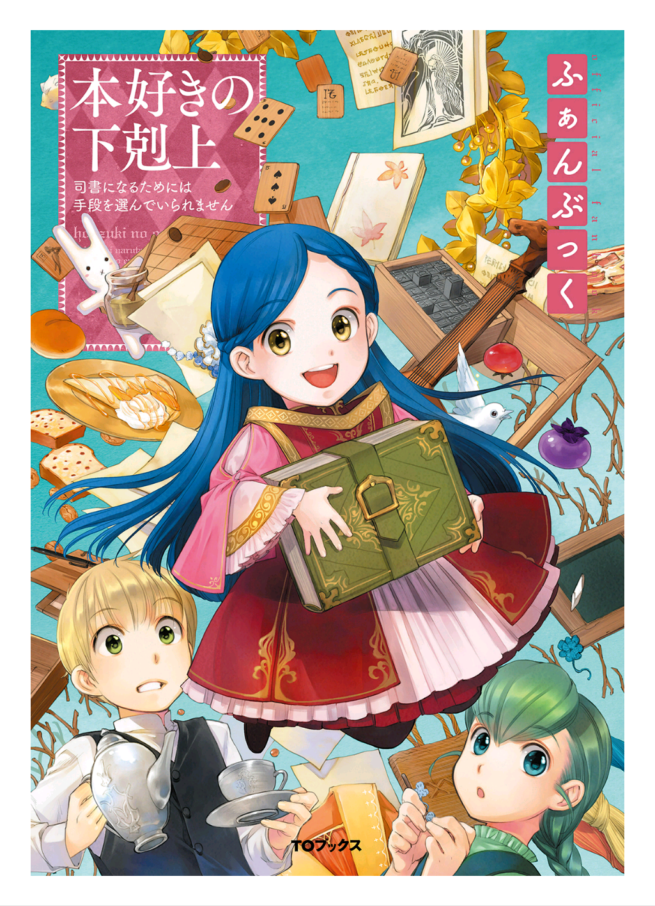

=======================
니콜라 시점 - 신전 안내
=======================

    
"니콜라, 표정이 웃겨요."

"그야 처음 밟는 귀족 구역인걸요."

모니카에게 지적을 받은 나는 땋은 머리째로 볼을 감싸면서 모니카를 살짝 째려보았습니다. 평소에는 침착하고 언니 노릇을 하려는 모니카도 짙은 갈색 눈동자가 불안하게 흔들립니다. 그 모습을 본 제 마음은 오히려 점차 안정을 찾아 갔습니다.

긴장하지 않을 수가 있나요. 귀족 구역의 청소는 성인들의 일이고 지금까지 저희가 하는 신전 청소라 하면 고아원이나 예배실이 전부였으니까요. 그런 저와 모니카를 로제마인 님께서 견습시종으로 받아주셨습니다. 앞으로 신전장이 될 로제마인 님은 고아원장실에서 신전장실로 방을 옮겨 귀족 구역에서 생활하시게 되었습니다. 그래서 오늘 프랑이 귀족 구역을 안내해 주기로 한 겁니다.

'고아원장실도 아직 적응이 덜 됐는데 신전장실 소속 견습 시종이 되다니.'

겨울 동안 저와 모니카는 요리 조수로서 고아원장실을 출입했던 터라 이곳은 그나마 잘 압니다. 주방에밖에 들어간 적이 없으니 다 안다고 할 순 없지만요.

"고아원장실과 귀족 구역의 방은 분위기가 꽤 달라요. 저곳은 청색 신관들이 생활하는 장소이기도 하니 여기만큼 마음 편하지는 않을 거예요."

프랑가 지시한 서류 작업을 하던 로지나가 손을 멈추고 불쑥중얼거렸습니다.

"로지나, 더 긴장되니까 그런 말 하지 말아 주세요."

이 고아원장실은 고아들에게도 허물없이 대해 주시는 로제마인 님만 계셔서 분위기도 화목하고 약간의 실수도 용서받을 수 있습니다. 하지만 이제 귀족 구역에 들어가면 그렇게 지내지 못할 거라는 로지나의 말에 다시 긴장하며 몸이 떨리기 시작했습니다.

"괜찮아요, 니콜라. 프랑도 로제마인 님도 무척 상냥하시잖아요."

"그렇네요. 모니카."

둘이서 손을 잡고 긴장을 풀려는데, 로지나가 우아한 동작으로 고개를 갸웃거렸습니다.

"어머, 프랑은 엄격하답니다. 절대 상냥하지 않아요."

"대체 무슨 얘기입니까."

프랑의 고요한 목소리와 위에서 내려다보는 갈색 눈동자에 저는 깜짝 놀랐습니다. 로지나는 아무것도 아니라는 얼굴로 생긋 웃으며 프랑에게 목패를 건넸습니다.

"별 얘기 아니에요. 이제 귀족 구역에 갈 시간인가요? 이쪽 서류도 끝냈어요."

"고맙습니다. 로지나 그림 로제마인 님의 간호를 부탁드립다다. 그리고 일어나시면 이 약을 드시게 하라는 신관장 님의 말씀이 있었습니다."

조금 전의 대화를 들었을 텐데도 프랑은 딱히 추궁하지 않고, 로지나에게 목패를 건네받았습니다.

'역시 프랑은 어른답게 대응하는 상냥한 사람이에요!!'

"모니카, 니콜라 갑시다."

고열로 몸져누운 로제마인 님의 간호를 로지나에게 맡기고 프랑은 저와 모니카를 데리고 고아원장실을 나섰습니다. 고아원장실을 나와 복도를 걸으면 고아원의 2층에 다다릅니다.

"청색 신관과 청색 무녀는 신전의 2층과 3층을 씁니다. 고아원장실과 달리 귀족 구역 시종들의 방은 전부 1층, 허드레꾼의 방과 주방은 지층에 있습니다."

"그럼 주방이 멀어지겠네요."

주방에서 엘라를 돕는 일이 많은 저는 그만 투덜대는 듯이 말해 버렸습니다. 프랑이 씁쓸해하며 "우물은 더 멀어집니다. 우물에서 가장 먼 방이 신전장실이니까요……" 하고 복도에서 보이는 우물을 가리켰습니다. 고아원장실에서 우물까지의 거리는 무척 가까워서 계단만 오르락내리락하면 금방이었는데, 앞으로 매일 물을 나르기 힘들어질 것 같습니다.

"물을 나를 땐 귀족 구역의 서쪽 입구로 들어와 지층을 통해 신전장실로 들어가야 합니다. 2층 복도로 물을 날라서는 절대 안 됩니다."

귀족 구역의 서쪽에는 허드레꾼이나 식료품 등을 납품하는 평민들이 드나드는 출입구가 있습니다. 그래서 물을 나르거나 빨래할 때에는 청색 신관의 눈에 띄지 않는 서쪽을 써야 하는 모양입니다. 모니카도 조금 신물이 나는 표정으로 우물을 바라봤습니다.

"지금보다 더 겨울이 싫어질 것 같아요"

눈발이 날리는 날씨에 물을 나를 생각에 저 역시 진심으로 모니카의 의견에 찬성하고 싶었습니다.

"……분명 엘라도 똑같이 싫은 표정을 짓겠지요."

저와 모니카가 재잘거리는 동안, 프랑은 귀족 구역으로 들어가는 문을 향해 걷기 시작했고 저희는 서둘러 그 뒤를 쫓아갔습니다. 예배실의 제단 옆과 뒤쪽에는 각 계절의 융단 등 예배에 쓰는 물건들을 수납한 창고나 문제아였던 길이 자주 갇혔던 반성실이 있습니다. 길의 말로는 반성실은 좁은 방이며 신들에게 가장 가까운 이곳에서 기도하며 용서를 구해야 한다고 합니다.

'아, 전 반성실에 들어간 적이 한 번도 없습니다. 성실하게 근무했기 때문이죠.'

반성실 앞을 지나가자 귀족 구역으로 들어가는 문이 보이기 시작했습니다. 지금은 기후가 좋은 초봄이라 항상 열어 두지만, 겨울은 항상 굳게 닫혀 있습니다. 귀족 구역의 복도는 벽에 걸린 태피스트리와 그림, 장식물들이 놓여 있어 고아원이나 고아원장실과는 분위기가 사뭇 달랐습니다.

"가요, 니콜라."

-삽화-

얼굴이 딱딱하게 굳은 니콜라와 손을 잡고 지금까지 보기만 했던 귀족 구역으로 오들오들 떨면서 한 발짝 내디뎠습니다. 들어간 바로 앞에 방문이 보이고, 복도가 좌우로 나뉘었습니다. 

"귀족 구역의 서쪽은 신전에 사는 청색 신관들의 방이고, 정면 현관에 가까운 동쪽은 친가에서 왕래하는 청색 신관들의 방입니다. 귀족가에 가까운 북쪽일수록 방이 넓고, 친가의 계급이 높은 분들이 쓰시게 됩니다. 그래서 상급귀족의 자녀이며 앞으로 영주님의 양녀가 되시는 로제마인 님은 가장 북서쪽에 있는 신전장실로 방을 옮기시게 된 겁니다."

현재 친가에서 다니는 청색 신관은 세 사람이라고 합니다. 설명을 마친 프랑은 오른쪽으로 돌아 통근하는 신관들이 쓰는 방 앞을 성큼성큼 걷기 시작했습니다. 저와 모니카는 총총걸음으로 프랑의 뒤를 쫓습니다. 로제마인 님과 걸을 때보다 프랑의 걸음이 훨씬 빠릅니다. 

"이쪽 방들은 그렇게 넓지가 않네요?"

모니카가 빌마를 흉내 내어 하나로 질끈 묶은 짙은 녹색를 꽁지처럼 흔들면서 의아하다는 듯이 문의 간격을 봅니다. 확실히 방비 고아원장실보다 훨씬 좁아 보였습니다. 

"통근하는 신관들의 방에는 침대가 필요없고, 시종이 사용하는 계단도 방안에 없기 때문입니다." 

"그럼 통근하는 주인을 모시는 시종들은 어떻게 이동하나요?"

"이곳에 시종 전용 계단이 있습니다. 지층에서 3층까지 이동할 수 있어서 통근하는 주인을 모시는 시종들은 모두 이 계단으로 이동합니다."

주인이 도착할 시간이나 신전에서 떠나는 시간은 모든 시종이 바빠지기 때문에 상당히 혼잡해진다고 합니다. 

"저희는 주인님의 방에 계단이 있어서 편하겠네요."

"빨래, 목욕 준비, 손님의 대응 등 신전에 사는 주인을 모시는 쪽이 업무량이 많으니 꼭 편하다고는………"

'주인이 통근이냐 기숙이냐에 따라 그런 차이도 있었군요.'

처음 알게 된 사실에 고개를 끄덕이면서 막다른 곳에서 왼쪽으로 꺾으니 창문으로 밝은 빛이 새어 들어왔습니다. 하얀 신전벽에 빛이 약간 들어오니 더욱 밝아 보입니다.

"이곳이 귀족 구역의 정문 현관입니다. 청색 신관이 외출하거나, 돌아올 때 이 문을 사용합니다. 의자와 테이블이 설치된 이쪽 홀은 대기실로 쓰기도 합니다."

이 대기실은 성결식이나 수화제 등 많은 청색 신관이 일제히 마차를 탈 순서를 기다릴 때나 어용상인이 돌아갈 마차 준비를 기다릴 때 쓰는 일이 많다고 합니다.

"빌마한테는 대기실이 방이라고 들었는데요……………"

빌마를 정말 좋아하는 모니카가 훤히 뚫린 천장에서 밝은 빛이 들어오는 현관홀을 둘러보면서 중얼거립니다.

"아아, 청색 무녀들은 남성의 시선을 피하고자 이쪽 대기실을 쓰기 때문에 자연히 이쪽 현관홀이 남성용, 저쪽이 여성용으로 나뉘었습니다. 로제마인 님께서 대기실을 쓰실 땐 저쪽 방으로 안내하십시오."

"알겠습니다."

진지한 얼굴로 끄덕이는 모니카의 옆에서 제 시선을 끈 것은 넓고 커다란 계단입니다. 주변을 빙글 돌면서 위층으로 이어지는 계단을 올려다봅니다.

"프랑, 이쪽이 청색 무녀의 방으로 가는 계단인가요? 1층으로는 이어져 있지 않네요?"

"이 계단은 청색 무녀가 정면 현관으로 나갈 때만 쓰는 계단이라 1층으로 이어져 있지 않습니다. 지금은 로제마인 님 외의 청색 무녀가 없어서 3층은 봉쇄한 상태입니다."

로제마인 님이 신전장과 고아원장이 아니라면 이 계단을 썼을 거랍니다. 하지만 로제마인 님이 고아원장이 아니시면 모든 고아원 사람들이 곤란해집니다.

'로제마인 님이 이 계단을 쓰는 날이 오지 않게 해 주세요. 신에게 기도를!'

"니콜라, 기도 중에 미안하지만, 따라오세요. 회의실 장소를 익혀 둬야 합니다."

프랑의 말에 전 기도를 멈췄습니다. 프랑이 안내하는 대로 왔던 길을 조금 돌아 모퉁이를 꺾습니다.

"이곳이 회의실입니다. 기원식이나 수확제의 분담 등을 정하는 청색 신관의 회의는 이곳에서 이뤄집니다. 회의에는 기본적으로 제가 동행하지만, 두 사람도 로제마인 님과 동행할 일이 있을지도 모릅니다. 외워두세요."

회의실을 지난 길모퉁이에서 프랑이 걸음을 멈추었습니다. 그 앞에는 천장이 뻥 뚫린 통층 구조인지 같은 간격으로 이어진 창문으로 밝은 햇살이 들어옵니다.

"귀족 구역은 천장까지 뚫린 곳이 많네요."

"네. 채광 때문에 필요하니까요. 청색 신관의 방은 어디에나 창문이 있고, 밝게 지낼 수 있는 구조로 되어 있습니다. 이 주변은 현재 사용 중인 방이 많으니 조용히 하시길. ・・・・・・이제 로제마인 님의 시종으로서 귀족 구역 중 가장 중요한 장소를 가르쳐드리겠습니다."

오른쪽으로 꺾어 조금 걸은 곳에 있는 문을 프랑이 "여깁니다." 라고 말하면서 열어 주었습니다. 책상과 의자, 자료 선반이 있고, 겨울 동안 로제마인 님이 방에 가지고 오신 것과 비슷한 책들이 몇 권이나 진열된 장소가 눈에 들어왔습니다.

"도서실입니다. 신전의 집무에 쓰는 자료도 이곳 선반에 보관합니다. 둘은 자주 이곳을 출입하게 될 겁니다. 로제마인 님께서는 이곳에 눌어붙고 싶어 하시기 때문이죠. 도서실에서 책을 읽기 시작하면 여섯 점 종이 울릴 때까지 한 발짝도 움직이지 않으실 겁니다. 그러니 책을 빌려서 방에서 읽으시도록 유도하는 것이 시종의 중요한 업무입니다. 기억해 두세요."

지금까지는 신관장님께 허락을 받고 프랑이 도서실에서 책을 빌려온 모양이지만, 이제는 신전장이 되시는 로제마인 님이 도서실 열쇠를 관리하시게 됩니다. 자유롭게 도서실을 출입하게 될 로제마인 님을 얼마나 잘 구슬려서 제지할 수 있을지가 시종의 중요한 일이 될 거라고 프랑은 예상한다고 합니다.

"・・・・・・저기, 도서관을 둘러싼 공방이 중요한 일이 된다니요? 제가 생각했던 시종의 업무 중에 그런 일은 없었는데요………"

"저도 신관장님을 모실 땐 그런 업무는 없었습니다. 로제마인님의 시종만 하게 되는 특수한 업무라고 생각하십시오."

프랑에게 냉정한 대답을 들었습니다. 특수한 업무에 제가 어이없어하자, 모니카가 키득거립니다.

"주인에 따라 업무 내용이 다르니 모셔 보지 않으면 모릅니다. 라던 빌마의 말이 떠올라서요. 빌마와 로지나가 크리스티네님이라는 청색 무녀를 모실 때는 작곡과 시를 쓰거나, 그림이 일이었대요."

"전 예술적 조예가 깊지 않고, 요리 조수가 즐거우니까 로제마인 님을 모시게 되어서 다행이네요."

제가 단박에 의견을 바꾸자, 모니카는 풋 하고 웃음을 터트렸고, 프랑은 피식 웃었습니다.

"크리스티네 님도 특수한 청색 무녀셨지만, 로제마인 님도 조금 독특한 주인입니다. 고아에게 자비를 베푸시고, 평민촌 공방들과 손을 잡고 적극적으로 돈을 모으는 청색 신관과 무녀를 전 로제마인 님 외에는 본 적이 없습니다. 고아원장과 신전장을 겸임하는 분도, 회색 무녀에게 요리를 맡기려는 분도, 사흘을 앓아눕고도 극도로 추운 도서실에 내내 틀어박혀 있고 싶다고 말하는 분도 전 처음입니다."

진지한 얼굴로 그렇게 말한 프랑이 어디로 튈지 모를 로제마인 님의 행동에 대응하느라 의외로 고생한다는 사실을 깨달았습니다. 표정 변화 없이 로제마인 님의 행동에 대응하려고 이래저래 고민하는 프랑의 모습이 떠올라 저는 그만 웃어 버리고 말았습니다.

"프랑은 참 힘들겠어요."

"힘들지만, 모시는 보람이 있습니다. ・・・・・・겨울 동안 조수를 해 준 두 사람 중의 한 사람만 거둘 수 없다고 말씀하시는 분도 처음이었답니다, 니콜라."

프랑의 말에 저와 모니카는 무심코 서로의 얼굴을 마주 보았습니다. 저희는 둘 다 귀족의 시종이 되어 행운이라며 기뻐했는데, 사실은 로제마인 님이 배려해 주신 행운이었던 모양입니다.

한 명밖에 거둘 수 없다면 당연히 저보다 우수한 모니카가 선택되었을 테지요. 그렇게 되면 어쩔 수 없으면서도 모니카가 너무 부러웠을 겁니다.

'전 정말 행운아예요.'

고아원을 구해 주시고, 시종을 고를 때도 배려해 주시고, 맛있는 요리를 회색 견습무녀에게 가르쳐 주시는 분이 제 주인님이라니요. 주인님이 조금 독특한 분이셨기 때문에 제가 시종이 되었다고 생각하니 감사하는 마음뿐입니다.

"두 사람 다 로제마인 님의 배려에 감사하는 마음으로 모시도록 하세요."

"네."

끝까지 로제마인 님을 모시자는 결의를 다진 그때, 도서실에서 서쪽으로 뻗은 복도에 문이 활짝 열린 방이 보였습니다.

"프랑, 저 방・・・・・・계속 문이 열려 있는 것 같은데, 뭔가 있나요?"

"방을 옮기는 청색 신관이 계십니다. 빤히 쳐다보는 것이 아닙니다. 니콜라."

"네. 죄송합니다."

프랑에게 주의를 듣고, 도서실을 지나 막다른 곳까지 걸어갔습니다. 프랑은 오른쪽으로 꺾어 조금 걸어가야 나오는 곳에 있는 문을 가리켰습니다.

"이곳이 신관장실입니다. 로제마인 님은 세 점종에서 네 점종까지 신관장님의 집무를 도우러 오시니, 이곳을 가장 자주 들리게 될 겁니다. 두 사람도 함께 집무를 돕도록 하겠습니다."

"저도 집무를 도와야 하나요……………?"

"물론이지요. 로제마인 님이 하셔야 하는 신전장 업무를 신관장님께서 맡아 주시고 계십니다. 원래라면 우리가 해야 할 일이지요."

신관장님은 프랑이 전에 모시던 분입니다. 상당히 엄격해서 시종이 몇 명이나 그만뒀다는 소문을 들었습니다.

'난 서류 작업을 잘 못 하는데 도움이 될까………?'

제가 모니카보다 서류 작업이 서툴러서 기가 죽어 있는 동안에도 프랑의 설명은 계속되었습니다.

"원래 신관장직을 맡는 분은 신전장실의 맞은편이나 출입구를 낀 옆방으로 이동해야 하지만, 당시에 신관장님은 인수인계로 바빴던 관계로 예전 방을 그대로 사용하고 계십니다."

마침 신전을 나가는 사람이 많았던 시기에 신관장이 된 탓에 업무를 잔뜩 껴안게 되셨다고 프랑에게 들은 적이 있습니다.

"신전장님이 로제마인 님으로 바뀌었는데도 방을 옮기지 않으시나요?"

모니카의 말에 프랑이 씁쓸하게 웃었습니다.

"로제마인 님이 하셔야 할 신전장 업무까지 전부 거들게 되셨으니, 신관장님은 전보다 더 바빠지셔서 방을 옮길 여유가 없으실 겁니다. 그리고 로제마인 님은 비록 어리시지만, 여성입니다. 그래서 신관장님께서는 지금까지 신전장실 주변 방을 쓰던 청색 신관들에게 이동을 명령하셨습니다. 그러니 그분께서 옮길 일은 없을 겁니다."

조금 전 방을 옮기던 청색 신관이 있던 건 신관장님의 명령때문이었던 모양입니다.

"이제 신전장실 주변에는 로제마인 님의 호위 기사가 쓸 여성용과 남성용 방을 준비할 겁니다. 이 귀족문으로 통하는 출입구부터 서쪽은 오직 로제마인 님의 관계자만 쓰게 됩니다."

프랑은 귀족문에 가장 가까운 출입구를 지나 어떤 문 앞에서 걸음을 멈췄습니다.

"이 앞에는 봉납식에 사용되는 의식실이 있습니다."

"봉납식이요?"

들어본 적 없는 의식입니다. 예배는 전부 예배실에서 하는 줄로만 알았습니다. 신들이 계시는 예배실 외에서 예배를 한다는 말에 전 의아했습니다.

"청색 신관들이 겨울에 귀족 구역에서 신구에 마력을 봉납하는 중요한 의식입니다. 겨울이 다가오면 또 자세히 알려주겠습니다. 오늘은 신전장실 내부와 이 목패를 잘 봐 놓으세요."

프랑은 아까부터 들고 있던 목패를 저와 모니카에게 건넸습니다. 목패에는 로지나의 글씨로 가구나 작은 물건들의 배치와 치수가 그려져 있습니다. 그것을 보는 동안 프랑은 잠긴 문을 열었습니다.

"이곳이 신전장실입니다."

가구들을 전부 들어낸 신전장실은 횅했습니다. 그렇지 않아도 넓은 방이 더 넓어 보입니다.

"앞으로 거기에 적힌 로지나의 지시대로 신전장실을 꾸미려고 로제마인 님의 가족이 부른 상인과 장인들이 찾아올 겁니다. 이 목패대로 그들에게 지시를 내리는 것이 두 사람의 역할입니다."

"엣? 네?"

제가 목패와 프랑과 모니카를 번갈아 보았습니다. 모니카도 상당히 동요하는 얼굴로 프랑을 올려다봅니다.

"프랑, 전 누군가에게 지시를 내려 본 적이 없어요."

이제 막 견습시종으로 올라간 저희는 지시받은 대로 움직이거나, 회색 무녀들에게 배우는 입장입니다. 누군가에게 지시를 내리는 처지가 아닙니다. 생각지 못한 프랑의 지시에 저와 모니카가 고개를 세차게 젓자, 프랑은 싱긋 웃었습니다.

"괜찮습니다. 길도 모두에게 지시를 내리는 공방 관리자가 될 정도인데 두 사람이 못 할 리가 없지요. 금방 익숙해질 겁니다."

"무리에요!"

"다들 무리라고 생각했던 고아원 개선을 로제마인 님께서는 해내셨습니다. 그런 로제마인 님의 시종이라면 가령 가능성이 희박한 일이라도 가능하게 만들려는 노력을 해야 합니다."

반론이 받아들여질 턱이 없는 프랑의 미소에 저와 모니카는 무심코 목구멍까지 올라온 경악의 외침을 필사적으로 참으며 목패를 꽉 쥐었습니다.

"어디에 뭘 놓아야 할지 설명하겠습니다. 한 번 만에 외우세요."

"한 번 만에요!?"

갑자기 떨어진 엄격한 지도에 울상이 된 제 머릿속에 출발 전 로지나가 했던 말이 빙글빙글 돌기 시작했습니다.

"어머, 프랑은 엄격하답니다. 절대 상냥하지 않아요."
