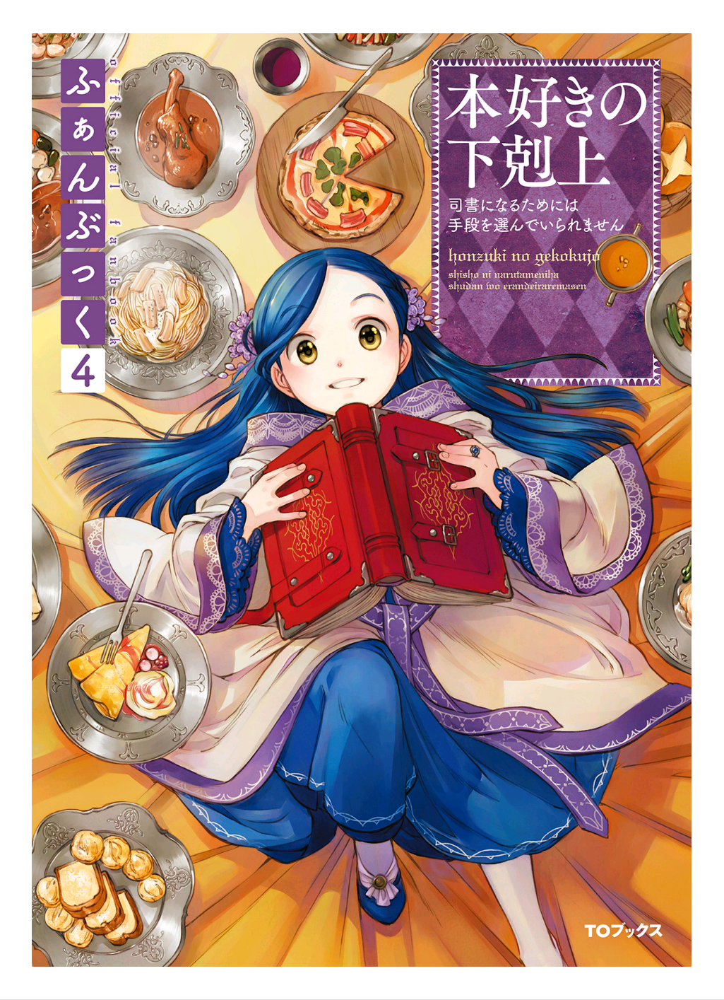

========================================
유디트 시점 - 마력감지와 결혼상대의 조건
========================================

"...어머나?"

기숙사 내에서 기사 코스 학생들이 모두 모여 공부 모임을 하고 있을 때의 일이었습니다. 갑자기 주위가 시끄러워진 것 같은 묘한 시선을 느끼는 것 같아 나도 모르게 고개를 들었습니다. 갑자기 움직이는 바람에, 함께 공부하고 있던 나타리에님이 신기한 듯이 저를 보고 고개를 갸우뚱합니다. 

"유디트님, 무슨 일이신가요?" 

주변을 둘러보면 자신의 눈에 비치는 풍경은 전혀 변하지 않았는데, 피부로 느끼는 세계가 왠지 존재감 있는 분과 존재감이 얇은 쪽으로 나뉘어져 있어 지금까지와 다릅니다. 온몸에 소름이 돋는 듯한 위화감에 저는 펜을 놓았습니다.

......혹시 마력감지?! 

지금까지는 전혀 신경 쓰지 않았던 다른 사람의 존재를 갑자기 느낀 것에 놀라, 나는 말없이 일어섰습니다. 탁하고 울린 소리에 모두의 시선이 이쪽으로 집중됩니다. 거기에 있는 마력의 흔들림과 그것을 내가 느낄 수 있는 것에 동요해 나는 재빨리 문을 열었습니다. 놀란 목소리를 내고 있는 주위 분들께는 미안하지만 그렇게 태연한 얼굴로 그 자리에 머물 수는 없습니다. 아마 지금 내 얼굴은 부끄러움으로 새빨갛게 달아오른 것 같습니다.

"무슨 일이세요, 유디트님?" 

시종으로 귀족원에 동행하고 있는 프레데리카는, 귀족원에 어머님이 없는 지금, 가장 가까이서 상담할 수 있는 연상의 여성입니다. 

"프레데리카, ㄴ, 나......" 

마력 감지를 할 수 있게 되어 위화감에 당황하고 있다는 것을 전하고 싶었습니다만, 뭐라고 말해야 할지 몰라서 저는 입을 다물고 말았습니다. 하지만, 제가 설명하는 것보다 먼저, 저에게 닿은 프레데리카가 눈을 동그랗게 떴습니다. 

"......어머? 유디트님의 마력이......뭐! 축하드릴 일입니다!" 

마력 감지는 10세에서 15세 정도 사이에 일어나는 변화입니다. 귀족 자녀에게 2차 성징의 하나라고 할 수 있겠습니다. 마력량이 가까운 자를 느낄 수 있는 능력으로 자손을 남긴다는 의미에서 결혼에 적합한 상대를 느끼게 됩니다. 마력량의 차이가 크면 아이가 생기기 어려워지니까요. 

"갑자기 주위가 술렁이기 시작한 것처럼 느껴지고, 왠지 모두가 나를 보고 있는 것 같아 안절부절 못했습니다. 어떻게 하면 좋을까요?" 

자신이 주위의 마력을 감지할 수 있게 될 뿐인건 아닙니다. 주위 사람들도 자신의 마력을 알게 됩니다. 즉, 저에게 아직 결혼 상대를 찾을 의사가 없어도, 적령기에 들어갔음을 알리는 것과 같습니다. 그게 저는 아무래도 창피해서 어쩔 수가 없습니다. 

"곧 익숙해질 거예요" 

"으......곧이란 어느 정도입니까? 종 하나 정도입니까? 아니면, 하루 정도입니까?" 

저에게는 큰 문제입니다만, 프레데리카는 「성급하네요」라고 킥킥 웃으며 흘립니다.

"내 때는 어느 정도였을까? 옛날 일이기 때문에 그렇게 세세하게 기억하고 있지 않아요. 다만, 아무리 해도 표정을 짓지 않고 주변 눈치를 차단하고 싶을 때는 숨겨진 방을 쓰는 거죠.

자신의 마력으로 만든 숨겨진 방은 밖에서 완전히 격리된 공간입니다. 거기에 틀어박히면 바깥의 기척을 차단할 수 있어요. 저는 지금까지 숨겨진 방을 거의 사용한 적이 없습니다만, 그 필요성을 잘 알았습니다. 이 새로운 감각에 익숙해질 때까지 다른 사람의 마력을 느끼지 못하는 공간에 틀어박혀 있고 싶어집니다. 

"틀어박혀 있으면 언제까지나 낯설지만요." 

"으으으..." 

그것은 "숨긴 방에 틀어박히지 말고, 빨리 익숙해지세요" 라고 말하는 것과 같은 것이 아닙니까. 갑작스런 변화에 당황하는 저와 달리 프레데리카는 왠지 기뻐하는 것 같습니다.

"서둘러 부모님께 알려드려야죠. 마력 감지가 발현됐다는 것은 유디트님의 결혼상대에 대해 진지하게 생각할 시기가 됐다는 것입니다. 바빠질 거예요."

어머니가 상대라면 "아직 익숙하지 않으니, 갑자기 많이 요구하지 마세요!" 라고 반박할 수 있었을 겁니다. 하지만, 프레데리카는 시종이지만 친척이에요. 너무 흐트러진 모습을 보일 수는 없습니다. 좀 더 침착하고 냉정하게 주고받을 수 있을 때까지 떨어져 있는 것이 좋을 것 같습니다.

"어머니에게로의 연락은 프레데리카에게 맡기겠습니다. 제가 너무 놀란 나머지 공부를 팽개치고 다목적 홀을 뛰쳐나왔으니 일단 돌아가겠습니다."

나는 허둥지둥 내 방을 나왔습니다. 추운 겨울인데도 뜨거워져 있는 뺨을 가볍게 두드립니다. 그래도 볼의 뜨거움은 조금도 가시지 않습니다. 이런 상태에서 많은 사람들이 있는 다목적 홀에 돌아가면 모두에게 어떻게 생각되겠어요.

"으으...... 이대로는 돌아갈 수 없습니다. 어떡하죠."

"유디트, 무슨 일 있어요? 갑자기 홀을 나와서 다들 신경썼어요." 

복도에서 말을 걸어온 것은 레오노레였습니다. 기사 코스 모두에게 공부를 가르치고 있었는데 일부러 쫓아와 준 것 같습니다. 

"레오노레...." 

뭐라고 대답할 지 궁리하다가 깜짝 놀랐어요. 레오노레의 기색은 근처에 있어도 특별히 아무것도 느껴지지 않습니다. 그만큼 레오노레와 저는 마력량이 차이나는 것이겠지요. 상급 귀족과의 차이를 깨달은 것입니다만, 지금은 거의 마력이 느껴지지 않는 레오노레의 존재에 안도하고 말았습니다. 

"저, 마력 감지를 할 수 있게 된 것 같아요. 하지만 갑작스러운 일이라 놀라버려서......" 

"아, 익숙해질 때까지는 아무래도 침착하지 않을 겁니다. 시종과 상담은 했나요?" 

레오노레는 곧 제 불안에 동의해 주었습니다. 자신만 그런게 아니라는 안도가 마음속에 퍼집니다. 

"부모님께 알려야겠다고 기뻐했지만, 제 불안감은 금방 익숙해진다고 그냥 넘어가버렸어요. 옛날 일이라 세세한 건 기억이 안 난대요." 

"상담해 드릴까요? 로제마인님의 측근방이라면 저희만 들어갈 수 있으니까 조금은 안심할 수 있겠죠?" 

로제마인 님은 에렌페스트로 귀환하고 있어 부재중이며, 남성 측근은 3층으로 올라갈 수 없습니다. 성과 달리 귀족원의 측근 방에 들어갈 수 있는 것은 저, 레오노레, 브륀힐데, 리젤레타, 필린느 뿐입니다. 

"부탁드립니다"

"그럼, 다른 모두에게 말하고 올테니 유디트는 먼저 측근방으로 들어오세요. 기사 코스의 모든 분들에게는 제가 잘 설명해 놓을 테니까요."

나는 레오노레에게 감사의 인사를 하고, 곧바로 측근방으로 들어갔습니다. 기숙사 안쪽에 있어서 그런지, 주인이 부재중이라 그런지 로제마인님의 측근방은 조용하고 잡다한 기색이 없어 나는 숨을 내쉬었습니다.

"유디트, 마력 감지가 발현됐다면서요?" 

"......네" 

"마땅히 축하해야 하겠지만, 아직 공개적으로 말하고 싶지는 않아요. 적어도 주위의 마력에 익숙해질 때까지는."

브륀힐데가 측근방에 놓여 있는 과자를 재빨리 접시에 늘어놓으며 쓴웃음을 짓습니다.성장을 축하하기보다 당혹감에 공감해주길 바랐던 저는 순순히 그 말을 받아들일 수 있었습니다. 

"시종인 프레데리카는 금방 익숙해진다고 하는데, 어느 정도 지나면 익숙해지나요?" 

"글쎄, 열흘쯤이면?" 

"나는 5일정도 지나니 신경이 쓰이지 않게 되었지만......" 

브륀힐데와 레오노레의 말에 저는 무릎 위에서 손을 꽉 잡았습니다. 생각했던 것 이상으로 시간이 걸릴 것 같아요. 툭하고 브륀힐데 앞에 리젤레타가 차를 놓으며 빙그레 미소를 지었습니다. 

"유디트, 처음 이틀 정도는 주위의 눈을 신경 쓸 필요가 없어요" 

"무슨 뜻이에요?"

예상외의 말에 제가 눈을 동그랗게 뜨자, 리젤레타는 느긋한 움직임으로 레오노레에게 차를 내밀면서 녹색 눈을 부드럽고 가늘게 합니다. 

"갑자기 감각이 바뀌고 민감하게 주위의 마력을 느끼죠? 하지만 유디트가 발하는 마력은 아직 불안정하기 때문에 만져질 정도로 가까이 가지 않으면 거의 느끼지 못합니다."

리젤레타는 그렇게 말하고 내 앞에 차를 놓았습니다. 흔들흔들 그녀의 마력이 움직이고 있어요. 보이는 것은 아니지만 감각적으로 알 수 있는 것입니다. 

"나는 아는데, 리젤레타는 모르나요?" 

"이렇게 만지면 알 수 있어요......조금 약하다고 할까, 먼 느낌이에요. 마력량의 차이일까요?"

여기 있는 사람 중에서 제가 마력을 느낄 수 있는 것은 리젤레타뿐입니다. 상급 귀족이자 상급생인 두 사람도 아직 마력 감지를 할 수 없는 하급 귀족인 필린느도 감지할 수 없습니다.

"보통 어머니로부터 배웁니다만, 귀족원에 있는 기간은 직접 말씀을 드릴 수 없지요. 유디트는 모르는 게 많아 불안하겠네요"

"실기를 조금 뒤로 피하는 형태로 하면 일단 귀환하는 것은 가능하겠지만......지금, 돌아가는 것은 하지 않는 것이 무난해요."

브륀힐데가 떫은 얼굴이 된 것을 보고 나는 "무엇 때문인가요?" 라며 고개를 갸웃거렸다. 보통은 어머니께서 자세히 가르쳐 주실 수 있는 것이라고 말한 직후에 귀환을 하지말라고 하니까요.

"부모님께 알려지면 싫어도 남성들을 많이 모신 축하를 받습니다. 유디트는 아직 마력 감지를 부끄럽게 생각하고 있고, 만지지 않았으면 좋겠죠? 어느 정도 마음의 준비가 될 때까지 에렌페스트로 귀환하는 것은 그만두는 게 좋아요."

브륀힐데 때는 이 중에서 결혼 상대를 고르라는 듯이 젊은 남성들을 많이 초빙한 큰 축하를 받았다고 합니다. 너무나도 부끄러운 행사의 존재를 알고, 저는 얼굴이 뜨거워지는 것을 넘어 눈물짓게 되었습니다. 레오노레에게 도움을 요청하며 돌아보니 레오노레는 뭐라고 말할 수 없는 애매한 미소와 함께 남색의 눈을 나에게로 향합니다.

"나는 브륀힐데와 달리 후계를 이를 딸이 아니어서 그렇게 과장되지는 않았어요. 하지만 축하에는 여러 명의 남성들이 초대받았어요."

"상급 귀족만 그런거죠? 리젤레타는 그런 축하를 받지 않았죠?"

실낱같은 희망을 걸고 나는 리젤레타를 바라보았습니다. 리젤레타는 차를 마시며 난처한 듯 미소를 짓습니다. 

"유디트는 큰일이네요. 귀족원에 있기 때문에 어머님께 상담을 할 수 없는데, 귀환하자마자 친족을 모아 축하하실 테니까요. 그 축하, 필요성은 이해하지만 도저히 있을 수 없는 걸요."

"어? 어? 어?" 

의미를 모르겠어요. 즉, 중급 귀족에서도 비슷한 행사가 있을 수 있는 것일까요. 내가 눈을 희번덕이고 있으면, "확실히......" 라고 동정어린 눈으로 레오노레와 브륀힐데가 나를 바라봅니다. 

"그런 축하는 친족이나 아는 사람에게 말을 걸기 쉬운 별 맺기의 시기나 겨울 사교 기간에 행해지는 것입니다" 

"저는 마력 감지의 발현이 여름의 끝이었기 때문에 축하까지 기간이 길어 마음의 준비를 할 시간이 있었습니다. 유디트 같은 경우는 귀환 즉시잖아요?" 

"싫어요, 싫습니다. 그 축하, 거부할 수는 없나요?" 

손님들을 초청해서, 적령기가 되었다는 것을 대대적으로 알리는 것입니다. 상상만 해도 얼굴에서 불이 날 것 같은 기분이 들어요.

"...... 부모님이 결혼할 상대를 찾으려면 필요한 통과의례니까요." 

"시종이 연락했다면, 부모님은 준비를 시작하실 거예요" 

포기할 수밖에 없다, 라고 미소짓는 선배님의 모습을 보면, 저에 대한 축하는 틀림없이 이번 겨울의 마지막에 행해지는 것 같습니다.

"그 축하는 어떤 것을 합니까? 저 그런 자리에 초대받은 적은 없어요!?"

"그건 그렇죠. 왜냐하면 마력 감지를 할 수 있게 된 여성과 마력량이 균형을 이룰 것 같은 미혼의 남성을 만나게 하는 자리입니다. 초대받는 분들도 있을 수 없는 생각을 하는 것 같으니까, 피차일반이라면 피차일반입니다만......"

축하의 자리에 있는 것은 주역 여성과 결혼 상대 후보가 되는 미혼 남성, 그리고 그 보호자라고 합니다. 너무 노골적인 결혼 상대방을 알선하는 자리 아닌가요? 나는 어슬렁어슬렁 시선을 헤매다가 남의 일처럼 차를 마시고 있는 필린느를 발견했습니다.

"태평하게 있지만, 필린느에게도 남의 일이 아니랍니다! 단 1살밖에 차이나지 않으니까, 필린느도 금방......"

"저는 여러분과 달리 아버님과 교류를 끊고, 로제마인님의 비호하에 있는 몸이기 때문에 그런 축하는 하지 않을 것 같습니다" 

딸이 적령기를 맞았음을 주지시키고 결혼 상대 후보를 찾는 행사여서 아버지와 교류가 없는 필린느는 관계가 없다고 합니다. 

"핫! 그럼, 저도 아버님과 인연을 끊으면...."

"아무리 그래도 너무 당황했어요, 유디트. 부끄러운 건 알지만 가족과 인연을 끊는 건 아니죠? 게다가 그 축하를 열어주는 건 가족으로서, 딸로서 아끼고 있다는 뜻이기도 하거든요." 

"네?" 

"지참금 등을 준비하지 못해 정식으로 결혼시킬 생각이 없는 딸의 경우는 축하를 받지 않습니다. 아버지가 제대로 된 결혼 상대를 찾을 계획이 없다는 거죠."

나는 나도 모르게 필린느에게 시선을 돌렸습니다. 아버지와의 관계가 지금 이대로가면, 필린느의 축하나 결혼은 어떻게 되는 것일까요. 로제마인 님이 뭔가 해주실까요? 아마 "그렇게까지 어리광을 부리다니...." 라고 귀족들로부터 비난의 대상이 될 것입니다. 

"유디트, 저를 걱정할 필요 없어요. 이제 와서 아버님께서 개입하시는 것은 곤란하니까요." 

필린느 가족의 상황은 알고 있는데도, 저는 필린느의 입장을 헤아릴 수가 없었어요. 가족에게 사랑받고 있는 내가 축하받는 입장을 내팽개치고 싶다고 말한 것을, 필린느는 어떻게 생각했을까요.  브륀힐데가 쭈뼛쭈뼛하며 내 어깨를 위로하듯 가볍게 두드립니다.

"유디트에게 아버지가 정한 약혼후보가 있으면 축하가 아니라 색 맞추기와 약혼를 위한 모임이 될 거예요. 그럴 가능성은 없나요?" 

"색 맞추기와 약혼이요?! 말도 안 돼요. 저는 제 약혼자 후보 같은 건 들어본 적이 없거든요."

축하하는 자리에서 결혼 상대 후보와 만나거나 약혼을 선보이기도 하는 것입니다. 마력 감지의 발현과 동시에 결혼이 임박해 왔습니다. 지금까지는 희미하다고 할까, 내 일이 아니었던 것에 대해, 바로 대답을 요구받고 있는 기분입니다.

나는 약혼식의 예정이 정해져 있는 레오노레에게 시선을 돌렸습니다. 레오노레는 곧 에렌페스트로 귀환하여 코르넬리우스와 약혼하는 것으로 알고 있습니다. 두 사람 모두 상급 귀족으로 로제마인님을 모시는 측근입니다. 부모끼리 정한 약혼자 사이였다고 해도 이상하지는 않지만, 두 사람은 연애를 통해 약혼에 이른 것 같습니다.

"그, 저는 아버님이나 어머님으로부터 이야기가 있기 전에 여쭤보고 싶은 것이 있습니다만...... 약혼자라고 할까, 결혼 상대를 결정하는 조건이라든가, 결정적인 방법은 무엇입니까? 어떻게 결정하죠?" 

제 질문에 상대가 있는 레오노레에게로 자연히 모두의 시선이 옮겨집니다. 

"그건, 그......결연의 여신 리베스크힐페가 좋은 일을 해주셨다는 말밖에 할 말이 없네요. 저는 로제마인님을 위해 노력하는 코르넬리우스의 모습에 끌렸습니다. 우연히 마력량이 맞아떨어지고 계급도, 파벌도 문제가 없어 코르넬리우스가 받아주셨을 뿐입니다." 

"우연, 히요?" 

나는 도저히 납득이 가지 않습니다만, 리젤레타는 낄낄 웃었습니다. 

"유디트, 그 이상은 레오노레라도 대답할 수 없을 거예요. 결혼 상대에게 요구하는 조건이란 각 계급은 물론 각 집안 사정에 따라서도 다를 테니까요."

"그럼, 리젤레타는 어때요? 중급귀족이기 때문에 레오노레보다 저에게 참고가 될지도 모릅니다. 게다가, 5 학년이니까요. 부모님께서도 무슨 말씀이 있으시죠? 리젤레타가 여러 명의 기사들로부터 권유를 받고 있다는 것은 알고 있습니다." 

리젤레타는 자수가 뛰어나고 세심한 배려를 잘합니다. 게다가 언니 안게리카는 보니파티우스님의 애제자로 에크하르트님과 약혼했습니다. 중급 귀족으로는 있을 수 없을 정도로 영주 일족과 가깝고 매우 좋은 조건입니다. |br|
조금 생각하는 듯이 시선을 돌린 후 리젤레타는 볼에 손을 대고 고개를 갸우뚱했습니다. 

"저는 후계자이기 때문에 동생이 있는 유디트에게 참고가 되지 않는다고 생각합니다" 

"네?" 

"언니와 저는 둘 뿐인 자매이고, 남자아이가 없습니다" 

리젤레타는 나와의 차이에 대해 말하기 시작했습니다. |br|
보통은 언니인 안게리카가 대를 잇습니다. 하지만 리젤레타의 집안은 시종 집안이기 때문에 기사 코스를 선택한 시점에서 안게리카는 후계자에서 벗어났다고 합니다. 게다가 에크하르트님과 약혼하고, 제2부인이 되는 것이 정해져 있습니다. 리젤레타에게 예상치 못한 사태가 일어났다고 해도 후계자가 될 수 없습니다. 리젤레타 말고는 이을 사람이 없다고 합니다.

그에 반해 저는 기베・쾰른베르거를 섬기는 기사의 가계입니다. 동생이 많기 때문에 빨리 결혼해서 출가할 것을 요구받고 있습니다. 집안을 이을 것도 아니고, 파벌이 옛 베로니카파에도 라이제강계에도 치우쳐 있지 않기 때문에 결혼 상대에게 엄격한 제약은 없습니다. 어지간히 이상한 사람이 아닌 한 마력량과 계급이 맞다면 부모님은 별다른 불평을 하지 않으실 겁니다.

......확실히 같은 로제마인님의 중급귀족 측근이라도 입장이 전혀 다르군요. 

"저는 부모님의 뜻을 우선으로 사위를 잡을 예정입니다. 저는 부모님처럼 부부가 영주 부부를 모시고 싶으니, 상대를 찾을 때 그 점을 고려해 달라고 부탁하고 있습니다."

리젤레타는 레오노레처럼 연애로 결혼 상대를 결정할 생각은 없다고 합니다. "그렇군요" 라고 납득하는 나와 달리, 레오노레와 브륀힐데는 "리젤레타는 고생이네요" 라고 쓴웃음을 짓는다. 

"그레첼의 딸인 저나 라이제강의 직계인 레오노레는 빌프리트의 측근이나 아우브 주변에 남아 있는 옛 베로니카파 귀족과의 결혼하는 것 따위 절대 허용되지 않는 법입니다."

장래적으로는 빌프리트님의 측근들과 밀접한 협력관계를 만드는 것이 요구되겠지만, 지금은 아직 어렵다고 두 사람은 말합니다.

"봄에 인쇄업으로 빌프리트님이 라이제강을 방문했을 때 조금이라도 관계가 개선됐으면 좋겠는데요. 베로니카님이 실각하신지 벌써 5년. 우리에게는 나름대로 오랜 시간이 흘렀다고 생각하지만, 증조할아버지와 아버지들이 푸대접 기간을 잊기에는 너무 짧습니다."

......아직도 명확하게 파벌의 구분이 있군요. 

남의 일처럼 그렇게 생각해 버리는 것은, 제가 태어나고 자란 환경이 크겠지요. 저의 고향에서 가장 중요하게 여기는 것은 쾰른베르거에만 존재하는 국경문입니다. 그것을 지키는 것이 쾰른베르거의 기사의 역할이자 자랑입니다. |br|
기베・쾰른베르거가 파벌관계에서 한발 물러선 곳에 있어서인지, 부모님이나 가까운 친족들도 쾰른베르거에 있는 동안에는 파벌에 대해 그다지 심각하게 생각하는 것 같지는 않았습니다. 결과적으로 저도 어렸을 때부터 파벌을 의식하지 않고 자랐습니다.

깨달았을 때에는 베로니카 님이 실각하고 계파간의 관계 개선이 시작되었고, 로제마인 님이 특별히 계파를 의식하지 않는 주인이어서, 저는 영주 일족의 측근이면서 현재도 파벌에 생소한 채로 있습니다.

......혹시, 전 영주 일족의 측근으로서 실격인 것은 아닐까요?......아, 아뇨. 물론 전혀 파벌간의 긴장을 느끼지 않는 것은 아니거든요! 브륀힐데들처럼 항상 신경을 곤두세우지 않았을 뿐...... |br|

내가 자신을 탓하는 마음의 소리에 서둘러 변명하고 있는 동안에도, 모두의 대화는 진행되어 갑니다. 

"그럼 브륀힐데도 리젤레타처럼 파벌을 고려해 아버님의 뜻대로 사위를 잡는 건가요? 기베・그레첼의 후계자인거죠?"

필린느의 말에 브륀힐데는 애매한 미소를 지었어요. 언제나 당당하게 자신의 의견을 분명하게 말하는 그녀로서는 드물게, "뭐, 후사의 경우는 부모님의 의향이 중시되겠지요" 라고 말끝을 흐립니다.

"사위를 들이든, 시집갈 곳을 찾든 그레첼을 위하는 것이 제게 중요한 조건입니다. 사위의 조건은 기베・그레첼을 지탱할 수 있는 분이기 때문에 감정만으로는 선택할 수 없고, 친족의 동의도 필요합니다. 그렇게 쉽지는 않아요."

기베의 딸은 꽤 힘든 입장인 것 같아요. 저는 생각도 못할 책임이 있습니다. 저는 마력 감지의 발현만으로 빠져들 것 같이 허우적거리고 있는데, 지금 시점에서 후사의 중책까지 맡아서 장래의 결혼상대에 대해 생각하는 것은 할 수 없습니다. 

"짊어진 것이 큰 분들은 힘드네요."

책임이 적어 편한 자신의 처지에 감사하며, 나는 필린느에게 동의했습니다. 필린느는 신록 같은 녹색 눈을 깜박이며 천천히 고개를 가로로 흔듭니다.

"하지만, 저도 장래적으로 가문을 이을 예정입니다. 콘라트가 고아원에 들어간 지금, 가문을 정식으로 잇는 것은 저뿐이니까요. 적어도 어머님이나 선조님들이 남기신 유산을 아버님, 요나사라님께 내줄 생각은 없습니다. 그러고 보면 옛날처럼 부모의 뜻은 상관없으나 데릴사위가 가능한 남성이 아니면 곤란하네요."

말도 못 하게 충격을 받아, 나는 말똥말똥 필린느를 쳐다봤어요. 마력 감지도 발현하지 않은 연하의 필린느가 장래의 결혼 상대의 조건을 제대로 생각하고 있습니다. 저는 자신의 편안함에 구타당한 기분이 되어 왔습니다. 

"그러시다면 다무엘은 적당한 것 아닙니까? 차남이니까 이어야할 가문이 없네요" 

"하지만, 브리기테님과 그럭저럭 어울릴 때까지 마력을 올린 거죠? 필린느도 열심히 마력 압축해야겠네요"

필린느의 마음을 알고 있는 모든 사람이 제각기 다무엘을 들이밉니다. 놀림을 당한 필린느는 수줍게 뺨을 물들이고 그만...시선을 놓쳤어요.

"저로서는 사정이 좋아도, 다무엘이 저와 같은 아이를 상대한다고는 생각되지 않습니다. ......그러니까, 저는 조금이라도 빨리 마력 감지가 발현되었으면 합니다." 

"네? 필린느는 마력감지의 발현을 원합니까?" 

갑자기 주위가 소란스러운 느낌이 들고, 마력량이 균형잡혀 있다고 보여져서 안절부절못하는 부끄러운 환경에 몸담고 싶다는 생각을 하다니 믿을 수 없습니다. 스스로는 생각할 수 없는 말에 내가 숨을 삼키자, 필린느는 부끄러운 얼굴을 감추지 않고, 분명히 고개를 끄덕였습니다.

"마력 감지를 할 수 있게 되면 다무엘과 마력량이 균형을 이루는지 알 수 있겠죠? 앞으로 얼마나 마력압축을 열심히 해야 하는지 목표도 분명해집니다. 게다가 조금은 다무엘이 여성으로 의식하게 될지도 모릅니다. 마력 감지의 발현으로 여러 가지가 바뀔 것이니 저는 달라졌으면 합니다."

......어떡하죠? 저 혼자만, 너무 생각이 없는 건 아닐까요? 

모두가 각자의 장래를 내다보고 여러 가지 생각하고 있는 것에 왠지 초조해졌습니다. 

"확실히 마력을 느끼게 되는 것이 결혼을 의식하는 첫걸음입니다. 필린느도 빨리 마력 감지할 수 있었으면 좋겠어요."

"필린느가 집안을 이을 각오를 하고 있다면 결혼으로 중급 귀족이 될 수는 없습니다. 앞으로도 귀족들의 험담이 계속될 것입니다. 사위는 인품과 계파를 잘 살펴야 해요." 

첫사랑을 응원하며 들끓는 목소리에 필린느는 얼굴을 붉게 물들이고, 나직하게 나를 가리켰습니다. 

"여러분 기다려 주세요. 지금은 제가 아닌 유디트의 상대방에 대해 생각해야 하지 않겠습니까?" 

"...네?" 

"아 그렇군요. 유디트 상담에 응하기 위한 다과회인걸요." 

화제가 돌아온 것에 깜짝 놀라 제가 고개를 들자, 모두가 흥미진진하다는 표정으로 눈을 빛내며 이쪽을 보고 있습니다. 

"유디트는 결혼 상대에게 어떤 희망을 가지고 있어요?" 

"결혼한 후에는 쾰른베르거로 돌아가나요?" 

"오틸리에처럼 육아가 끝난 후, 다시 로제마인님을 모시는 것을 고려한다면 귀족가 귀족과 결혼하는 것이 좋지 않을까요?"

연달아 물어도 확 답이 떠오르지 않습니다. 모두의 호기심에 노출된 탓인지, 명확한 답을 돌려주지 못한 탓인지 제멋대로 얼굴이 뜨거워집니다.

......멈춰주세요! 저, 모두와 달리 아무 생각도 없어요! 

그렇게 외치며 도망가고 싶은 나를 질타하면서 나는 컵을 집어 들었습니다. 저에게도 조금 정도는 허세가 있습니다. 로제마인 님의 측근으로서 "아무 생각도 없다" 라고 대답하고 싶지 않습니다.

......벗어날 방법이! 어딘가에 달아날 길은 없습니까?

모두의 질문에서 벗어날 수 있다면 마력으로 웅성거리는 다목적 홀에라도 뛰어들고 싶은 기분이 들었습니다. 조금 따뜻해진 차를 마시고 시간을 끌면서, 제가 측근방의 문을 노려보고 있는데, 올도난츠가 뛰어들었습니다. 다목적 홀에서 기사 코스 모두에게 공부를 가르치고 있는 코르넬리우스로부터 레오노레에 대한 조력 요청입니다.

"레오노레, 코르넬리우스가 부르고 있어요. 바로 가죠. 저도 내년 강의의 범위에서 모르는 바가 있습니다!"

"어머, 유디트는 이제 다목적홀로 돌아갈 각오가 됐군요. 저도 상담에 응한 보람이 있었습니다. 그럼 같이 갑시다." 

벗어날 길을 발견하고 기뻐하며 뛰어든 저의 망토를 레오노레가 허쉬하고 잡습니다. 

......실패했습니다! 

피식 웃는 레오노레의 손에서 벗어날 수 없었고, 저는 반강제적으로 다목적홀에서 안절부절못하는 시간을 보내게 되었습니다.

하지만, 그 덕분일까요. 예상보다 빨리 3일 정도만에 나는 주위의 마력을 느끼는 상황에 익숙해질 수 있었습니다.
