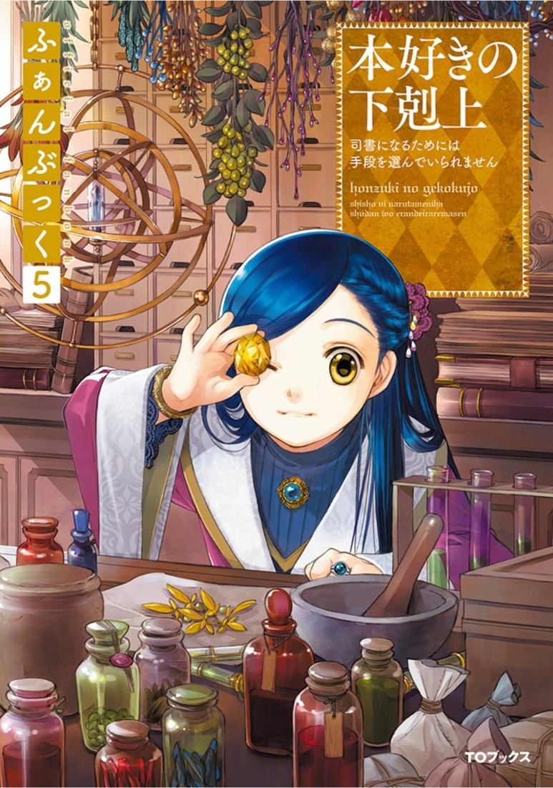
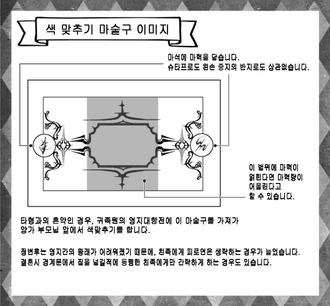

=================================
리젤레타 시점 - 색맞추기와 혼약식
=================================

측근방에 미끄러지듯 올도난츠가 날아온 것은 한가을, 로제마인 님이 수확제때문에 영지내를 이동하는 시기였습니다.

빙글빙글 방안을 돌아 올도난츠는 제 팔에 내려 앉습니다.

"어라, 리젤레타에게 올도난츠는 드문일이네요."

측근방에 날아온 올도난츠는 리카르다나 오틸리에 앞으로 오는 경우가 많아서 저는 눈을 동그랗게 뜨고 하얀 새를 바라봅니다.

슈타프로 살짝 두드리자 아버님의 목소리로 "휴가를 받도록" 이라는 내용을 전합니다.

"......아마도 제 결혼상대가 정해졌다고 생각합니다."

자식의 결혼상대를 정하는것은 가장의 역할입니다. 귀족원에서 상대를 찾는 분들도 있습니다만, 가장의 허락을 받지 못하고 귀족원에서의 인연으로 끝나는 분들도 많습니다.

저는 후계자이기때문에 데릴사위로 저희 집안에 들어올 분이 아니면 안됩니다. 때문에 상대를 찾는것은 처음부터 아버님께 일임했습니다. 그렇다곤해도 아버님은 제 희망도 일단 들어주셨습니다.

저는 자신의 경혼상대로 빌프리트 님의 측근이나, 그에 가까운 친족, 혹은 성에서 일하는 시종을 희망하고 있습니다.

아버님과 어머님처럼 성에서 일하는 부부가되어 다음세대 영주부부를 지탱하고 싶습니다.

그것이 제 바람입니다.

"리젤레타는 겨울이되면 최고학년이니까요. 정식으로 상대가 정해진 것이면 결혼식 준비나 의상 주문 등 할 일이 많죠? 수확제가 끝날때까지 로제마인 님이 성에 돌아오시지 않습니다. 천천히 다녀오세요."

흔쾌히 휴가를 내주는 리카르다와 오틸리에에게 배웅받아 저는 측근방을 나왔습니다.

......어떤분으로 정해진걸까요? 로제마인님의 측근은 아무래도 라이제강계 귀족이 많아서 구 베로니카파와 다리를 놓을 수 있는 분이면 좋을텐데......

아버님에게 부탁했다곤 하지만 제 희망이 이뤄졌다고는 단정할 수 없습니다. 기대와 불안으로 마음이 흔들리는 가운데 집으로 돌아왔습니다.

"리젤레타, 후보가 정해졌다."

"어라, 아직 후보입니까?"

저는 아버님의 말에 고개를 갸웃거렸습니다. 결정권이 가장에게 있음에도 결정하지 않았다는것은 대체 무슨일인 걸까요.

"너는 로제마인 님의 마력압축법으로 마력을 늘리고있지? 당사자들끼리 만나보지 않으면 내 독단으로 정할 수 없어."

보통은 미혼 자녀는 부모님의 마력량이나 속성에서 크게 벗어나지 않습니다. 때문에 가장끼리 자식의 상대를 정할 수 있습니다. 하지만 누구와 마력이 어울리는지 알지 못하면 결혼상대를 정할 수 없습니다. 자손을 남기는것에 지장이 생기니까요.

......로제마인 님의 마력압축은 굉장하지만 급격한 변화로 폐해도 있네요.

저는 최근 아버님의 마력을 희미하게밖에 느끼지 못하게 됐습니다. 앞으로 1년에서 2년정도 진지하게 마력압축을 한다면 완전히 느낄 수 없게 될테죠. 혹여나 마력의 성장이 멈추는것이 빠를지도 모르지만요.

"가능하면 시종에서 상대를 찾으려 했다만, 리젤레타와 어울리는 마력, 연령, 계급의 상대가 없었다. 지난번처럼 되면 곤란하지?"

저희 집안은 시종을 배출하는 가계여서 아버님은 시종에서 상대를 골랐었습니다. 하지만 아버님이나 어머님이 잘 아는 분들로부터는 찾을 수 없었던것 같습니다.

사실은 겨울 끝무렵에 한번 아슬아슬하게 마력량이 맞는 정도의 상대와 혼약 준비를 진행하고 있었습니다. 하지만 혼약식 전에 마력량 차가 너무 커져버려서 마력을 느낄 수 없게되어서 없던일로 하게되었습니다.

"모처럼 좋은 인연을 찾아준 아버님께 죄송하지만 저는 로제마인 님을 섬기는 이상 가능한 마력압축을 해두고 싶습니다."

제 경우 마력량이 어울리는 분은 상급귀족이 되어버립니다만, 그들은 결혼해서 중급귀족으로 신분을 떨어트리는것을 기피합니다. 때문에 아버님은 상대를 찾는것이 굉장히 곤란했던 모양입니다.

......아버님과 어머님에게는 폐를 끼쳐드렸지만, 로제마인 님을 섬기는데는 아무리 마력을 늘려도 부족한걸요.

규격외인 주인을 따른다고 생각하면 마력은 많을 수록 좋습니다.

저는 자신의 결혼을 위해 마력압축을 멈출 생각은 없습니다. 지금은 결혼보다 일에 더 관심이 있기에 더더욱입니다.

"문관이라도 괜찮다면 짐작가는 사람이 있다고 소개받았다. 너는 빌프리트 님의 문관인 톨스텐님을 알고있니?"

"네, 물론 알고있습니다. 귀족원때는 길게 기른 밤색 머리를 성인에 어울리게 자른 분이지요? 접한적은 많지 않지만 문관다운 문관이라는 인상이었습니다."

영주일족을 섬기는 상급문관이기때문일까요. 하르트무트 같이 부드러워보이는 미소를 띄우며 주저없이 타인을 계략에 빠트리는 분위기를 느꼈습니다.

"꽤나 사정이 있는 건가요? 상급귀족이 결혼으로 계급을 낮추는 선택을 할 줄은 몰랐으니까요......."

"톨스텐 님은 상급귀족 문관이지만 3남이라서 재산 상속을 받지 못한데다 자신이 상급귀족으로서 일가를 지탱할 정도의 재산도 없어서 데릴사위로 갈 곳을 찾고있었던 듯 하다."

기본적으로 집안을 잇는 사람이 선조 대대로 내려오는 마술구나 마석을 물려받습니다. 때문에 새롭게 가정을 꾸리기 위해서는 격에 맞는 여러 마술구나 가구 등을 준비하지 않으면 안됩니다.

집안으로부터 원조를 기대할 수 없다면 톨스텐 님이 결혼해서 새롭게 가정을 꾸리는데까지 긴 시간이 걸릴테죠.

"영주일족의 측근이니까 계급을 낮추는 결혼을 하는 것보다 독신으로 사는편이 일하기 편할테죠? 계급이 낮아지면 여러 군데에서 불편함이 생기지않나요?"

"물론, 저쪽은 저쪽의 노림수가 있는 듯 하다. 로제마인 님과의 연을 바라는 것이겠지만 라이제강계 귀족에게는 기대기 싫으니 중립파인 우리 집안이라면......이라고한다. 불만이더냐?"

귀족의 결혼은 집안과 집안의 이익을 생각한 결과입니다. 가장이 집안의 존속을 생각해 결정한 결혼이기에 어지간한 이유가 없다면 싫다고 말할 수 없습니다. 그리고 저는 마력이 어울릴듯한 상급귀족과 혼담을 진행하는 것에 아버님이 얼마나 고생하고 있는지 알고 있습니다. 아무래도 거부할 수 없습니다.

"각자 이익이 있고 서로 존중할 수 있는 것이 좋은 인연입니다. 톨스텐 님은 계급 변화를 포함해서 납득하고 데릴사위를 희망한 것이겠죠? 그렇다면 전 불만없습니다. 마력이 어울리는 남성분은 연하가 될지도 모른다고 각오하고 있을 정도였으니까요."

아버님이 안심한듯이 "그러냐" 하며 어깨에 힘을 뺍니다.

"하지만 부모끼리 색을 맞춰본 결과는 미묘했다. 휴가는 받았겠지? 내일 모레에는 당사자들까리 색을 맞추고 어울릴 듯하면 혼담을 진행할까 한다."

"알겠습니다. 폐를 끼쳐드리겠지만 잘 부탁드립니다."

"아니아니, 안게리카에 비하면 리젤레타는 별것 아니다."

아버님은 한숨을 쉬었습니다. 봄의 끝무렵, 왕명으로 페르디난드 님의 데릴사위행이 정해지고 호위기사인 에크하르트 님도 동행하게 되었습니다. 혼약자인 언니도 당연히 따라가야지라고 부모님은 생각한 모양이지만 언니는 부모님께 상담도 없이 거절해버렸습니다.

당연한듯한 얼굴로 "이미 거절했습니다." 라고 언니에게 들은 부모님은 불경이 아닌가하고 머리를 감싸안은듯 합니다.

"하지만 이 이상 안게리카가 상급귀족을 상대로 무언가 저지를 위험성은 줄었다. 그 사실에 가슴을 쓸어내린건 사실이다. 다음은 부모의 눈이 닿는 범위내에서 상대를 찾을 수 있겠다고 생각했지만......."

보니파티우스 님과 엘비라 님이 "책임지고 일족내에서 다음 상대를 찾겠다." 고 얘기한 모양입니다. 게다가 언니는 강한 분이 좋다는 이유로 보니파티우스 님을 희망했다고 합니다.

......로제마인 님도 놀란듯한데, 그야 놀랄만도 합니다. 자신의 호위기사라곤해도 중급귀족이 영주일족의 방계에 시집가고 싶다고 바라는 것인걸요.

측근끼리라면 언니가 순수하게 강함을 동경한다는 것을 알고 있습니다만, 보통 귀족이라면 영주일족의 방계에 이름을 올리고 싶은 야심가라고 생각할테죠.

어머님은 "영주일족의 3부인이라니, 아무리 그래도 적당히 해주세요!" 라며 비명을 지르고 아버님도 "나이차, 신분차를 생각해라! 부모에게 상담도 없이 강함으로 상대를 고르는게 아니야!" 라고 쓴소리를 날렸다고 들었습니다.

"......하아. 안게리카의 혼인에 대해서는 이미 우리들 의견도 손도 닿지 않는 일이 되어버렸다. 나는 보니파티우스 님 일족에 이미 시집간거나 마찬가지라고 생각하고 있어."

아버님은 사고를 포기한 듯 합니다. 그것도 어쩔수 없겠죠. 보니파티우스 님과 엘비라 님이 분발하고 있는 이상 중급귀족인 저희들이 뭐라고 해봤자 불경이 될것이 뻔합니다.

"그, 마력의 어울림을 생각하면 내가 찾는건 어렵지만, 네 결혼에는 영주일족이 관여하지 않도록 해주면 고맙겠다."

"저는 언니같은 일을 저질러서 아버님을 곤란하게 할 생각은 없습니다. 후계자로써 의무를 다 할 생각입니다."

......이렇게 말하기도 뭣하지만 저는 아버님이 고른 상대보다 보니파티우스 님이 고른 상대가 언니에게 맞을거라 생각합니다.

아버님도 언니를 위해서 상대를 찾고있지만 역시 마력량이 맞지않겠지요. 그리고 아버님이나 어머님과 교류가 있는 분들은 시종들이 많아서 상대의 강함을 바라는 언니의 희망은 이루어지지 않을 가능성이 큽니다. 로제마인 님을 아주 아끼는 보니파티우스 님 이라면 호위기사를 계속하고 싶다는 언니의 희망에 강함을 겸비한 상대를 찾아주리라 생각합니다.

언니의 행복을 위해서라도 제가 이 집안의 후계자로써 아버님이 안심할 수 있도록 행동할 생각입니다.

"리젤레타 입니다. 이틀 후 빌프리트 님의 측근인 톨스텐 님과 상견례를 하게되었습니다. 그와 그 친족에 대해서 아는바가 있다면 알려주세요."

아버님과 이야기를 끝내고 저는 방으로 돌아오자마자 리카르다와 브륀힐데에게 올도난츠를 보냅니다.

"리카르다 입니다. 어머나, 차기영주부부를 지탱하는 것으로는 매우 좋은 인연을 만났네요. 그분은 빌프리트 도련님의 세례식 직후부터 줄곧 섬기고있습니다. 지금으로선 오즈발트 다음으로 길게 섬기고 있지 않을까요? 영지 상황때문에 혼약이 파기되기도하고 주인이 힘든 입장에 처하기도해서 고생하고있지만 어떠한 경우에도 참을성있게 섬겨왔습니다."

그밖에도 톨스텐 님의 귀족원 성적이나 빌프리트 님의 측근으로 들어간 경위, 현재 일하는 모습에 대해서도 알려주었습니다. 정보가 풍부하다는 점에서는 리카르다에게 이길 수 있는 사람은 없을테죠. 측근중에서 최연장자인데다 무엇이든 알고있습니다.

하지만 그녀는 무엇이든 영주와 영지에 좋은가 나쁜가하는 관점에서 이야기합니다. 게다가 영주일족의 방계로써 영주를 섬기고 있기 때문인지 집안의 존속에 대해서는 그다지 의식하지 않는듯 합니다.

"브륀힐데 입니다. 톨스텐 님은 구 베로니카파의 상급귀족으로 베로니카 님의 요청으로 측근으로 들어가는것이 정해지고, 그녀의 실각으로 거의 성립된 혼약이 파기된 분이지요? 그 분 개인이 무슨 생각인지는 모르겠지만, 일족전체로 생각해보면 로제마인 님에대한 생각은 그다지 좋지 않다고 생각합니다. 데릴사위를 들임으로서 집안의 관습이나 파벌색을 가장의 동의없이 변경해버리지 않도록 주의가 필요해요."

브륀힐데는 차기 기베로써 교육을 받고있기때문에 데릴사위를 얻는것에 대한 주의점을 알려주었습니다. 하지만 라이제강계 귀족으로써 시점의 정보이기때문에 톨스텐 님에 대해서는 리카르다보다 훨씬 신랄한 평가입니다.

저는 두사람으로부터 얻은 정보를 정리해 색맞추기나 혼약식에 대해서도 복습해둡니다. 이번에는 상급귀족에 맞춘 정식 절차로 행해지기 때문입니다.

색맞추기는 혼인에있어 마력량의 어울림, 마력이 서로 물드는 정도, 속성의 상성 등을 마술구로 확인하는 것입니다. 혼약이 정식으로 정해지기까지 세 번의 색 맞추기를 하는 것이 일반적입니다.

처음엔 양가 부모님이 결혼상대를 정하기 위해서, 다음은 상견례에서 당사자들의 마력적인 상성을 확인하기 위해, 마지막으로 친족들 앞에서 약혼을 발표하기 위해서입니다.

제가 이틀 뒤 하는것은 상견례로 보통은 부모님들끼리 마력의 어울림을 보고 있기때문에 거의 문제가 없습니다. 만일을 위해서 당사자들까리 색맞추기를 하는 정도입니다.

하지만 이번처럼 자식세대의 마력량이 부모세대와 다를경우 혼담을 진행하기위해선 상당히 중요한 색맞추기가 됩니다.

상견례에서 문제가 없으면 혼약식 준비가 시작됩니다. 혼약식에서는 친족을 모아서 색맞추기를 통해 마력적인 문제가 없음을 보여주고 모두의 축복을 받으며 혼약마석을 교환합니다. 그것으로 정식 혼약자로써 세간에 인정받게 됩니다.

중급귀족은 몇 번이고 성대한 행사를 치를 여유가 없는 집안도 많기때문에 친족에게 동세대가 있는 경우는 몇쌍이 함께 혼약식을 치릅니다.

본가와 동시에 치를 수 있다면 분가 사람들은 금전적으로 도움되기때문에 저희 집안에서도 저나 언니의 혼약식을 언제 치르는지 문의가 있었습니다. 하지만 언니도 저도 상급귀족 집안과 연을 맺기때문에 상대 친족의 사람들과 합동으로 할 수 없습니다. 아버님은 친족에게 거절과 사과 연락으로 바빴던 모양입니다.

......상급귀족의 혼인 진행 방식에 대해서는 언니와 에크하르트 님의 색맞추기나 혼약식을 참고할 수 있기에 다행입니다.

언니는 제 2부인 예정이었고, 보니파티우스 님의 강력한 후원에 의해 정해진 혼약이었기 때문에 저희 집안의 부담이 적도록 엘비라 님께서 배려해주셨습니다. 또한 주위로부터 악담을 듣지 않도록 너무도 자세히 알려주셨습니다. 덕분에 이번 톨스텐 님과의 색맞추기에서 저희 집안이 쓸데없는 수치를 당할 일은 없을테죠.

"시간의 여신 드레팡아의 인도에 의해 이 자리가 마련되었습니다. 결연의 여신 리베스크힐페의 축복이 있기를."

톨스텐 님의 부모님, 그리고 후계자인 장남부부, 톨스텐 님까지 다섯 명이 왔습니다. 차남부부는 로윈왈트에 살고 있기 때문에 이번엔 결석이라고 합니다.

저희 집안에서 맞이하는 것은 부모님과 저입니다. 서로 가장이 인사한 후 각자 소개를 합니다. 하지만 상대방은 모두 저희를 보며 의아한 얼굴을 하고 있습니다. 마치 무언가 착오가 있는듯한 분위기 입니다. 아버님이 무언가 실수가 있었는지 정중히 묻자 톨스텐 님의 어머님이 뺨에 손을 가져갑니다.

"다른 한 명의 따님은 어디 계신걸까요?"

"안게리카는 호위기사로서 로제마인 님의 수확제에 동행하고 있습니다......"

"호위기사같은건 몇 명이고 있는데 동생의 결혼이 정해지는 상견례에 결석하다니.......이번 혼담에 반대하는건 아니겠지요?"

굉장히 걱정스러운 듯 물어보아 저는 안심시키기위해 미소지으며 "언니는 반대같은 건 하지 않습니다." 라고 대답합니다.

혹시 언니가 동석하더라도 한마디도 하지않고 미소지으며 앉아있을 뿐일테죠. 그것이 언니에게 있어 가장 간단하게 할 수 있는, 귀찮은 일로부터 도망치는 수단이니까요.

"그래요. 결석이 반대 의사표시가 아니라면 상관없습니다."

"그러면 어서 색 맞추기를. 마력이 어울리지 않는다면 혼담을 진행할 것도 없어."

톨스텐 님의 아버님이 색 맞추기 마술구가 준비된 테이블로 이동합니다.

본래대로라면 아버님이 이 자리를 맡아보는것이 맞지만, 명령하는 것이 익숙한 상급귀족의 말에 저항할 필요는 없다고 생각하는 것이겠죠.

"톨스텐은 이쪽에서, 자네는 저쪽에서 마력을 흘리도록."

색맞추기 마술구 앞에서 저와 톨스텐 님은 한번 얼굴을 마주합니다. 마술구에 달려있는 두 개의 둥근 마석에 각자 반지가 있는 왼손 중지를 가져갑니다.

손끝에서 쓱하고 마력이 빨려 나가는 것과 동시에 마술구 한가운데있는 직사각형 모양의 평평한 마석에 마력이 흘러들어갑니다.

조금 옅은 황록색이 제 것, 옅은 청자색이 톨스텐 님의 마력 색으로 톨스텐 님 쪽이 면적은 넓지만 어울린다 할 수 있는 범위내에서 마력이 맞닿습니다.

맞닿은 부분이 스미듯이 조금씩 색이 섞여갑니다.

"오호.......정말로 양친에 비해 마력이 많군."

아버님들이 마술구의 반응을 보고있는 사이에 손끝에 작은 마력의 반발이 있었습니다. 이 이상은 마력을 주입할 필요가 없는 것이겠죠. 저와 톨스텐 님은 손을 뗐습니다.

"흠. 색의 섞임도 특별히 문제는 없군. 그렇다면 나머지는 당사자들끼리 이야기해 정하도록. 톨스텐은 결혼하면 계급이 낮아지니까 말이야."

톨스텐 님의 아버님은 아들의 어깨를 가볍게 두드리고 다른 테이블로 이동하라고 말했습니다. 톨스텐 님은 시종이 차를 준비하는 모습을 보며 도청방지 마술구를 건냈습니다.

"서로 주인에 대해 이야기가 나올 가능성이 있으니까요......."

저희들이 결혼에 대해 이야기하는 이상 각자의 업무를 화제로 삼지 않을리 없습니다. 저는 끄덕이며 노란색 마석을 손에 쥡니다.

"차기 영주부부를 섬길 수 있도록 빌프리트 님의 측근이나 성의 시종을 희망했다고 들었습니다만......."

"네. 그렇기에 저는 톨스텐 님이 상대라면 희망이 이루어집니다. 톨스텐 님은 결혼상대에 대해 희망같은 건 있습니까? 그게 톨스텐 님의 아버님이 말했듯이 계급이 낮아지는 건 복잡한 일일테죠?"

제가 결혼을 통해 톨스텐 님의 가족이 기대하는 것을 묻자 그는 조금 생각하듯이 시선이 흔들립니다.

"대체로 희망한대로 입니다. ......얼마나 당신이 저에대한 정보를 가지고 있는지는 모르지만, 저는 에렌페스트나 주인의 입장변화에 줄곧 휘둘려 왔습니다. 빌프리트 님의 세례식 준비가 시작될 무렵, 당시 귀족원 5학년 이었던 저는 측근으로 들어오도록 베로니카 님께 명령 받았습니다. 가족은 양손을 들어올리며 기뻐했습니다. 하지만, 빌프리트 님의 세례식으로부터 계절이 바뀌기도 전에 베로니카 님이 실각하고 혼약은 정리도 되기전에 없던 일이 되버렸습니다."

그 뒤는 빌프리트 님의 교육부족 문제, 흰탑 사건에 의한 폐적미수.......톨스텐 님은 꽤나 고생했다고 이야기합니다.

"가족은 로제마인 님에 대해 어떻게 생각하나요? 베로니카 님의 실각에 관여한 것때문에 받아들일 수 없다는 귀족도 많다고 들었습니다."

"로제마인 님이 빌프리트 님을 구제한 것으로 저도 구원받았습니다. 아니었다면 제 집안도 피해를 받았을 겁니다. 로제마인 님에게는 감사하고 있습니다."

로제마인 님에게 감사한 마음이 있는 빌프리트 님의 측근이라면 업무상으로도 잘 해나갈 수 있을테죠. 자신의 희망이 이루어진 것 같아 저는 굉징히 기뻐졌습니다.

"아아, 로제마인 님에게도 감사하고 있지만, 결혼을 결정한 것은 당신의 평판입니다. 상견례를 한다고 친구들에게 이야기하니 부러움을 샀습니다."

상급귀족인 톨스텐 님의 친구들이 부러워할 요소가 저에게 있는걸까요. "시집온다면 환영하겠지만, 데릴사위로 계급이 내려가는건......." 라고 이야기하는 경우가 많아서 어쩐지 이상한 느낌입니다.

"제게 불만은 없습니다. 이 혼인을 진행할까 말까는 톨스텐 님의 마음에 맡기겠습니다. 부디 결연의 여신이 손에 든 실이 별의 신에게 넘겨지기를."

"저도 결연의 여신이 손에 든 실이 별의 신에게 넘어가길 바라고 있습니다."

당사자인 저희들이 결혼을 희망한 것으로 혼담을 진행하게되어 혼약식을 겨울의 끝무렵에 치르게 되었습니다.

"가능하다면 겨울 시작무렵에 혼약식을 치르고 마석 교환을 하고싶지만, 역시 준비 시간이 모자라겠죠. 먼저 혼약마석만이라도 건네도 괜찮을까요?"

"꽤나 서두르네요. 무언가 이유라도 있나요?"

"졸업식 에스코트 전에 혼약마석을 건네고 싶다고 생각한 것은 이유가 되지않을까요?"

쓴웃음을 지으며 이야기하는 톨스텐 님의 말에 저는 눈을 동그랗게 뜹니다.

"혼약마석을 지니지않은 여성에게는 타령의 학생이 말을 걸어 오겠죠? 제가 귀족원을 졸업한 이상 걱정입니다. 먼저 혼약마석을 건네고 싶다고 생각할 정도로......"

최고학년이되어 혼약마석을 지니지 않는 사람은 에스코트 상대가 정해지지 않았다고 선전하는 것이나 마찬가지입니다.

이성으로부터 요청도 늘테죠. 저는 로제마인 님의 시종으로서 업무를 우선하고 싶기에 요청은 기본적으로 거절하고 있습니다.

하지만 혼약마석이 있다면 처음부터 다가오지 않습니다. 톨스텐 님의 마음 씀씀이에 저는 천천히 가슴 한 켠이 따뜻해지는 듯한 기분이 됩니다.

"아버님, 먼저 혼약마석을 받아도 괜찮을까요?"

저의 에스코트로 톨스텐 님이 귀족원을 방문해 로제마인 님에게 기숙사에서 인사할 적에 정식 혼약자라고 그저 구두약속만으로는 주변의 시선이나 소개 방법이 달라집니다. 하지만 혼약마석이 있다면 혼약자라고 소개할 수 있습니다.

"그건 톨스텐 님과 네가 정하도록. 나도 졸업식에서 에스코트한다면 혼약마석이 있는 편이 모양새가 좋다고 생각한다만, 마석을 준비하는건 두 사람 이니까."

페르디난드 님의 급한 출발, 마티아스의 밀고에 따른 숙청 앞당김, 구 베로니카파의 와해.......

겨울의 끝나고 상견례때와는 크게 영지 상황이 달라진 가운데 저와 톨스텐 님의 혼약식이 치뤄졌습니다.

상견례와 같이 혼약식에서도 색맞추기를 합니다. 친족 앞에서 색맞추기 마술구에 두 사람이 마력을 흘려보내고 아버님이 마술구를 높이 들어올리자 마력에 문제가 없음을 확인한 친족이 슈타프를 빛내며 축복해줍니다.

그다음엔 혼약마석 교환입니다. "함께 다음 세대를 지탱해 나갑시다." 라고 새긴 제 마석과 "나의 어둠을 거둬준 빛의 여신에게" 라고 새겨진 톨스텐 님의 마석을 교환합니다.

......이걸로 정식 혼약자이네요.

마석 교환을 끝내고 둘이서 각자의 친족에게 인사 다닙니다.

"어머나 리젤레타 님. 멋진 인연을 얻었네요. 상급귀족과 인연을 얻다니 저도 친족으로서 기쁘답니다."

"라이제강계 귀족과 연을 얻기 어려운 와중에 리젤레타 님과 안게리카 님을 통해 영주일족과 연이 생기다니......감사할 일입니다."

"하급귀족 측근도 보호하는 로제마인 님이라면 자신의 친족과 강하게 맺어진 안게리카 님을 기대면 힘써 주실테죠. 이걸로 일족도 안녕하겠죠."

상급귀족과 연을 얻는 것을 기뻐하는 제 일족과, 로제마인 님이나 보니파티우스 님같은 영주일족과의 관계의 깊이를 떠보는 톨스텐 님의 일족.

웃는 얼굴로 인사를 하고있지만, 말을 건넬 때마다 마음에 무거운 것이 쌓이는 기분입니다.

......혼인은 집안과 집안의 계약이니까 각자의 사정이나 꿍꿍이가 있는건 당연하지만.......

톨스텐 님의 일족이 그의 계급을 낮추는 혼담에 긍정적인 것은 언니가 보니파티우스 님의 마음에 들었고, 보니파티우스 님이나 로제마인 님과의 인연을 넘어다봤기 때문 인듯합니다.

혼약한 저희들이나 가장인 아버님보다 언니에게 인사를 우선하는 분들이 많아서 저나 저희 집안에게는 가치가 없다고 하는 것같아 실망스런 기분이 되었습니다.

......장래적으로는 이 두 친족을 저희들이 한데 모아가지 않으면 안되겠죠.

후 하고 가볍게 한숨을 쉴때 "리젤레타" 하고 언니가 손짓하는 것이 보입니다. 언니는 조금이라도 친분을 쌓으려는 톨스텐 님의 친족에게 둘러쌓여 있었습니다만, 그곳에서 빠져나온 모양입니다.

"죄송합니다 톨스텐 님. 잠시 언니와......."

"인사도 일단 끝났습니다. 언니와 느긋하게 있어도 괜찮아요."

흔쾌히 보내주는 것에 감사를 표하고 저는 언니에게 갑니다. 언니는 저를 데리고 사람이 적은 곳으로 향했습니다.

"언니도 지쳤지요? 죄송합니다. 전 톨스텐 님의 가족이 이렇게나 보니파티우스 님의 애제자를 눈여겨보고 있는지 생각도 못하고......"

"전 괜찮아요. 처음부터 사람들의 이야기를 들을 생각조차 없었으니까요."

생글생글 미소지으며 있었을 뿐 얼굴도 이름도 기억하지 않았다고 잘라말하는 언니는 너무나도 평상시와 다를 바 없습니다.

저 자신만 겉돈 것 같은 기분이되어 전 눈부신 것을 보듯이 언니를 바라봅니다. 언니는 그런 저를 보며 살짝 눈썹을 찌푸립니다.

"리젤레타, 혹시 무언가 위험한 일이 있으면 말해주세요. 전 베어버리는 것 정도는 할 수 있습니다."

"언니도 참.......갑지가 무슨 말을 하는건가요?"

결혼식이라는 경사스런 장소에서 꺼낸 말로는 매우 위험합니다. 제가 눈을 크게뜨자 언니는 천천히 할말을 찾듯이 생각한 뒤에 입을 열었습니다.

"......제가 부족한 탓에 리젤레타가 후계자가 되지않았나요. 그게 무거운 짐이라는 것 정도는 알고 있습니다."

"언니가 부족하다니 그런......"

확실히 언니는 집안의 후계자로서 시종이 되지 못했고 강의는 어려워 합니다. 하지만 자신에게 맞는 기사를 선택할 수 있었고 거기서 보니파티우스 님의 애제자가되어 로제마인 님을 성심성의껏 섬기고 있습니다.

"오늘 손님들의 태반이 언니에게 향한 것을 생각해봐도 부족하지 않습니다. 오히려 언니 덕에 제가 혼약자를 얻을 수 있......"

"복잡한 뒷사정은 아무래도 좋습니다. 그저 분위기가 아무래도 좋지않다는건 알았습니다. 그러니까 저는 로제마인 님 다음으로 리젤레타를 지키겠습니다."

굳센 표정이 된 언니가 한손을 허리에 대고, 다른 한손은 자신의 가슴에 올리며 가슴을 폅니다.

"전 리젤레타의 언니니까요."

너무나도 익숙한 동작과 대사입니다.

"언니도 참, 로제마인 님의 흉내인가요?"

"언니는 동생을 위해서 힘내는 거라고 로제마인 님이 말했습니다."

샤를로테 님에게 멋진 모습을 보여주고 싶어서 힘내는 주인의 모습에 언니도 무언가 생각한 바가 있던 걸테죠. 그렇더라도 갑자기 "베어버리는 것 정도는 할 수 있습니다." 라고 들으면 놀랍니다.

......로제마인 님을 흉내낸 것일텐데 어째서 위험한 방향으로 가는건가요?

그래도 진지한 표정으로 말하는 언니가 저를 걱정해주는 것이라는걸 알 수 있습니다. 왠지 우울한 기분이 날아가고 부끄러운 기분이 되었습니다.

"호위기사인 언니가 지켜준다면 저는 무서운 것따위 없겠네요."

제가 무심결에 웃으며 말하자 언니도 기쁜 듯한 미소로 보답합니다.

봄의 끝무렵에는 또 다시 상황이 변하리라고 예상조차 하지 못한 겨울의 끝에 저와 톨스텐 님의 혼약이 성립되었습니다.
