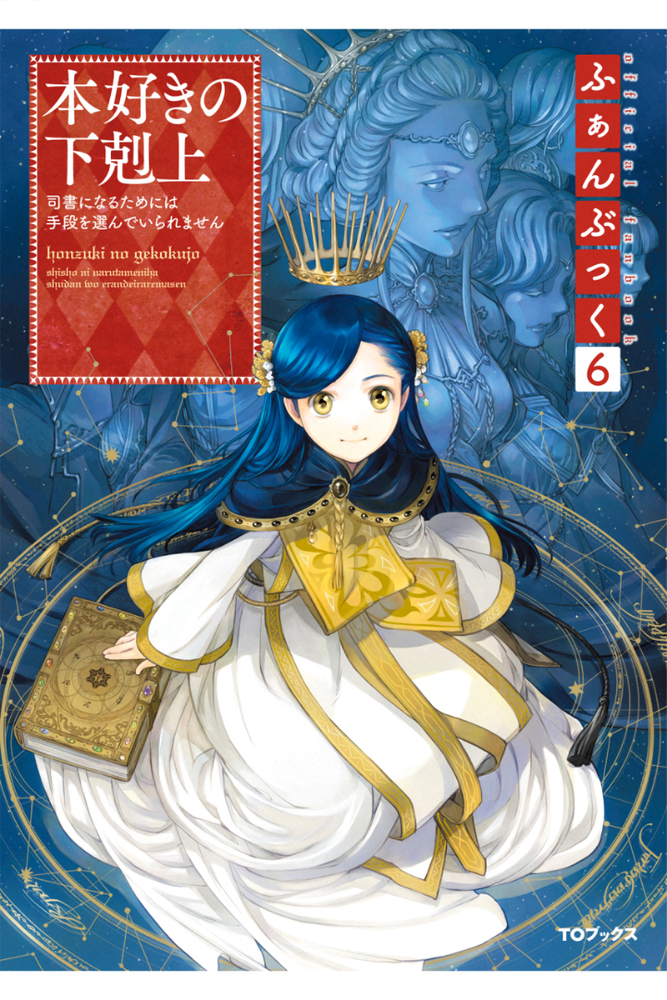
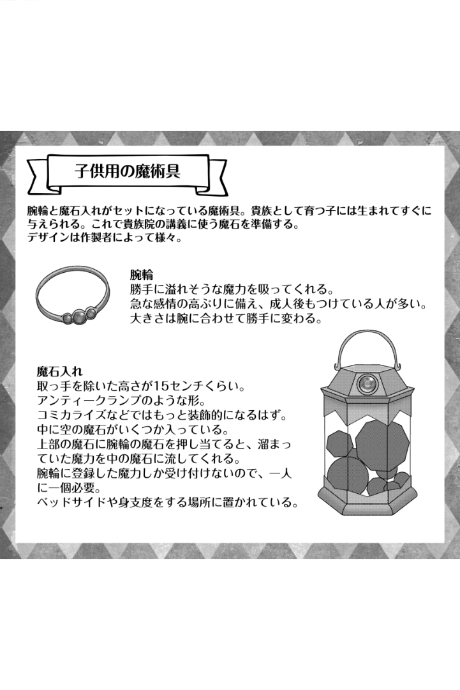

===================================
디르크 시점 - 귀족이 되기 위한 준비
===================================

"디르크, 마이너드. 오늘은 제 아버지이신 아우브・에렌페스트에게서 당신들에게 줄 어린이 마술 도구를 맡아 왔습니다."

하르트무트 님과의 면접을 마친 다음날 오후 멜키오르 님이 고아원에 찾아왔다. 물론 혼자가 아니다. 회색 신관인 시종과 귀족 측근이 여럿 있다. 신전장실에서는 프랑과 모니카, 그리고 로제마인님의 측근인 필린느님과 다무엘님이 와 있다. 로제마인님과 하르트무트님이 없는 것을 조금 안타깝게 생각한다.

......헤에, 저 안에 마술 도구가 있는 건가? 

나는 그중 두 사람이 손에 들고 있는 커다란 나무상자를 보고 앞으로 나가려다 휙 뒤로 끌려갔다. 불안한 얼굴로 델리아가 내 팔을 잡고 있다. 

"디르크......"

델리아는 아직 마음속으로는 반대하고 있는지도 모른다. 하지만, 나는 콘라트와 약속했다. 나는 마술구를 받고 신전을 지킬 수 있는 귀족이 될 것이다. 델리아가 고아원에서 나올 수 없게 된 건 나를 지키기 위해서였다고 들었다. 그러니, 나도 델리아의 생활을 지킬 작정이다. 

"부르고 있으니까 갈게"

오늘 오후에는 멜키오르 님으로부터 "세례식 전인 아이들을 대기시켜 놓으라" 고 연락이 왔다. 그래서, 어른은 공방에 있지만 아이들은 식당에 있다. 나는 델리아의 손을 떼고 세 살배기 마이너드, 빌마와 함께 아이들 앞에 나섰다. 멜키오르 님에 대한 마중 인사가 끝난 뒤에도 모두가 조금 멀찍이 이쪽을 응시하고 있다. "평민 주제에" 라고 하는 소리가 작게 들렸다. 

"이 중에서 골라주세요"

식당 테이블 중 하나에 나무상자가 놓여 상자를 열려 있다. 마이너드는 빌마에 안겨 상자 안을 들여다보고 있지만 내 키 높이로는 보이지 않는다. 나는 으쓱 하고 의자에 올라 상자 안을 들여다보았다.

腕輪と装飾的な金属とガラスでできた筒のような魔術具がいくつも入っている。孤児院で貴族の子達が持っている物と同じだ。これがないと貴族の血を引いていても貴族になれないとギャリックが言っていた。ギャリックはハルトムート様の面接で魔力量が少ないと落とされて怒っていた子だ。今も怒っている。 

팔찌와 장식적인 금속과 유리로 된 통 같은 마술구가 여러 개 들어 있다. 고아원에서 귀족 아이들이 가지고 있는 것과 같다. 이것이 없으면 귀족의 피를 뽑아도 귀족이 될 수 없다고 개릭이 말했었다. 개릭은 하르트무트 님의 면접에서 마력량이 적다고 떨어뜨려 화를 내던 아이다. 지금도 화가 나 있다. 

"이것이 귀족이 되기 위한 마술구입니까?"

"......정확히는, 넘치는 마력을 모아두기 위한 마술구입니다. 능숙하게 마력을 다루지 못하는 아이에게 생명의 위험이 없도록 과도한 마력을 이 팔찌의 마석에서 빨아들여 이곳에 들어 있는 비어있는 마석으로 옮길 수 있습니다."

여러 가지로 대답해 준 것은 멜키오르님의 측근인 카지미알 님이다. 옅은 주황색 머리에 눈꼬리가 처진 갈색 눈을 하고 있다. 하르트무트 님 다음으로 신관장이 되는 분이고 말투나 분위기도 하르트무트 님을 닮아 매우 상냥한 귀족인 것이다. 하지만, 하는 말이 너무 어렵다. 

"마력을 잘 다루면 이것이 없이도 귀족이 될 수 있나요? 마술구가 없어도 개릭은 귀족이 될 수 있습니까?" 

"그건 어렵겠죠. 마력을 다루는 것을 가르치는 것이 귀족원입니다. 원래 귀족으로서 세례식을 받지 않으면 귀족원에 갈 수 없습니다. 게다가 귀족원 강의에서는 자신의 마력으로 물든 마석을 많이 사용합니다. 마력을 다루는 것을 모르는 아이가 강의를 위해 마석에서 잡다한 마력을 빼고, 자신만의 마력으로 물들인 것을 준비하기는 매우 어렵습니다."

......음, 어려운 것은 알았다. 하르트무트 님의 면접 후에는 계속 싫은 소리를 듣고 있기 때문에 뭔가 방법이 있으면 좋았지만 개릭이 귀족이 되는 것은 무리일 것 같다. 

"카지미알, 이 중에서 디르크에 맞는 마술구를 골라주세요"

멜키오르 님의 목소리에 고개를 들자, 이미 마이너드는 손에 팔찌 하나를 들고 있었다. 한 손만 장갑을 낀 멜키오르님의 측근이 그 모습을 물끄러미 지켜보고 있다. 자세히 보니 카지미알 님도 한 손만 장갑을 끼고 있었다. "내 마력이 통하지 않기 위해서죠" 라며 카지미알 님은 장갑을 낀 손을 가볍게 흔들었다. 

"마술구에 뭔가 차이가 있나요?"

"궁합이 있는 거죠. 태어날 때부터 가지고 있는 마력의 적성과 마술구의 궁합이 나쁘면 팔찌에서 마술구 안에 있는 마석으로 마력이 잘 전달되지 않아 유출됩니다. ......이것을 세게 잡고 열까지 세어주세요"

잘 모르겠지만, 열까지 세는 것은 알았다. 나는 "네" 라고 씩씩하게 대답을 하고 건네지는 순서대로 팔찌의 마석 부분을 꽉 잡고 열까지 세어 나간다. 카지미알 님이 진지한 눈으로 팔찌를 비교하고 있긴 한데, 무엇을 보고 있는 걸까.

"귀족은 이 마술구를 아기 때부터 사용하는 거죠? 아기가 쥐게하는 건 잘 잡을 수 없어서 힘들 것 같아요."

"아니요. 보통은 부모님이나 친족이 준비한 마술 도구를 사용하기 때문에 궁합이 잘 맞지 않는 경우는 거의 없습니다. 이번에는 중앙으로부터 양도받은 것이니까요." 

"......부모님이나 친족이 준비한다면, 왜 개릭들은 마술구를 가지고 있지 않은 거죠?" 

나는 대답을 기다리고 있었지만, 카지미알 님은 대답해 주지 않았다. 

"이번에 마술구를 고를 수 있는 것은 특별합니다. 디르크나 마이너드는 시간이 없겠죠? 귀족이 되려고 생각한다면, 귀족 자제들이 10년에 걸쳐 쌓는 마력을 디르크는 3년 반만에, 마이너드는 6년 반만에 모아야 합니다. 그러니까, 이렇게 골라주게 된 거죠."

......10년 걸리는 곳을 3년 반만에? 

너무 놀란 탓에 개릭들에 대한 걱정이 단숨에 날아갔다. 나에게는 생각보다 짧은 시간밖에 없다. 괜찮을까. 

"세례식 전까지 같은 학년 아이들의 70% 정도를 준비하지 못하면 귀족원에 갈 때까지 준비를 마칠 수 없습니다. 마석과 회복약은 로제마인 님이 준비해주신다고 합니다만, 회복약이 있어도 몸에 부담이 가는 행위입니다. 조금의 마력도 헛되이 할 수 없습니다. 마술구와의 궁합은 중요하겠죠? 멜키오르 님의 온정에 감사하세요."

"네, 진심으로 감사드립니다"

자신도 모르게 고아원에서 가르친 대로의 말이 입에서 나왔다. 귀족 님에게는 거역하지 않는다. 이것은 고아원에서 제일 중요한 일이다. 

"마이너드는 이게 가장 궁합이 잘 맞는 마술구네요. ......카지미알, 디르크는 어때요?"

メルヒオール様の声にカジミアール様がいくつか並べてある腕輪を見ながら「非常に珍しいことですが、ディルク はどれでも問題なさそうです」と言った。その途端、メルヒオール様や貴族の側近達が驚いて不思議そうに私を見っ めてくる。 

멜키오르 님의 목소리에 카지미알 님이 여러 개 늘어놓은 팔찌를 보면서 "아주 드문 일이지만 디르크는 아무 문제 없을 것 같아요" 라고 말했다. 그 순간 멜키오르 님이나 귀족 측근들이 놀라 신기한 듯 나를 쳐다본다. 

"어떤 마술구와도 궁합이 잘 맞습니까? 왜 그럴까요?" 

"네? 음, 제가 평민 고아이기 때문일까요? 어떤 것이든 궁합이 잘 맞는 건 안되는 건가요?" 

"아니요, 드문 일이지만 문제는 없어요. 디르크는 이쪽 마술구를 사용하세요."

나는 받을 수 있다면 무엇이든 좋다.

"감사합니다, 멜키오르 님" 이라고 정중히 감사의 인사를 건네며 카지미알님이 고른 마술 도구를 받았다.

「これから魔力登録をするのですが、貴族は生まれてすぐに行うので私もよく知らないのです。カジミアール、どう すれば良いですか? 其方は子供がいるでしょう?」 カジミアール様はメルヒオール様に向かって笑顔で頷いた後、腕輪に登録する方法を教えてくれた。 

"이제 마력 등록을 해야 하는데 귀족들은 태어나자마자 하기 때문에 저도 잘 몰라요. 카지노, 어떻게 해야 하나요? 그 분은 아이가 있겠죠?" 카지노 님은 멜키오르 님을 향해 웃는 얼굴로 고개를 끄덕인 뒤 팔찌에 등록하는 법을 가르쳐 주셨다. 

「しばらく握っていると魔石が小さく光るので、それまでこの赤い魔石をきつく握っていてください。登録が完了し たら腕輪を腕にはめます。手首でも二の腕でも構いませんよ。貴族の子供は親が確認しやすいように手首につけることが多いですが、ここでは二の腕につけることが多いようです」

"잠시 잡고 있으면 마석이 작게 빛나니 그때까지 이 빨간 마석을 꽉 잡고 계십시오. 등록이 완료되면 팔찌를 팔에 끼웁니다. 손목이든 팔이든 상관없어요. 귀족 자녀는 부모가 확인하기 쉽도록 손목에 차는 경우가 많은데 여기서는 팔뚝에 차는 경우가 많은 것 같아요."

孤児院では掃除や洗濯、採集や工房の手伝いをするので、二の腕につける方が作業の邪魔にならないし汚れない。 ベルトラム達がそう言っていた。私も二の腕にはめる。次の瞬間、大きさがヒュンと縮んで自分の腕にちょうど良い 大きさになった。
マイナードも魔力を登録し、二の腕に腕輪をはめてもらっている。ヴィルマ やリリーが着替えの時に確認するらしい。

고아원에서는 청소나 빨래, 채집이나 공방을 도와주기 때문에 팔뚝에 붙이는 것이 작업에 방해가 되지 않고 더러워지지 않는다. 벨트람들이 그렇게 말하고 있었다.나도 팔뚝에 끼운다. 다음 순간 크기가 뿅 줄어들어 내 팔에 딱 좋은 크기가 됐다. 
마이너드도 마력을 등록해, 팔뚝에 팔찌를 채우고 있다. 빌마나 릴리가 갈아입을 때 확인하는 것 같아.

"잘됐네요, 마이너드" 

"으으, 빌마~"

마이너드가 귀족 앞에서 보채고 있다. 이것은 곤란하다. 귀족들은 아이가 기분이 나쁘면 어째서인지 덩달아 함께 기분이 나빠지는 것이다. 

"멜키오르 님, 여러분께 실례가 되기 전에 마이너드를 내려드려도 될까요?" 

"아, 상관없어요. 피곤했을 거예요."

メルヒオール様が頷くと、マイナードはリリーに連れられて下の部屋へ下がっていく。それからメルヒオール様は 私を見た。 

멜키오르 님이 고개를 끄덕이자 마이너드는 릴리의 손에 이끌려 아랫방으로 내려간다.그리고 나서 멜키오르님은 나를 쳐다보았다. 

「ディルク、其方にはひとまず子供用魔術具が与えられました。けれど、アウブの面接に合格しなければ貴族の洗礼式には出られません。今年の冬に洗礼式を行うならば、秋にアウブの面接があります。洗礼式前までの努力や生活態 度、それから、アウブへの忠誠心を確認されます。そこでアウブが後見するのに相応しくないと判断されれば、その時点で子供用の魔術具は回収されます」 

"디르크, 거기에는 일단 어린이 마술구가 주어졌어요. 하지만 아우브・면접에 합격하지 않으면 귀족 세례식에는 나갈 수 없습니다. 올 겨울에 세례식을 한다면 가을에 아우브・면접이 있습니다. 세례식 전까지의 노력과 생활태도, 그리고 아우브에 대한 충성심을 확인합니다. 그래서 아우브가 후견하기에 적합하지 않다고 판단되면 그 시점에서 어린이 마술구는 회수됩니다." 

......멜키오르 님은 아직 어린 아이인데도 어려운 말을 많이 아는구나. 

大人が使うような言葉でダーッと言われた。私は「あとでこっそりフィリーネ様に尋ねよう」 と思いながら何度か 頷く。 

어른들이 쓰는 말로 더덕더덕 소리를 들었다. 나는 "나중에 슬쩍 필린느 님에게 물어봐야겠다" 고 생각하면서 몇 번 고개를 끄덕인다. 

「洗礼式やお披露目の準備はフィリーネ達と行ってください。その進度からアウブと面接するかどうか考えると良い ですよ。どうしても準備期間が足りないならば、洗礼式を一年間延期することができると父上はおっしゃいました」 

"세례식이나 피로연 준비는 필린느들과 하세요. 그 진도에서 아우브와 면접을 할 지 생각하시면 됩니다. 아무래도 준비기간이 부족하다면 세례식을 1년 연기할 수 있다고 아버지께서 말씀하셨습니다." 

"그리고.., 세례식은 일곱 살에 하는 거죠? 저는 내년에 여덟 살이 됩니다만......" 

"준비기간을 연장하기 위해 디르크는 내년에도 일곱 살을 할 거예요."

......내년에도 일곱 살? 그런 일이 가능한 거야? 역시 영주님이다. 

年齢を止められるなんてアウブはすごい。私がアウブに最大限の感謝を捧げようとした瞬間、「平民の孤児が貴族 になれるものか」という憎々しい響きを帯びた声が背後から聞こえた。ギャリックの声だ。 

나이를 멈출 수 있다니 아우브는 대단해. 내가 아우브에게 최대한의 감사를 드리려는 순간 평민 고아가 귀족이 될 수 있겠느냐는 얄미운 울림을 띤 목소리가 등 뒤에서 들렸다. 개릭의 목소리다. 

"1년 정도 연기해 봤자 평민 고아는 평민 고아다. 빨리 포기해라."

ベルトラム達、魔術具を持っている子供達もギャリックに賛同している。メルヒオール様が口を開くのと、カジミ アール様がニコリと微笑みながらメルヒオール様の前に一歩出るのは同時だった。 

벨트람들, 마술구를 가지고 있는 아이들도 개릭에 동참하고 있다. 멜키오르님이 입을 여는 것과 카지미알 님이 히죽 웃으며 멜키오르 님의 앞으로 한 걸음 나가는 것은 동시였다. 

「他人事ではありませんよ。貴族の子であっても親族に引き取り手がなく、アウブの後見が受けられない場合は貴族 になれません。その場合、子供用の魔術具は孤児院に必要のない物として回収され、其方等は普通の灰色見習いにな ります」

"남의 일이 아니에요. 귀족의 자녀라도 친족에게 인수자가 없어 아우브의 후견을 받을 수 없는 경우에는 귀족이 될 수 없습니다. 그럴 경우 어린이 마술구는 고아원에 필요 없는 물건으로 회수되고, 그대들은 보통 회색 견습이 됩니다." 

何を言われたのかわからないように貴族の子達がポカンとした顔になった。それから一斉に顔色を変えて、自分の 腕輪を押さえる。 

무슨 말을 들었는지 모르게 귀족 아이들이 포근한 얼굴이 되었다. 그리고는 일제히 안색을 바꿔 자신의 팔찌를 누른다. 

"그런......! 이건 가족이 나를 위해 준 겁니다" 

"거둬들인다라니 횡포 아닙니까!" 

"이제 가족이 남겨준 것은 이것밖에 없어요."

......카지미알님께 반론을 하다니, 모두는 역시 귀족님이구나. 

孤児院では「お貴族様に反論なんてしたら殺されても文句は言えない」と実際に神殿で起こったことを交えて教え 込まれる。孤児の事情や思いを訴えたところで、お貴族様が決めたことが変わるわけがない。 

고아원에서는 귀족에게 반론을 하면 죽임을 당해도 불평할 수 없다고 실제로 신전에서 벌어진 일을 섞어 가르친다. 고아의 사연과 생각을 호소해 봤자 귀족들이 결정한 것이 달라질 리 없다. 

「将来の貴族を増やすために必要だろうと持ち出しを特別に許可されただけで、普通は孤児院へ入る際に孤児の私物 は神殿長の物にされます。今回は粛 清された犯罪者の館にあった魔術具なのでアウブが回収します」

미래의 귀족을 늘리기 위해 필요할 것이라며 반출을 특별히 허가받았을 뿐 보통 고아원에 들어갈 때 고아 개인 물건은 신전장의 물건이 됩니다. 이번에는 숙청된 범죄자의 관에 있던 마술구이기 때문에 아우브가 회수합니다.
우엉.

貴族の子達が大事にしている魔術具は彼等の物ではなく、アウブの物らしい。孤児院に持ち込まれた物は、孤児院 の共有物になるか回収される。貴族になれなければ魔術具が回収されるのは当然だ。

귀족 자녀들이 아끼는 마술구는 그들의 것이 아니라 아우브의 것인 것 같다. 고아원에 반입된 물건은 고아원의 공유물이 되거나 회수된다. 귀족이 되지 못하면 마술구가 회수되는 것은 당연하다.

......즉, 내가 고아원에 들어갈 때 싸여 있던 천이 모두의 것이 되어 기저귀나 걸레가 된 것이나 마찬가지라는 걸까. 응.

私は魔術具の行く先よりもカジミアール様がいつ怒り出すのか、ベルトラム達が処罰を受けるのではないか、私達 もそのとばっちりを受けるのではないか。そちらの方がよほど気になる。 ハラハラしながら見ていたけれど、カジミアール様は怒らずにニコリと微笑んだ。 

저는 마술구 가는 곳보다 카지노 님이 언제 화를 내시는지, 벨트람들이 처벌을 받지 않을까 우리도 그 시비를 받지 않을까. 그쪽이 꽤 신경 쓰인다. 조마조마하게 쳐다보았지만 카지미알 님은 화를 내지 않고 씩 웃었다. 

"마술구를 회수당하기 싫으면 아우브・면접에 붙어서 귀족이 되면 되는겁니다. 귀족이 되면 그대로 사용할 수 있습니다"

......反論されても怒らないなんて、やっぱりカジミール様はいい人だ。 

......반론을 받아도 화를 내지 않다니, 역시 카지미르님은 좋은 사람이다. 

私はホッとした。貴族の子達も「貴族になれば良い」と言われてホッとしたようだ。反論の声がピタリと止まる。 皆の様子を見てからカジミアール様は一歩下がり、そっとメルヒオール様を前に押し出した。 

나는 안심이 되었다. 귀족 아이들도 "귀족이 되면 좋겠다" 는 말을 듣고 마음이 편했던 모양이다. 반론의 목소리가 딱 그치다. 여러분의 모습을 보고 카지미알 님은 한발 물러서서 슬쩍 멜키오르 님을 앞으로 밀어냈다. 

「私はエーレンフェストの領主一族として、一人でも多く貴族が増えれば良いと思っています。魔術具を持っている者はそのための努力をしてください。今年の洗礼式やお披露目の準備はローゼマイン姉上とその側近が中心になって行います。フィリーネ、ダームエル。後を任せます」 

"저는 에렌페스트의 영주 일족으로서 한 명이라도 더 귀족이 늘었으면 좋겠어요.마술구를 가지고 있는 사람은 그것을 위한 노력을 하세요. 올해 세례식이나 소개팅 준비는 로제마인 언니와 그의 측근이 중심이 되어 진행합니다. 필린느, 다무엘. 뒤를 맡기겠습니다." 

メルヒオール様はフィリーネ様やダームエル様に後を頼むと、自室へ戻っていった。引き継ぎで忙しいそうだ。

멜키오르님은 필린느님이나 다무엘님에게 뒤를 부탁하자 자기 방으로 돌아갔다. 인수인계로 바쁘다고 한다.

メルヒオール様達が退出すると、皆はそれぞれに動き始めた。工房へお手伝いに向かう者、カルタを取り出す者、 フェシュピールの練習を始める者、様々だ。デリアとコンラートは少し離れたところからこちらの様子を窺っている。邪魔をしないように考えてくれたのだろう。

멜키오르 님들이 퇴출하자 모두는 각자 움직이기 시작했다. 공방으로 도우러 가는 자, 카루타를 꺼내는 자, 페슈필 연습을 시작하는 자, 다양하다. 델리아와 콘라트는 조금 떨어진 곳에서 이쪽의 모습을 엿보고 있다. 방해하지 않도록 생각해 주었을 것이다.

ヴィルマがベルトラムに「ディルクと一緒にダームエル様達のお話を聞かなくても良いのですか?」と声をかけて いるが、「中級貴族が洗礼式やお披露目に向けて何をすべきか、私は下級貴族より知っています」と断っている。 

빌마가 벨트람에게 "디르크와 함께 다무엘님들의 말씀을 듣지 않아도 되나요?" 라고 말을 걸고 있지만 "중급 귀족들이 세례식이나 선보이기 위해 무엇을 해야 할지 저는 하급 귀족들보다 알고 있습니다" 라고 거절하고 있다. 

"벨트람은 이제 고아인데, 저런 말투......" 

"별 상관 없어"

무례한 태도에 나는 화가 났지만, 다무엘님은 전혀 신경쓰지 않는 것 같다. 가볍게 손을 흔들었다. 

「彼は貴族の子として育っていたのだ。何もかも不足しているディルクとは違う。冬までに、と考えると其方には時間が全く足りない。こちらが関わる必要がないならば、正直なところ助かる」 

"그는 귀족의 아들로 자랐던 것이다. 모든 것이 부족한 디르크와는 다르다. 겨울까지, 라고 생각하면 거기에는 시간이 전혀 부족하다. 우리가 관여할 필요가 없다면 솔직히 도움이 된다." 

"겨울까지라니, 어째서 인가요? 멜키오르님은 일 년후라도 상관없다고......"

領主様が時間を止めてくれるとおっしゃったのに、と私が首を傾げると、ダームエル様はとても真剣な灰色の目で私を見つめた。 

영주님께서 시간을 멈춰주신다고 하셨는데, 하고 내가 고개를 갸우뚱하자 다무엘님은 아주 진지한 회색 눈으로 나를 바라보았다. 

「私は一年後に洗礼式を延期するのは止めた方が良いと思う。機会はこの冬しかないと思った方が良い」 

"나는 일년 뒤로 세례식을 연기하는 것은 그만두는 것이 좋다고 생각한다. 기회는 이번 겨울밖에 없다고 생각하는 게 좋다." 

"무슨 뜻입니까?" 

「他の貴族は孤児に魔術具など必要ないとか勿体ないと思っている者が多い。ローゼマイン様が交渉して得た魔術具なので、孤児院にも少し回してほしいという意見が通っただけだ。ローゼマイン様が去った一年後は、難癖を付けられて魔術具を取り上げられる可能性もある」

"다른 귀족들은 고아들에게 마술 도구가 필요 없거나 아깝게 여기는 사람들이 많다. 로제마인님이 협상해서 얻은 마술구이니 고아원에도 좀 돌려달라는 의견이 통했을 뿐이다. 로제마인 님이 떠난 지 1년 뒤에는 트집을 잡아 마술구를 빼앗길 수도 있다."

살며시 다무엘님이 숨을 내쉬었다. 여기에 남는 로제마인님의 측근은 하급귀족인 다무엘님이나 필린느님이어서 다른 귀족들의 목소리가 커져 영주 일족이 의견을 바꿀 경우 도저히 반항할 수 없다고 한다. 

「今だって其方の周囲も協力的な者ばかりではないはずだ。貴族の血を引く自分が得られなかったのに、平民の孤児が魔術具を得たことを妬む者もいるだろう?」 ダームエル様はギャリックの悪口を聞いたのだろう。私はコクリと頷いた。 

지금도 그쪽 주변도 협조적인 사람만은 아닐 것이다. 귀족의 피를 뽑는 자신을 얻지 못했는데 평민 고아가 마술구를 얻은 것을 질투하는 자도 있겠지? 다무엘님은 개릭의 욕을 들었을 것이다. 나는 고개를 끄덕였다. 

「ローゼマイン様とハルトムートが神殿からいなくなれば、今までと同じようにはいかない。孤児院の管理者が代わおおげさ」る。神殿長も神官長も代わる。そうなると、孤児院の中の小さな失敗を大袈裟に言いふらしてディルクの評価を下げられる可能性もある」 

"로제마인님과 하르트무트가 신전에서 사라지면 지금까지와 같지 않다. 고아원 관리자가 대신 엄살을 부린다. 신전장도 신관장도 바뀐다. 그러면 고아원 안의 작은 실수를 과장되게 퍼뜨려 디르크의 평가를 낮출 수도 있다." 

"아무리 그래도 그건......" 

"그들은 어려도 귀족의 자식이다. 교활하게 굴 줄 안다. 평민의 상식으로 생각하지 않는 것이 좋다. 그대는 스스로가 생각하는 것보다 훨씬 원망받고 있다."

私は急にギャリック達......貴族の血を引いているのに子供用の魔術具を持っていない者達が怖くなった。何を仕掛 けてくるのかわからないことが怖い。 

나는 갑자기 개릭들.... 귀족의 피를 뽑고 있는데도 어린이 마술구를 가지고 있지 않은 자들이 무서워졌다. 무엇을 걸어오는지 모르는 것이 두렵다. 

"1년 연기하면 준비는 훨씬 편해질 것이다. 하지만, 그 한 해에 얼마나 상황이 바뀔지 예측할 수 있을까? 지난 1년 동안 신전 내에 한해서도 대체 얼마나 변화가 있었지? 일년 전에는 페르디난드 님이 아직 신관장이었던 거야." 

ダームエル様の言葉に私はハッとした。そうだ。たった一年の間に神官長がフェルディナンド様からハルトムート様に代わり、貴族の子達が孤児院へ来たことで私は普通のお貴族様がどれほど危険か知った。ローゼマイン様の移動が決まり、孤児の私が貴族になれるかもしれない立場になったのだ。それを思い返せば、更に一年後、ローゼマイン様が去った後にどれだけ状況が変わってもおかしくない。 

다무엘님의 말에 나는 깜짝 놀랐다. 그렇다. 단 1년 사이에 신관장이 페르디난드 님에서 하르트무트 님을 대신했고 귀족 자녀들이 고아원에 오면서 나는 보통 귀족들이 얼마나 위험한지 알았다. 로제마인님의 이동이 결정되면서 고아인 내가 귀족이 될 수 있을지도 모르는 입장이 된 것이다. 그것을 생각하면 1년 후, 로제마인님이 떠난 후에 얼마나 상황이 바뀌어도 이상하지 않다. 

「其方が確実に貴族を目指すならば、この冬しかない。どれだけ苦しくても負けるな。今しかないと、心に刻め」 

"그쪽이 확실히 귀족을 지향한다면, 이번 겨울밖에 없다. 아무리 힘들어도 지지마. 지금밖에 없다고 명심하라."

다무엘 님의 말을 조용히 듣고 있던 필린느 님이 신기한 듯 눈을 깜박였다. 

"다무엘은 상당히 디르크에게 애정이 있네요"

"아, 나는 디르크가 신전에 왔을 때부터 알고 있다. 델리아가 고아원에서 평생을 보내는 것이 결정된 사건에도 로제마인님의 호위로서 연루됐다. 게다가, 로제마인 님이 만들어 낸 신전이나 고아원의 본연의 자세를 지켜줄 귀족이 자랄 것인가의 갈림길이다. ......가능한 한 협력은 하겠다." 

ダームエル様はローゼマイン様の護衛として孤児院に出入りしていたけれど、ハルトムート様のように私達と直接話すことはほとんどなかった。フィリーネ様やラウレンツ様のように孤児院に弟妹がいるわけでもない。だから、あまり親しみはなかった。それなのに、私が赤子の頃からずっと見守っていてくれたらしい。初めて知ったことが嬉しくて目の奥が熱くなる。

다무엘 님은 로제마인 님의 호위로 고아원에 드나들었지만 하르트무트 님과 같이 우리와 직접 이야기하는 경우는 거의 없었다. 필린느님이나 라우렌츠님처럼 고아원에 동생이 있는 것도 아니다. 그래서 별로 친숙하지 않았다. 그런데도 내가 아기 때부터 쭉 지켜봐 준 것 같다. 처음 알게 된 것이 기뻐서 눈 속이 뜨거워진다.

......왠지 눈물이 날 것 같다.

"알겠습니다, 다무엘 님. 저는 기필코 이번 겨울에 세례식을 마치고 귀족이 되겠습니다"

「よく言った。秋にアウブとの面接が行われ、冬に貴族が集まる城で洗礼式とお披露目がある。それまでに何をすべきか確認しよう」

"잘 말했다. 가을에 아우브와 면접을 하고 겨울에 귀족들이 모이는 성에서 세례식과 선로가 있다. 그때까지 무엇을 해야 하는지 확인해보자."

ダームエル様が目を向けると、フィリーネ様が頷いて口を開いた。 

다무엘님이 눈을 돌리자 필린느님이 고개를 끄덕이며 입을 열었다. 

「秋の面接ではアウブへの忠誠心と貴族になる覚悟を最も問われます。ディルクは問題ないでしょう。ハルトムート との面接で言ったことをそのまま伝えれば大丈夫です」

"가을 면접에서는 아우브에 대한 충성심과 귀족이 될 각오가 가장 많습니다. 디르크는 문제 없을 거예요. 하르트무트와의 면접에서 한 말을 그대로 전하면 됩니다."

優しい笑顔で言われて私はホッとした。けれど、すぐにフィリーネ様の表情が曇った。 

상냥한 미소로 들어서 나는 안심했다. 하지만 이내 필린느님의 표정이 흐려졌다. 

「問題は貴族としての教養や礼儀作法ですね。洗礼式では指輪を使った貴族の挨拶をし、お披露目ではフェシュピー ルの演奏を神に奉納しなければなりません。何に関してもアウブに恥をかかせない程度の腕前が必要になります」 

"문제는 귀족으로서의 교양이나 예의범절이죠. 세례식에서는 반지를 이용한 귀족들의 인사를 드리고, 피로식에서는 페슈필 연주를 신에게 봉납해야 합니다. 무슨 일에 관해서든 아우브를 망신시키지 않을 정도의 솜씨가 필요합니다." 

「フェシュピール......」 私は貴族になれるかもしれないとヴィルマに聞かされるまで、あまり真面目に練習していなかった。貴族社会に戻りたいと真剣に練習していたベルトラムに比べると、とても下手だ。 

"페슈필......" 나는 귀족이 될지도 모른다는 말을 빌마에게 들을 때까지 그다지 진지하게 연습하지 않았다. 귀족사회로 돌아가고 싶다고 진지하게 연습하던 벨트람에 비하면 매우 서투르다. 

「......間に合うと思いますか?」 

"...시간에 맞출 수 있을 것 같습니까?" 

「ディルクの今の腕前では難しいですね。お披露目で恥をかくことになります。中級貴族に相応しい技量が求められ ますから」

"디르크의 지금 솜씨로는 어렵죠. 소개팅으로 망신을 당하게 됩니다. 중급 귀족들에게 걸맞은 기량이 요구되니까요."

そう言いながらフィリーネ様はフェシュピールの練習をしているベルトラムへ視線を向ける。同じくらい上手にな らなければならないと言われて、私は目の前が暗くなった。 

그러면서 필린느 님은 페슈필 연습을 하고 있는 벨트람으로 시선을 돌린다. 비슷하게 잘해야 한다는 말에 나는 눈앞이 어두워졌다. 

「落ち着け、二人とも。とりあえずお披露目で奉納する一曲だけを完璧に弾けるように猛練習すれば良い。そうすれ ば、お披露目を乗り越えることは可能だ」 

"진정해, 둘 다. 일단 선보임에서 봉납할 한 곡만 완벽하게 칠 수 있도록 맹연습하면 돼. 그러면 피로도를 뛰어넘는 것은 가능하다."

「え?」 

"네?" 

「ダームエルはそのような形で練習していたのですか? それでは貴族院で苦労するのではありませんか?」 フィリーネ様が眉を寄せると、ダームエル様は少し困った顔になって「私ではない」と頭を左右に振った。 

"다무엘은 그런 식으로 연습하고 있었나요? 그럼 귀족원에서 고생하는 거 아닌가요?" 필린느님이 눈썹을 치켜세우자 다무엘님은 조금 난처한 얼굴이 되어 "내가 아니다" 라고 고개를 좌우로 흔들었다. 

「以前ローゼマイン様が別の方に助言しているのを聞いていただけだ。その方は季節一つ分でお披露目を乗り切った。同じ教育を専属楽師のロジーナから受けられるようにローゼマイン様にはお願いしておこう」

"예전에 로제마인 님이 다른 분에게 조언하는 걸 들었을 뿐이다. 그 분은 계절 하나만으로 선을 넘겼다. 같은 교육을 전속 악사인 로지나로부터 받을 수 있도록 로제마인 님께 부탁드리자."

お披露目さえ乗り切れば貴族院入学までの時間を稼げるので、その間に練習を重ねれば良いらしい。ダームエル様 が「努力すれば大丈夫だ」と言ってくれると、本当に何とかなる気がする。 

피로만 극복하면 귀족원 입학까지의 시간을 벌 수 있기 때문에 그 사이에 연습을 거듭하면 된다고 한다. 다무엘님이 "노력하면 괜찮다" 고 말해주면 정말 어떻게든 될 것 같다. 

「挨拶も大事ですね。わたくしも覚えるのに苦労しました。それに、貴族と接するのですから礼儀作法も学ばなけれ ばなりません」 

"인사도 중요하죠. 저도 외우느라 고생했어요. 게다가 귀족을 대할 테니 예의범절도 배워야 해요."

「魔力を考えるとディルクは中級貴族になれるかもしれないが、アウブの後見を受けると犯罪者の子と同列に見られる。たとえ下級貴族が相手でも礼を尽くした方が良い。自分の方が強い立場だと思って行動すれば大変なことになる」 

"마력을 감안할 때 디르크는 중급 귀족이 될 수 있을지 모르지만 아우브의 후견을 받으면 범죄자의 자녀와 동렬로 보인다. 설사 하급 귀족이 상대라도 예를 갖추는 것이 좋다. 내가 강한 입장이라고 생각하고 행동하면 큰일난다." 

いくら中級貴族であっても身寄りのない犯罪者の子より、両親や親族の多い下級貴族の方が優勢になることもあるらしい。

아무리 중급귀족이라도 친척이 없는 범죄자 자녀보다 부모나 친족이 많은 하급귀족이 우세해질 수도 있다고 한다.

「ディルクに全く否がない状態でなければ、後見であってもアウブが表立って庇うことは難しいだろう」と 言われた。

"디르크가 전혀 부인하지 않는 상태가 아니라면 후견이라 하더라도 아우브가 겉으로 감싸기 어려울 것" 이라는 말을 들었다.

......今までと同じじゃないか。 

....지금까지와 같지 않은가?

孤児院ではお貴族様の横暴についてもよく話されているので、それほど不思議ではない。挨拶の言葉などが変わる けれど、一番下の立場として礼を尽くすのはいつも通りだ。 

고아원에서는 귀족들의 횡포에 대해서도 자주 이야기하니 그리 신기하지 않다. 인사말 등이 바뀌지만 맨 아래 입장으로서 예를 갖추는 것은 여느 때와 같다. 

「あの、ダームエル。祝福を送る練習も必要ではありませんか?」

"저, 다무엘. 축복을 보내는 연습도 필요하지 않나요?"

「そうだな。冬の挨拶だけでも早急に覚えなければまずい。子供部屋で初対面の挨拶がある。こうして跪き、私の 言う通りに続けて。命の神エーヴィリーベの厳しき選別を受けた類稀なる出会いに」 

"그래. 겨울 인사만이라도 빨리 외워야 맛있다. 아이방에서 첫 대면 인사가 있다.이렇게 무릎을 꿇고 내 말대로 계속해. 생명의 신 에이빌리베의 엄격한 선별을 받은 드문 만남으로."

「命の神エーヴィリーベの厳しき選別を受けた......た、たぐい?」

"생명의 신 에이빌리베의 엄격한 선별을 받은......유, 유례?"

神様の名前はカルタや絵本で覚えたので間違えずに言えるが、それ以外の言葉が難しい。覚えるのが大変そうだ。 けれど、神事の祝詞も似たような言葉を使うらしい。 

신님의 이름은 카루타나 그림책으로 외웠기 때문에 틀리지 않고 말할 수 있지만 그 이외의 말이 어렵다. 외우기가 힘들 것 같다. 하지만 신사의 축사도 비슷한 말을 쓴다고 한다. 

「挨拶を述べて魔力を発する祝福を贈るのです。何度か練習が必要ですよね? ローゼマイン様に練習用の指輪をご準備いただいた方が良さそうです」 

"인사를 하고 마력을 발하는 축복을 주는 거죠. 여러 번 연습이 필요하겠죠? 로제마인님이 연습용 반지를 준비하시는 게 좋을 것 같아요."

필린느님들도 세례식 전에는 귀족사회에서 인사도 못하는 귀족이라고 생각되지 않기 위해 집에서 여러 번 연습했다고 한다.

「魔力量はハルトムートが面接で測ったので問題ない。挨拶の祝福は文言を覚えて、実際に練習が必要だな。フェシュピールはロジーナと相談して明日から始めよう。一番肝心なのは魔力を溜めることか。それで洗礼式とお披露目だけは何とか凌げるだろう」

"마력량은 하르트무트가 면접에서 잰 만큼 문제없다. 인사의 축복은 문구를 외우고 실제로 연습이 필요하구나. 페슈필은 로지나와 상의해서 내일부터 시작하자. 가장 중요한 것은 마력을 모으는 것인가. 그래서 세례식과 피로만큼은 어떻게든 능가할 수 있을 것이다."

......그것만 해도 최소한이라고. 

너무 할 일이 많다. 정말 할 수 있을지 조금 불안해졌다. 

「貴族の子は生まれた時からこの魔術具をつけているから、回復薬を使って無理に溜めなければならないのはディルクだけだ。健康な体に薬を飲んで無理矢理魔力を溢れさせるのだ。非常に苦しい思いをするし、体に良いことではない。それでもやるか?」

"귀족 아이는 태어날 때부터 이 마술구를 달고 있으니 회복약을 써서 무리하게 모아야 할 것은 디르크뿐이다. 건강한 몸에 약을 먹고 억지로 마력을 넘치게 하는 것이다. 매우 고통스럽고 몸에 좋은 일이 아니다. 그래도 할까?"

최후의 확인으로 다무엘님이 묻는다. 나는 얼른 고개를 끄덕였다. 

"그렇게 하지 않으면, 귀족이 될 수 없는거죠? 하겠습니다."

내 대답을 들은 필린느 님이 금속으로 싸인 유리관을 허리춤의 주머니에서 꺼냈다. 

"디르크, 이 회복약은 로제마인님의 명령으로 제가 만들었어요. 이 마석부분을 누르면 뚜껑이 열리게 되어 있습니다. 이걸 마셔주세요." 

나는 필린느님이 만들었다는 회복약을 집어들었다. 뚜껑을 열고 연한 녹색 액체를 마신다. 

......으~ 맛없다. 

"왠지......내리는데 실패한 이상한 차 같은 맛이 나네요" 

私が口元を拭って空になったガラス管を見ていると、フィリーネ様がクスクスと笑いながらそれを手に取って蓋を閉める。 

내가 입가를 닦고 텅 빈 유리관을 보고 있는데, 필린느님이 쿡쿡 웃으며 그것을 손에 들고 뚜껑을 닫는다.

「これはローゼマイン様が使われる回復薬に比べると、かなり飲みやすいのですって。そちらの回復薬を飲んだ方は本当にひどい味だとおっしゃいます。ローゼマイン様やハルトムートはそんな味のお薬を飲みながら領地のために神 事を行い、土地を魔力で満たしているのですよ」

"이건 로제마인님이 쓰시는 회복약에 비하면 상당히 먹기 쉽대요. 그쪽 회복약을 드신 분은 정말 지독한 맛이라고 말씀하십니다. 로제마인 님이나 하르트무트는 그런 맛의 약을 먹으면서 영지를 위해 신사를 지내고 땅을 마력으로 채우는 거죠."

"즉, 저도 크면 그 약을 먹게 되는 거군요"

내가 각오를 하고 그렇게 말하자 필린느 님은 조금 난처한 듯 미소지었다. 마력량이 많은 사람이 아니면 쓰지 않는 약이라고 한다. 살았다고 해야 할까, 그만한 마력량을 갖고 싶다고 생각해야 할까.

......어? 뜨거워? 

갑자기 몸이 뜨거워졌어. 왠지 답답한 기분이 든다. 하아하아 하고 숨이 얕아짐과 동시에 체내의 뜨거움과 달리 차가운 듯한 끈끈한 땀이 나왔다. 

"아, 약효가 올라왔구나"

奥の方から次々と熱が生まれて溢れてくるような感覚に体の力が抜けていく。指先が冷たくなってきたような、痺 れてきたような気がする。手の指先から手首へと、足の指先から足首へと痺れがゆっくり広がってきた。立っていることもできず、私はその場にしゃがみ込む。 

안쪽에서 차례차례 열이 나고 넘쳐나는 듯한 감각에 몸의 힘이 빠져 나간다. 손가락 끝이 차가워진 것 같은, 저린 것 같은 느낌이 든다. 손끝에서 손목으로, 발가락에서 발목으로 저림이 천천히 퍼졌다. 서 있지도 못하고 나는 그 자리에 쪼그리고 앉는다. 

"디르크!" 콘라트와 델리아의 목소리가 다가오고 있다. 걱정시키지 않으려고 "괜찮아" 라고 밝게 대답하려 했는데 목소리가 잘 나오지 않아 괜히 걱정하게 만들었다. 

"디르크에게 무슨 일이 일어난 겁니까?" 

「魔力を溜めるために必要なことだ。やると決めたのはディルクで、ローゼマイン様から教育を任されている以上、 私や周囲が止められることはない」 

"마력을 모으기 위해 필요한 일이다. 하기로 결정한 것은 디르크로, 로제마인 님이 교육을 맡고 있는 이상, 나나 주위가 멈출 수 없다" 

ダームエル様はしゃがみ込んだ私にそのまま寝転がるように言う。ハッハッハッと呼吸が苦しくなっていたので、 私はその言葉に甘えて床にゴロリと横たわった。 

다무엘 님은 웅크린 나에게 그대로 뒹굴라고 말한다. 헉헉헉 호흡이 힘들어져서 나는 그 말에 어리광을 부리며 바닥에 뒹굴었다. 

「ディルク、できるだけゆっくり呼吸をするのだ。ゆっくり吸って......。そうだ。ゆっくり吐いて......」

"디르크, 가능한 한 천천히 숨을 쉬는 거다. 천천히 들이마시고.... 맞다. 천천히 토하고......"

丸まるように転がった私の隣にダームエル様も膝をつき、背中をゆっくりと撫でてくれる。ゆっくり、ゆっくりと心の中で言いながら私はダームエル様の声に合わせて息を吸い、吐く。

둥글게 굴러가던 내 옆에 다무엘님도 무릎을 꿇고 등을 천천히 쓰다듬어준다. 천천히, 천천히 마음속으로 말하면서 나는 다무엘님의 목소리에 맞추어 숨을 들이마시고 내쉰다.

どのくらいの時間が経っただろうか。体の中に生まれた熱が腕輪に流れていくのが何となくわかった。回復薬の効力が切れたようで、奥の方から生まれてくる熱がなくなって、体温が落ちついてくる。 

얼마나 시간이 흘렀을까. 몸 속에 태어난 열이 팔찌로 흘러가는 것을 어쩐지 알 수 있었다. 회복약의 효력이 떨어진 것 같고, 안쪽에서 태어나는 열이 없어져 체온이 침착해진다. 

"끝났나? 그러면 팔찌를 확인해 보아라."

팔찌의 마석 하나가 조금 색을 바꾸고 있지만 큰 차이는 없다. 그것을 들여다본 다무엘 님이 약간 눈썹을 찌푸렸다. 

「魔力がある程度溜まったら腕輪からこちらへ移すのだが、まだ全然溜まっていないな。もう一本飲むか?」

"마력이 어느 정도 쌓이면 팔찌에서 이쪽으로 옮기는데 아직 전혀 쌓이지 않았군. 한 병 더 마실까?"

先程までの苦痛を繰り返せと言われ、私は一瞬答えを躊躇う。それを見たコンラートが勢いよく手を上げた。 

조금 전까지의 고통을 반복하라고 해서 나는 순간 대답을 망설인다. 그것을 본 콘라트가 힘차게 손을 들었다. 

"다무엘님, 제가 하는 법을 가르쳐 주겠습니다! 마력을 옮기는 시기나 옮기는 법을 알고 있으니까요." 

"아, 그런가. 콘라트는 알고 있나. 그럼 맡기자."

ダームエル様は立ち上がると、フィリーネ様に回復薬を三本渡すように言った。フィリーネ様は心配そうに私とコンラートを見た後、回復薬を私の手に置いていく。薄い緑の薬が中でゆらゆらと揺れているのが見えた。 

다무엘님은 일어서자 필린느님께 회복약을 세 병 건네라고 했다. 필린느님은 걱정스러운 듯 나와 콘라트를 본 뒤 회복약을 내 손에 두고 간다. 연한 녹색약이 안에서 하늘하늘 흔들리는 것이 보였다. 

"하루에 최소 두 번은 이렇게 마력을 쌓지 않으면 안된다. 고아원 작업도 있고 페슈필 연습도 있다. 하루 중 언제 마실지는 디르크에게 맡기겠다." 

"네" 

重たく感じる回復薬を手に、私はゆっくりと頷いた。私の躊躇いを見抜いたようにダームエル様が苦笑する。 

무겁게 느껴지는 회복약을 손에 들고 나는 천천히 고개를 끄덕였다. 나의 망설임을 간파한 듯 다무엘님이 쓴웃음을 짓는다. 

"내일 다시 오겠다. 오늘은 그만 쉬고, 정말로 귀족이 될지 잘 생각해 보는 게 좋겠다." 

내 방황을 꿰뚫어본 듯한 눈이야. 말로는 무슨 말을 해도 각오가 부족하다는 말을 들은 기분이 되어 나는 부끄러워졌다. 

필린느님과 다무엘님이 떠나자 델리아가 울먹이는 얼굴로 "디르크, 이제 그만해요. 아무리 봐도 몸에 안 좋아요" 라고 말해 왔다. 콘라트도 걱정스러운 듯 나를 쳐다본다. 

"흥, 아무리 생각해도 무리 아닌가?" 

"그쪽은 우리와 달리 평민 고아니까말야. 그렇게 무리할 것도 없지."

ギャリック達から出てくる嘲 笑混じりの哀れみの声に、私は回復薬をきつく握った。何と言われても諦める気はない。平民の孤児が貴族になるのだ。そんなに簡単なわけがない。そのくらい私は知っていたはずだ。

개릭들에게서 나오는 비웃음 섞인 애틋한 목소리에 나는 회복약을 꽉 쥐었다. 뭐라고 해도 포기할 생각이 없다. 평민 고아가 귀족이 되는 것이다. 그렇게 간단할 리가 없다. 그만큼 나는 알고 있었을 것이다.

그날 밤 언제든 구를 수 있도록 이불을 준비한 뒤 나는 회복약을 손에 쥐었다. 

"디르크, 지금부터 마실 거야?" 

"응. 자기 전이 좋을 것 같아서"

私は大きく息を吸った後、回復薬の蓋を開けて一気飲みした。蓋をして着替えを入れている籠に空のガラス管を入 れる。そうこうしている内に熱が奥から噴き出してきた。体の中から食われそうな熱が広がっていく苦痛に、私は岬き声を上げる。 

나는 숨을 크게 들이마신 뒤 회복약 뚜껑을 열고 단숨에 마셨다. 뚜껑을 닫고 옷을 갈아입을 바구니에 빈 유리관을 넣는다. 그러는 사이 열이 안쪽에서 뿜어져 나왔다. 온몸에서 잡아먹을 듯한 열이 퍼져나가는 고통에 나는 곶성을 지른다. 

"디르크 괜찮아?"

"괘......괜찮지 않아.....그러니까 응원해줘. 다무엘 님이 해주신 것처럼." 

"......응. 천천히 들이마시고......천천히 내쉬고...." 

콘라트가 울먹이는 목소리로 그렇게 말하면서 자꾸 등을 쓰다듬어준다. 나는 그 목소리에 호흡을 맞추면서 나는 팔찌를 잡고 몸 안에서 쏟아지는 열을 그쪽을 향해 필사적으로 흘려보냈다.

......나는 반드시, 귀족이 될거야.
